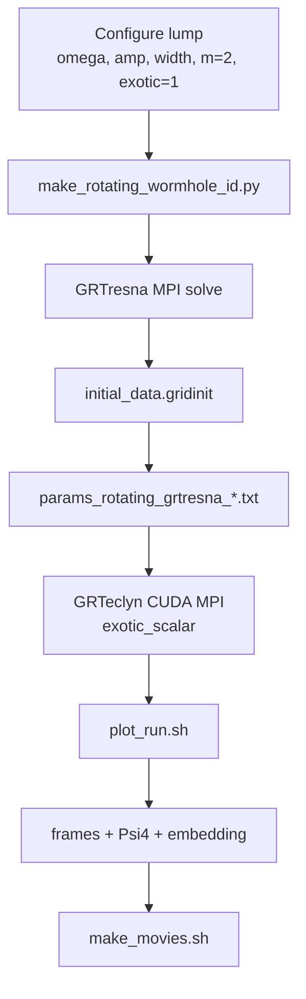

# RotatingWormholeCollapse

Rotating traversable wormhole evolution with CCZ4 + matter. The **production
path** is GRTresna elliptic initial data plus the co-evolving `exotic_scalar`
matter model. The older Teo `effective_teo` route is diagnostic-only (frozen
source at `t=0`); see `Debug.md`.

---

## Table of contents

1. [Production pipeline](#production-pipeline)
2. [Quick start (hi-res recipe)](#quick-start-hi-res-recipe)
3. [Build](#build)
4. [Stage 1 — GRTresna initial data](#stage-1--grtresna-initial-data)
5. [Stage 2 — GRTeclyn evolution](#stage-2--grteclyn-evolution)
6. [Stage 3 — Plotting and movies](#stage-3--plotting-and-movies)
7. [Disk management](#disk-management)
8. [Params files](#params-files)
9. [Physics notes](#physics-notes)
10. [Restart from checkpoint](#restart-from-checkpoint)
11. [MPI environment](#mpi-environment)
12. [Diagnostic: Teo initial data](#diagnostic-teo-initial-data)

---

## Production pipeline



| Stage | Tool | Output |
| --- | --- | --- |
| 1 — ID | `make_rotating_wormhole_id.py` | `runs/rotating_wormhole_id/rotwh_*/initial_data.gridinit` |
| 2 — evolve | `main3d.gnu.MPI.CUDA.ex` | `RotatingWormholeChk*`, `RotatingWormholePlt*`, `data/constraint_norms.dat` |
| 3 — plot | `plot_run.sh` | `output/frames/`, `output/small_data/` |
| 4 — movies | `make_movies.sh` | `output/frames/*/movie_*.mp4` |

The four-lobed pattern in `phi`, `Pi`, `K`, and `Weyl4` frames is the **`m=2`
azimuthal mode** of the rotating lump (quadrupole), not a grid artifact.

---

## Quick start (hi-res recipe)

Validated hi-res run: `L=128`, `N=256`, `dx=0.5`, `t=20`, lump
`omega=0.05`, `amp=0.1`, `width=12`, `m=2`.

All commands assume repo root `/path/to/GRTeclyn` unless noted.

**Terminal 1 — plot watcher** (start before evolution):

```bash
cd /path/to/GRTeclyn

GRTECLYN_FRAMES_ZOOM="128" \
GRTECLYN_FRAMES_CENTER="0 0 0" \
GRTECLYN_EXTRACTION_CENTER="64 64 0" \
GRTECLYN_FRAMES_AUTO_ZLIM="0" \
GRTECLYN_FRAMES_GLOBAL_ZLIM="1" \
./grteclyn-wrapper/scripts/plot/plot_run.sh \
  runs/rotating_wormhole/grtresna_spin_hires/output
```

**Terminal 2 — evolution** (2 GPUs, rank-local CUDA binding):

```bash
source /path/to/GRTeclyn/grteclyn-wrapper/scripts/lib/env.sh
cd /path/to/GRTeclyn/Examples/RotatingWormholeCollapse

mpirun -n 2 bash -c \
  'export CUDA_VISIBLE_DEVICES=$OMPI_COMM_WORLD_LOCAL_RANK; \
   exec ./main3d.gnu.MPI.CUDA.ex params_rotating_grtresna_hires.txt'
```

**After evolution — stitch movies:**

```bash
./grteclyn-wrapper/scripts/plot/make_movies.sh \
  runs/rotating_wormhole/grtresna_spin_hires/output \
  --framerate 10
```

**Outputs:**

| Path | Contents |
| --- | --- |
| `runs/rotating_wormhole/grtresna_spin_hires/output/frames/` | PNG frames per field |
| `runs/rotating_wormhole/grtresna_spin_hires/output/frames/*/movie_*.mp4` | MP4 movies |
| `runs/rotating_wormhole/grtresna_spin_hires/evolution.log` | Evolution stdout |
| `runs/rotating_wormhole_id/rotwh_omega_p0p05_amp_0p1_w_12/` | GRTresna ID + convergence |

---

## Build

```bash
cd /path/to/GRTeclyn/Examples/RotatingWormholeCollapse
make -j 8 USE_CUDA=TRUE USE_MPI=TRUE COMP=gnu CUDA_ARCH=90
```

Produces `main3d.gnu.MPI.CUDA.ex` in this directory.

---

## Stage 1 — GRTresna initial data

Generate constraint-satisfying rotating exotic-scalar initial data. The script
writes GRTresna params, runs the elliptic solve, converts to `.gridinit`, and
records `Ham_and_Mom_errors.txt` + `manifest.json`.

**Hi-res ID** (matches `params_rotating_grtresna_hires.txt`):

```bash
cd /path/to/GRTeclyn

uv run python grteclyn-wrapper/scripts/wormhole/make_rotating_wormhole_id.py \
  --out-dir runs/rotating_wormhole_id \
  --omegas 0.05 --no-control --ranks 2 \
  --length 128 --nx 128 --ny 128 --nz 64 \
  --gridinit-nx 512 --gridinit-ny 512 --gridinit-nz 256 \
  --target-center-x 64 --target-center-y 64 --target-center-z 0 \
  --amp 0.1 --width 12 \
  --iterations 30 --timeout 3600
```

**Standard-res ID** (matches `params_rotating_grtresna_exotic.txt`):

```bash
uv run python grteclyn-wrapper/scripts/wormhole/make_rotating_wormhole_id.py \
  --out-dir runs/rotating_wormhole_id \
  --omegas 0.0,0.05 --ranks 2 \
  --nx 64 --ny 64 --nz 32 \
  --gridinit-nx 256 --gridinit-ny 256 --gridinit-nz 128 \
  --target-center-x 32 --target-center-y 32 --target-center-z 0 \
  --iterations 30 --timeout 1800
```

Check convergence in `runs/rotating_wormhole_id/rotwh_*/Ham_and_Mom_errors.txt`
and `manifest.json` (`accepted: true`).

---

## Stage 2 — GRTeclyn evolution

```bash
source /path/to/GRTeclyn/grteclyn-wrapper/scripts/lib/env.sh
cd /path/to/GRTeclyn/Examples/RotatingWormholeCollapse

# Hi-res production (t=20)
mpirun -n 2 bash -c \
  'export CUDA_VISIBLE_DEVICES=$OMPI_COMM_WORLD_LOCAL_RANK; \
   exec ./main3d.gnu.MPI.CUDA.ex params_rotating_grtresna_hires.txt'

# Standard production (t=4)
mpirun -n 2 bash -c \
  'export CUDA_VISIBLE_DEVICES=$OMPI_COMM_WORLD_LOCAL_RANK; \
   exec ./main3d.gnu.MPI.CUDA.ex params_rotating_grtresna_exotic.txt'

# Short smoke test
mpirun -n 2 bash -c \
  'export CUDA_VISIBLE_DEVICES=$OMPI_COMM_WORLD_LOCAL_RANK; \
   exec ./main3d.gnu.MPI.CUDA.ex params_rotating_grtresna_smoke.txt'
```

Log evolution to a file:

```bash
mpirun -n 2 bash -c '...' 2>&1 | tee ../../runs/rotating_wormhole/grtresna_spin_hires/evolution.log
```

Boundary conditions for spinning runs: Sommerfeld in `x,y`, reflective in `z`
(`lo_boundary = 1 1 2`). The `.gridinit` `target_center` must match the params
`center` so the throat lands at the same coordinate.

---

## Stage 3 — Plotting and movies

### Live watcher (`plot_run.sh`)

Start from repo root **before** evolution. Watches for new plotfiles, extracts
Psi4 / areal radius / embedding, renders slice frames, deletes processed
plotfiles (keeps newest 2).

```bash
./grteclyn-wrapper/scripts/plot/plot_run.sh RUNS/.../output
```

**Environment variables** (hi-res full-domain example):

| Variable | Hi-res value | Meaning |
| --- | --- | --- |
| `GRTECLYN_FRAMES_ZOOM` | `128` | Full domain `0..128` in x,y |
| `GRTECLYN_FRAMES_CENTER` | `0 0 0` | Corner origin (with `--frames-corner`) |
| `GRTECLYN_EXTRACTION_CENTER` | `64 64 0` | Psi4 / areal extraction throat |
| `GRTECLYN_FRAMES_AUTO_ZLIM` | `0` | Off — avoids per-frame colorbar drift in movies |
| `GRTECLYN_FRAMES_GLOBAL_ZLIM` | `1` | Lock colorbar from first plotfile (stable + visible) |

Standard-res throat zoom (`L=64`, center `32,32,0`):

```bash
GRTECLYN_FRAMES_ZOOM="48" \
GRTECLYN_FRAMES_CENTER="8 8 0" \
GRTECLYN_EXTRACTION_CENTER="32 32 0" \
./grteclyn-wrapper/scripts/plot/plot_run.sh \
  runs/rotating_wormhole/grtresna_spin_exotic/output
```

Use `--not-remove` when restarting from checkpoint so existing plotfiles are
not deleted at watcher startup.

### Movies (`make_movies.sh`)

```bash
./grteclyn-wrapper/scripts/plot/make_movies.sh RUNS/.../output --framerate 10

# Specific fields only
./grteclyn-wrapper/scripts/plot/make_movies.sh RUNS/.../output \
  --framerate 10 --only phi_z Weyl4_Re_z K_z
```

Writes `output/frames/<field>_<axis>/movie_<field>_<axis>.mp4`.

Default frame fields: `chi`, `chi_minus_1`, `K`, `lapse`, `phi`, `Pi`,
`scalar_activity`, `Weyl4_Re`, `Weyl4_Im`, `Weyl4_Mag`, plus embedding.

---

## Disk management

Hi-res checkpoints are ~18 GB each on a `256³` grid. Use a large
`checkpoint_interval` and delete old checkpoints after the run.

**Params setting** (`params_rotating_grtresna_hires.txt`):

```text
checkpoint_interval = 1000
plot_interval       = 10
```

`plot_run.sh` deletes processed plotfiles automatically (`--keep-last 2`).

**Keep only the final checkpoint** (example step 2000 for `t=20`):

```bash
cd /path/to/GRTeclyn
OUT=runs/rotating_wormhole/grtresna_spin_hires/output

# rollback trims data files and frames beyond step N
./grteclyn-wrapper/scripts/wormhole/rollback --step 2000 --data "$OUT"

# delete older checkpoints manually (rollback only removes steps > N)
for d in "$OUT"/RotatingWormholeChk*; do
  [[ "$(basename "$d")" == "RotatingWormholeChk02000" ]] && continue
  rm -rf "$d"
done
rm -rf "$OUT"/RotatingWormholePlt*
```

---

## Params files

| File | Purpose |
| --- | --- |
| `params_rotating_grtresna_hires.txt` | Hi-res production (`L=128`, `N=256`, `t=20`, `amp=0.1`, `width=12`) |
| `params_rotating_grtresna_exotic.txt` | Standard production (`L=64`, `N=64`, `t=4`) |
| `params_rotating_grtresna_smoke.txt` | Short validation run |
| `params_rotating_grtresna_a0_exotic.txt` | Matched `omega=0` control |
| `params_rotating_grtresna_no_matter.txt` | Vacuum control |

Each params file sets `recipe_initial_data_file` to the matching
`runs/rotating_wormhole_id/rotwh_*/initial_data.gridinit` and
`wormhole_matter_model = exotic_scalar`.

---

## Physics notes

### Initial data

GRTresna solves the 3D elliptic constraints for one exotic scalar lump with
azimuthal mode `m=2`. The output `.gridinit` contains CCZ4 geometry plus
`phi` and `Pi`. GRTeclyn loads it via `ExternalGridInitialData`.

### Matter model

| `wormhole_matter_model` | Behaviour |
| --- | --- |
| `exotic_scalar` | Co-evolving `phi`, `Pi` (production) |
| `no_matter` | Vacuum control |
| `effective_teo` | Frozen prescribed `teo_*` source (diagnostic only) |

### Loading and diagnostics (C++)

`SupportedWormholeLevel::initData` reads the `.gridinit` when
`recipe_initial_data_file` is set. Each step, `specificPostTimeStep` writes
`data/constraint_norms.dat` and `data/collapse_diagnostics.dat`.

### Symmetry

Genuine z-axis rotation is incompatible with octant symmetry. Spinning runs use
full `x,y` domains with Sommerfeld outer boundaries and equatorial z-reflection.

---

## Restart from checkpoint

1. Rollback to the desired step:

```bash
./grteclyn-wrapper/scripts/wormhole/rollback --step 2000 \
  --data runs/rotating_wormhole/grtresna_spin_hires/output
```

2. Start watcher with `--not-remove`:

```bash
./grteclyn-wrapper/scripts/plot/plot_run.sh --not-remove \
  runs/rotating_wormhole/grtresna_spin_hires/output
```

3. Restart evolution:

```bash
cd Examples/RotatingWormholeCollapse
mpirun -n 2 bash -c \
  'export CUDA_VISIBLE_DEVICES=$OMPI_COMM_WORLD_LOCAL_RANK; \
   exec ./main3d.gnu.MPI.CUDA.ex params_rotating_grtresna_hires.txt \
   amr.restart=../../runs/rotating_wormhole/grtresna_spin_hires/output/RotatingWormholeChk02000'
```

Use the same step number in rollback and `amr.restart`.

---

## MPI environment

`plot_run.sh` and evolution need `mpirun` on `PATH`. Source the wrapper env
script (adds local OpenMPI and the `grtresna` conda MPI):

```bash
source /path/to/GRTeclyn/grteclyn-wrapper/scripts/lib/env.sh
```

Or set manually:

```bash
export PATH=/path/to/openmpi/bin:$PATH
export LD_LIBRARY_PATH=/path/to/openmpi/lib:${LD_LIBRARY_PATH:-}
```

---

## Diagnostic: Teo initial data

Analytic Teo geometry + inferred effective stress-energy. **Not** a stable
production evolution path (`effective_teo` freezes the source). Useful for
regression and comparison.

```bash
uv run python grteclyn-wrapper/scripts/wormhole/make_teo_wormhole_gridinit.py \
  --output runs/teo_wormhole/teo_weak_spin.gridinit \
  --nx 128 --ny 128 --nz 64 --lx 64 --ly 64 --lz 32 \
  --center 32 32 0 --spin 0.05
```

Add `--check` to evaluate ADM constraint residuals before trusting the data.
Keep `--spin` below the ergoregion threshold (`|a_hat| < 0.5`).
