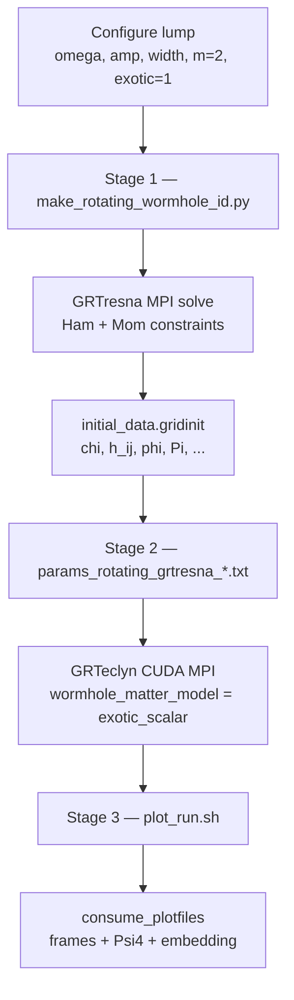
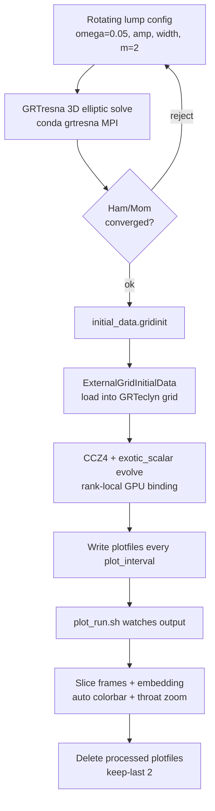
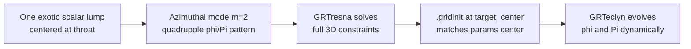

# RotatingWormholeCollapse

This example evolves a **rotating traversable wormhole** with the CCZ4 + matter
machinery shared with `SupportedWormholeCollapse`. The recommended production
path now uses **GRTresna elliptic initial data** plus the co-evolving
`exotic_scalar` matter model. The older analytic Teo `.gridinit` +
`effective_teo` path remains useful as a diagnostic/regression route, but its
frozen source is not a stable physics run.

## Production pipeline

The working route is **one rotating exotic-scalar lump → GRTresna elliptic solve →
`.gridinit` → GRTeclyn `exotic_scalar` evolution → live plotting**. Scalar fields
`phi` and `Pi` co-evolve with the geometry; the old Teo `effective_teo` path
froze a prescribed `teo_*` source at `t=0` and is not a stable physics run (see
`Debug.md`).

### End-to-end stages



| Stage | Tool | Typical output |
| --- | --- | --- |
| 1 — ID | `make_rotating_wormhole_id.py` | `runs/rotating_wormhole_id/rotwh_*/initial_data.gridinit`, `Ham_and_Mom_errors.txt`, `manifest.json` |
| 2 — evolve | `main3d.gnu.MPI.CUDA.ex` | `RotatingWormholeChk*`, `RotatingWormholePlt*`, `data/constraint_norms.dat` |
| 3 — plot | `plot_run.sh` | `output/frames/`, `output/small_data/psi4_mode_l2m0.dat` (plotfiles deleted) |

### Per-run loop

Every production run follows this loop:



Plain-text summary (same loop):

```
make_rotating_wormhole_id.py
  → GRTresna MPI elliptic solve (Hamiltonian + momentum constraints)
  → reject if Ham/Mom missing, NaN, or above threshold
  → initial_data.gridinit (solved geometry + phi + Pi)
  → GRTeclyn loads it and evolves with exotic_scalar on GPU
  → plot_run.sh consumes plotfiles into frames, Psi4, embedding
  → delete processed plotfiles to save disk
```

### Lump → matter on the grid



The four-lobed pattern seen in `K`, `phi`, `Pi`, and `Weyl4` frames is the
`m=2` azimuthal mode of the rotating lump, not a numerical artifact. Lower
`amp` or use the hi-res params to soften it.

## How it works

### 1. Production initial data (GRTresna)

`grteclyn-wrapper/scripts/wormhole/make_rotating_wormhole_id.py` writes GRTresna
params, runs the `ScalarFieldBH` elliptic solver, converts the Chombo HDF5 output
to `.gridinit`, and records a manifest with Hamiltonian/momentum convergence.
The generated data contains the CCZ4 geometry plus scalar fields `phi` and `Pi`;
the evolution then uses `wormhole_matter_model = "exotic_scalar"` so the matter
source co-evolves.

The working configuration is one rotating exotic scalar lump:

- `omega = 0.05`, amplitude `0.2`, width `8`, azimuthal mode `m = 2`.
- GRTresna solves the elliptic constraints for that lump and writes
  `initial_data.gridinit`.
- GRTeclyn then evolves the solved geometry plus the scalar fields with
  `exotic_scalar`. This is the important difference from `effective_teo`, where
  the stored `teo_*` source was frozen at t=0.

From the repo root:

```bash
uv run python grteclyn-wrapper/scripts/wormhole/make_rotating_wormhole_id.py \
  --out-dir runs/rotating_wormhole_id \
  --omegas 0.0,0.05 \
  --ranks 2 \
  --nx 64 --ny 64 --nz 32 \
  --gridinit-nx 256 --gridinit-ny 256 --gridinit-nz 128 \
  --target-center-x 32 --target-center-y 32 --target-center-z 0 \
  --iterations 30 --timeout 1800
```

Validated short-run data:

- `runs/rotating_wormhole_id/rotwh_omega_p0p05_amp_0p2_w_8/initial_data.gridinit`
  (`Ham=0.7427%`, `Mom=0.0115%`)
- `runs/rotating_wormhole_id/rotwh_omega_p0_amp_0p2_w_8/initial_data.gridinit`
  (`Ham=0.5761%`; momentum residual is `NaN` because the control has zero
  momentum source, so the relative momentum norm is undefined)

Validated evolution:

- `params_rotating_grtresna_exotic.txt` ran cleanly to `t = 4.0` on 2 CUDA MPI
  ranks with no NaN.
- Final constraint norms at `t = 4.0`: Ham L2 `1.27e-4`, Mom L2 `7.44e-6`.
- Frames were generated for `chi`, `chi_minus_1`, `K`, `lapse`, `phi`, `Pi`,
  `scalar_activity`, `Weyl4_Re`, `Weyl4_Im`, `Weyl4_Mag`, and the embedding
  diagram under `runs/rotating_wormhole/grtresna_spin_exotic/output/frames/`.

### 2. Analytic Teo initial data (diagnostic)

The Teo geometry is a stationary, axisymmetric wormhole. Rather than solving an
elliptic problem, we sample the *known* metric on a uniform Cartesian grid and
do the 3+1 (ADM) decomposition in Python:

- `grteclyn_wrapper.initial_data.teo` (in `grteclyn-wrapper/src/`) is the physics
  module. Given a `TeoWormholeConfig` (grid size, throat radius `b0`, spin
  `a_hat`, source model) it computes:
  - the ADM variables — lapse `alpha`, shift `beta^i` (the frame-dragging
    `omega`), spatial metric `gamma_ij`;
  - the CCZ4 state GRTeclyn evolves — `chi`, conformal metric `h_ij`, `K`,
    `A_ij`, conformal connection `Gamma^i`;
  - the **effective stress-energy** `(rho, j_i, S_ij) = G_ab / 8pi`, computed
    numerically from the 4-metric. Teo specifies a *geometry* and infers its
    matter content, so the source is stored as data, not derived from a
    fundamental field.
- `grteclyn-wrapper/scripts/wormhole/make_teo_wormhole_gridinit.py` is a thin CLI that
  builds a config, calls the module, and writes the `.gridinit` plus a
  `.manifest.json` of diagnostics.

The throat is regularised at the puncture; the generator asserts finite values
and positive `chi`/`lapse` before writing.

### 3. Loading into GRTeclyn (C++)

The GRTresna params files set `recipe_initial_data_file` to the solved
`.gridinit`. In `SupportedWormholeLevel::initData`, when that key is non-empty,
`ExternalGridInitialData` reads the file and fills every state component,
including the scalar fields `phi` and `Pi`, by interpolation onto the simulation
grid. The legacy Teo params use the same loader but fill the `teo_*` source
fields instead.
If the key is empty, it falls back to the analytic `SupportedWormholeInitialData`
(the phantom-scalar wormhole).

### 4. Matter model and evolution (C++)

The `wormhole_matter_model` parameter selects how the matter source enters the
CCZ4 right-hand side and the constraints. It is wired in `variableSetUp`,
`specificEvalRHS`, and `specificPostTimeStep`:

| `wormhole_matter_model` | Class | Source of `T_ab` |
| --- | --- | --- |
| `effective_teo` (Teo runs) | `EffectiveTeoMatter` | reads the prescribed `teo_rho/j/S` fields, scaled by `teo_source_strength` |
| `no_matter` | `NoMatter` | identically zero (vacuum relaxation control) |
| `exotic_scalar` (default) | `ExoticScalarField<PhantomDecayPotential>` | evolves a phantom scalar `phi`, `Pi` |

`EffectiveTeoMatter` is a *prescribed* source: it returns the stored `teo_*`
values and has an empty `add_matter_rhs`, because the Teo source is fixed initial
data, not a dynamically evolved field. `teo_source_strength` lets you scale it
(e.g. a support-threshold scan).

Each step, `specificPostTimeStep` recomputes the Hamiltonian and momentum
constraint L2 norms with the matching matter model and writes
`data/constraint_norms.dat`, plus `data/collapse_diagnostics.dat` (min lapse/chi,
`max|K|`, an apparent-horizon `theta_+` proxy, scalar field range). Weyl4 is
extracted on the configured radii for gravitational-wave output.

### Symmetry / boundary conditions

Genuine z-axis rotation is **incompatible with octant symmetry**: the shift
`beta^x = omega y`, `beta^y = -omega x` has the wrong parity across the `x=0` and
`y=0` planes. Spinning runs therefore use full `x,y` domains with Sommerfeld
(non-reflective) outer boundaries and only an **equatorial z-reflection**:

```text
lo_boundary = 1 1 2     # Sommerfeld in x,y; reflective in z
hi_boundary = 1 1 1
```

The generated `.gridinit` `center`/`origin` must match the simulation `center`
so the throat lands on the same coordinate.

## Run variants

### Params files (GRTresna only)

| File | Purpose |
| --- | --- |
| `params_rotating_grtresna_exotic.txt` | Production weak-spin (`L=64`, `N=64`, `dx=1`) |
| `params_rotating_grtresna_hires.txt` | Higher resolution (`L=128`, `N=256`, `dx=0.5`, weaker lump) |
| `params_rotating_grtresna_smoke.txt` | Short validation run |
| `params_rotating_grtresna_a0_exotic.txt` | Matched `omega=0` control |
| `params_rotating_grtresna_no_matter.txt` | Vacuum control |

Legacy Teo / `effective_teo` params were removed; see `Debug.md` for that
investigation history.

### Production GRTresna runs

```bash
cd Examples/RotatingWormholeCollapse

# Short smoke run, validated to t = 0.22
mpirun -n 2 bash -c 'export CUDA_VISIBLE_DEVICES=$OMPI_COMM_WORLD_LOCAL_RANK; exec ./main3d.gnu.MPI.CUDA.ex params_rotating_grtresna_smoke.txt'

# Production weak-spin run
mpirun -n 2 bash -c 'export CUDA_VISIBLE_DEVICES=$OMPI_COMM_WORLD_LOCAL_RANK; exec ./main3d.gnu.MPI.CUDA.ex params_rotating_grtresna_exotic.txt'

# Higher-resolution production run
mpirun -n 2 bash -c 'export CUDA_VISIBLE_DEVICES=$OMPI_COMM_WORLD_LOCAL_RANK; exec ./main3d.gnu.MPI.CUDA.ex params_rotating_grtresna_hires.txt'

# Matched omega=0 control
mpirun -n 2 bash -c 'export CUDA_VISIBLE_DEVICES=$OMPI_COMM_WORLD_LOCAL_RANK; exec ./main3d.gnu.MPI.CUDA.ex params_rotating_grtresna_a0_exotic.txt'

# Vacuum control
mpirun -n 2 bash -c 'export CUDA_VISIBLE_DEVICES=$OMPI_COMM_WORLD_LOCAL_RANK; exec ./main3d.gnu.MPI.CUDA.ex params_rotating_grtresna_no_matter.txt'
```

Short-run validation at `t = 0.22`:

| Run | Ham L2 | Mom L2 | Verdict |
| --- | --- | --- | --- |
| `grtresna_spin_smoke` | `3.49e-4` | `1.02e-5` | clean |
| `grtresna_a0_exotic` | `2.88e-4` | `8.11e-6` | clean |
| `grtresna_spin_no_matter` | `3.62e-4` | `3.89e-5` | clean |

## Generate Teo initial data (diagnostic only)

From the repo root:

```bash
# Weak-spin effective-source data (regression / comparison only)
uv run python grteclyn-wrapper/scripts/wormhole/make_teo_wormhole_gridinit.py \
  --output runs/teo_wormhole/teo_weak_spin.gridinit \
  --nx 128 --ny 128 --nz 64 --lx 64 --ly 64 --lz 32 \
  --center 32 32 0 --spin 0.05

# Matched non-spinning baseline
uv run python grteclyn-wrapper/scripts/wormhole/make_teo_wormhole_gridinit.py \
  --output runs/teo_wormhole/teo_a0.gridinit \
  --nx 128 --ny 128 --nz 64 --lx 64 --ly 64 --lz 32 \
  --center 32 32 0 --spin 0.0

# Same geometry but zeroed source (pair with wormhole_matter_model=no_matter)
uv run python grteclyn-wrapper/scripts/wormhole/make_teo_wormhole_gridinit.py \
  --output runs/teo_wormhole/teo_weak_spin_zero_source.gridinit \
  --nx 128 --ny 128 --nz 64 --lx 64 --ly 64 --lz 32 \
  --center 32 32 0 --spin 0.05 --source zero
```

The ergoregion threshold is near `|a_hat| = 0.5`; keep `--spin` below that for
the first controlled runs. Each call prints and stores summary diagnostics
(min/max `chi`, `lapse`, `max|shift|`, `teo_rho` range) in the manifest.

### Validate the initial data (self-consistency)

Pass `--check` to also evaluate the full 3D ADM constraint residuals from the
generated fields before trusting the data:

```bash
uv run python grteclyn-wrapper/scripts/wormhole/make_teo_wormhole_gridinit.py \
  --output runs/teo_wormhole/teo_weak_spin.gridinit \
  --nx 128 --ny 128 --nz 64 --lx 64 --ly 64 --lz 32 \
  --center 32 32 0 --spin 0.05 --check
```

This computes

```text
Hamiltonian:  H   = R + K^2 - K_ij K^ij - 16 pi rho
Momentum:     M_i = D_j (K^j_i - delta^j_i K) - 8 pi j_i
```

excluding the boundary finite-difference layer and a small ball around the
throat, then reports L2 (RMS) and max norms (added to the `.manifest.json` under
`constraint_residuals`). Because the effective source is `T_ab = G_ab / 8pi` from
the same metric, the constraints hold *by construction* up to truncation error,
so this is a self-consistency check (it confirms the `K_ij` and Einstein-tensor
derivative paths agree away from the throat). Small residuals are expected; the
throat region is a puncture and is intentionally not resolved. A genuine
resolution-convergence test (fixed physical mask radius across resolutions) is a
separate, stronger check.

> Note: `make_rotating_wormhole_id.py` (GRTresna elliptic solve) is now the
> recommended production initial-data route. The Teo analytic path above remains
> diagnostic/regression-only because its effective source is frozen.

## Build

```bash
# Production multi-GPU build
make -j 8 USE_CUDA=TRUE USE_MPI=TRUE COMP=gnu CUDA_ARCH=90
```

## Run

**Recommended production run:**

```bash
cd Examples/RotatingWormholeCollapse

# 2 GPUs, rank-local binding
mpirun -n 2 bash -c 'export CUDA_VISIBLE_DEVICES=$OMPI_COMM_WORLD_LOCAL_RANK; exec ./main3d.gnu.MPI.CUDA.ex params_rotating_grtresna_exotic.txt'
```

For live plotting and plotfile deletion, start the watcher from the repo root
before the simulation:

```bash
./grteclyn-wrapper/scripts/plot/plot_run.sh \
  runs/rotating_wormhole/grtresna_spin_exotic/output
```

`plot_run.sh` writes `output/frames/` and `output/small_data/`, renders the
diagnostic field frames listed above, and deletes processed plotfiles while
keeping the newest two (`--delete --keep-last 2`).

## Restart from Checkpoint

To resume from any checkpoint (for example step **3000** or **4000**):

1. **Rollback** the data directory to the desired checkpoint (use paths matching your clone of this repo and the `output_path` set in the params file):
   ```bash
   cd /path/to/GRTeclyn
   ./grteclyn-wrapper/scripts/wormhole/rollback --step 3000 --data /path/to/your/simulation/output
   ```
   (Replace `3000` with the desired checkpoint number, e.g. `4000`.)

2. **Start the watcher** (in a second terminal — use `--not-remove`):
   ```bash
   cd /path/to/GRTeclyn
   ./grteclyn-wrapper/scripts/plot/plot_run.sh --not-remove /path/to/your/simulation/output
   ```

3. **Restart the simulation** using `amr.restart` (this is the correct flag):
   ```bash
   cd /path/to/GRTeclyn/Examples/RotatingWormholeCollapse

   # 2 GPUs example
   mpirun -n 2 bash -c 'export CUDA_VISIBLE_DEVICES=$OMPI_COMM_WORLD_LOCAL_RANK; exec ./main3d.gnu.MPI.CUDA.ex params_rotating_grtresna_exotic.txt amr.restart=/path/to/your/simulation/output/RotatingWormholeChk03000'
   ```

> **Tip**: Always replace both the `--step N` in rollback **and** the `ChkN` number in the restart command with the same value (e.g. 4000).

## Plotting (normal run)

```bash
# In a second terminal (from the GRTeclyn root; set RUN_DIR to your simulation output)
./grteclyn-wrapper/scripts/plot/plot_run.sh /path/to/your/simulation/output
```

## Quick MPI Setup (if needed)

Point these at **your** OpenMPI install prefix (the directory that contains `bin/mpirun` and `lib`):

```bash
export PATH=/path/to/your/openmpi/bin:$PATH
export LD_LIBRARY_PATH=/path/to/your/openmpi/lib:${LD_LIBRARY_PATH:-}
```
