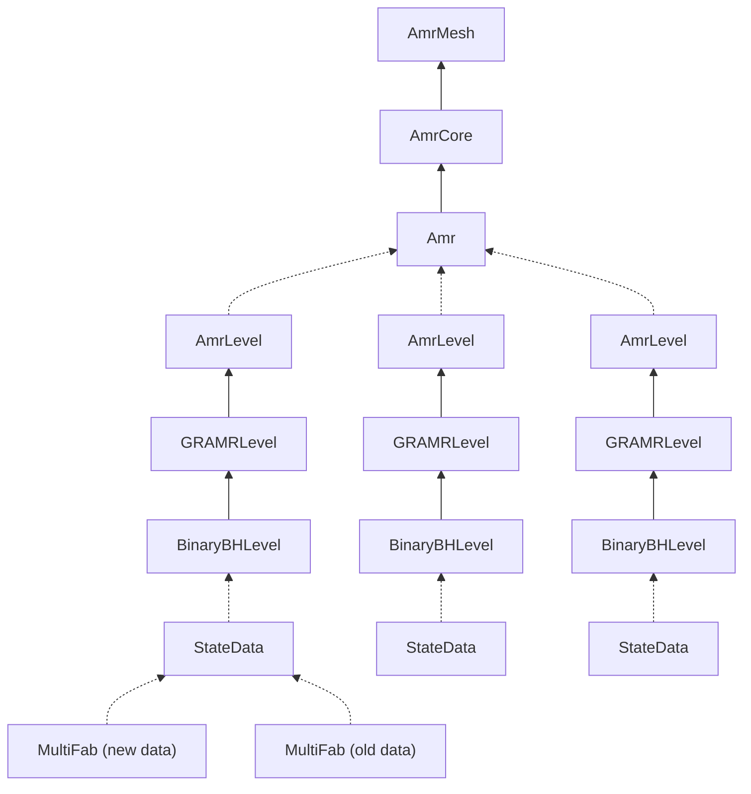

# GRAMReX BinaryBH example walkthrough

## Introduction

This is a short walkthrough on building and running the GRAMReX BinaryBH
example. It is still in the very early stages so lots of things have yet to be
ported/implemented. See below for the current status.

### Status
| Feature | Ported/Implemented | Notes |
| --- | --- | --- |
| CCZ4 Evolution | :heavy_check_mark:  | Only fourth order spatial derivatives |
| Boundary Conditions | :heavy_check_mark: :grey_question: | All except mixed BCs have been implemented |
| Plot/checkpoint files + restart | :heavy_check_mark: | AMReX-specific, not HDF5 |
| AMR/tagging criterion | :x: | No tagging criterion yet so only 1 level/uniform grid |
| Diagnostic variables | :x: | e.g. Constraints, $\Psi_4$ |
| AMR Interpolator | :x: | |
| GW extraction | :x: | Requires AMR Interpolator |
| Puncture tracking | :x: | Requires AMR Interpolator |
| TwoPunctures initial data | :x: | |

## Obtaining and building the code

### Prerequisites

You will need the following software
* Git
* GNU Make >= 3.81
* Python >= 2.7
* A Unix-like environment with `perl` and `sed` commands
* C compiler with C99 support
* C++ compiler with C++17 support (e.g. GCC >= 8, Clang >= 6, Intel Classic >= 19.14)
* MPI implementation (optional)

Note that the C++17 requirement means that older compilers you have used to
build [GR]Chombo may not work with GRAMReX but so long as you have a more recent
compiler available, if you can build GRChombo, you can probably build GRAMReX
too. 

Feel free to try this example locally on your own system (the example parameter
file is relatively small so should run fine on a laptop) if you have the above
software or SSH to your favourite cluster (I have tested on the CSD3 icelakes).

### Obtaining the code

First `cd` into a directory you are happy to clone the code into. For
simplicity, I will assume that is your home directory (so adjust any commands 
below accordingly if not).

The AMReX source code is hosted on
[GitHub](https://github.com/AMReX-Codes/amrex). Clone this with a command such
as

```bash
git clone https://github.com/AMReX-Codes/amrex.git
```
It will be cloned to the `amrex` directory.

The GRAMReX repository is currently private so first check you have access by
navigating to https://github.com/GRChombo/GRAMReX. If you're reading this on
your own device, then you have the necessary permissions. If you don't have
access, please let me know so I can give them to you. Clone the repository with
a command such as

```bash
git clone -b training/202212_grchombo_meeting https://github.com/GRChombo/GRAMReX.git
```
Note that the above command automatically checks out the
`training/202212_grchombo_meeting` branch but if you missed out this flag make
sure to check it out using e.g.
```bash
git checkout training/202212_grchombo_meeting
```

> **Note**
> I have assumed that you have cloned both of
> these repositories to the same directory so that the `amrex` and `GRAMReX`
> directories share the same parent directory. If you want to clone AMReX
> elsewhere, make sure to set the `AMREX_HOME` environment variable
> appropriately e.g. 
> ```bash
> export AMREX_HOME=/path/to/amrex
> ```

### Building the BinaryBH example

> **Warning** 
> If you are on macOS and want to use GCC built with Homebrew (which
> has the major version number appended to the executable e.g. `g++-9`), you
> will need to create a `Make.local` (like Chombo's `Make.defs.local` file) in 
> ```
> amrex/Tools/GNUMake/Make.local
> ```
> with something like the following lines
> ```makefile
> CXX = g++-9
> CC  = gcc-9
> FC  = gfortran-9
> F90 = gfortran-9
> 
> INCLUDE_LOCATIONS += /usr/local/include
> ```
> 
> See [this
> page](https://amrex-codes.github.io/amrex/docs_html/BuildingAMReX.html#gcc-on-macos)
> for more details.  

If you are on a cluster make sure you have loaded modules which provide you with
the software listed under [prerequisites](#prerequisites) (e.g. you might need a
compiler newer than the default).

Now, navigate to the BinaryBH example directory
```bash
cd ~/GRAMReX/Examples/BinaryBH
```

In this directory, the build options are in the `GNUMakefile`. They are very
similar to Chombo's, and, like Chombo, can be overriden on the command line. You
might want to change the following: 

* Set `USE_OMP = TRUE` to use OpenMP.
* If you don't want to use the GNU compiler `g++` , change `COMP = gnu` to 
  `COMP = intel` (for the Intel classic compiler `icpc`) or `COMP = llvm` (for 
  LLVM `clang++`). 
* If you don't have an MPI implementation available, set `USE_MPI = FALSE`.

Now start building AMReX and the BinaryBH example with the command
```bash
make -j 4
```
A new `tmp_build_dir` directory will be created to store the compiled object
and auxiliary files. Assuming all is well, you should have an executable in the
current directory of the form `main<config>.ex` e.g. `main3d.gnu.MPI.OMP.ex`.

## Running and visualizing the example

### Running the example

There is a single cheap parameter file: `params_cheap.txt`. If you open the
file, you'll find that many of the parameters have been inherited from GRChombo
and thus their names and functions are the same. Note that not all parameters
have been implemented (e.g. `output_path`). Consult the table in the 
[AMReX renamed parameters](#amrex-renamed-parameters) section below.

Running the example is the same as for GRChombo examples e.g. (with MPI):
```bash
export OMP_NUM_THREADS=2
mpiexec -n 4 ./main3d.gnu.MPI.OMP.ex ./params_cheap.txt
```


> **Note**
> Even though this example is quite small, as always, if
> you are running on a cluster, it is good practice to *not* run the code on the
> login node but instead request an interactive job. Consult your cluster's
> documentation on how to do this. On CSD3, I use the following command 
> ```bash
> srun --pty --qos=INTR -p <partition> -t <time limit in minutes> -n <number of tasks> -A <account> bash
> ```
> or alternatively launch the code directly on a compute node which I do on CSD3
> using a command like
> ```bash
> srun --qos=INTR -p <partition> -t 5 -n 4 -c 2 -A <account> --export=ALL,OMP_NUM_THREADS=2 ./main3d.gnu.MPI.OMP.ex ./params_cheap.txt
> ```

With the provided parameters, it should evolve 128 timesteps and write 5 plot
files (actually directories/folders rather than single files, each about 26 MB):
```
plt00000  plt00032  plt00064  plt00096  plt00128
```
This should not take longer than a few minutes on a laptop.

### AMReX new/renamed parameters
Below are some parameters you will find in the BinaryBH `params_cheap.txt` that
are either new or differ in name to the GRChombo equivalent. Most of their names
are self-explanatory.
| GRChombo parameter name | GRAMReX parameter name | Notes |
| --- | --- | --- |
| `chk_prefix` | `amr.check_file` | Still a prefix in GRAMReX |
| `plot_prefix` | `amr.plot_file` | Still a prefix in GRAMReX |
| `restart_file` | `amr.restart` | |
| - | `amr.file_name_digits` | Number of timestep digits in the filenames. |
| `checkpoint_interval` | `amr.check_int` | |
| `plot_interval` | `amr.plot_int` | |

### Visualizing the plot files

The `pltxxxxx` directories can be opened using ParaView (>=5.7), VisIt or yt.
Note that, unlike GRChombo, checkpoints cannot be visualized.

If you are using ParaView, open the group of `plt...` directories and then
select "AMReX/BoxLib Grid Reader". 

If you are using VisIt, open the `Header` file in one of the `pltxxxxx`
directories.

## Code structure

### Class structure

The structure of the code is very similar to GRChombo. Here is a diagram showing
the inheritance/aggregation relationship between the main classes for this
example in GRAMReX:



### [GR]Chombo to [GR]AMReX class dictionary

Here are a list of some of the main classes in [GR]Chombo and their equivalents
in [GR]AMReX:

| [GR]Chombo class | [GR]AMReX class  | Description |
| ---           | ---           | ---         |
| `AMR`         | `Amr`         | Class which manages the whole AMR hierarchy and knows about all of the levels |
| `AMRLevel`    | `AmrLevel`    | Class which manages things on a single level |
| `GRLevelData` | `MultiFab`    | Class which stores the actual array data on a single level |
| `FArrayBox`   | `FArrayBox`   | Class which stores the actual array data in a single box |
| - | `StateData` | Class which stores the new and old `MultiFab`, boundary conditions, etc. In Chombo, the `GRLevelData` objects are just stored directly in `GRAMRLevel` |


### Further information

More information about AMReX can be found in its
[documentation](https://amrex-codes.github.io/amrex/docs_html/).


