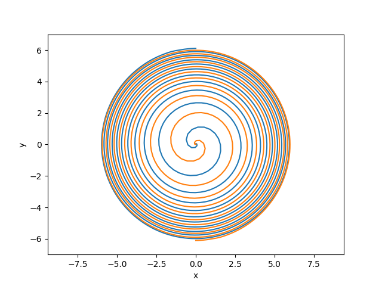
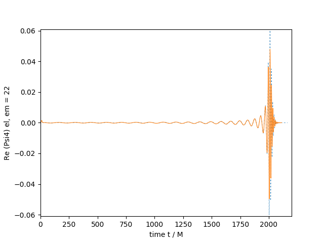

# Running the binary black hole example

The following gives some instructions on running the binary black hole example.

## Physical scenario

This page describes running the Binary BH example using the parameters found in [this parameter file](https://github.com/GRTLCollaboration/GRTeclyn/blob/develop/Examples/BinaryBH/params_profile.txt).

The initial conditions consist of a superposition of two equal mass black holes, with initial momenta and positions chosen to give approximately 10 circular orbits before merger.

Note that finding the right momenta for an initial circular trajectory is in general a hard problem in NR - simply setting the momentum to the Newtonian approximation will result in elliptic orbits even for well separated initial BHs. One must use the Post-Newtonian approximations, and then adjust the momentum manually over several iterations to achieve an initial eccentricity of less than 1%. We are grateful to Dr Sebastian Khan at Cardiff University for providing us with these initial data values.

Note that this is a realistic example but not production quality for generating BBH waveforms (one should have a larger wave zone, and better resolution at the horizon). Production level parameters are provided in `params_production.txt`.

The initial data solves the Momentum constraint exactly but uses an approximation for low boosts to solve the Hamiltonian constraint (see [Baumgarte and Shapiro](https://doi.org/10.1017/CBO9781139193344), pg 73-74) which is accurate up to order P⁴, where P is the momentum of the BH.

One can also use the [**Two Punctures Initial Data**](two_punctures.md) extension for more accurate initial data, in which case one needs to use `params_twopunctures.txt`.

## Computational set up

Please read the [Performance Optimisation](performance_optimisation.md) guide to understand how to divide the domain into boxes that are shared over the MPI ranks, as this is crucial for obtaining good performance on HPC systems. When GRTeclyn regrids (always at the first step, and at later steps as requested by the user), it will output the grid setup to the output file. This tells you how many boxes are on each level, and what their sizes are. This is very useful for understanding if you are load balancing appropriately.

The parameters should be mostly self explanatory if you are familiar with NR, but you can look at the [**Parameters**](parameters.md) guide for more details.

Typically, on a CPU system, dividing the domain up into 16^3 boxes, and running on 512 CPU cores with 512 MPI ranks, we obtain a speed of 30 M/hr in code units. The speed is output at every timestep to the output file. This is just a rough measure obtained by dividing the current simulation time by the total runtime, so if the simulation freezes it won't go immediately to zero.

Typically, on a GPU system, dividing the domain up into 32^3 boxes, and running on 8 GPUs (1 node) with 8 MPI ranks, we obtain a speed of 300 M/hr in code units.

If you are seeing speeds significantly less than these you may have some memory bottleneck on your system. It will be worth trying to resolve this rather than running at a slower speed - your system admins should be able to advise on how to do this.

## Checking the outputs

### Viewing data in VisIt

See [**Visualising Ouputs**](visualising_outputs.md) for details on visualising. Note that checkpoint files are not viewable with AMReX, only plot files are.

The most enlightening variable to look at in the outputs is chi, the conformal factor of the metric, which goes to zero at the centres of the BHs. When (for example in VisIt) the Pseudocolour plot is viewed on a slice through the centre of the grid, normal to the z axis, the black holes should be seen to inspiral and merge.

Note that you can look at these files even when the job is still running. It is always a good idea to check the files after a few timesteps to make sure it is doing something sensible.

### Puncture plots

The example also outputs some ASCII datafiles for post processing in a `data` folder. Firstly, it gives a file `punctures.dat` which gives the location at each timestep of the two BHs.

This can be plotted using a `gnuplot` command:

`f='punctures.dat'; L=256; plot f using ($2-L):($3-L) with lines, f using ($5-L):($6-L) with lines`

or a `python` script such as:

```python

# A simple python script to plot the puncture
# tracks over time. This helps with setting up
# circular orbits. The params.txt file should
# give around 8-9 orbits before merger.

import numpy as np;
import matplotlib.pyplot as plt;
from mpl_toolkits.mplot3d import Axes3D
from matplotlib import cm
from matplotlib.ticker import LinearLocator, FormatStrFormatter

# location of center of grid
L = 256
# half the separation of punctures
r = 6
# output data from running merger
data = np.loadtxt("data/punctures.dat")

# make the plot
fig = plt.figure()

# first puncture
x1 = data[:,1]-L
y1 = data[:,2]-L
plt.plot(x1,y1)

# second puncture
x2 = data[:,4]-L
y2 = data[:,5]-L
plt.plot(x2,y2)

# make the plot look nice
plt.xlabel("x")
plt.ylabel("y")
plt.axis('equal')
plt.ylim(-r-1,r+1)

# save as png image
plt.savefig("PunctureTracks.png")
```

The resulting image should look like .

### Gravitational Wave plots

The other data files starting with `Weyl_integral_` give the spin weight -2 spherical harmonic components of the Weyl Scalar Ψ₄ as calculated at each of the selected extraction radii. The aim of these files is to check that the signal has converged and so is similar at the different extraction radii, and also that one obtains a correct signal for a binary merger.

Again, these can be plotted using a `gnuplot` command, for example:

`f='Weyl_integral_22.dat'; plot f using ($1-50):2 with lines, f using ($1-100):4 with lines`

or a `python` script such as:

```python

# A simple python script to plot the GW
# signals over time, for a chosen mode

import numpy as np;
import matplotlib.pyplot as plt;
from mpl_toolkits.mplot3d import Axes3D
from matplotlib import cm
from matplotlib.ticker import LinearLocator, FormatStrFormatter

# coord locations of extraction radii
R0 = 50
R1 = 100
# Total ADM mass
M = 1.0
# The mode, as text
mode = "22"
# output data from running merger
data = np.loadtxt("Weyl_integral_" + mode + ".dat")

# make the plot
fig = plt.figure()

# first radius
r0 = R0 + M*np.log(R0/(2.0*M) - 1.0)
timedata0 = (data[:,0] - r0) / M
fluxdata0 = data[:,1]
plt.plot(timedata0, fluxdata0, ':', lw = 0.5, label="r0")

# second radius
r1 = R1 + M*np.log(R1/(2.0*M) - 1.0)
timedata1 = (data[:,0] - r1) / M
fluxdata1 = data[:,3]
plt.plot(timedata1, fluxdata1, '-', lw = 0.75, label="r1")

# make the plot look nice
plt.xlabel("time t / M")
plt.ylabel("Re (Psi4) el, em = " + mode)
plt.xlim(0, 2200)
plt.ylim(-0.061, 0.061)

# save as png image
filename = "Weyl_" + mode + ".png"
plt.savefig(filename)
```

The resulting image should look like .

### What next?

Congratulations - you have successfully run a binary black hole simulation with GRTeclyn! We suggest that you try amending some of the variables in the parameters and rerun the code to understand what they do.
