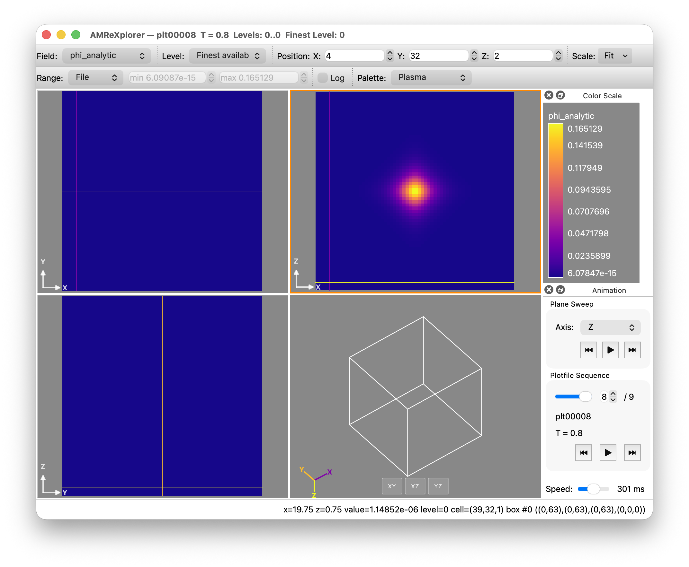

# Testing with the Klein Gordon example

The repository includes an example which solves the Klein Gordon equation in flat spacetime (i.e. without GR, or any non trivial metric background). It casts the equation as first order in time, and therefore only contains two variables - the field `phi` and its conjugate momentum `Pi`.

It runs three models:

- 1D Wave equation with potential:

$$ \frac{\partial^2 \phi}{\partial t^2} = \nabla^2 \phi + \frac{1}{2} m^2 \phi^2 $$

- 1D Sine-Gordon breather equation

$$ \frac{\partial^2 \phi}{\partial t^2} = \frac{\partial^2 \phi}{\partial x^2} - \sin \phi $$

- 3D Sine-Gordon breather solution

$$ \frac{\partial^2 \phi}{\partial t^2} = \nabla^2 \phi - \sin \phi $$


This example can be useful if you:

- want a simpler example from which to learn the structure of the code and how it interacts with AMReX, before diving into the full CCZ4 equations
- want to work on optimizating the code
- need an example with an analytic solution for testing
- need an example of how to change models at runtime

## How to run the code
1. `git clone` GRTeclyn and AMReX as usual. Navigate to `Examples/KleinGordon`.
2. Build using
```bash
make -j 8 COMP=<your favourite toolchain>
```
See the [example configs](https://grtlcollaboration.github.io/GRTeclyn/example_configs/) for some common setups.
3. Take a look inside the parameter file, `params_test.txt`:
```
#Klein Gordon Parameters
# Choose from "Wave" or "SineGordon1D" or "SineGordon3D"

# Example parameters for SineGordon models
# NB: alpha must be defined
# If SineGordon3D is specified then the initial time
# can't be 0 because then the solution is uniformly 0

klein_gordon.model = SineGordon3D
klein_gordon.alpha = 0.7
klein_gordon.initial_time = -5.4;


# Example parameters for Wave model
# NB: wave_vector must be defined
#klein_gordon.model = Wave
#klein_gordon.wave_vector = 10.
#klein_gordon.scalar_mass = 1      # potential is scalar_mass^2 phi^2 - only relevant for Wave models

```
All Klein Gordon parameters are prefaced by `klein-gordon`:

    - `klein_gordon.model`: Choose from `Wave`, `SineGordon1D` or `SineGordon3D`
    - **(Sine Gordon models only)** `klein_gordon.alpha`: The breather solutions oscillate and this controls the frequency of the oscillation. Must be less than 1!
    - `klein_gordon.initial_time`: This sets the initial state/phase of the solution.
    - **(Wave models only)** `klein_gordon.wave_vector`: The characteristic wave number, $k_r$. The solution is in the form $\cos(k_r r - \omega t)$.
    - **(Wave models only)** `klein_gordon.scalar_mass`: The potential is in the form $m^2 \phi^2$, where $m$ is the mass of the scalar field.

4. Run the code using
```bash
mpirun -np 2 ./KleinGordon3d.XXX.MPI.ex ./params_test.txt
```
where the `XXX` represents the toolchain that you've chosen in Step 2.
This example is very small, so 2 MPI ranks is more than sufficient.

## Looking at the outputs

There are two state variables:

* `phi` - the scalar field value at each cell
* `Pi` - the first derivative of the scalar field at each cell

There are three derived variables:

* `phi_analytic` - the analytic solution to the field value at each cell
* `Pi_analytic` - the analytic solution to the first derivative of the field value at each cell
* `rho` - the value of the energy density at each cell.

Set `amr.plot_vars = ALL` and `amr.derive_plot_vars = ALL` to print all the state (`phi`, `Pi`) and derived variables (`phi_analytic`, `Pi_analytic`, `rho`).

If you plot the outputs using AMReXplorer, you will get something like this:



You can then use the "Field" button to scroll through the different variables.


The analytic solution and energy density are examples of GRTeclyn diagnostics (called derived variables by AMReX). See [Diagnostics](diagnostics.md) for details of how they are registered, calculated when needed and added to your own example.
