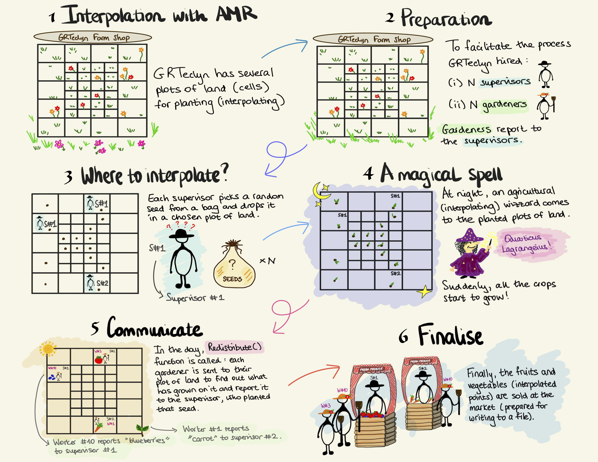

# Particle Interpolator

## Overview

GRTeclyn uses AMReX particles to interpolate evolved fields on the computational grid. Particles are placed at the positions where interpolation is required and the field values are then interpolated to those particle locations. In this sense, the particles act as special data containers storing the interpolated values. The reason for using particles is that it lets us reuse AMReX's existing machinery for locating interpolation points on the AMR grid, rather than implementing this logic ourselves. In particular, AMReX determines which AMR level and grid contains each particle and which MPI rank owns it. During `Redistribute()`, AMReX also handles the MPI communication required to move particles to the appropriate ranks. This significantly reduces the amount of parallel book-keeping required in GRTeclyn.

If you are not familiar with the AMReX particle interface, see the [AMReX particle documentation](https://amrex-codes.github.io/amrex/docs_html/Particle.html).

Interpolation is performed using a [Lagrange interpolation](https://github.com/GRTLCollaboration/GRTeclyn/blob/2bfd19eacba91645fc8675709732a800fc2a3454/Source/ParticleInterpolator/Lagrange.hpp) algorithm of arbitrary order, with fourth-order interpolation typically used by default. AMReX particles support several possible memory layouts for particle data. In GRTeclyn, interpolated values are stored using a **Struct-of-Arrays (SoA)** layout.

The main class used for interpolation in GRTeclyn is `ParticleInterpolator`. This class is templated over the number of components, i.e. the number of variables to be interpolated. It handles the interpolation logic, boundary conditions treatment, interaction between the particles and the mesh data and many other things. If you ever end up using interpolation for your example,`ParticleInterpolator` is one of the classes you will need to interact directly with, in addition to the `InterpolationQueryParticle` class, which set-ups the information about the interpolation query. See the section below for more information on how to get started.

!!! warning

    Currently, `ParticleInterpolator` supports interpolation of multiple
    components only when they are in the **contiguous** order!

    For example, recall that state variables are assigned unique component indices in
    [`CCZ4StateVariables.hpp`](https://github.com/GRTLCollaboration/GRTeclyn/blob/2bfd19eacba91645fc8675709732a800fc2a3454/Source/CCZ4/CCZ4StateVariables.hpp). Here, the conformal factor $\chi$ and the metric component
    $h_{11}$ occupy consecutive component indices, so they can be interpolated
    together. In contrast, $\chi$ and the extrinsic curvature $K$ cannot be
    interpolated together, as their component indices are not contiguous!

!!! note

    Our `ParticleInterpolator` supports both **state** and **derived** variables.
    The interpolation setup differs slightly depending on whether state or derived variables are being interpolated. Both cases will be described in more detail below.


## Quick start

To use the particle interpolator, we first need to define an interpolation query specifying:

1. where interpolation should take place (i.e. coordinate positions)
2. which component(s) should be interpolated
3. any additional information, such as whether the variable being interpolated is state or derived and the parity, if derived variable is queried.

Queries are generated by the `InterpolationQueryParticle` class.

### Defining query for a state variable

The following example defines two interpolation points and requests interpolation of component `0` of the state variables:

```cpp
// random interpolation positions
std::vector<double> interp_x = {0, 1};
std::vector<double> interp_y = {1, 1};
std::vector<double> interp_z = {1, 1};

// storage for the interpolated values
std::vector<double> out_interp(2);

// define query
int num_points = 2;
InterpolationQueryParticle query(2);

query.setCoords(0, interp_x.data())
     .setCoords(1, interp_y.data())
     .setCoords(2, interp_z.data())
     .addComp(0, out_interp, VariableType::state);
```

`VariableType::state` is the default variable type, so it may be omitted when appropriate.

### Defining query for a derived variable

The query for a derived variable is constructed in essentially the same way, but there are two additional requirements:

1. Set the variable type to `VariableType::derived`.
2. Specify the parity of the derived variable using `BCParity`, for example `BCParity::even`.

For example:

```cpp
query.addComp(0, out_interp, VariableType::derived, BCParity::even);
```

See the definition of [`InterpolationQueryParticle::addComp()`](https://github.com/GRTLCollaboration/GRTeclyn/blob/2bfd19eacba91645fc8675709732a800fc2a3454/Source/ParticleInterpolator/InterpolationQueryParticle.hpp#L65) for the complete list of arguments.

Note that the component index supplied to `addComp()` refers to the component within the selected variable group. For derived quantities, a single derived group may contain multiple components.

### Setting up the interpolator

Once the query has been defined, create and setup a `ParticleInterpolator`:

```cpp
constexpr int num_components = 1;
int verbosity = 1;

ParticleInterpolator<num_components> my_interpolator;

my_interpolator.setup(&gr_amr, sim_params.boundary_params, verbosity);
```

Here:

* `gr_amr` is the AMR object that you would have already created
* `sim_params.boundary_params` contains the information on the boundary conditions
* `verbosity` controls the amount of diagnostic output.

The template parameter `num_components` must correspond to the number of components that will be interpolated. In this example, `num_components = 1`.

### Performing the interpolation

For state variables, interpolation is then performed simply by passing the query to the interpolator:

```cpp
my_interpolator.interp(query);
```

For derived variables, two additional pieces of information are required:

* the name of the **derived group**, for example `"Weyl4"`
* the time at which the derived quantity should be evaluated.

For example, schematically:

```cpp
my_interpolator.interp(query, "Weyl4", time);
```

See the definition of [`ParticleInterpolator::interp()`](https://github.com/GRTLCollaboration/GRTeclyn/blob/2bfd19eacba91645fc8675709732a800fc2a3454/Source/ParticleInterpolator/ParticleInterpolator.impl.hpp#L306) for the complete set of arguments.

For a minimal working example, see the [`ParticleInterpolatorUnitTest`](https://github.com/GRTLCollaboration/GRTeclyn/blob/2bfd19eacba91645fc8675709732a800fc2a3454/Tests/ParticleInterpolatorUnitTest/ParticleInterpolatorUnitTest.cpp).

## Other capabilities

1. Particles in AMReX can only exist inside the domain. If you use reflective (aka symmetric) boundary conditions, `ParticleInterpolator` will automatically reflect particles back into the physical domain using `ParticleInterpolator::reflect_particle()`. Whether this is done is determined from the boundary condition parameters you provide in `ParticleInterpolator::setup()`.

2. We also check whether the points you provide in the query are valid using `ParticleInterpolator::check_domain()`. If you encounter any issues or you think we missed a special case, please let us know.

3. `ParticleInterpolator` applies the parity to the interpolated fields automatically. Whilst the parity for state variables is defined directly in the source code (see e.g. [`CCZ4StateVariables.hpp`](https://github.com/GRTLCollaboration/GRTeclyn/blob/2bfd19eacba91645fc8675709732a800fc2a3454/Source/CCZ4/CCZ4StateVariables.hpp#L79)), you have to provide the required parities for derived variables.

4. If the grid layout changes during the simulation, we must call `Redistribute()` on our particles to ensure that the particles have been reassigned to the correct levels, grids and MPI ranks. In particular, the grid layout changes whenever we regrid. Using `ParticleInterpolator::ensure_redistributed()`, we automatically determine whether the particles need to be redistributed.

5. Whilst the ownership of particles in the AMR grid is handled automatically by AMReX's particle machinery, additional complications arise when we also have different querying ranks. In most applications, such as GW extraction, only rank 0 makes the query. However, it is also possible for multiple ranks to have their own queried points. In particular, the ranks containing the queried points may be different from the ranks actually containing the answers (i.e. the interpolated values). In this case, we need to send the answers back to the querying ranks using MPI communication. Again, this is handled automatically within the `ParticleInterpolator` class and you do not need to worry about it. This communication is facilitated by the helper `MPIContextParticle` and `MPILayoutParticle` classes. If you would like to understand the details of the implenetation in more details, we encourage you to refer to the section below, where we provide a simple example. Or if you do not want to end up with the headache, we encourage you to skip it altogether.

### Example: sending interpolated answers back to querying ranks

As described in point #5 above, additional machinery is required to send interpolated values back to the querying ranks. The main ingredients in the code that facilitate this logic are contained in `ParticleInterpolator::prepare_receive_buffers()` and `ParticleInterpolator::prepare_send_buffers()` functions. In here we walk through these parts of the code using a simple example.

As the names of our functions suggest, we have send and receive buffers. What are these creatures? The send buffer stores each interpolated value (i.e. answer) together with the query index identifying the point for which that value was computed. During the MPI exchange, the query index and the corresponding interpolated value are sent back to the receiving rank and stored in the receive buffer.

For the purpose of our toy example, suppose that after `Redistribute()` the current answering rank (e.g. rank 1) holds three particles:

```text
Particle   iquery   Query rank (p.cpu())   Query index (p.id())   Interpolated value (answer)
A          0        0                        2                        10.5
B          1        1                        0                        20.7
C          2        0                        5                        30.1
```

In the table above:

* *iquery* is the loop index over the locally cached particle answers before they are packed into the MPI send buffers.
* *query rank* is the rank that requested the interpolation point. In our implementation the query rank is the rank on which the interpolation particle is originally created from the query.
* *query index* is the index of that interpolation point within the query on the rank that created it. In this example we purposely chose non-contiguous query indices. For example, rank 0 can have 6 query points. Only 2 points with query indices 2 and 5 will be located on answering rank 1. Query indices 0, 1, 3 and 4 will then be located on other ranks.
* *interpolated value* is the answer.

Since particles A and C belong to queries made by rank 0, while particle B belongs to a query made by rank 1, the current answering rank has:

* 2 answers to send to rank 0
* 1 answer to send to rank 1

We have 3 answers to send back, therefore the send buffers must have 3 entries in total:

```cpp
const int total_send = 3;

m_answer_idx.resize(total_send); // query-point indices associated with answers
m_answer_data.resize(total_send); // actual answers; in the code we actually have m_answer_data[k][idx], with k being the index of the component, but we remove it here for simplicity (assuming we have only one component so that k = 1)
```

We use `MPI_Alltoallv` to exchange the information. It is basically a collective MPI communication routine that allows every rank to send a different amount of data to every other rank. Note, however, that `MPI_Alltoallv` requires the entries sent to a given rank to occupy a contiguous section of the send buffer. We therefore arrange the buffer as:

```text
send-buffer position:   0      1      2
destination rank:       0      0      1
particle:               A      C      B
iquery:                 0      2      1
```

With our new arrangement of `[0, 0, 1]` for destination ranks, it is useful to define a function `answerDispl(r)`, which gives the starting position in the flat MPI send buffer for the answers that will be sent to rank r. Within our example, this function gives:

```cpp
answerDispl(0) = 0;
answerDispl(1) = 2;
```

All this means is that destination rank 0 starts from send-buffer position 0 but destination rank 1 starts from send-buffer position 2. This allows us to cleverly separate the answers needed to be sent to each rank.

For book-kepping, we also define `rank_counter[r]`, which records how many answers have already been placed into the section of the send buffer corresponding to rank `r`.

```cpp
std::vector<int> rank_counter(mpi_procs, 0);
```

Initially:

```text
rank_counter = [0, 0]
```

But then for each particle its position in the send buffer is calculated as:

```cpp
const int idx =
    m_mpi.answerDispl(query_rank) + rank_counter[query_rank]++;
```

So, recall that for particle A, we have:

```text
iquery = 0
query_ranks[0]   = 0
query_indices[0] = 2
comp_values[0]   = 10.5
```

Here, `comp_values[0] = 10.5` is the interpolated value that was previously stored in the particle SoA and copied into `comp_values` in `prepare_send_buffers()`.

Particle A is the first answer being packed for rank 0, so we find:

```text
answerDispl(0)  = 0
rank_counter[0] = 0
```

Its position in the MPI send buffer is then:

```text
idx = answerDispl(query_rank) + rank_counter[query_rank]
    = answerDispl(0)          + rank_counter[0]
    = 0                       + 0
    = 0
```

Note above that `rank_counter[0]` will become `1` after `idx` is calculated.

The original query index, stored in `query_indices[iquery]` and the corresponding interpolated value, stored in `comp_values[iquery]`, are then written to the same send-buffer position `idx`:

```cpp
m_answer_idx[idx]  = query_indices[iquery];
m_answer_data[idx] = comp_values[iquery];
```

For particle A this gives:

```cpp
m_answer_idx[0]  = query_indices[0]; // = 2
m_answer_data[0] = comp_values[0]; // = 10.5
```

Playing the same game for particles B and C, the final packed send buffers are:

```text
send-buffer position      0       1       2
particle                  A       C       B
iquery                    0       2       1
destination rank          0       0       1
m_answer_idx              2       5       0
m_answer_data            10.5    30.1    20.7
```

Recall that before packing, the particles were encountered in the order:

```text
Particle                  A       B       C
iquery                    0       1       2
query_ranks               0       1       0
query_indices             2       0       5
interpolated value       10.5    20.7    30.1
```

The packing step changes the order from `A, B, C` to `A, C, B`, so that all answers destined for rank 0 are contiguous and appear before the answer destined for rank 1.

*Painful, right?*

<p style="text-align: center;">
  
</p>