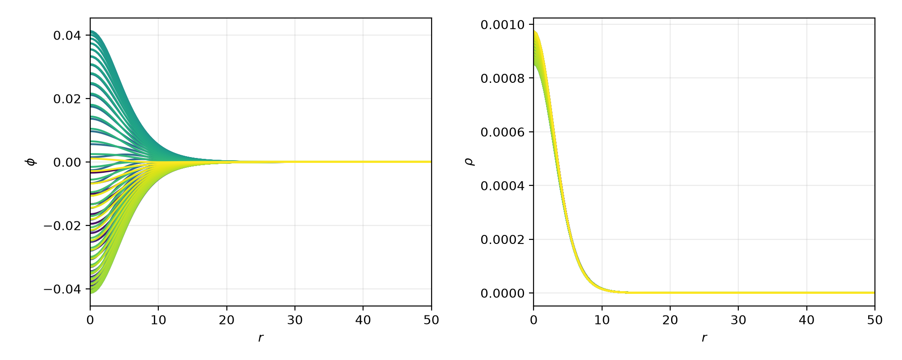

# Running the scalar field example

Here we explain the scalar field example found in the code, which implements an oscillaton, which is a compact object where the scalar field gradients balance the gravitational attraction, leading to a long-lived, local, oscillating configuration.

The parameters that are provided give a good enough resolution for the physical problem, and can be run relatively quickly on a laptop. For that reason it is a good initial test of running the code. However, to test the performance of the code on a larger system we recommend the [**Binary BH example**](bbh_example.md).

## Physical scenario

This page describes running the Scalar Field example using the parameters found in [this parameter file](https://github.com/GRTLCollaboration/GRTeclyn/blob/develop/Examples/ScalarField/params.txt).

### Initial data

The initial scalar field profile is set in [`OscillatonInitialData.hpp`](https://github.com/GRTLCollaboration/GRTeclyn/blob/develop/Examples/ScalarField/OscillatonInitialData.hpp)).

This uses a quasi-stationary solution obtained from a shooting method, which has then been interpolated using chebychev polynomials to give something we can impose analytically. At large radius it reduces to the Schwarzschild metric. 

The values for $\Gamma^i$ could be calculated analytically from derivatives of the conformal metric, but instead we calculate it numerically using the `GammaCalculator.hpp` tool, which is necessary where the initial data is not conformally flat.

Time-symmetric metric data for the fitted ground-state oscillaton profile is supplied in areal-polar coordinates,

$$ dl^2 = g_{rr}(r) dr^2 + r^2 d\Omega^2. $$

In Cartesian coordinates this is

$$ \gamma_{ij} = \delta_{ij} + (g_{rr} - 1) n_i n_j. $$

The CCZ4 variables are `chi`$= det(\gamma)^{-1/3} = g_{rr}^{-1/3}$ and `h`$= \chi \gamma_{ij}$. The components of the extrinsic curvature `K` and `A`$=\tilde A_{ij}$ are zero.  At the initial oscillaton phase the field profile `phi` is zero and its conjugate momentum `Pi` is nonzero, which means it can satisfy the constraints for any scalar potential (but it will only be stationary for the massive potential corresponding to the solution). 

The conformal connection `Gamma`$=\tilde{\Gamma}^i$ is evaluated numerically from `h` using a separate class `GammaCalculator`, which is required for consistency since the metric is not conformally flat.

The fitted profiles are finite Chebyshev expansions in

$$s = r^2 / (r^2 + L^2), \quad   x = 2s - 1.$$

They are smooth and even at the origin.  

The geometry approaches a Schwarzschild solution of mass $M=0.52459888$ at large r.

Note that this profile uses a scalar mass $\mu=1$ and Newton's constant $G=1$.

We currently impose a fixed hierarchy of 2:1 refinement grids.

### Diagnostics

In this example we show how to extract evolution and diagnostic data along a line through the centre of the oscillaton using the particle interpolator.

Further details are below.

## Computational set up

Please read the [Performance Optimisation](performance_optimisation.md) guide to understand how to divide the domain into boxes that are shared over the MPI ranks, as this is crucial for obtaining good performance on HPC systems. When GRTeclyn regrids (always at the first step, and at later steps as requested by the user), it will output the grid setup to the output file. This tells you how many boxes are on each level, and what their sizes are. This is very useful for understanding if you are load balancing appropriately.

The parameters should be mostly self explanatory if you are familiar with NR, but you can look at the [**Parameters**](parameters.md) guide for more details.

Typically, on an old M1 Macbook laptop with no MPI, we obtain a speed of 650 M/hr in code units with the provided parameters. If your speeds are significantly below this, something is wrong.

## Checking the outputs

### Viewing 3D data and 2D slices

See [**Visualising Ouputs**](visualising_outputs.md) for details on visualising. Note that checkpoint files are not viewable with AMReX, only plot files are.

You probably want to look at the scalar profile `phi`, and perhaps also the conformal factor `chi`. Both should oscillate during the evolution.

### Plots from data files

The example also outputs some ASCII datafiles for post processing in a `data` folder. Firstly, it gives a file `scalar_profile.dat`, which gives the scalar profile over time.

This can be plotted using the `python` script `plot_lineouts.png` found in the example folder.

The resulting image should look like  

Note that the small oscillation in the density over time is expected - for a real scalar field oscillon, the stress energy tensor is not completely stationary. However, it should not decay noticeably over time and the amplitude of the oscillations should remain just above 0.04.
