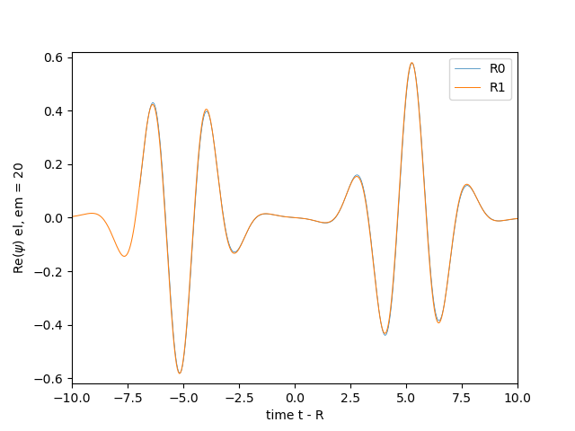

# Running the Teukolsky wave example

This documentation is about the Teukolsky wave example in GRTeclyn.
It simulates the evolution of a Teukolsky wave (defined in [Teukolsky, 1982](https://journals.aps.org/prd/pdf/10.1103/PhysRevD.26.745)), a linearized quadrupolar gravitational wave in the TT gauge.

Multiple choices exist for the parity of the wave (even or odd) and its azimuthal quantum number M. Note that only the combinations (even, 0), (even, 2) and (odd, 2) are implemented for (parity, M).


## Physical scenario

This page describes running the Teukolsky wave example using the parameters found in [this parameter file](https://github.com/GRTLCollaboration/GRTeclyn/blob/main/Examples/TeukolskyWave/params.txt) or in [this lighter parameter file](https://github.com/GRTLCollaboration/GRTeclyn/blob/main/Examples/TeukolskyWave/params_light.txt). They both correspond to the case (even, 0), with the "lighter" parameter file using a smaller number of cells to run faster, in particular to be able to run on a personal laptop.

### Initial data

In this example, the initial data of the Teukolsky waves follows the Eppley construction ([Eppley, 1979](https://ui.adsabs.harvard.edu/abs/1979sgrr.work..275E/abstract)), which constructs a superposition of an in- and outgoing wave such that the initial data is at a moment of time-symmetry and the momentum constraint is trivially satisfied. More precisely, it employs the seed function in ([Hilditch, 2013](https://inspirehep.net/literature/1254684)), which generalizes the Eppley construction to start the wave packets at a distance $r_0$ away from the origin.

The initial data metric coefficients are computed in [`EppleyPacket.impl.hpp`](https://github.com/GRTLCollaboration/GRTeclyn/blob/main/Examples/TeukolskyWave/EppleyPacket.impl.hpp). They are derived from the expressions in [Teukolsky, 1982](https://journals.aps.org/prd/pdf/10.1103/PhysRevD.26.745). As given in the paper, the metric in spherical coordinates is, for the even-parity case, given by

$$
\begin{align*} d s^2 = & - dt^2 + (1+ A f_{rr}) dr^2 + (2B f_{r \theta}) r dr d\theta + (2B f_{r \phi})r \sin \theta dr d\phi \\
& + (1 + C f_{\theta \theta}^{(1)} + A f_{\theta \theta}^{(2)}) r^2 d\theta^2 + [2(A-2C) f_{\theta \phi}] r^2 \sin \theta d \theta d\phi\\
& + (1 + C f_{\phi \phi}^{(1)} + A f_{\phi \phi}^{(2)}) r^2 \sin^2 \theta d\phi^2;
\end{align*}
$$

and for the odd-parity case:

$$
\begin{align*}
ds^2 = & - dt^2 + dr^2 + (2K d_{r\theta})r dr d\theta + (2 K d_{r \phi}) r \sin \theta dr d \phi \\
&+ (1 + L d_{\theta \theta}) r^2 d \theta^2 + (2 L d_{\theta \phi})r^2 \sin \theta d \theta d \phi\\
&+ (1 + L d_{\phi \phi}) r^2 \sin^2 \theta d \phi^2;
\end{align*}
$$

where $f_{ij}$ and $d_{ij}$ are angular functions of $\theta,\phi$, and the functions A, B, C, K and L depend on $r,t$ through a seed function $F(x)$ (and its derivatives): here, $x=t-r$ results in an outgoing wave, while $x=t+r$ results in an ingoing wave. The seed function used in this example is

$$ F(x;\mathcal{A},\sigma,r_0) = \frac{\mathcal{A} x}{2}  \left( e^{-((x + r_0)/ \sigma)^2} + e^{-((x - r_0)/ \sigma)^2} \right).$$

As this seed function is not regular at the origin (see [Hilditch, 2015](https://inspirehep.net/literature/1362166)), the initial data is regularized near the origin by evaluating the seed function at

$$ r_{reg} = r + \rho e^{-(r / \rho)^2} \,, $$

where $\rho$ is a regularization parameter, called `regularize_r` in the parameter files.
The parameters in `params.txt` and in `params_light.txt` are such that $\rho \ll \sigma \ll r_0$. The example has not been tested for parameters that do not respect the above condition.

Finally, the metric coefficients are converted to Cartesian coordinates through a standard coordinate transformation, resulting in the expressions given in [`EppleyPacket.impl.hpp`](https://github.com/GRTLCollaboration/GRTeclyn/blob/main/Examples/TeukolskyWave/EppleyPacket.impl.hpp).


## Computational set up

Please read the [Performance Optimisation](performance_optimisation.md) guide to understand how to divide the domain into boxes that are shared over the MPI ranks, as this is crucial for obtaining good performance on HPC systems. When GRTeclyn regrids (always at the first step, and at later steps as requested by the user), it will output the grid setup to the output file. This tells you how many boxes are on each level, and what their sizes are. This is very useful for understanding if you are load balancing appropriately.

The parameters should be mostly self explanatory if you are familiar with NR, but you can look at the [**Parameters**](parameters.md) guide for more details.

Running the example with `params.txt` takes about 13 minutes on one Intel Ponte Vecchio GPU, using 2 MPI ranks, 2 tiles. If only one rank and one tile are used, we find a duration of about 25 minutes. This corresponds to speeds of about 1150 code units/hr and 600 code units/hr, respectively.

Running `params_light.txt` takes around 10 to 15 minutes to run on a personal laptop, using a single CPU (no parallelization). This corresponds to a speed of $\sim 80-120$ code units/hr. If your speeds are significantly below this, something is wrong.


## Checking the outputs

### Extraction of the Weyl scalar

This example incorporates the extraction of the Weyl scalar (following the [**Binary BH example**](bbh_example.md)), and hence gravitational waves can be visualised.
For the $M=0$ ($M=2$) case, the Weyl component(s) $\psi_{20}$ ($\psi_{22}$ and $\psi_{2,-2}$) show two bursts, separated by a time delay $\sim 2 r_0$. This represents the outgoing wave, followed by the ingoing wave after it has passed through the origin.


### Viewing data in VisIt

See [**Visualising Outputs**](visualising_outputs.md) for details on visualising. Note that checkpoint files are not viewable, only plot files are.

Variables that are interesting to plot are the real part of the Weyl scalar `Weyl4_Re`, and potentially its imaginary part `Weyl4_Im`.
Additionally, the constraint norms can be useful for checking the accuracy of the run: `Ham`, `Mom1`, `Mom2` and `Mom3`.

### Plots from data files

The Weyl extraction is generating outputs for several angular components of the Weyl scalar, extracted at one or more radii, to files named as `weyl_extraction_mode_<mode LM>.dat`. The parameters for the extraction, in particular the modes and the extraction radii, can be modified in the parameter files.

These outputs can be plotted with various tools. For example, one can plot $\psi_{20}$ extracted at radii $R_0 = 7$ and at $R_1 = 10$ using `gnuplot`:

`f20='weyl_extraction_mode_20.dat'; plot f20 u ($1-7):2 with lines title 'r = 7', f20 u ($1-10):4 with lines title 'r = 10'`

or a `python` script, such as:

```python
# A simple python script to plot the GW
# signal from the TW example over time,
# for a chosen mode

import numpy as np;
import matplotlib.pyplot as plt;

# coord locations of extraction radii
R0 = 7
R1 = 10

# The mode, as text
mode = "20"
# output data from running the example
data = np.loadtxt("weyl_extraction_mode_" + mode + ".dat")

# make the plot
fig = plt.figure()

# first radius
timedata0 = (data[:,0] - R0)
fluxdata0 = data[:,1]
plt.plot(timedata0, fluxdata0, '-', lw = 0.5, label="R0")

# second radius
timedata1 = (data[:,0] - R1)
fluxdata1 = data[:,3]
plt.plot(timedata1, fluxdata1, '-', lw = 0.75, label="R1")

# make the plot look nice
plt.xlabel("time t - R")
plt.ylabel(r"Re($\psi$) el, em = " + mode)
plt.xlim(-10, 10)
plt.ylim(-0.62, 0.62)
plt.legend()

# save as png image
filename = "TW_Weyl_" + mode + ".png"
plt.savefig(filename)
```

The image resulting from data obtained with `params_light.txt` should look like


For the case (even, 0), all other modes should have negligible amplitude compared to the mode $\psi_{20}$.
