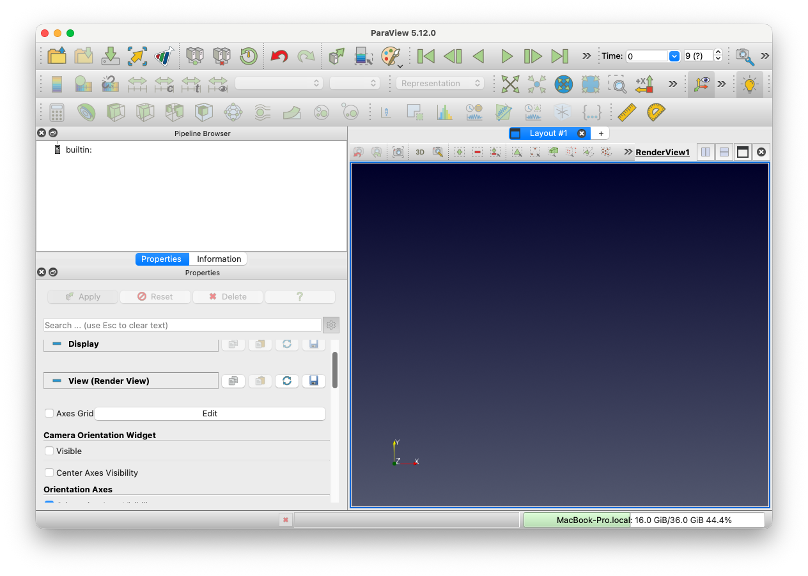
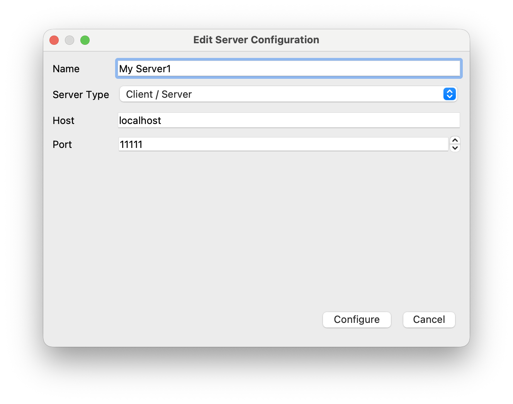
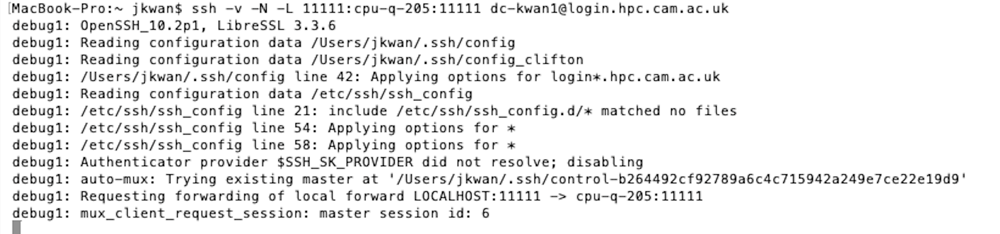
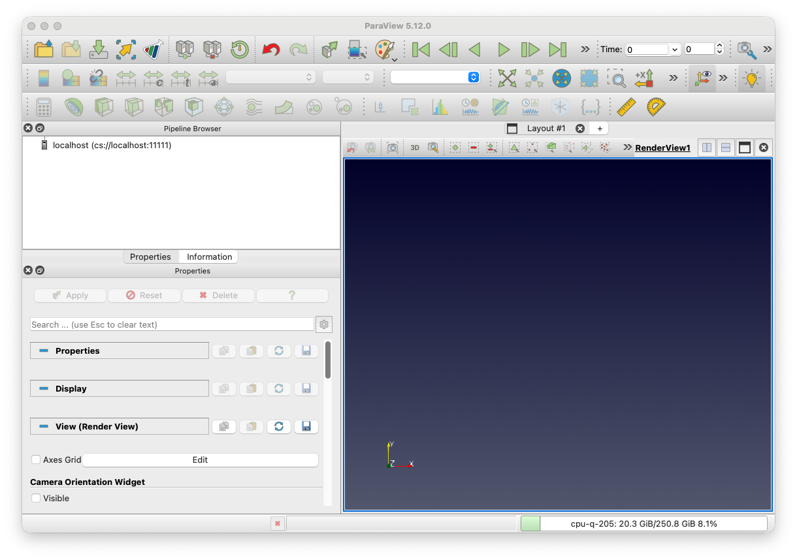
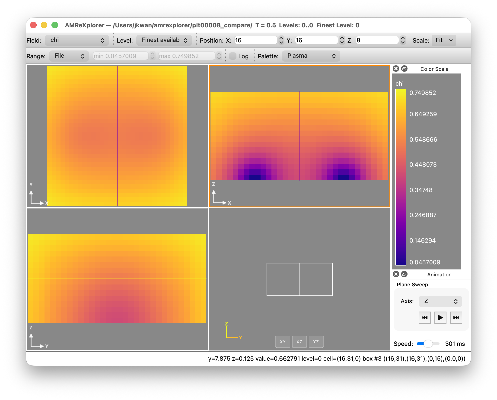

# Visualising outputs

GRTeclyn outputs checkpoint and plot files in the native AMReX `plt` format. There are several options for viewing and processing such files, but we generally use VisIt, ParaView or `yt`.

Please see the [AMReX documentation](https://amrex-codes.github.io/amrex/docs_html/Visualization_Chapter.html) for more information on any of the methods listed below.

## Using ParaView

[ParaView](https://www.paraview.org/) is an open-source and scalable
visualisation application similar to VisIt that can understand AMReX's
native `plt*` format for both grid and particle data.

You can download a prebuilt version of ParaView for your local machine
(Windows/macOS/Linux) from [here](https://www.paraview.org/download/).

* **Windows and macOS:** These are in the form of executables
  (`exe` and `dmg` respectively).
* **Linux:** Download and extract the tar file to a directory of your
  choosing. The application can be run by changing to the the `bin` subdirectory
  of the extracted folder and running the `paraview` executable, for example
  ```bash
  cd /path/to/ParaView-5.9.1-MPI-Linux-Python3.8-64bit/bin
  ./paraview
  ```

!!! warning

    It is very important that you download the **exact** same version of ParaView as what is installed on the cluster if you want to run it remotely in a server/client configuration.


### Remote visualisation

Assuming you have just performed a simulation on a remote HPC cluster and wish
to visualise the outputted files, the best way to do this is to set up
ParaView for remote visualisation (client/server mode). In order to do this, you
will need to match the version on the cluster with your local version, down to subversion number,
so check what version is available via modules (assuming your system uses some
form of modules):
```
module avail paraview
```
and install the corresponding version locally. If ParaView is not installed,
ask the cluster administrator to install the latest version for you.

Since ParaView relies on open ports in order to be able to connect between the
client and server, and most HPC systems do not leave ports open for security
reasons, we will get around this by "tunnelling" the port with ssh.

To do this, follow the steps below

1. Open ParaView locally. 
Notice how the bottom right corner shows the name of your laptop/local machine.

2. Click the 'Connect' icon ()
near the top left (or via the menu option File → Connect). Click 'Add Server' and set the fields to the values in the
image below. Then click 'Configure' and set the 'Startup Type' field
to 'Manual'. Click 'Save' and then click 'Close' 
3. SSH into the remote cluster and load the relevant ParaView module. Start a Slurm job using
   ```bash
   srun -A <YOUR_ACCOUNT> -p <PARTITION> --nodes=1 --ntasks=4 --cpus-per-task=1 --walltime=00:30:00 pvserver
   ```
   which requests 4 MPI ranks on a single node for 30 mins. (Please do not run `pvserver` directly on the head node.)
   When the job starts, something like this will be printed:
   ```bash
   Waiting for client...
   Connection URL: cs://<hostname>:<remote port>
   Accepting connection(s): <hostname>:<remote port>
   ```
   where `<remote port>` is usually something `11111`.
   Note that if loading a particularly large file, you may want more ranks.

4. In a local terminal, set up an SSH tunnel through the ports:
   ```bash
   ssh -v -N -L 11111:<name of compute node>:<remote port> <username>@<hostname>
   ```
   See the example for CSD3: 
5. Click the 'Connect' icon again and choose the server we configured in step 2
   called `localhost`. It should then connect to the remote cluster and the
   output from your SSH session in step 3 will have the extra line
   ```
   Client connected.
   ```
   Using the menu options 'File → Open', you should be able to browse the remote
   filesystem and select your files. 
   If the connection is successful, the bottom right corner, should show the name of the compute node, not your laptop.

Note that you only need to do step 2 once. To run remote visualisation another
time, simply repeat steps 1 and 3-5.

### Remote visualisation with reverse connection (Advanced users only)
If you are having problems with the above method for remote visualisation with
ParaView, there is an alternative in the form of *reverse connections* where
the remote server connects to the local client (rather than the above where the
local client connects to the server). If you are trying to use Catalyst Live
with the ParaView Catalyst insitu instrumentation, this also uses a reverse
connection so you will need to follow similar steps.

As for the conventional client/server
mode, you will need to have a version of ParaView installed on the remote system
and the same version installed locally.

To set up remote visualisation with reverse connections, follow the steps below

1. Open ParaView locally.
2. Click the 'Connect' icon ()
   near the top left (or via the menu option File → Connect). Click 'Add Server'.
   Use the same settings as above, except in the drop down menu for "Server Type",
   select "Client/Server (reverse connection)". Name it something new.
   Then click 'Configure' and set the 'Startup Type' field to 'Manual'.
   Click 'Save'.
3. Connect to the server we have just configured by selecting it and then
   clicking 'Connect'. A dialog box will appear which says:
   > Establishing connection to 'localhost (reverse connection)'.
   > Waiting for server to connect.
4. SSH into the remote cluster and load the relevant ParaView module. Start an interactive job, using
   ```bash
   srun -A <YOUR_ACCOUNT> -p <PARTITION> --nodes=1 --ntasks=4 --cpus-per-task=1 --walltime=00:30:00 --pty bash
   ```
   Then on the terminal run:
   ```bash
   pvserver -rc --client-host=<name of computer running ParaView client>
   ```
   NB: notice the additional flags!
   Note the name of the node that you've been allocated

5. Set up the tunnel between the local `11111` port and the remote port
   (this can usually be set to `11111` but we will leave it generic in the
   following instructions) with the command
   ```bash
   ssh -v -N -R 11111:<name of compute node>:<remote port> <username>@<hostname>
   ```
   It may ask for authentication and then look as though it has 'hung' (i.e. no
   prompt)
   Note that these commands are virtually identical to the ones for the
   conventional client/server tunnelling but the `-L` flag has changed to `-R`.
   Assuming everything has worked, you should get the following output
   ```
   Connecting to client (reverse connection requested)...
   Connection URL: csrc://localhost:xxxxx
   Client connected.
   ```
   Using the menu options 'File → Open', you should be able to browse the remote
   filesystem and select your HDF5 files.

### Creating plots with ParaView

Fill this in!

### Documentation and Tutorials

The ParaView user and reference guide can be found
[here](https://docs.paraview.org/en/latest/). Make sure to select the correct
version in the bottom left.

There are also some tutorials that are linked to from the main ParaView website
[here](https://www.paraview.org/tutorials/).

There are some nice tutorials from the ALCF, including
[a beginners guide](https://docs.alcf.anl.gov/polaris/visualization/paraview-tutorial/)
for mesh and particle data and one with [more advanced techniques](https://github.com/argonne-lcf/GettingStarted/blob/master/Visualization/ParaViewPython.md).

There is also a YouTube video for a presentation given at
ATPESC [here](https://youtu.be/sXY72e3Ce4g).

## Using AMReXplorer
[AMReXplorer](https://github.com/AMReX-Codes/amrexplorer) is a GUI for plotting AMReX outputs that has been vibe coded by Weiqun Zhang and Ben Wibking (so please open an issue if you encounter problems).

Please refer to the [installation](https://github.com/AMReX-Codes/amrexplorer/blob/main/INSTALL.md) and [user guide](https://github.com/AMReX-Codes/amrexplorer/blob/main/docs/user-guide.md) for more information.

AMReXplorer supports both Mac and Linux builds but you will need a C++20 compiler and `qt`. It can operate in server/client mode as well if your data is stored on a HPC system.



## Using `fsnapshot`

`fsnapshot` is a lightweight AMReX tool for generating quick images of outputs. Navigate to `${AMREX_HOME}/Tools/Plotfile` then run `make COMP=<your preferred system>`. For example:
```bash
./fsnapshot.intel-llvm.ex -v chi -p Palette /lus/flare/projects/grteclyn/GRTeclyn/Examples/BinaryBH/plt00008
```
will plot the values of `chi` from the regression test output from the BinaryBH example using the `Palette` colourmap. The output will be in one directory above where the plotfiles are stored, in this case, this is `/lus/flare/projects/grteclyn/GRTeclyn/Examples/BinaryBH/`.

You can specify the AMR level you would like to plot and where to take a slice for 3D data.

There are other very useful tools in that directory! More information on the AMReX plotfile tools can be found [here](https://amrex-codes.github.io/amrex/docs_html/Post_Processing.html).

<p style="text-align: center;">
  
</p>


## Using Visit

Download Visit to your local machine from their [current releases](https://visit-dav.github.io/visit-website/releases-as-tables/).

!!! warning
    It is very important that you download the **exact** same version of VisIt as what is installed on the cluster if you want to run it remotely in a server/client configuration.


For Mac and Windows there are installers, for Linux you should download the tar file, plus the "Visit Install Script" (in the bullets above the executable) and follow the instructions in "Visit Install Notes". The tar file for Ubuntu 14.04 seems to work on Ubuntu 16.04 too.

Assuming your plot files are on a remote cluster, you have three options:

1. Download the files to a local machine (or more likely onto an external hard drive connected to it, since the files are large) and run them directly there. (The command for copying files is scp).
2. Install (or module load) VisIt and run it in command line mode by submitting a batch job. This is usually the best option for systems with a firewall preventing outgoing connections (e.g. Marenostrum, SupermucNG). Some example scripts and the appropriate run command for this can be found [here](https://github.com/GRTLCollaboration/Postprocessing_tools/tree/master/VisItTools). Note that some clusters do not support X11 forwarding. In these circumstances, you may be able to submit an interactive job that gives you a GUI desktop so you can run any GUI application that you would normally do on your personal machine. For example:
    - CSD3 supports a [web login](https://login-web.hpc.cam.ac.uk/). See the documentation [here](https://docs.hpc.cam.ac.uk/user-guide/login-web.html) for more info. NB: the MFA token is different from the one you use for SSH access.
    - All COSMAS support [x2go](https://wiki.x2go.org/doku.php). Information on how to set up x2go for COSMA access can be found [here](https://cosma.readthedocs.io/en/latest/x2go.html)
3. Run Visit remotely by downloading **the same version** (ie, 1.12.3 etc) of Visit on the cluster and setting up a remote profile in Visit on your local machine (see below). This has the advantage that you can keep the data on the cluster, and use its (probably more powerful) compute power, although some clusters don't like you to run Visit on the login nodes as it can clog up the system for other users, and may have dedicated nodes for visualisation. You should check this with your local cluster administrator. **(Note: The remote version should be the one with Mesa support for rendering without a display, otherwise you will have problems saving images and movies.)**

If you chose option 3, read the next section carefully!

### Setting up a remote host

To set up a remote host, launch VisIt on your local machine, then go to "Options->Host profiles". Click on "New Host" and configure it by setting:

* The Host nickname e.g. `cosmos`
* The remote hostname, e.g. `cosmos.damtp.cam.ac.uk`
* If you can run in parallel on the cluster nodes, set the max number of nodes and processors to use
* Path to visit installation (where you put it on the cluster), e.g. `~/visit`
* Username (your username on the remote host), e.g. `kclough`
* Select "Tunnel data connections through ssh" and set the ssh command to `ssh -C`

VisIt can sometimes be "difficult" when it comes to getting it to remember the configuration. After you've configured the host, click "Apply", then click on the "i" button on the bottom-right of the main Visit window. Return to the host configuration dialog and hit "Export host" you should then see a confirmation that VisIt has saved it for you.

A useful tutorial on running VisIt in parallel in client server mode, where one needs to submit a batch job to reserve the compute nodes, can be found [here](https://www.youtube.com/watch?v=IPekLxRJxJ0). (Note that for this you need to download a version which includes parallel VisIt - ie redhat not ubuntu).

### Making a plot

VisIt has a GUI interface, so it is (sort of) intuitive. Opening a file should allow you to view the series of hdf5 outputs as a time series, without having to select any special options.

!!! note "Opening a plotfile series"

    If you want to look at the series, rather than individual plot files, then you need to create a time series manually. For example, from the `Examples/BinaryBH` directory, create a VisIt database file (assuming you used the default plotfile names) with

    ```bash
    ls -1v plots/plt*/Header | tee movie.visit
    ```

    Open `movie.visit` in VisIt to load the plotfiles in numerical order as a time series.

The most useful plots for our data are Pseudocolour plots, using the Operators->Slice operators to view a slice (adjust the intercept to the centre of the grid) and Operators->Elevate to make the plot 3D, but the things you can do with VisIt are pretty limitless.

There are [VisIt tutorials](https://visit-sphinx-github-user-manual.readthedocs.io/en/develop/tutorials/index.html) which will help you to discover the available functionality.

See our (still relevant!) tips for making good visualisations in the [GRChombo wiki](https://github.com/GRTLCollaboration/GRChombo/wiki/Visualisation-tips). Feel free to add to them!

There are a number of example scripts for processing GRChombo files using the VisIt command line [here](https://github.com/GRTLCollaboration/Postprocessing_tools/tree/master/VisItTools)


## Using yt

`yt` is an alternative python based visualisation software which is very good for processing and analysing data. Instructions on downloading and using yt can be found [here](http://yt-project.org/doc/index.html).


> TIP: When installing `yt` try to do it in a virtual environment with `venv` or `pipx`. This will help avoid conflicts with other Python packages.


There are a number of example scripts for processing GRChombo files [here](https://github.com/GRChombo/Postprocessing_tools/tree/master/YTAnalysisTools) and as `yt` recognizes the AMReX output format, these still apply to GRTeclyn.
### Basics

The following script shows an example of the most basic commands:

```
import yt

filename = "/your/path/BBH_000100.3d.hdf5"       # path to the checkpoint/plot file.
ds = yt.load(filename)                           # yt.load() automatically detects that is a Chombo file and loads it.

L, _, _ = ds.domain_width                        # extract the size of the grid

# Loading data
data_flat = ds.r[:,:,:]                          # creates a dict with flat data (1D-array),
                                                 #it ignores duplicated datapoints from coarser levels.
data_grid = ds.r[::120j,::120j,::120j]           # creates a dict with grid data (3d-array with 120 points per side),
                                                 ## using 0th-interpolation order ('nearest') from the finest level.
data_grid = ds.r[::120j,::120j, L/2]             # creates a dict with grid data (2d-array with 120 points per side),
                                                 ## using 0th-interpolation order ('nearest') from the finest level.


print('shape flat: ',  data_flat["K"].shape)     # Here it has been used the var "K" as an example
print('shape grid: ',  data_grid["K"].shape)
print('shape slice: ',  data_slice["K"].shape)
# Output:
# shape flat:  (15489664,)
# shape grid:  (120, 120, 120)
# shape slice:  (120, 120)

```

The command `ds.r[:,:,:]` creates a python-dictionary that contains the outputted variables  (e.g. "K", "chi", etc) and other useful grid-variables  (e.g. "x", "y", ..., "dx", ..., etc).
The following script shows an example of how to compute the averaged quantities of a variable of interest.

```
import numpy as np

# Loading data
ds = yt.load("/path/your/file/???.hdf5")
dd = ds.r[:,:,:]                                         # Load the dict containing the flat array data

gridcell_volume = dd['dx']**3
physical_cell_volume =  dd['dx']**3*dd['chi']**(-1.5)    # physical cell volume taking into account the conformal factor "chi".
total_volume = np.sum(physical_cell_volume)

average_K = np.sum(dd['K'] * physical_cell_volume)/total_volume

```

`yt` contain many additional functionalities for both analysis and plotting. Have a look at their documentation for an in-depth description (link above).
