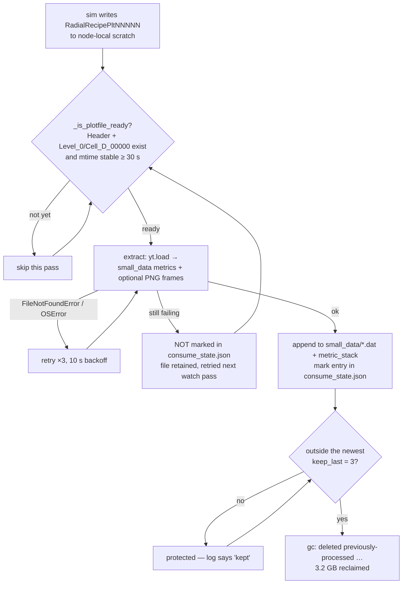

# grteclyn-wrapper

Python orchestration layer that runs isolated **GRTeclyn** GPU episodes from the
repo root (`GRTeclyn/`). For each candidate spacetime it asks the sibling
**GRTresna** elliptic solver for constraint-satisfying initial data, hands that
data to GRTeclyn for time evolution, streams plotfiles into `small_data/` +
`frames/` during the GPU run, deletes the heavy HDF5 dirs afterward, and scores
the result with a pluggable objective. On top of this episode loop sit
quality-diversity (MAP-Elites) and CMA-ES search campaigns that explore
matter/geometry configurations for FTL shortcuts, gravitational-wave beaming,
spacetime shear, and critical collapse.

All commands run from **`grteclyn-wrapper/`**. Binaries must be built first —
see [Operations](#operations). Site layout (sibling repos, OpenMPI, GRTresna
env) is configured with a gitignored [`.env`](#site-paths-env) — see below.

> **Roadmap:** critical review of the results' validity and the prioritized
> implementation plan (probe calibration, gauge-honest baseline, ANEC/QI,
> convergence, pump accounting, self-grav, wave-zone GW) live in
> [`NextSteps.md`](NextSteps.md).

---

## What is implemented

| Capability | Where | Notes |
|------------|-------|-------|
| **GRTresna bridge** — `params.txt` → MPI solve → Chombo HDF5 → `.gridinit` | `src/grteclyn_wrapper/grtresna/` | Ham + Mom constraint solve; exotic (`rho<0`) auto-switches to K=0 maximal slicing. Deep docs: [`src/grteclyn_wrapper/grtresna/README.md`](src/grteclyn_wrapper/grtresna/README.md) |
| **Matter sectors** — real scalar, complex scalar / U(1) boson star, Q-ball, shell, trajectory, rotating Q-torus eigenstate | `grtresna/matter/`, `grtresna/fields/`, `grtresna/profiles/` | Per-lump signed scalars (`GRTresnaIndependentScalars` C++); exotic wedge; self-gravitating boson-star ODE solver (isotropic coords); 2D spinning Q-ball (`qball_torus.py`, `profile==4`) |
| **Matter-profile contract (rail)** — single source of truth + t=0 cross-code consistency gate | `grtresna/matter/profile_contract.py`, `tests/grtresna/test_profile_contract.py` | Catches stale-binary empty fields / sign flips / wrong-ω / center bugs before evolution; see [Matter-profile contract](#matter-profile-contract--the-rail-for-adding-new-profiles-safely) |
| **Plotfile consumer** — streaming `small_data/` + PNG `frames/` + HDF5 deletion | `scripts/lib/`, `src/.../visualisation/` | `consume_plotfiles` sidecar; **required** for every production run |
| **Ψ₄ / GW extraction** — in-code C++ `WeylExtraction` (spherical-harmonic modes) | `Examples/RotatingWormholeCollapse/`, `src/.../visualisation/process_wave/` | **Primary: in-code GRTeclyn `SphericalExtraction`** → `data/Weyl4_mode_2{0,1,2}.dat`, dense (every coarse step), multi-radius, decoupled from plotfiles. Python `process_wave` sidecar still extracts a coarse cross-check + drives frames |
| **Search algorithms** — MAP-Elites (QD) archive, CMA-ES hill-climb | `src/.../search/qd_search/`, `src/.../search/optimize/` | Shared pre-evolution gates; warm-start from any trajectory |
| **Objectives** — `ftl_first`, `robust_ftl`, `general_ftl`, `critical_collapse`, `gw_beam`, `spacetime_shear` | `src/.../metrics/score/objectives.py` | See [Campaigns](#campaigns) for which objective each campaign uses |
| **Descriptors** — `ftl_lifetime`, `speed_horizon`, `wave_focusing`, `spacetime_shear`, `gw_beam` | `src/.../search/qd_search/descriptors.py` | Behavior axes for the MAP-Elites archive |
| **4D null-geodesic probe** — gauge-invariant FTL shortcut measurement | `src/.../metrics/probes/ftl/` | `search` (cheap) and `hq` (full verify) profiles; continuous emission sweep |
| **Falsification tiers** — T0 constructed → T6 analytic | `scripts/search/validate_tiers.py` | Offline ladder; no rerun needed |
| **Geometry-first projection** — motif scout → GRTresna solve | `src/.../initial_data/motif.py`, `grtresna/fit/motif.py`, `projection/` | Additive second stage; never push fitted matter directly into GRTeclyn |
| **Pure-geometry MAP-Elites atlas** — Stage-1 stationary metric scout | `src/.../search/geometry_atlas/`, `scripts/campaigns/geometry_atlas/run.sh` | Searches broad asymptotically flat 4-metrics (no matter); scores frozen `f_geo` + stationary `f_ff` vs exotic-energy cost; see [`docs/GeometryFirst.md`](docs/GeometryFirst.md) |
| **Iterative matter adjustment** — CMA-ES loop over lump params (GRTresna-only) | `projection/iterate.py`, `projection/mismatch.py` | `--iterate N` on `project_geometry_motif.py`; L2 geometry-mismatch fitness; closes the fit→solve→compare loop |
| **Post-load constraint gate** — short GPU load check of `.gridinit` | `projection/postload_gate.py` | Rejects bad loads before the expensive main evolution |
| **Solved-FTL gate** — cheap t=0 filter on `.gridinit` | `search/solved_ftl_gate.py` | ~1 s/candidate; rejects flat/degenerate slices |
| **Visualization** — constraint plots, GW panels, frame movies | `src/.../visualisation/`, `scripts/plot/` | Article-style 6-panel Ψ₄ figures; `make_movies.sh` |
| **LIGO matched-filter search** — methodology + reference script | `src/.../gw_search/` | Intermediate-mass collapse templates vs GWOSC; see [`src/.../gw_search/README.md`](src/grteclyn_wrapper/gw_search/README.md) |
| **RL chassis** — pump/transport training launcher | `scripts/campaigns/rl/` | Opt-in stage 1.5; handoff in [`research/RL/LabJournal.md`](../research/RL/LabJournal.md) |
| **Self-gravitating boson star seed** — stationary single-star confinement | `grtresna/profiles/boson_star_ode.py`, GRTresna C++ | Four-bug fix; see [Self-gravitating boson star](#self-gravitating-boson-star) and [`SELFGRAV_HANDOFF.md`](SELFGRAV_HANDOFF.md) |

---

## Campaigns

The wrapper runs **three-stage** search campaigns (QD → CMA-ES → HQ) plus several
specialized single-stage campaigns. Each campaign has its own launcher under
`scripts/campaigns/`.

| Stage | What it does | Launcher | Output directory |
|-------|--------------|----------|------------------|
| **0 — QD** | MAP-Elites survey (8×8 archive) | `scripts/campaigns/qd/run.sh` | `runs/grtresna_qd/<name>/` |
| **1 — CMA-ES** | Local hill-climb from QD elites | `scripts/campaigns/cmaes/run.sh` | `runs/grtresna_cmaes/<name>/` |
| **2 — HQ** | Full-res replay + frames | `scripts/campaigns/hq/run_batch.sh` | `runs/grtresna_promote/<prefix>_hq_eval*/` |

**Geometry-first Stage-1 scout** (independent of the matter-first ladder above):

| Stage | What it does | Launcher | Output directory |
|-------|--------------|----------|------------------|
| **G0 — geometry atlas** | MAP-Elites over stationary metrics; frozen `f_geo` / `f_ff` | `scripts/campaigns/geometry_atlas/run.sh` | `runs/geometry_atlas/<name>/` |

This is a pure-geometry scout. It does **not** replace matter-first QD/CMA-ES; elites later hand off to `project_geometry_motif.py` for matter synthesis. Stationary atlas scores are screening metrics only — dynamical shortcuts still require GRTeclyn evolution.

Shared search defaults (grid, gates, 4D probe, objective) live in
`scripts/campaigns/lib/search_common.sh`. HQ defaults in
`scripts/campaigns/lib/promote_common.sh`. QD and CMA-ES **must** stay aligned
(same `search_common.sh`) so warm-started scores are comparable. HQ is
intentionally different: higher resolution and longer time stress-test whether
shortcuts survive refinement.

### Campaign catalog

| Campaign | Launcher | Objective | Descriptor | Matter | What it searches for |
|----------|----------|-----------|------------|--------|----------------------|
| **`geometry_atlas`** | `scripts/campaigns/geometry_atlas/run.sh` | stationary `f_geo`/`f_ff` | `f_geo` × log exotic energy | none (pure geometry) | Broad stationary metric atlas; Stage-1 inverse-design scout |
| **`general_ftl` (wormhole/ring/spin)** | `scripts/campaigns/general_ftl/run_all.sh` | `general_ftl` | `ftl_lifetime` | real scalar (pinned 15-D subspace) | FTL shortcut on a wormhole/ring/spin geometry; current production path |
| **`ftl_4d` (generic QD)** | `scripts/campaigns/qd/run.sh` | `ftl_first` | `ftl_lifetime` | real scalar shell/ring/free | Generic FTL discovery |
| **`qball_trajectory` (spiral)** | `scripts/campaigns/qball_trajectory/run.sh` | `general_ftl` | `ftl_lifetime` | complex scalar Q-ball, 5 per-lump orbits (39-D) | FTL from compact solitons on retrograde spiral orbits |
| **`qball_trajectory` (Lentz)** | `scripts/campaigns/qball_trajectory/run_lentz.sh` | `general_ftl` | `ftl_lifetime` | canonical Q-ball only, v_max=0.5c | Pure positive-energy FTL (no phantom matter) |
| **`qball_trajectory` (shear)** | `scripts/campaigns/qball_trajectory/run_shear.sh` | `spacetime_shear` | `spacetime_shear` | canonical Q-ball | Extreme non-collapsing frame-dragging shear |
| **`gw_beam`** | `scripts/campaigns/gw_beam/run.sh` | `gw_beam` | `gw_beam` | canonical Q-ball trajectory | Directional gravitational-wave emission (Z-axis beaming) |
| **`splash` (critical collapse)** | `scripts/campaigns/splash/run.sh` | `critical_collapse` | `wave_focusing` | canonical bosonic shell | Gravitational-wave focusing / critical collapse |
| **`boson_star`** | `scripts/campaigns/boson_star/run.sh` | `ftl_first` | `ftl_lifetime` | complex scalar / U(1), 7-D | Single centered Gaussian boson star |
| **`boson_star` (FTL shell, RL chassis)** | `scripts/campaigns/boson_star/ftl_shell_run.sh` | `general_ftl` | `ftl_lifetime` | `BosonStarBH` superposed shell (~18-D, exotic wedge ON) | Bosonic shell FTL with RL pump handoff |

### Objective modes

| Mode | Goal | Dominant terms |
|------|------|----------------|
| `ftl_first` | FTL shortcut, health secondary | geodesic + operational FTL dominate; shaping gradients cut to ~40%; trapped-surface veto |
| `robust_ftl` | Persistent, low-exotic FTL | persistence boosted (300→500), exotic hardened (40→70), coordinate signals trimmed |
| `general_ftl` | Gauge-invariant shortcut + curvature | geodesic + curvature_activity; graded horizon penalty; warp-motor shaping disabled |
| `critical_collapse` | GW focusing / collapse | geometric splash (χ-well + Ψ₄ wave + K-crunch) primary; ρ/focus/lapse secondary; FTL ignored |
| `gw_beam` | Directional GW power + Z-beaming | `(1000×quality + 100×peak + health) × gw_health_multiplier + penalties`; collapse → multiplier 0 |
| `spacetime_shear` | Max curvature, avoid horizon | 1000×curvature_activity + confinement; horizon veto (−500); FTL-agnostic |

---

## How to run

### Prerequisites

From the GRTeclyn repo root:

```bash
cd /path/to/GRTeclyn
uv sync   # Python deps including yt, h5py>=3.10 for the Chombo→gridinit bridge
```

Then configure site paths (required for GRTresna builds / solves) — see
[Site paths (`.env`)](#site-paths-env).

First build (single GPU, no MPI):

```bash
BUILD=1 bash grteclyn-wrapper/scripts/radial/run_radialrecipe_gpu_smoke.sh
```

Binaries (GRTresna MPI solver + GRTeclyn GPU binary) — see [Operations](#operations).

### Site paths (`.env`)

Machine-specific paths stay out of git. Copy the template, edit values, and
either source `scripts/lib/env.sh` (shell campaigns) or rely on automatic load
from Python (`grteclyn_wrapper.core.site_paths`).

```bash
cd grteclyn-wrapper
cp .env.example .env
# edit .env — set at least SIM_ROOT and GRTRESNA_ENV
source scripts/lib/env.sh   # exports vars for this shell + campaign scripts
```

| Variable | Meaning | Example shape |
|----------|---------|---------------|
| `SIM_ROOT` | Parent of GRTeclyn / GRTresna / Chombo | `/path/to/simulation` |
| `GRTECLYN_ROOT` | This checkout | `${SIM_ROOT}/GRTeclyn` |
| `GRTRESNA_ROOT` | Sibling elliptic solver | `${SIM_ROOT}/GRTresna` |
| `CHOMBO_HOME` | Chombo `lib` dir | `${SIM_ROOT}/Chombo/lib` |
| `OPENMPI_ROOT` | Local OpenMPI prefix (multi-GPU) | `${SIM_ROOT}/local/openmpi` |
| `GRTRESNA_ENV` | Conda/venv with `mpirun` for GRTresna | `/path/to/envs/grtresna` |

Rules:

- **`.env` is gitignored** — never commit it. Commit only [`.env.example`](.env.example).
- Already-exported shell variables win over `.env` (safe to override per run).
- `${VAR}` expansion is supported inside `.env` (e.g. `GRTECLYN_ROOT=${SIM_ROOT}/GRTeclyn`).
- Shell scripts that `source scripts/lib/env.sh` pick up the same keys.
- Python resolves the same layout via `site_paths` (loads `.env` on first use).
- If `.env` is missing, `GRTECLYN_ROOT` is auto-detected from the wrapper layout;
  `GRTRESNA_ENV` is **not** guessed — set it in `.env` for GRTresna MPI work.

Quick check:

```bash
cd grteclyn-wrapper
source scripts/lib/env.sh
echo "GRTECLYN_ROOT=$GRTECLYN_ROOT"
echo "GRTRESNA_ROOT=$GRTRESNA_ROOT"
echo "GRTRESNA_ENV=${GRTRESNA_ENV:-unset}"

uv run python -c "
from grteclyn_wrapper.core.site_paths import grteclyn_root, grtresna_env
print(grteclyn_root())
print(grtresna_env())
"
```

### Stage 0 — MAP-Elites (QD)

**Generic launch** (background, 8 GPUs, pipelined GRTresna + GPU):

```bash
QD_NAME=my_campaign_v1 \
QD_TARGET_EVALS=200 \
OBJECTIVE_MODE=ftl_first \
GPU_IDS="0 1 2 3 4 5 6 7" \
GPU_SLOTS_PER_DEVICE=1 \
MAX_CONCURRENT_GRTRESNA=3 \
  nohup bash scripts/campaigns/qd/run.sh \
  > ../runs/my_campaign_v1.launch.log 2>&1 &
```

**`general_ftl` wormhole** (current production path — pins 15-D subspace, dirs `x y z`):

```bash
BRANCH=wormhole \
QD_NAME=general_ftl_wormhole_v22 \
QD_TARGET_EVALS=200 \
GPU_IDS="0 1 2 3 4 5 6 7" \
  nohup bash scripts/campaigns/general_ftl/run_all.sh \
  > ../runs/general_ftl_wormhole_v22.launch.log 2>&1 &
```

**Resume** an existing QD run (same `QD_NAME`, same dir):

```bash
QD_NAME=general_ftl_wormhole_v21 QD_RESUME=1 \
  bash scripts/campaigns/qd/run.sh
```

**Q-ball trajectory spiral** (compact solitons on retrograde orbits, 39-D):

```bash
QD_NAME=qball_traj_spiral_v3 QD_TARGET_EVALS=400 \
GPU_IDS="0 1 2 3 4 5 6 7" \
  bash scripts/campaigns/qball_trajectory/run.sh
```

**Lentz** (pure canonical matter, v_max=0.5c):

```bash
QD_NAME=qball_traj_lentz_v1 QD_TARGET_EVALS=200 \
  bash scripts/campaigns/qball_trajectory/run_lentz.sh
```

**Spacetime shear** (extreme non-collapsing curvature):

```bash
QD_NAME=qball_traj_shear_v1 QD_TARGET_EVALS=200 \
  bash scripts/campaigns/qball_trajectory/run_shear.sh
```

**GW beam** (directional gravitational-wave emission, canonical Q-balls):

```bash
QD_NAME=gw_beam_v1 QD_TARGET_EVALS=200 \
GPU_IDS="0 1 2 3" \
  bash scripts/campaigns/gw_beam/run.sh
```

**Splash** (critical collapse / GW focusing, canonical bosonic shell):

```bash
QD_NAME=spacetime_splash_v13 QD_TARGET_EVALS=100 \
GPU_IDS="0 1 2 3 4 5 6 7" \
  bash scripts/campaigns/splash/run.sh
```

**Boson star** (complex scalar / U(1), 7-D):

```bash
QD_NAME=boson_star_v1 QD_TARGET_EVALS=80 \
GRTRESNA_MATTER_SECTOR=boson_star GRTRESNA_MATTER_COUPLING=canonical \
GPU_IDS="0 1 2 3" \
  bash scripts/campaigns/boson_star/run.sh
```

**Bosonic shell + FTL (RL chassis)** (~18-D, exotic wedge ON):

```bash
uv sync   # h5py>=3.10 required for GRTresna Chombo→gridinit bridge
QD_NAME=boson_shell_ftl_rl_v1 QD_TARGET_EVALS=200 QD_ITERATIONS=30 \
STOP_TIME=16.0 PLOT_INTERVAL=320 GRTECLYN_FRAMES=1 \
GPU_IDS="0 1 2 3 4 5 6 7" MAX_CONCURRENT_GRTRESNA=5 BATCH_SIZE=8 \
  nohup bash scripts/campaigns/boson_star/ftl_shell_run.sh \
  > ../runs/boson_shell_ftl_rl_v1.launch.log 2>&1 &
```

| Knob | Default (search) | Notes |
|------|------------------|-------|
| Grid | N=128, L=64, ml=1–2 | GRTresna solve on 128³ domain |
| Stop time | t=16 | `STOP_TIME=16.0` |
| Archive | 8×8 bins | `BINS=8` |
| Frames | **off** (search) / **on** (GW beam, boson shell) | `GRTECLYN_FRAMES=0` for speed |
| 4D geodesic | `search` profile | cheap stack for leaderboard |
| Prune eval dirs | top 3 + FTL peaks | `QD_KEEP_TOP_EVAL_DIRS=3` |

**Outputs:** `trajectory.jsonl`, `archive.json`, `eval_*/`, `ftl_champions.json`.

**Monitor:**

```bash
tail -f runs/grtresna_qd/<name>/trajectory.jsonl
cat runs/grtresna_qd/<name>/ftl_champions.json
```

### Stage 1 — CMA-ES optimization

Warm-start from a QD (or prior CMA-ES) trajectory. **Must match** the source
campaign's `OBJECTIVE_MODE`, grid, `STOP_TIME`, pins, and 4D profile.

```bash
RUN_NAME=general_ftl_wormhole_cmaes_v1 \
OBJECTIVE_MODE=general_ftl \
WARM_START_TRAJECTORY="${GRTECLYN_ROOT}/runs/grtresna_qd/general_ftl_wormhole_v21/trajectory.jsonl" \
WARM_START_TOP_K=1 WARM_START_JITTER=0.05 SIGMA0=0.05 \
TARGET_EVALS=150 MAX_GENERATIONS=50 KEEP_TOP_EVAL_DIRS=3 \
GPU_IDS="0 1 2 3 4 5 6 7" MAX_CONCURRENT_GRTRESNA=3 \
PIN_DIMS="$(bash -c 'source scripts/campaigns/lib/general_ftl_pins.sh && ftl_general_ftl_wormhole_pins')" \
  nohup bash scripts/campaigns/cmaes/run.sh \
  > ../runs/general_ftl_wormhole_cmaes_v1.launch.log 2>&1 &
```

| Knob | Typical | Notes |
|------|---------|-------|
| Population | = GPU count | `POPULATION` defaults to `#GPU_IDS` |
| σ₀ | 0.05–0.08 | local basin width |
| Warm-start | top-K elites | `WARM_START_TOP_K`, `WARM_START_JITTER` |
| Target | eval budget | `TARGET_EVALS` or `MAX_GENERATIONS × pop` |

**Outputs:** `runs/grtresna_cmaes/<RUN_NAME>/` — same layout as QD. **Monitor:**
`tail -f runs/grtresna_cmaes/<RUN_NAME>/trajectory.jsonl`

### Stage 2 — HQ promotion

Replays elite genomes at **N=256, L=128, ml=3, t=30** with fresh GRTresna solve,
**frames on**, 4D geodesic in **`hq`** verify mode, incremental
`score_timeseries.jsonl`.

**Single candidate** (`CANDIDATES` = eval/gpu **pairs**):

```bash
SOURCE_RUN="${GRTECLYN_ROOT}/runs/grtresna_cmaes/general_ftl_wormhole_cmaes_v1" \
NAME_PREFIX=general_ftl_wormhole_cmaes_v1 \
OBJECTIVE_MODE=general_ftl \
CANDIDATES="46 0" \
  bash scripts/campaigns/hq/run_batch.sh
```

**Top-K auto-pick** from trajectory (score-sorted `gpu_ok` rows):

```bash
SOURCE_RUN="${GRTECLYN_ROOT}/runs/grtresna_cmaes/general_ftl_wormhole_cmaes_v1" \
NAME_PREFIX=general_ftl_wormhole_cmaes_v1 \
OBJECTIVE_MODE=general_ftl \
TOP_K=1 \
  bash scripts/campaigns/hq/run_batch.sh
```

| Knob | Search (QD/CMA-ES) | HQ |
|------|-------------------|-----|
| Grid | 128³, L=64, ml=1–2 | **256³, L=128, ml=3** |
| Stop time | 16 | **30** |
| 4D mode | `search` | **`hq`** (full stack) |
| Frames | off | **on** (`GRTECLYN_FRAMES=1`) |
| GW / Ψ₄ | off (`--no-psi4`) | **on** (`GRTECLYN_PSI4=1`, HQ default) |
| Extraction radii | `4 8` | **`8 12 24`** from physics `center` |

**Monitor:**

```bash
tail -f runs/grtresna_promote/<name>.log
tail -f runs/grtresna_promote/<name>/small_data/score_timeseries.jsonl
ls runs/grtresna_promote/<name>/frames/
bash scripts/plot/make_movies.sh runs/grtresna_promote/<name> --framerate 10
```

### End-to-end orchestrator (QD → CMA-ES → HQ)

Single script under one campaign root (`runs/campaigns/<CAMPAIGN_NAME>/`):

```bash
CAMPAIGN_NAME=general_ftl_wormhole_v22 \
  bash scripts/campaigns/run_full_campaign.sh
```

Resume / partial: `RESUME=1 STAGE=cmaes CAMPAIGN_NAME=... bash scripts/campaigns/run_full_campaign.sh`

See [`scripts/campaigns/README.md`](scripts/campaigns/README.md) for stage
comparison and full env-var reference.

### Rules (do not skip)

1. **CMA-ES must mirror QD** — same `OBJECTIVE_MODE`, pins, grid, `STOP_TIME`, geodesic config.
2. **`general_ftl` needs `GRTECLYN_GEO_DIRECTIONS=x y z`** — wormhole shortcuts live on z; x-only scoring replays elites at the wrong fitness.
3. **HQ `CANDIDATES` is eval/gpu pairs** — e.g. `"46 0 39 1"` not a bare eval list.
4. **Search turns frames off, HQ turns them on** — by design (`search_common.sh` vs `promote_common.sh`).
5. **Promotion must use `N > L`** (or same `L` with larger `N`) to refine the grid. `L=N` only enlarges the domain at `dx=1` — no fidelity gain.
6. **Plotfiles go to node-local scratch, never NFS** — set `amr.plot_file` / `amr.check_file` under `/tmp`, point the consumer at the same path, keep `output_path` on NFS. See [Plotfile scratch MUST be node-local](#plotfile-scratch-must-be-node-local-required).

### ALWAYS extract frames on the fly (required)

Every GPU evolution run — QD, CMA-ES, HQ promotion, replay — **MUST** stream
plotfiles through `consume_plotfiles` during the simulation. Do not let heavy
`data/plt*` HDF5 directories accumulate; extract PNG frames + `small_data/`
metrics in flight and delete processed plotfiles immediately.

| Requirement | How |
|-------------|-----|
| Sidecar consumer ON | `CONSUME_PLOTFILES=1` (shell) or `consume_plotfiles=True` (Python) |
| Delete heavy HDF5 | on by default with `--keep-last 3` (even if `GRTECLYN_FRAMES=0`); opt out with `GRTECLYN_KEEP_PLOTFILES=1` |
| PNG frames written | Set `GRTECLYN_FRAMES_FIELDS` → outputs in `eval_*/frames/` |
| Verify consumer alive | `ps aux \| grep consume_plotfiles` while GPU is busy |

#### Plotfile scratch MUST be node-local (required)

Plotfiles are write-once, read-once, delete-immediately transients. They must
never be written to NFS. `amr.plot_file` and `amr.check_file` are independent
of `output_path`, so route the heavy data to node-local NVMe (`/tmp`, the
overlay mount) and keep only `.dat` diagnostics and `small_data/` results on
the shared filesystem.

##### Topology — what lives on which filesystem

Bulk data never crosses the network. The 3.2 GB plotfile is born, read, and
destroyed inside the node; only the ~1.4 MB of extracted numbers it distils
down to is written to NFS. Figures are measured on the mode-0 pump ladder
(2026-07-28, 6 × 256³ ml=3, t=30, `plot_interval=144`).

```
┌─ ONE RUN — replicated ×6, one per GPU, all sharing this node ────────────────┐
│                                                                              │
│   GRTeclyn sim (GPU N)                                                       │
│        │                                                                     │
│        │  plotfile, 3.2 GB every ~288 s                                      │
│        ▼                                                                     │
│   ╔═══════════════════════════════════════════╗                              │
│   ║  NODE-LOCAL NVMe  (overlay, 1.8 TB)       ║   never leaves the node      │
│   ║  /tmp/grteclyn_scratch/<run>/             ║                              │
│   ║      RadialRecipePlt*   ≤3 resident       ║   steady state 8.8 GB/run    │
│   ║      _cache/            pinned lib caches ║   53 GB for all six          │
│   ╚═══════════════════╤═══════════════════════╝                              │
│        ▲              │  read back 3.2 GB, extract in 15.7 s                 │
│        │  GC          ▼  (18× headroom against the 288 s cadence)            │
│        └───── consume_plotfiles (sidecar, one per run)                       │
│                       │                                                      │
│        ┌──────────────┘  distilled: ~1.4 MB per plotfile                     │
│        │                                                                     │
│        │      ┌─ .dat diagnostics, KB/s, written by the sim itself           │
│        ▼      ▼                                                              │
│   ╔══════════════════════════════════════════════════════════╗               │
│   ║  NFS  <output_path>/                                     ║               │
│   ║    data/*.dat                    772 KB   ← sim          ║               │
│   ║    small_data/metric_stack/       11 MB   ← consumer     ║               │
│   ║    small_data/{confinement,ftl_timeseries,…}.dat  12 KB  ║               │
│   ║    small_data/consume_state.json          ← the ledger   ║               │
│   ║    run.log, params.txt           676 KB                  ║               │
│   ╚══════════════════════════════════════════════════════════╝               │
│                                            ~12 MB per run, growing slowly    │
└──────────────────────────────────────────────────────────────────────────────┘
```

The write set is exactly these two boxes. Nothing else on the machine is
touched — see *Keep every write inside your own space* below.

##### What the move bought

| | plotfiles on NFS (before) | plotfiles node-local (after) |
|---|---|---|
| NFS traffic | ~130 MB/s aggregate | KB/s |
| max concurrent HQ runs | **2** | **6** (GPU-bound, not I/O-bound) |
| consumer state | blocked in `D`, backlog grew | 15.7 s/file, lag ≤ 1 plotfile |
| plotfiles resident | unbounded accumulation | flat at `keep_last` = 3 |

##### Plotfile lifecycle

Extraction is the only path that deletes anything, and it deletes only what it
has already recorded in `consume_state.json`. A file that fails extraction is
never marked and never collected — it is retried instead.



Two consequences worth internalising:

* `[ok] … kept` means *protected at that instant*, not *retained permanently*.
  The same file is collected later once three newer ones exist.
* Because deletion is gated on the ledger, **any extraction not enabled during
  the run is unrecoverable.** Decide on `--areal-radius`, `--shell-fields`,
  frames, and scoring passes *before* launch.

Params:

```
output_path    = "<NFS>/runs/<campaign>/<run>"       # .dat + small_data
amr.plot_file  = "/tmp/<scratch>/<run>/RadialRecipePlt"
amr.check_file = "/tmp/<scratch>/<run>/RadialRecipeChk"
```

Consumer: `--data /tmp/<scratch>/<run>` (local) `--out <NFS>/.../small_data`.

**Why this is mandatory.** A 256³ ml=3 plotfile is ~3.2 GB, written *and*
read back every ~288 s per run — ~22 MB/s per run plus heavy metadata churn.
On NFS that is what capped concurrency at 2 runs; consumers went to `D` state
in NFS I/O and stalled, backlogs grew, and plotfiles accumulated. Moving the
transients to local NVMe drops NFS traffic from ~130 MB/s to KB/s and lets
**6 concurrent HQ runs** share one node. Measured on the mode-0 pump ladder
(2026-07-28): 6 × 256³ t=30 runs, NFS run dirs ~12 MB each — dominated by
`small_data/metric_stack` at ~1.4 MB per extracted plotfile, so budget ~30 MB
per completed t=30 run — while local scratch held 8.8 GB per run; extraction
15.7 s against a 288 s plotfile cadence (18× headroom).

**Cloning a baseline `params.txt`: `amr.plot_file` / `amr.check_file` are
absolute paths into the source run directory.** Strip and re-emit them, or the
clone writes plotfiles into the baseline and a `--delete` consumer prunes the
baseline's own data. Verify with a dry run that each of `output_path`,
`amr.plot_file`, `amr.check_file` occurs exactly once.

**Scratch is transient — purge only what was extracted.** Anything deleted
from local scratch is gone for good (on NFS it would have survived a stalled
consumer). Purge a run's scratch only when every resident plotfile appears in
`small_data/consume_state.json`; otherwise keep it and log the discrepancy.
Allow a drain window of **600 s** after the simulation exits before tearing the
consumer down — shorter windows (120–180 s) truncated confinement data in three
runs of the fast ladder.

**Sizing.** Steady state is `n_runs × (keep_last + jobs) × plotfile_size`.
Six runs × 3 kept × ~2.9 GB ≈ 53 GB, against 1.1 TB free on the overlay. Check
`df -h /tmp` before launching; if `checkpoint_interval > 0`, remember
checkpoints are **not** pruned by the consumer and must be budgeted separately
(the pump ladder runs with `checkpoint_interval = -1`).

**Keep every write inside your own space.** Call the project venv python
directly (`grteclyn-wrapper/.venv/bin/python -m ...`) rather than `uv run`,
which writes to `~/.cache/uv`, and pin library caches into scratch:

```python
env["XDG_CACHE_HOME"]      = f"{SCRATCH}/_cache"
env["UV_CACHE_DIR"]        = f"{SCRATCH}/_cache/uv"
env["MPLCONFIGDIR"]        = f"{SCRATCH}/_cache/mpl"
env["TMPDIR"]              = f"{SCRATCH}/_cache/tmp"
env["PYTHONPYCACHEPREFIX"] = f"{SCRATCH}/_cache/pyc"
```

On the shared cluster `~/.local/bin` and `~/.local/lib` are owned by
`nobody:nogroup` and are **not writable** — admin policy is "write only to your
own directories". Nothing in this pipeline touches them. The complete set of
write targets is: `/tmp/<scratch>/` (transient) and the NFS run directory
(`data/`, `small_data/`, `run.log`, `params.txt`). Nothing else.

> **Note (not yet enforced in code).** `core/params.py` still defaults
> `amr.plot_file` / `amr.check_file` to the episode directory, so on NFS-backed
> `RUNS_DIR` the default lands on NFS. Until that default is changed, local
> scratch is a launcher-level convention that each campaign script must apply
> explicitly. Reference implementation: [`scripts/campaigns/rl/pump_ladder_queue.py`](scripts/campaigns/rl/pump_ladder_queue.py).

#### Plotfile pruning: failure mode and fix

`--keep-last N` protects the newest `N` plotfiles; it does not delete a
plotfile until extraction succeeds. A log entry such as
`[ok] RadialRecipePlt00000 ... kept` means that the file was protected at that
moment, not that it will be retained permanently. Once it falls outside the
newest `N`, the consumer logs
`[gc] deleted previously-processed RadialRecipePlt00000`.

Three bugs previously caused HQ plotfile data loss or accumulation:

1. **Metrics-only deletion disabled.** Metrics-only runs (`GRTECLYN_FRAMES=0`)
   silently disabled deletion. Deletion is now independent of frame rendering.
   Set `GRTECLYN_KEEP_PLOTFILES=1` only when retaining HDF5 dumps is intentional.
2. **Watch mode backlog stall.** Watch mode queued the entire backlog before
   running GC. Extraction can take minutes per multi-GB AMR dump, so old
   processed files remained while new files accumulated. Watch mode now
   processes at most one worker-sized batch per pass and runs GC before starting
   the next extraction batch.
3. **External cleanup loop race condition (2026-07).** An ad-hoc background
   shell loop (`while true; do ... xargs rm -rf ...; sleep 120; done`) created
   during debugging to enforce plotfile counts raced with the consumer. The loop
   deleted complete, unprocessed plotfiles every 2 minutes — including files the
   consumer had just confirmed as ready and was actively extracting. Symptoms:
   - Every plotfile after the first fails with `ENOENT` on
     `Level_0/Cell_D_00000` or `Header`, even though `_is_plotfile_ready`
     passed moments earlier.
   - Plotfile directories survive as empty skeletons (dir exists, `Level_0/`
     exists, but `Cell_D_00000` and `Header` are gone).
   - Exactly `keep_last` plotfiles survive at any time (the loop's retention
     count), while the consumer `state` shows far fewer processed entries.
   - No error messages from the consumer itself — it simply reports "failed to
     process" on every plotfile it tries.

   **Root cause:** the loop was a plain `bash` process with no identifiable
   name (`watchdog`, `monitor`, etc.), so `pkill -f` commands targeting named
   scripts missed it. It survived multiple process cleanups across session
   restarts.

   **Fix:** killed the orphaned loop process (found via `head -n 10` on
   terminal state files), then relaunched all runs from scratch. The consumer's
   own `--delete --keep-last N` is sufficient — it only deletes plotfiles
   *after* successful extraction and marks them in `consume_state.json`.

   **Prevention:** never run external plotfile deletion loops alongside the
   consumer. If disk pressure is a concern, increase `plot_interval` or reduce
   extraction cost (`-j 1`, disable frames). The consumer's built-in GC is the
   only safe deletion path.

**NFS close-to-open latency (secondary issue).** On NFS, a plotfile's metadata
(`Header`, directory entries) can appear before the data blocks
(`Level_0/Cell_D_00000`) are readable. The consumer mitigates this with:
- `--stable-seconds 30` (default, increased from 5) — waits 30s after
  `Header` mtime before attempting extraction.
- `_is_plotfile_ready` checks both `Header` existence and
  `Level_0/Cell_D_00000` existence before declaring a plotfile ready.
- `_load_plotfile_with_retry` in `worker.py` retries `yt.load()` up to 3
  times with 10s backoff on `FileNotFoundError`/`OSError`.
- Failed plotfiles are not marked in `state` — the consumer retries them on
  the next watch pass automatically.

Production cadence must also let extraction keep up with evolution. The eval
118 validation campaign uses `plot_interval=144` instead of `24`; this retains
roughly 1.4--1.9 simulation-time-unit sampling while avoiding a plotfile every
few wall-clock seconds. A live run normally has `keep_last + jobs` files at
most (three protected files plus files currently being processed).

Verify pruning with:

```bash
ps aux | grep consume_plotfiles | grep -- '--delete --keep-last 3'
grep -h '\[gc\] deleted' ../runs/grtresna_promote/e118_*/run.log | tail
```

If the count keeps growing beyond `keep_last + jobs`, check whether consumer
workers are blocked in NFS I/O (`D` state), then increase `plot_interval` or
reduce extraction cost. Never delete an unprocessed plotfile merely to force
the count down; that loses the corresponding Psi4/FTL sample.

**Diagnosing plotfile deletion by an unknown process:** if plotfiles vanish
despite only one consumer running and `consume_state.json` showing fewer
processed entries than expected, an external process is deleting them. To
identify it:

```bash
# 1. Check for orphaned loops in terminal state files
head -n 10 ~/.cursor/projects/*/terminals/*.txt | grep -A5 "rm -rf\|xargs\|while true"

# 2. Watch a specific plotfile's Cell_D for 2 minutes
for i in $(seq 1 40); do
  [ -f <run>/RadialRecipePlt00XXX/Level_0/Cell_D_00000 ] && echo "$(date +%T) Y" || echo "$(date +%T) GONE"
  sleep 3
done

# 3. Strace the consumer for unlink syscalls (if consumer is suspect)
timeout 30 strace -f -e trace=unlinkat,rmdir -p <consumer_pid> 2>&1 | grep Plt
```

### Smoke test (all stages)

```bash
bash scripts/campaigns/smoke_test.sh
```

Covers: pytest preflight, QD dry-run, CMA-ES dry-run + warm-start, HQ batch
dry-run + `TOP_K` auto-pick, `replay_eval.py --help`.

---

## Integration with GRTresna and GRTeclyn

Three repos cooperate. The wrapper is the glue; the two C++ trees do the physics.

```
GRTresna (sibling repo, ../GRTresna)        GRTeclyn (this repo, .)
  elliptic constraint solver                  GPU time evolution
  ┌────────────────────┐                     ┌─────────────────────┐
  │ Ham + Mom solve     │  params.txt         │ CCZ4 + matter RHS    │
  │ (MPI, Chombo/AMR)   │ ◄───── wrapper ───► │ (CUDA, AMReX)        │
  │ InitialDataFinal    │   .gridinit         │ ExternalGridInitial  │
  │   .3d.hdf5          │ ──────wrapper────►  │   Data               │
  └────────────────────┘  (+ matter.json)     └─────────────────────┘
                                                        │
                                                  plotfiles (HDF5)
                                                        │
                                                  consume_plotfiles
                                                        ▼
                                             small_data/ + frames/ + score
```

### GRTresna → wrapper → GRTeclyn data flow

```text
Search / CLI overrides
        │
        ▼
  GRTresnaConfig  ──►  params.txt  ──►  GRTresna (MPI)  ──►  InitialDataFinal.3d.hdf5
        │                                                        │
        ▼                                                        ▼
  io/conversion  ──►  initial_data.gridinit  (+ optional .matter.json)
        │                                                        │
        ▼                                                        ▼
  post-load gate (short GPU load, L2_Ham/Mom check)  ──►  GRTeclyn ExternalGridInitialData evolution
                                                                 │
                                                                 ▼
                                                       consume_plotfiles → score
```

### Per-eval loop (every CMA-ES member and QD candidate)

1. **Sample ansatz parameters → GRTresna MPI solve** (Ham + Mom). Exotic
   (`rho<0`) candidates auto-switch to the K=0 maximal-slicing solver
   (`apply_exotic_safe_solver`).
2. **Reject** if convergence missing, NaN, or above threshold.
3. **Solved-geometry FTL gate** on `.gridinit` (cheap, pre-GPU, ~1 s).
4. **Post-load constraint gate** — short GPU launch (`stop_time=0.01`, **no**
   `consume_plotfiles`) that loads the `.gridinit` and rejects if `L2_Ham`/
   `L2_Mom` exceed thresholds (default `1e-2`). Writes to `postload_gate/`
   only — **no frames here**.
5. **Main** GRTeclyn GPU evolution (`stop_time=16` search / `30–50` HQ) →
   `consume_plotfiles` sidecar → PNG frames in `frames/` → objective score.
6. **Feed fitness** to CMA-ES or MAP-Elites archive cell.

Pre-evolution gates 2–4 are centralized in
`search/grtresna_evaluation_gates.py` (`apply_grtresna_pre_evolution_gates`),
shared by CMA-ES and MAP-Elites.

### Matter–geometry consistency

GRTresna solves the constraints with **independent, signed scalar lumps** (each
lump has its own sign and there are no inter-lump cross terms). The wrapper keeps
GRTeclyn's evolved matter in lock-step end-to-end:

```text
GRTresna signed-lump solve → .gridinit (+ per-lump phi_k/Pi_k channels, matter metadata)
  → GRTeclyn GRTresnaIndependentScalars matter (mass-matched V = ½ m² φ²)
  → post-load gate: L2_Ham / L2_Mom small  ⇒ valid Einstein solution
```

A `gpu_ok` candidate is a genuine, constraint-satisfying solution of GR; whether
it is an *interesting* (transport-capable) one is what the search explores.

**Implementation:** C++ matter `Source/Matter/GRTresnaIndependentScalars.*`,
RadialRecipe dispatch in `Examples/RadialRecipe/RadialRecipeMatterDispatch.hpp`;
Python bridge `grtresna/lump_fields.py`, `grtresna/matter_wiring.py`,
`grtresna/solver.py`; gate `projection/postload_gate.py`.

### Matter-profile contract — the rail for adding new profiles safely

Wiring a matter profile into the pipeline means the **same physical facts are
repeated across three codes** (Python solver, GRTresna C++ painter, GRTeclyn
evolution): the potential `V = ½m²|Φ|² − ¼λ|Φ|⁴ + ⅙μ₆|Φ|⁶`, the couplings, the
frequency `ω`, the U(1) momentum rule `Π₂ = −(ω/α)φ₁`, the winding phase, the
exotic sign, the profile table format, and the coordinate center. If **any one**
disagrees you don't get an error — you get a *plausible-looking wrong answer*
(silent dispersal, or a t=0 constraint blow-up). Real bugs of this class:
a stale C++ binary painting a torus as `f≡0` (→ "Ham=0%", looks converged), an
initial-data/evolution sign mismatch, a diagnostics column off-by-one.

The **contract** (`grtresna/matter/profile_contract.py`) makes these invariants
executable so they fail in seconds instead of after a wasted GPU run:

- **`MatterProfileSpec`** — the ONE place a profile's physics lives. It emits the
  GRTresna `lump<k>_*` params **and** the Python reference field, so they cannot
  drift.
- **`reference_paint(spec, x, y, z)`** — the Python mirror of the C++ painter
  (`Φ = f(ρ,z)e^{imφ}`, `Π₁=+(ω/α)φ₂`, `Π₂=−(ω/α)φ₁`).
- **`check_gridinit_matches_spec(gridinit, spec)`** — reads the GRTresna-produced
  `.gridinit`, paints the reference at the same cell centres, asserts phi/phi2/
  Pi/Pi2 match (relative tol, default 5%). This is the **t=0 cross-code
  consistency test**.

**To add a NEW matter profile (checklist):**

1. **C++ painter** — add the profile to `../GRTresna/Source/Matter/BosonStarParams.hpp`
   (a loader + a `lump_winding_modulus` / `lump_phi1` branch), give it a `profile`
   enum int, and extend the `read_params` inherit so it picks up its table path.
   **Rebuild GRTresna** (`scripts/wormhole/build/build_grtresna_bosonstar.sh`) —
   forgetting this is the "stale binary" bug the rail catches.
2. **Python mirror** — add the int to `PROFILE_KIND_TO_INT` and one modulus branch
   to `reference_paint` in `profile_contract.py`.
3. **Contract test** — add a case to `tests/grtresna/test_profile_contract.py`
   (a self-contained synthetic-gridinit round-trip needs no GPU/solve).
4. **Wire the gate** into whatever driver emits the ID (see `solve_torus.py`,
   which runs `check_gridinit_matches_spec` after every solve and refuses to hand
   off a mismatched ID).

**Run the rail:**

```bash
cd grteclyn-wrapper
uv run pytest tests/grtresna/test_profile_contract.py -q   # 7 tests: passes good,
#   catches empty-field (stale binary), momentum sign flip, wrong ω, + real torus
```

The gate also runs automatically inside `solve_torus.py` (prints
`MatterProfile consistency (PASS, …)`), so a bad solve never reaches evolution.

### Rotating Q-torus wormhole — genuine stationary eigenstate support + collapse

The rotating-wormhole support was originally a spherical Q-ball twisted by
`(sinθ)^m`, which is **not** a stationary state and drains its Noether charge
(half-life t≈13–16). The fix is a **genuine 2D spinning Q-ball eigenstate**
`Φ = f(ρ,z)e^{i(mφ−ωt)}`, solved by `grtresna/profiles/qball_torus.py`
(bordered Newton + amplitude continuation; pins the peak, lets ω float, so it
cannot collapse to the vacuum), painted into GRTresna as `profile == 4`. Result:
charge half-life ≈ doubled and no t≈13.5 dynamical blow-up (journal:
[`../research/rotatingwormhole/OrbitalPumpPlan.md`](../research/rotatingwormhole/OrbitalPumpPlan.md)
Phase 8).

**Solve an isolated torus ID** (throat-free flat background; validates the
eigenstate on its own). `EXOTIC=1` matches the phantom evolution matter;
`TORUS_OMEGA` is the target internal frequency (use the compact/thick-wall band
≈0.2–0.45 — deep thin-wall ω<~0.15 does not fit the box, and the solver errors
with a box-escape message):

```bash
cd /path/to/GRTeclyn
EXOTIC=1 TORUS_OMEGA=0.25 bash grteclyn-wrapper/scripts/wormhole/id/solve_torus.sh 2
# -> runs/rotating_torus_id/torus_m1_om0p250_.../{initial_data.gridinit, qball_torus.dat}
#    prints Ham%/Mom% and the MatterProfile consistency PASS gate
```

**Solve a torus-supported wormhole ID** (adds a bare-mass throat the torus hugs;
`THROAT_MASS` = `bh1_bare_mass`, the positive mass that implodes when support is
cut — the Phase-7 collapse recipe wants b0≈2, i.e. `THROAT_MASS≈1`):

```bash
EXOTIC=1 THROAT_MASS=1.0 TORUS_OMEGA=0.25 \
  bash grteclyn-wrapper/scripts/wormhole/id/solve_torus.sh 2
```

**Evolve** with `wormhole_case.sh` (`--gridinit` override + `--full-box` for a
centered z-symmetric object). Two arms — control (support held) vs collapse
(exotic support ramped to 0, the rotating analogue of the Ellis–Bronnikov
`S_support` cut). Default is one GPU (`--gpu N`); for Arena-OOM cases use
multi-GPU `--np` / `--gpus` — see
[Launch multi-GPU evolutions](#launch-multi-gpu-evolutions-wormhole_case---np----gpus).

```bash
G="$PWD/runs/rotating_torus_id/torus_m1_om0p250_kappa1p00_dx0p5_L64_lam170_mu614450_exotic_throat1/initial_data.gridinit"

# CONTROL — support held
bash grteclyn-wrapper/scripts/wormhole/run/wormhole_case.sh --gridinit "$G" --full-box \
  --omega 0.25067 --m 1 --dx 0.5 --box-size 64 --max-level 0 --stop-time 20 \
  --mass 0.5 --lambda 170 --mu6 14450 --no-frames --run-suffix torus_wh_control --gpu 0

# COLLAPSE — cut the exotic support over t=8..10 (floor 0)
bash grteclyn-wrapper/scripts/wormhole/run/wormhole_case.sh --gridinit "$G" --full-box \
  --omega 0.25067 --m 1 --dx 0.5 --box-size 64 --max-level 0 --stop-time 20 \
  --mass 0.5 --lambda 170 --mu6 14450 \
  --support-ramp-t-start 8 --support-ramp-t-end 10 --support-ramp-floor 0 \
  --no-frames --run-suffix torus_wh_collapse --gpu 1
```

Diagnostics land in `runs/rotating_wormhole/evo_*/output/data/collapse_diagnostics.dat`
(1-based: **3** `min_chi`, **8** `max_ah_r`, **9** `min_theta_plus`, **21**
`Q_sphere`, 23 `pump_work`). Collapse ⇒ `min_chi → puncture` + a persistent
`max_ah_r>0`; a clean trapped-surface result needs `--max-level ≥ 4` (AMR; note
the gridinit trilinear-interpolation kink caveat in the wormhole `Debug.md`).

Couplings/ω/exotic/mass **must** match between the `solve_torus` ID and the
`wormhole_case` evolution — the consistency gate enforces the ID side; keep
`--mass/--lambda/--mu6/--omega` equal to the solve's `MASS/LAMBDA/MU6/TORUS_OMEGA`.

#### GW / Ψ₄ extraction is now C++-side (upgrade)

**Upgrade (2026-07):** Ψ₄ is now extracted **in-code on the C++ side** using
GRTeclyn's own `WeylExtraction` (`SphericalExtraction`), instead of being
reconstructed in Python by post-processing the `Weyl4_Re/Im` grid fields dumped
into plotfiles. `SupportedWormholeLevel::specificPostTimeStep` interpolates the
`Weyl4` derived variable onto the extraction spheres and writes the
spherical-harmonic mode time series directly to `output/data/`:

- `Weyl4_mode_20.dat`, `Weyl4_mode_21.dat`, `Weyl4_mode_22.dat` — the l=2,
  m=0/1/2 modes, one appended row per **coarse step** (dt≈0.01), one Re/Im
  column pair **per extraction radius**.

Why this is better than the old Python route:

| | Old (Python `process_wave` sidecar) | New (in-code C++ `WeylExtraction`) |
|---|---|---|
| Sampling cadence | tied to `plot_interval` (≈ every 2 code units → ~13 points) | every coarse step (dt≈0.01 → thousands of points) |
| Decoupled from frames/plotfiles | no (finer Ψ₄ ⇒ plotfile/frame flood) | **yes** (Ψ₄ cadence independent of `--plot-interval`) |
| Angular decomposition | grid-sampled shells, approximate | proper `num_points_phi/theta` Gauss quadrature (collaboration code) |
| Multi-radius | supported | supported (`--extraction-radii`) |

The Python `process_wave` sidecar still runs (coarse Ψ₄ cross-check +
confinement + frame rendering), but the **`Weyl4_mode_*.dat` files are the
trusted GW signal** for wave analysis (1/r fall-off, propagation speed between
shells, QNM fits).

Relevant flags (see `wormhole_case.py --help`):

```bash
# t=40 so the burst propagates out; three detector shells for a radial ladder;
# dense in-code Psi4 is automatic (every step) and independent of --plot-interval
# (which now controls only the frame/movie cadence).
bash grteclyn-wrapper/scripts/wormhole/run/wormhole_case.sh --gridinit "$G" --full-box \
  --omega 0.25067 --m 1 --dx 0.5 --box-size 64 --max-level 3 --stop-time 40 \
  --mass 0.5 --lambda 170 --mu6 14450 --sponge \
  --extraction-radii 12 18 24 --plot-interval 100 \
  --support-ramp-t-start 8 --support-ramp-t-end 10 --support-ramp-floor 0 \
  --run-suffix torus_wh_collapse_ml3_gw --gpu 0
```

| Flag | Effect |
|------|--------|
| `--extraction-radii R [R ...]` | Weyl4 shell radii (default `12 24`). Shells at/behind the sponge (`≥ L/2−2`) are auto-dropped. Feeds both the in-code extraction and the sidecar. |
| `--write-extraction-surfaces` | also dump the raw per-step Weyl4 surfaces (off by default — thousands of files; the compact `Weyl4_mode_*.dat` is always written). |
| `--plot-interval N` | frame/movie cadence only (Ψ₄ is now independent). Use a moderate value (e.g. 100) for smooth movies without a plotfile flood. |

Implementation note: the wormhole `Main` now builds a `BHAMR<1>` container
(instead of a bare `GRAMR`) purely to reuse its set-up `m_weyl_interpolator`;
puncture tracking stays disabled. This required a rebuild — see
[Build the RotatingWormholeCollapse binary](#build-the-rotatingwormholecollapse-binary-mpi--cuda).

### One-off GRTresna solve

```python
from pathlib import Path
from grteclyn_wrapper.grtresna import GRTresnaConfig, solve

cfg = GRTresnaConfig(
    mpi_ranks=1, bh1_bare_mass=0.0,
    lump_amp=0.1, lump_width=8.0,
    lump_velocity=(0.2, 0.0, 0.0),
)
gridinit = solve(cfg, work_dir=Path("/tmp/grtresna_run"))
# GRTeclyn: recipe_initial_data_file = <gridinit>
```

Deep bridge docs: [`src/grteclyn_wrapper/grtresna/README.md`](src/grteclyn_wrapper/grtresna/README.md).

### Self-gravitating boson star

The wrapper ships an ODE solver for genuine self-gravitating boson stars
(gravity provides the binding, not an artificial pump well). After a four-bug
fix, a single stable-branch star stays mostly confined through a full coarse
evolution. Full handoff: [`SELFGRAV_HANDOFF.md`](SELFGRAV_HANDOFF.md).

| t | old broken seed | fixed (stable star + pump) |
|---|-----------------|----------------------------|
| 0 | 0.96 | 0.74 (broad seed settling) |
| 6.4 | 0.74 | **0.97** |
| 9.6 | 0.64 | **0.97** |
| 12.8 | 0.61 | **0.97** |
| 16.0 | **0.58** (dispersed) | **0.90** |

**Caveats (read before trusting):** the "confined fraction" is generous; RMS
radius tightens to ~2.1 by t≈9.6 then spreads back to ~4.2 by t=16 (slow leak /
breathing). High resolution (`max_level=3`) still develops NaNs around t≈6–9 —
a separate numerical-relativity stability issue, not the seed/pump physics.

---

## Metrics & scoring

Each episode is measured into an `EpisodeMetrics` dataclass, then mapped to a
scalar `Score` by `score_episode()`. Deep docs:
[`src/grteclyn_wrapper/metrics/README.md`](src/grteclyn_wrapper/metrics/README.md)
(metric groups, FTL stack precedence) and
[`src/grteclyn_wrapper/metrics/score/README.md`](src/grteclyn_wrapper/metrics/score/README.md)
(scoring pipeline).

### Metric groups (`EpisodeMetrics`)

Every group is parsed from a C++ `.dat` diagnostic file or computed from
plotfiles / recipe overrides / `.gridinit`. The `diagnostics/` package holds the
`.dat` parsers; `probes/` holds the computed metrics.

| Group | Source | Key score components |
|-------|--------|----------------------|
| collapse | `collapse_diagnostics.dat` | `numerical_survival` (completion gate), `lapse_health`, `horizon_penalty` |
| constraints | `constraint_norms.dat` | `constraint_health`, `initial_constraint_quality`, `structural_persistence` → survival |
| stability | collapse + `areal_radius.dat` | `stability`, `instability_penalty` |
| growth | derived time series | `constraint_growth` |
| comoving | shell profiles + shift | `comoving_stability` |
| energy_conditions | `energy_conditions.dat` | `energy_condition` |
| curvature | `curvature_invariants.dat` | `curvature_activity`, `nontrivial_geometry` |
| transport | barycenter in collapse dat | `transport_objective` |
| qei | physical + geodesic trajectory | `qei_penalty` |
| confinement | `diagnostics/confinement.py` | `confined_frac`, `rms_radius` (dispersal detectors) |
| psi4 | `small_data/psi4_mode_l2m0.dat` | GW power, beam_ratio, `gw_health_multiplier` |
| ftl (analytic) | recipe overrides t=0 | `ftl_shortcut`, `expansion_asymmetry` |
| general_ftl (t=0) | recipe 2D slice | `ftl_precursor`, `channel_progress` |
| general_ftl_evolved | latest plotfile | **`operational_ftl`** (primary coordinate FTL) |
| ftl_persistence | last N plotfiles | `ftl_persistence` |
| general_ftl_solved | `initial_data.gridinit` | `operational_ftl_solved` |
| geodesic_ftl | null-ray on frozen slice | `operational_ftl_geodesic` (frozen) |
| evolving_geodesic | null-ray on ≥3 plotfile stack (4D metric) | **`ftl_geo_evolving`** (headline gauge-invariant FTL) |
| ftl_timeseries | `small_data/ftl_timeseries.dat` | `ftl_geo_timeavg`, `ftl_geo_peak`, `ftl_lifetime` |
| physical | recipe t=0 proxies | `anec_condition`, `tidal_comfort` |
| boundary_flux | `boundary_flux.dat` / plotfile | `boundary_penalty` |
| effective_ec | ≥3 plotfile stack (`warpfactory.py`) | `exotic_penalty` |

Use `from grteclyn_wrapper.metrics.catalog import list_metrics, get_metric` for
programmatic lookup.

### FTL stack precedence

Scoring rewards **evolved** operational FTL (`general_ftl_evolved`) over t=0
slices. A t=0 shortcut that relaxes away scores nothing on `operational_ftl`.
Geodesic confirmation (`geodesic_ftl` / `evolving_geodesic`) gates the
highest-weight component.

| Probe | Metric field | When | Primary score use |
|-------|--------------|------|-------------------|
| `geodesic_ftl` | single Cauchy slice (∂g/∂t = 0) | per-frame + final | diagnostic when 4D ran; else `operational_ftl_geodesic` (frozen timeavg) |
| `evolving_geodesic` | time-interpolated stack from ≥3 plotfiles | end-of-run when enabled | **`ftl_geo_evolving`** (headline in QD; frozen credit zeroed) |

The evolving probe traces null rays through `EvolvingMetricField` (temporal
linear interpolation between plotfile slices at the ray's coordinate time). It
answers whether a pulse emitted at `t_emit` beats flat-space transit through the
**full evolved geometry**, not a frozen mid-run snapshot. A continuous-emission
sweep fires ray fans at multiple launch times (`t_emit = 0, 2, 4, …`) and
reports the peak `f_geo(t_emit)`.

**Enable:** QD `GRTECLYN_EVOLVING_GEODESIC=1` +
`GRTECLYN_EVOLVING_GEODESIC_MODE=search`; HQ `--evolving-geodesic` or
`GRTECLYN_EVOLVING_GEODESIC_MODE=hq`.

### Scoring pipeline

`score_episode()` runs phases in fixed order (each mutates
`ScoringContext.components` / `.notes`):

1. `survival.compute_survival_components`
2. `health.compute_health_components`
3. `ftl.compute_ftl_components` — includes stationary, persistence, and
   geodesic-contradiction gates
4. `penalties.compute_penalty_components`
5. `gating.compute_nontriality_gate` (flat-space attractor guard)
6. `objectives.compute_total` → `Score`

The total is then assembled by the chosen [objective mode](#objective-modes).

### Score components by tier (`ftl_first`)

| Tier | Component | Weight | Meaning |
|------|-----------|-------:|---------|
| **Validated FTL** | `operational_ftl_geodesic` | 1000 | gauge-invariant geodesic shortcut (reliability-gated) |
| | `ftl_geo_evolving` | 1000 | 4D evolving-metric geodesic shortcut |
| | `operational_ftl` | 400 | evolved coordinate-time shortcut vs flat baseline (Dijkstra) |
| | `ftl_persistence` | 300 | shortcut sustained across last retained plotfiles |
| | `operational_ftl_solved` | 50 | constraint-solved t=0 shortcut |
| **Shaping gradients** | `channel_progress` | 100 | `path_closeness × √(ftl_precursor × shift_drive)` |
| | `ftl_precursor` | 30 | local cone-tilt past `c=1` + superluminal area (graded) |
| | `shift_drive` | 20 | frame-drag motor (`max_shift`) |
| **Health/survival** (gated by `nontriviality_gate`) | `survival` | 70 | `numerical_survival × structural_persistence` |
| | `energy_condition` | 40 | evolved NEC/WEC/SEC/DEC |
| | `instability_penalty` | 15 | geometric drift penalty |
| | `stability` | 10 | bounded stability reward |
| | `comoving_stability` | 8 | co-moving-frame drift |
| | `constraint_health` | 6 | evolved Ham/Mom constraint quality |
| **Penalties** | `exotic_penalty` | 40×weight | NEC-violating matter (graded 0..−1.6) |
| | `stationary_artifact_penalty` | 8 | shift-free geometry demotion |
| | `horizon_penalty` | 500 | trapped-surface veto (non-traversable) |

`structural_persistence = density_retention × morphological_coherence` (3D
connected-component count of matter activity). It also gates the Tier-2 shaping
rewards — a structure that dissipates or fragments cannot bank "promising
precursor" credit.

`SUPERLUMINAL_MARGIN = 0.05` de-saturates the superluminal-fraction descriptor:
only cells genuinely past `c=1.05` count, separating cone-tilted lobes from the
broad shift background.

### Survival = numerical_survival × structural_persistence

`numerical_survival` alone (did the integrator reach `stop_time`?) perversely
rewards junk — empty space is the easiest thing to march to the end. It is
gated by **structural persistence**, itself the product of two failure modes:

- **Density retention** — fraction of peak matter energy density still present
  at `stop_time`. A dissipating config sees its peak ρ collapse toward 0.
- **Morphological coherence** — whether surviving matter is still one connected
  structure or has fragmented. Measured in 3D on a level-0 covering grid;
  returns `~1/k` for `k` comparable pieces.

### Public API

```python
from grteclyn_wrapper.metrics import read_episode_metrics, score_episode, EpisodeMetrics
from grteclyn_wrapper.metrics.score import Score, DEFAULT_WEIGHTS
```

---

## Main results

Full per-eval tables, frames, and movies live in three lab journals:
[`research/neuralspacetime/MapElites.md`](../research/neuralspacetime/MapElites.md)
(FTL search — SH, shell, wormhole),
[`research/neuralspacetime/MapElitesDynamics.md`](../research/neuralspacetime/MapElitesDynamics.md)
(trajectory FTL campaigns), and
[`research/grlab/LabJournal.md`](../research/grlab/LabJournal.md) (GW beam +
splash). Headline numbers below, in roughly chronological order.

### Top 3 findings (critical summary)

Across all campaigns — FTL search, wormhole, trajectory, GW beam, splash,
self-grav — the three findings that matter most. A critical review of these
claims' validity (baseline gauge-dependence, missing probe controls, pump
consistency) and the plan to harden them is in [`NextSteps.md`](NextSteps.md):

**1. Genuine gauge-invariant FTL shortcuts exist in GR with exotic matter — but they are transient, not stable warp bubbles.**

The trajectory campaigns produced the strongest evidence: **eval 122**
(`trajectory_5lump_v1`) survived to t=30 at 256³ HQ with a confirmed **9.4%
end-to-end 4D geodesic shortcut** (frozen peak **21%**). **Eval 118**
(`qball_traj_spiral_v2`) peaked at **~23%** mid-run. These are gauge-invariant
(null rays traced through the full evolving metric, not frozen slices), with
5/5 rays reaching their targets, geodesic drift < 0.002, and shift vectors that
*decay* (the opposite of gauge runaway). This is not a coordinate artifact.

The critical caveat: **in every case the matter disperses and the channel
fades.** Eval 118 confinement falls 53%→23% (rms radius 7.6→18.6); the channel
peaks at t≈19 then decays. Eval 122's FTL window lasts ~16.6 code units (55% of
evolution) before closing. The wormhole HQ (eval 046) opens a real throat mid-run
(peak 7.57%) but a **horizon forms at t≈21** and kills it. No campaign found a
configuration that holds a shortcut open while keeping matter confined. The
honest summary: GR permits transient superluminal shortcuts with exotic matter,
but sustaining them requires a confinement mechanism (self-grav boson star, RL
pump) that this work has not yet solved.

**2. The validation pipeline successfully separates physical shortcuts from gauge artifacts — without it, multiple false positives would have been published as FTL.**

The single most important methodological result. Several high-scoring
candidates turned out to be artifacts:

| Candidate | Apparent signal | What it actually was | Caught by |
|-----------|----------------|----------------------|-----------|
| `trajectory_5lump_v1` eval 008 | 24.62% f_geo (Stage 0 leader) | Low-res artifact → 0% at HQ | HQ resolution ladder |
| SH eval 151 | 2.26c max speed | Gauge collapse (geodesics untrusted from t=3.2) | Geodesic trust flag |
| SH eval 101 | f_geo = 0.753 | Single untrusted timestep (shift runaway to 1.01) | Timestep trust + shift monitoring |
| GW beam v3 eval 51 | Score 336 | Numerical bomb: Ham crash → Ψ₄ noise scored as GW | Health multiplier + Ψ₄ truncation |
| Wormhole v22 | operational_ftl = 0 | Real 19% shortcut invisible to coordinate Dijkstra | 4D evolving geodesic vs frozen slice |

The last row is the key insight: a stationary wormhole (β≈0) reads subluminal on
coordinate Dijkstra (`operational_ftl = 0`) because lapse drops below 1, but the
4D null-geodesic tracer measures a real ~19% proper-distance shortcut through
the throat. The pipeline decoupled gauge-dependent coordinate speed from
gauge-invariant traversability. Without the 4D evolving probe + dispersion gate +
geodesic trust flag + HQ ladder, the project would have reported both false
positives (eval 008, 151, 101) and false negatives (the wormhole throat).

**3. Search design — ansatz and matter sector — is the dominant lever; optimizer tuning is secondary.**

The search infrastructure (MAP-Elites, CMA-ES, GRTresna-in-the-loop) is mature,
but what determined success was *what* was searched:

| Comparison | Result | Implication |
|-----------|--------|-------------|
| Trajectory ansatz vs SH | 54% FTL hit rate vs 1.3% (**40×**) | Per-lump independent orbits give the optimizer geometric freedom SH lacks |
| Real scalar vs boson shell | 32/92 FTL vs 0/94 (**zero**) | Complex U(1) boson shells do not open geodesic shortcuts under matched conditions |
| Self-grav boson star | Still disperses at high res (NaN @ t≈6–9) | Confinement is the unsolved bottleneck, not the search |

The GW beam campaign confirmed this from the opposite direction: even with a
working search and hard gates, the best directional GW emission was a **weak
steady hum** (~30% beam ratio at P ~ 10⁻⁵–10⁻⁴), not a laser. The search found
what the physics permits — coherent multi-lump clusters with breathing
quadrupoles — and no amount of optimizer tuning changes that. Future work should
invest in the matter model (self-grav confinement, RL pump actuation) rather
than further search-space refinement.

---

### FTL search — spherical-harmonic `scalar_sh_ftl_v22` (200 evals, general_ftl)

First genuine geodesic FTL: **eval 189** (score 470.6). Source:
[MapElites.md §SH campaign](../research/neuralspacetime/MapElites.md#sh-campaign-results-scalar_sh_ftl_v22-200-evals-2025-06-24).

| Property | Value |
|----------|-------|
| `f_geo_peak` | 3.1% @ t=9.6 (rises dynamically from 0) |
| `ftl_geo_evolving` | 0.101 |
| `ftl_lifetime` | 1.0 (present at every timestep) |
| `max_speed` | 1.33c → 1.21c (shift *decays* 0.36→0.04 — healthy gauge) |
| geodesic trust | 5/5 rays, drift <0.002, all timesteps trusted |
| exotic_fraction | 0.51 (3/5 lumps exotic) |

Two false positives discarded: eval 151 (2.26c = gauge collapse artifact,
geodesics untrusted from t=3.2) and eval 101 (f_geo=0.75 from one untrusted
timestep, shift runaway to 1.01). Pipeline funnel: 200 sampled → 74 GRTresna
rejected → 23 postload rejected → **73 gpu_ok (36%)**.

### `general_ftl` wormhole — `general_ftl_wormhole_v21` (200 evals, 15-D pinned)

Stationary, non-translating wormholes in a 15-D pinned subspace. Source:
[MapElites.md §v22 final results](../research/neuralspacetime/MapElites.md#v22-final-results-top-3--ftl-champions).

| Eval | Score | `ftl_geo_evolving` | `f_geo_peak` | `op_ftl` | Survival | Role |
|------|------:|-------------------:|-------------:|---------:|---------:|------|
| **063** | **165.6** | **19.3%** | 4.2% | 0 | 0.94 | score + 4D record holder |
| **191** | 161.9 | 18.5% | 3.8% | 0 | **1.00** | champion (survival, f_op_peak) |
| **174** | 157.4 | 18.5% | 3.8% | 0 | 1.00 | stable variant |

**Scoring paradox resolved:** `operational_ftl = 0` while `ftl_geo_evolving ≈ 19%`.
In a stationary wormhole (β≈0), lapse-dominated coordinate speed reads subluminal
(Dijkstra → 0), but proper-distance contraction through the throat gives a real
~19% 4D null-geodesic shortcut. The pipeline decouples coordinate gauge artifacts
from physical traversable shortcuts.

**CMA-ES refinement** (eval 063 → eval 046): score 165.6 → **179.8** (+14.2),
`ftl_geo_evolving` 19.3% → **20.3%**, survival → 1.00. Basin-tightening, not a new
mechanism. Source:
[MapElites.md §v22 CMA-ES](../research/neuralspacetime/MapElites.md#v22-cma-es-wormhole-refinement-general_ftl_wormhole_cmaes_v1-2026-06-18).

**HQ promotion** (eval 046, 256³, t=30): throat opens mid-run, peak **7.57%** 4D
@ t≈15.6, then **horizon kills** at t≈21 (score cliff to −546). A mid-run FTL
demonstrator, not a t=30 survivor. Source:
[MapElites.md §HQ eval 046](../research/neuralspacetime/MapElites.md#hq-eval-046-final-results-t30).

### Trajectory FTL — `qball_traj_spiral_v2` (200/200 evals, general_ftl)

Best search candidate **eval 118** — a breathing, retrograde, mostly-exotic
Q-ball shell. Source:
[MapElitesDynamics.md §spiral v2](../research/neuralspacetime/MapElitesDynamics.md#qball_traj_spiral_v2--dispersion-gated-spiral-qd-complete-2026-07-01-200200-evals).

| | QD (128³, t=16) | HQ (256³, t=16) | HQ (256³, t=30) |
|--|----------------:|----------------:|----------------:|
| **Score** | **603.39** | 511.89 | **224.20** |
| `operational_ftl` | 0.347 | 0.346 | 0.099 (dispersal-gated) |
| `ftl_geo_evolving` | 0.306 | 0.225 | 0.150 |
| 4D `f_geo_evol` | peak 17.7% (t_emit≈12) | 13.0% | **13.0%** |
| frozen `f_geo` peak | — | 22.1% @ t≈15.1 | **22.8% @ t≈19.2** |
| `max_local_speed` | 1.47 c | 1.46 c | — |
| confinement | ~53% @ t=0 | ~35% | **23%** (rms 7.6→18.6) |

**Verdict:** A real, gauge-invariant geodesic shortcut (~13% end-to-end, peaking
~23% mid-run). Numerics survive to t=30. But **matter disperses** — confinement
falls 53%→23% and the channel peaks near t≈19 then fades. A transient shortcut
from a dissolving "motor," not a stable warp bubble.

### HQ validation — `trajectory_5lump_v1` (5 elites at 256³, t=30)

Source:
[MapElitesDynamics.md §HQ validation](../research/neuralspacetime/MapElitesDynamics.md#hq-validation-results-trajectory_5lump_v1-only).

| Eval | Stage 0 score | Stage 0 f_geo | HQ f_geo_evol | HQ f_geo_peak | HQ status | Verdict |
|------|--------------:|--------------:|--------------:|--------------:|-----------|---------|
| 122 | 1237.6 | 8.51% | **9.40%** | **20.97%** | survived t=30 | **CONFIRMED** |
| 115 | 1367.9 | 10.63% | 12.5% | 20.3% | crashed t=21 | confirmed (transient) |
| 050 | 1039.5 | 10.82% | 7.4% | 20.3% | crashed t=19 | confirmed (transient) |
| 111 | 1389.6 | 17.37% | 8.6% | 19.8% | crashed t=8.6 | confirmed (short) |
| 008 | 1166.8 | 24.62% | 0.0% | — | survived t=30 | **FALSE POSITIVE** |

All genuinely FTL configs converge to **~20% peak f_geo** at HQ (resolution
ceiling). Eval 008's 24.62% Stage 0 signal was entirely a low-res artifact. Eval
122 is the only eval that both survived to t=30 AND confirmed FTL.

### SH vs trajectory ansatz (Stage 0 head-to-head)

Source:
[MapElitesDynamics.md §SH vs trajectory](../research/neuralspacetime/MapElitesDynamics.md#campaign-comparison-scalar_sh_ftl_v22-vs-trajectory_5lump_v1-2026-06-25).

| Metric | **SH v22** (202 evals) | **Trajectory v1** (130 evals) | Factor |
|--------|----------------------:|---------------------------:|--------|
| Best stable score | 470.6 | **1367.9** | 2.9× |
| Best stable f_geo_peak | 2.12% | **10.63%** | 5.0× |
| Best HQ-confirmed f_geo_evol | — | **9.40%** | — |
| FTL hit rate (per GPU eval) | 1.3% | **54%** | ~40× |

The trajectory ansatz (per-lump independent orbits) decisively outperforms the
spherical-harmonic ansatz for FTL discovery.

### Paired shell — boson vs scalar (200+200 evals, general_ftl)

Source:
[MapElites.md §paired shell](../research/neuralspacetime/MapElites.md#paired-shell-ftl-comparison-boson-vs-scalar-2026-06-23).

| Metric | **Boson** | **Scalar** |
|--------|----------:|-----------:|
| `gpu_ok` | 94 (47%) | 92 (46%) |
| `f_geo_peak > 0` | **0 / 94** | **33 / 92** |
| `ftl_geo_evolving > 0` | **0 / 94** | **32 / 92** |
| Best score | 21.6 (eval 100, no FTL) | **869.3** (eval 166, persist 0.76) |

**Verdict:** Boson static exotic shell **never opens a geodesic shortcut** (0/94);
real scalar exotic shell does (32/92). Boson arm **rejected** for FTL RL;
scalar eval 166/126 promoted for RL chassis Gate 2.

### Wormhole / shell HQ leaderboard (`qd_20260605T155951Z`, t=50)

Source: [MapElites.md §campaign log](../research/neuralspacetime/MapElites.md#campaign-log--runs-analysis).

| Rank | eval | HQ score | `op_ftl` | `channel` | `shift` | Role |
|------|------|--------:|---------:|----------:|--------:|------|
| 1 | **106** | **1423** | **1.000** | 0.423 | 0.179 | HQ winner |
| 2 | **117** | **1346** | 0.920 | 0.436 | 0.190 | Channel backup |
| 3 | **011** | **1274** | 0.885 | 0.302 | 0.091 | Search leader |
| 4 | **094** | **1089** | 0.658 | 0.454 | 0.206 | Best channel/shift |

Resolution ladder (eval 057, `op_ftl`=1.0 holds across all):

| Run | L | N | t | max c | Notes |
|-----|--:|--:|--:|------:|-------|
| `val16hq2` | 128 | 128 | 16 | 1.192 | best t=16 HQ |
| `val30hq` | 128 | 128 | 30 | 1.276 | peak c |
| `val100hq` | 128 | 128 | 100 | 1.205 | long GPU-only |
| `val256hq` | 256 | 256 | 100 | 1.196 | 2× domain; ~3× tighter Ham/Mom |

### GW laser search — `gw_beam_qd100_v4` (100/100 evals, gw_beam objective)

Canonical Q-balls on trajectory orbits, scored for directional Ψ₄ emission
(Z-axis beaming). Source:
[LabJournal.md §gw_beam v4](../research/grlab/LabJournal.md#2026-07-03-gw_beam_qd100_v4-complete-eval-61--88-analysis).

Hard gates held: 77/100 collapse modes crushed to ~−116; 22 healthy survivors;
5 archive elites.

| | eval 88 (best score) | eval 61 (best beam) |
|--|----------------------|---------------------|
| Score | **3.09** | 2.82 |
| mean Ψ₄ power | 4.5×10⁻⁴ | **6.4×10⁻⁴** |
| beam_ratio | 14% | **~30%** (to 40% late) |
| max ‖Ham‖₂ | 0.08 | 0.14 |

**Verdict:** Neither run is a strong GW emitter — both produce a weak steady hum
(P ~ 10⁻⁵–10⁻⁴), not a merger chirp or beamed burst. The t=0 Ψ₄ spike is an
initial/near-zone transient. The ~30% Z-beaming (eval 61) comes from a coherent,
fast, compact multi-lump cluster + breathing quadrupole, not a clean radiative-
zone binary.

**Reward-hacking closure (v3 → v4):** v3's optimizer built a **numerical bomb**
instead of a GW laser — crash the Hamiltonian → grid fills with high-frequency
noise → second-derivative Ψ₄ reports "infinite wave power" (eval 51 @ **336**
vs trustworthy eval 7 @ 3.4). Permanently closed in v4 by three hard gates:
Ψ₄ time-series truncation at the spike, archive admission requiring
`tier ≥ CONSTRUCTED`, and a multiplicative `gw_health_multiplier` (→0 on
collapse). Source:
[LabJournal.md §v3→v4](../research/grlab/LabJournal.md#2026-07-03-gw_beam_qd100_v3--v4-collapse-mode-reward-hacking).

### Splash campaign — `spacetime_splash` (critical_collapse objective)

Canonical bosonic shell, scored for gravitational-wave focusing / critical
collapse. Uses `critical_collapse` objective (geometric splash: χ-well + Ψ₄ wave
+ K-crunch primary; ρ/focus/lapse secondary). Source:
[MapElites.md §handoff to RL](../research/neuralspacetime/MapElites.md#handoff-to-rl).

Interim pump proof: splash boson **`spacetime_splash_v14_moving/eval_000010`**
held as the pump-actuation reference until RL Gate 2 passes on the scalar FTL
chassis. The splash campaign validated the `critical_collapse` scorer and the
`SPLASH_MODE` early-termination (stop once matter disperses after peak, typically
t≈10–12), and feeds the RL handoff path.

### Self-gravitating boson star (single-star smoke)

See [Self-gravitating boson star](#self-gravitating-boson-star) above. After the
four-bug fix, confinement holds ~0.90 at t=16 (was 0.58). Not yet committed;
high-res instability remains open. Source:
[`SELFGRAV_HANDOFF.md`](SELFGRAV_HANDOFF.md).

---

## Operations

### Build GRTresna

Production searches use MPI `mpicxx.gfortran` (`RANKS=8` default). Needs
`CHOMBO_HOME` and `GRTRESNA_ENV` on `PATH` — configure them in
[`.env`](#site-paths-env) first, then:

```bash
cd grteclyn-wrapper && source scripts/lib/env.sh
cd "${GRTRESNA_ROOT}/Examples/ScalarFieldBH"
PATH="${GRTRESNA_ENV}/bin:${PATH}" CONDA_PREFIX="${GRTRESNA_ENV}" \
  make all -j4 CHOMBO_HOME="${CHOMBO_HOME}" MPI=TRUE
```

Produces `Main_ScalarFieldBH3d.Linux.64.mpicxx.gfortran.OPTHIGH.MPI.ex`.
Serial debug: build with `MPI=FALSE`, run `RANKS=1`.

### Build GRTeclyn (GPU evolution binary)

RadialRecipe supports **both** single-GPU and multi-GPU (MPI+CUDA). Build
**without the conda/grtresna env g++** (nvcc requires gcc ≤ 12).

#### Single-GPU RadialRecipe (default search / HQ)

```bash
cd Examples/RadialRecipe
PATH="/usr/local/cuda/bin:$PATH" NO_MPI_CHECKING=TRUE \
  make USE_MPI=FALSE USE_CUDA=TRUE -j$(nproc)
```

Produces `main3d.gnu.CUDA.ex`. Use for N≲256 / L≲128 HQ promotions that fit one H100.

| Setting | Value | Why |
|---------|-------|-----|
| `USE_MPI` | `FALSE` | Single-GPU runs |
| `USE_CUDA` | `TRUE` | GPU kernels (AMReX + CCZ4 RHS) |
| **Do NOT** put grtresna env on PATH | — | Its `g++ 15.x` breaks nvcc's gcc ≤ 12 check |

#### Multi-GPU RadialRecipe (MPI + CUDA)

For Arena-OOM cases (large base grids, e.g. N=320/L=160 or N=384/L=128 with
`max_level=3`), build the MPI binary the same way as RotatingWormholeCollapse:

```bash
cd Examples/RadialRecipe

export PATH="/usr/local/cuda/bin:$OPENMPI_ROOT/bin:$PATH"
export LD_LIBRARY_PATH="$OPENMPI_ROOT/lib:${LD_LIBRARY_PATH:-}"

# USE_PARTICLES=TRUE is required so Weyl/ParticleInterpolator headers resolve.
make -j8 USE_CUDA=TRUE USE_MPI=TRUE COMP=gnu CUDA_ARCH=90
```

Produces `main3d.gnu.MPI.CUDA.ex` (~137 MB). HQ replay / validation launchers
drive it with explicit GPU binding:

```bash
# 2 ranks on physical GPUs 4 and 5, reusing an existing gridinit
GRTECLYN_FRAMES=0 GRTECLYN_PSI4=1 \
uv run python grteclyn-wrapper/scripts/campaigns/hq/replay_eval.py \
  runs/grtresna_qd/qball_traj_spiral_v2/eval_000118 \
  --name e118_dl_L160_N320_t30_mpi2_hq_eval000118 \
  --gpu 4,5 --evolution-mpi-ranks 2 \
  --n-full 320 --l-full 160 --stop-time 30 \
  --evolving-geodesic --objective-mode general_ftl \
  --gridinit runs/grtresna_promote/e118_dl_L160_N320_t30_hq_eval000118/initial_data.gridinit

# Or via the eval-118 validation launcher:
EVOLUTION_MPI_RANKS=2 GPU_ID=4,5 FORCE=1 \
  # eval-118 validation is NO-GO; archived under scripts/campaigns/promote/_archive/eval118/
```

| Flag / env | Effect |
|------------|--------|
| `--evolution-mpi-ranks N` / `EVOLUTION_MPI_RANKS` | MPI ranks for GPU evolution (must equal `#` of GPU ids) |
| `--gpu a,b,...` / `GPU_ID` | Explicit physical GPU ids; each rank binds one via `GRTECLYN_GPU_IDS` |

**Binding rule (same as wormhole):** do **not** rely on parent
`CUDA_VISIBLE_DEVICES=0,1,…` + `LOCAL_RANK`. OpenMPI/prterun often drops that
env. The runner wraps each rank with
`CUDA_VISIBLE_DEVICES=${GRTECLYN_GPU_IDS[LOCAL_RANK]}`.

**Known limitation (2026-07):** RadialRecipe MPI+CUDA currently segfaults at the
first RK4 advance under AMR (`storeRKCoarseData` / `m_fillpatcher`) even when
VRAM is fine. Single-GPU remains the production path until that AMReX/GRAMR
path is fixed. Use multi-GPU only after a smoke advance past `t>0` succeeds.

#### Build the RotatingWormholeCollapse binary (MPI + CUDA)

The wormhole evolution binary (`main3d.gnu.MPI.CUDA.ex`, used by
`scripts/wormhole/run/wormhole_case.py`) is built **with MPI** (multi-GPU) and
CUDA. Single-GPU remains the default (`--gpu N`); multi-GPU is
`--np` / `--gpus` (see [Launch multi-GPU evolutions](#launch-multi-gpu-evolutions-wormhole_case---np----gpus)
below). The recurring pain here is that `make` fails immediately unless
**both** `nvcc` **and** the OpenMPI wrapper (`mpicxx`) are on `PATH`. Use this
exact, copy-pasteable recipe:

```bash
cd Examples/RotatingWormholeCollapse

# nvcc (CUDA 12.x) + local OpenMPI must both be on PATH; OpenMPI libs on
# LD_LIBRARY_PATH. Use the SYSTEM g++ (11.4, nvcc-compatible) -- do NOT source
# the grtresna conda env (its g++ 15 fails nvcc's gcc<=12 check).
export PATH="/usr/local/cuda/bin:$OPENMPI_ROOT/bin:$PATH"
export LD_LIBRARY_PATH="$OPENMPI_ROOT/lib:${LD_LIBRARY_PATH:-}"

make -j8 USE_CUDA=TRUE USE_MPI=TRUE COMP=gnu CUDA_ARCH=90
```

`CUDA_ARCH=90` targets the H100 (`sm_90`); adjust for other GPUs (A100 = `80`).
The same recipe rebuilds any Example — just `cd` into its dir. After editing
`Source/**` or an Example's `*.cpp/*.hpp`, re-run `make` (incremental).

**Symptom → fix** for the usual "can't find CUDA/MPI" tension:

| Build error | Cause | Fix |
|-------------|-------|-----|
| `/bin/sh: 1: nvcc: not found` | CUDA not on `PATH` | prepend `/usr/local/cuda/bin` (see `export` above) |
| `*** Unknown mpi wrapper. ... Stop.` | `mpicxx` not on `PATH` | prepend `$OPENMPI_ROOT/bin` (from `.env`) |
| `nvcc fatal: unsupported gnu version` / g++ ≥ 13 errors | GRTresna conda env's `g++` too new for nvcc | run in a shell where that env is **not** on `PATH` |
| runtime `libmpi.so not found` | OpenMPI libs missing at run | set `LD_LIBRARY_PATH=$OPENMPI_ROOT/lib` (from `.env`) |

Verify: a fresh `main3d.gnu.MPI.CUDA.ex` (~130 MB) appears in the Example dir.

#### Launch multi-GPU evolutions (`wormhole_case --np` / `--gpus`)

The binary is MPI-linked; **`wormhole_case.py` / `wormhole_case.sh` can drive
multi-GPU runs** (needed when a single H100 OOMs under deep AMR, e.g. fine
convergence rungs). Pass `--np N` and an explicit GPU list:

```bash
# 4 ranks on physical GPUs 0,1,2,4 (OOM-prone fine dx / high max_level)
bash grteclyn-wrapper/scripts/wormhole/run/wormhole_case.sh --gridinit "$G" --full-box \
  --omega 0.25067 --m 1 --dx 0.333 --box-size 64 --max-level 3 --stop-time 40 \
  --mass 0.5 --lambda 170 --mu6 14450 --sponge --no-frames \
  --support-ramp-t-start 8 --support-ramp-t-end 10 --support-ramp-floor 0 \
  --run-suffix conv_dx033 --np 4 --gpus 0,1,2,4

# 2 ranks; if --gpus is omitted, uses consecutive devices from --gpu
bash grteclyn-wrapper/scripts/wormhole/run/wormhole_case.sh ... --np 2 --gpu 6
# equivalent: --np 2 --gpus 6,7
```

| Flag | Effect |
|------|--------|
| `--gpu N` | Single-GPU pin (default), or start of a consecutive block when `--np>1` and `--gpus` is omitted |
| `--np N` | MPI ranks = GPUs for this case (default `1`). Uses local OpenMPI `mpirun` |
| `--gpus a,b,...` | Explicit physical GPU ids; length must equal `--np` |

**How binding works:** each rank exports `CUDA_VISIBLE_DEVICES` to **one**
physical id from `--gpus` (via `WORMHOLE_GPU_IDS`). Do **not** rely on parent
`CUDA_VISIBLE_DEVICES=0,1,…` + `LOCAL_RANK` remapping — OpenMPI/prterun often
drops that env, and every job then lands on GPUs `0..N-1`.

`run_rotating_wormhole.sh PARAMS NGPU` is the older params-file multi-GPU
launcher (same binary); prefer `wormhole_case` for the torus / article
campaign so plotfile delete sidecars stay attached.

### Solver-only AMR smoke tests

```bash
cd $GRTRESNA_ROOT/Examples/ScalarFieldBH
EXE=Main_ScalarFieldBH3d.Linux.64.mpicxx.gfortran.OPTHIGH.MPI.ex
for case in canonical exotic mixed_exotic; do
  PATH="${GRTRESNA_ENV}/bin:${PATH}" CONDA_PREFIX="${GRTRESNA_ENV}" \
    mpirun --oversubscribe -np 8 ./"${EXE}" params_${case}_amr_test.txt
done
```

### Visualization

**Two commands cover every run.** Point them at the run's `output/` directory
(the one holding `data/`, `small_data/`, `frames/`). All figures land in
`<RUN_DIR>/plots/`; all movies in `<RUN_DIR>/movies/`.

```bash
RUN=runs/rotating_wormhole/<episode>/output      # dir containing data/ small_data/ frames/

# 1) All diagnostic + GW figures (radii = extraction shells, e.g. 12 18 24)
bash grteclyn-wrapper/scripts/plot/plot_diagnostic.sh "$RUN" 12 18 24

# 2) Field-slice movies (one .mp4 per frames/<field>_z/)
bash grteclyn-wrapper/scripts/plot/make_movies.sh   "$RUN" --framerate 10
```

`plot_diagnostic.sh` writes, into `<RUN>/plots/`:

| Figure | Built from | Shows |
|--------|-----------|-------|
| `constraints_plot.*` | `data/constraint_norms.dat` | L2 Ham/Mom vs `t` (must stay bounded) |
| `collapse_diagnostics_plot.*` | `data/collapse_diagnostics.dat` (23-col) | `min_lapse`, `min_chi`, `max|K|`, `max_ah_r`, `min_theta_plus`, K-decay lifetime |
| `psi4_analysis_M30_D10.*`, `psi4_analysis_M1000_D0.002.*`, … | `small_data/psi4_mode_l2m0.dat` | 6-panel GW: waveform, retarded+QNM fit, PSD, propagation speed, spectrogram, LIGO strain |

`make_movies.sh` writes `movie_<field>_z.mp4` for each of
`chi, chi_minus_1, K, lapse, phi, Pi, Weyl4_Re, Weyl4_Im, Weyl4_Mag`.

Mass/distance configs for the GW panels are baked into `plot_diagnostic.sh`
(`30:10`, `1000:0.002`, `1000:1`); override the first with env `MASS_MSUN` /
`DISTANCE_MPC`. LIGO panel quantity via `LIGO_QUANTITY=asd|hchar`.

> **Which Ψ₄ is trusted?** `plot_diagnostic.sh` uses the **Python post-hoc
> spherical-harmonic extraction** in `small_data/psi4_mode_l2m0.dat` (produced by
> `consume_plotfiles` during the run). That signal is validated: the `m=0`
> imaginary part is ~1e-5 (≈0, as required) and it is free of high-frequency
> gauge contamination. **Do NOT** feed `data/Weyl4_mode_2{0,1,2}.dat` (the dense
> in-code C++ extraction) into `plot_extracted_psi4.py` for physics plots —
> that extraction currently carries an `O(1)` spurious `m=0` imaginary part and a
> ~1.8 M⁻¹ junk oscillation. This is **expected**: the GRTL collaboration lists
> *Weyl scalar / CCE extraction* as 🔧 **In progress** in GRTeclyn's port status, so
> the in-code C++ Ψ₄ path is incomplete upstream. Use the Python extraction until
> it is marked ✅ Ported. It is retained only for debugging.

Full module reference: [`src/grteclyn_wrapper/visualisation/README.md`](src/grteclyn_wrapper/visualisation/README.md).

### Falsification tiers

A high score is a proxy, not proof. `validate_tiers.py` records how far each
candidate survives:

| Tier | Name | Gate |
|------|------|------|
| T0 | `constructed` | Constraint-satisfying data exists |
| T1 | `nontrivial` | Non-flat FTL signal |
| T2 | `operational` | Evolved shortcut beats flat control |
| T3 | `persistent` | Stable long evolution |
| T4 | `observer_ec` | Observer-robust EC margin |
| T5 | `converged` | Resolution-ladder replay agrees |
| T6 | `analytic` | Closed-form back-derivation |

```bash
uv run python scripts/search/validate_tiers.py runs/grtresna_qd/<campaign>
uv run python scripts/search/validate_tiers.py runs/grtresna_qd/<campaign> --min-tier 3
```

### Diagnostics

Each run emits under `data/` (parsed by `read_episode_metrics`):

| File | Probes |
|------|--------|
| `constraint_norms.dat` | Ham/Mom L2; `min_rho_req < 0` → exotic needed |
| `energy_conditions.dat` | Evolved matter NEC/WEC/SEC/DEC |
| `curvature_invariants.dat` | Ricci/K invariants |
| `Weyl4_mode_2{0,1,2}.dat` | **In-code C++ Ψ₄** l=2 m=0/1/2 modes, dense (per coarse step), one Re/Im pair per `--extraction-radii` shell. ⚠️ Unreliable — GRTeclyn's Weyl/CCE extraction is 🔧 In progress upstream; use `small_data/psi4_mode_l2m0.dat` for physics. See [GW/Ψ₄ extraction is now C++-side](#gw--ψ₄-extraction-is-now-c-side-upgrade) |

---

## Reference

### What to edit, build, and run

| Goal | Edit here | Rebuild? | Validate with |
|------|-----------|----------|---------------|
| CMA-ES dimensions, ansätze, warm starts | `search/optimize.py`, `__main__.py` | No | `uv run pytest tests/grtresna/test_grtresna_ring_ansatz.py tests/metrics/ftl/test_solved_geometry_ftl.py -q` |
| Launcher defaults / env knobs | `scripts/campaigns/*/run*.sh` | No | `DRY_RUN=1 ... bash scripts/campaigns/cmaes/run.sh` |
| GRTresna invoke / `.gridinit` conversion | `grtresna/solver.py`, `grtresna/io.py` | Usually no | `uv run pytest tests/grtresna/test_grtresna_integration.py -q` |
| Solved-geometry FTL filter | `metrics/ftl_solved_geometry.py`, `search/solved_ftl_gate.py` | No | `uv run pytest tests/metrics/ftl/test_solved_geometry_ftl.py -q` |
| Scoring weights / objectives | `metrics/score/`, `episode_metrics.py` | No | Re-score campaign or metric tests |
| GRTeclyn evolution, plotfiles, gridinit load | `Examples/RadialRecipe/*`, `Source/Matter/*` | Yes (GRTeclyn) | `BUILD=1 bash scripts/radial/run_radialrecipe_gpu_smoke.sh` |
| GRTresna elliptic solver | `../GRTresna/Examples/ScalarFieldBH/*` | Yes (MPI binary) | AMR smoke tests above |
| **New matter profile** (painter + reference + gate) | `../GRTresna/Source/Matter/BosonStarParams.hpp`, `grtresna/matter/profile_contract.py` | Yes (GRTresna) | `uv run pytest tests/grtresna/test_profile_contract.py -q` — see [Matter-profile contract](#matter-profile-contract--the-rail-for-adding-new-profiles-safely) |
| Rotating Q-torus wormhole ID / collapse | `grtresna/profiles/qball_torus.py`, `scripts/wormhole/id/solve_torus.py`, `scripts/wormhole/run/wormhole_case.py` | Yes if C++ painter changes | See [Rotating Q-torus wormhole](#rotating-q-torus-wormhole--genuine-stationary-eigenstate-support--collapse) |

### Tests

```bash
cd grteclyn-wrapper
uv run pytest tests/grtresna/ -q          # bridge, matter, profiles (258 tests)
uv run pytest tests/grtresna/test_profile_contract.py -q  # matter-profile rail (cross-code t=0 gate)
uv run pytest tests/ -q                    # full suite
ruff check src/grteclyn_wrapper            # lint
```

### Campaign triage

```bash
cd runs/grtresna_qd/<campaign>
python3 - <<'PY'
import json, os
rows=[json.loads(l) for l in open("trajectory.jsonl") if l.strip()]
gr=[r for r in rows if r.get("grtresna_rejected")]
sf=[r for r in rows if r.get("solved_ftl_rejected")]
ev=[r for r in rows if not r.get("grtresna_rejected") and not r.get("solved_ftl_rejected") and not r.get("grtresna_failed")]
print("records", len(rows), "grtresna_rej", len(gr), "solved_ftl_rej", len(sf), "gpu/evolved", len(ev))
for r in ev:
    e=f"eval_{r['eval']:06d}"
    print(e, "score", r.get("score"), "exit", r.get("exit_code"), "score.json", os.path.exists(f"{e}/score.json"))
PY
```

### Stop and verify

```bash
pkill -TERM -f 'runs/grtresna_search|runs/grtresna_qd|campaigns/qd/run.sh|campaigns/cmaes/run.sh'
sleep 5
pkill -KILL -f 'runs/grtresna_search|runs/grtresna_qd|campaigns/qd/run.sh|campaigns/cmaes/run.sh'
nvidia-smi   # expect 0 MiB, no running processes
```

### Research manuscript (TikZ / tectonic)

The neuralspacetime article (`research.tex`, TikZ + pgfplots figures) is compiled
on this machine with **tectonic**:

```bash
cd ../research/neuralspacetime/article
tectonic --keep-logs research.tex
# → research.pdf
```

On first run tectonic downloads the TeX support files (fonts, `.tfm`/`.pfb`) it
needs and caches them, so the initial compile requires network access.

Source: [`../research/neuralspacetime/article/research.tex`](../research/neuralspacetime/article/research.tex) ·
PDF: [`../research/neuralspacetime/article/research.pdf`](../research/neuralspacetime/article/research.pdf) ·
campaign journal: [`../research/neuralspacetime/MapElitesDynamics.md`](../research/neuralspacetime/MapElitesDynamics.md).

### Related docs

| Doc | Content |
|-----|---------|
| [`.env.example`](.env.example) | Site-path template (`SIM_ROOT`, `GRTRESNA_ENV`, …) — copy to gitignored `.env` |
| [`scripts/campaigns/README.md`](scripts/campaigns/README.md) | Three-stage pipeline detail, env-var reference |
| [`src/grteclyn_wrapper/grtresna/README.md`](src/grteclyn_wrapper/grtresna/README.md) | GRTresna bridge deep docs |
| [`src/grteclyn_wrapper/gw_search/README.md`](src/grteclyn_wrapper/gw_search/README.md) | LIGO matched-filter methodology |
| [`src/grteclyn_wrapper/visualisation/README.md`](src/grteclyn_wrapper/visualisation/README.md) | Plotting module reference |
| [`SELFGRAV_HANDOFF.md`](SELFGRAV_HANDOFF.md) | Self-grav boson star fix + caveats |
| [`../research/neuralspacetime/article/research.tex`](../research/neuralspacetime/article/research.tex) | Manuscript source (compile with tectonic above) |
| [`../research/neuralspacetime/MapElitesDynamics.md`](../research/neuralspacetime/MapElitesDynamics.md) | FTL trajectory campaign lab journal |
| [`../research/rotatingwormhole/OrbitalPumpPlan.md`](../research/rotatingwormhole/OrbitalPumpPlan.md) | Rotating wormhole: Q-torus eigenstate support, collapse trigger |
| [`../research/grlab/LabJournal.md`](../research/grlab/LabJournal.md) | GW beam + splash lab journal || [`../research/RL/LabJournal.md`](../research/RL/LabJournal.md) | RL chassis handoff |

