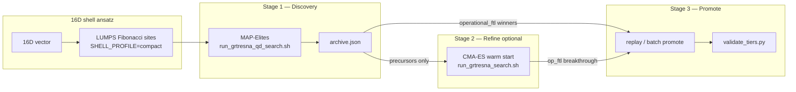

# grteclyn-wrapper

Run isolated GRTeclyn episodes from the repo root (`GRTeclyn/`). The wrapper can stream plotfiles into `small_data/` during GPU runs and delete heavy HDF5 dirs afterward.

## Prerequisites

From the GRTeclyn repo root:

```bash
cd /path/to/GRTeclyn
uv sync   # Python deps including yt for plotfile extraction
```

First build (single GPU, no MPI):

```bash
BUILD=1 bash grteclyn-wrapper/scripts/radial/run_radialrecipe_gpu_smoke.sh
```

## Quick start

Run from `GRTeclyn/grteclyn-wrapper` unless noted.

```bash
# CMA-ES scalar search (see Search pipeline for ansätze and knobs)
GPU_IDS="0 1 2 3 4 5 6 7" GRTRESNA_ANSATZ=shell \
  bash scripts/search/run_grtresna_search.sh

# MAP-Elites quality-diversity (diverse FTL families)
QD_ITERATIONS=8 BINS=8 GPU_IDS="0 1 2 3 4 5 6 7" RANKS=8 \
  LUMPS=5 SHELL_PROFILE=compact \
  bash scripts/search/run_grtresna_qd_search.sh

# Cheap smoke: no GRTresna solve, no GPU evolution
DRY_RUN=1 MAX_GENERATIONS=1 GPU_IDS="0 1" GRTRESNA_ANSATZ=ring \
  bash scripts/search/run_grtresna_search.sh
```

**Stop and verify** — kill the whole campaign tree, then check CPU and GPU:

```bash
pkill -TERM -f 'runs/grtresna_search|runs/grtresna_qd|runs/grtresna_refine|run_grtresna_search|run_grtresna_qd_search'
sleep 5
pkill -KILL -f 'runs/grtresna_search|runs/grtresna_qd|runs/grtresna_refine|run_grtresna_search|run_grtresna_qd_search'
ps -eo pid,ppid,pgid,pcpu,pmem,etime,args \
  | awk '/run_grtresna_search|run_grtresna_qd_search|grteclyn_wrapper|Main_ScalarFieldBH3d|main3d.gnu.CUDA.ex|consume_plotfiles|prterun|mpirun|orterun/ && !/awk/ {print}'
nvidia-smi   # expect 0MiB usage, no running processes
```

**Campaign triage** — start with `trajectory.jsonl`:

```bash
cd runs/grtresna_search/optimize_<timestamp>
python3 - <<'PY'
import json, os
rows=[json.loads(l) for l in open("trajectory.jsonl") if l.strip()]
gr=[r for r in rows if r.get("grtresna_rejected")]
sf=[r for r in rows if r.get("solved_ftl_rejected")]
ev=[r for r in rows if not r.get("grtresna_rejected") and not r.get("solved_ftl_rejected") and not r.get("grtresna_failed")]
print("records", len(rows), "grtresna_rej", len(gr), "solved_ftl_rej", len(sf), "gpu/evolved", len(ev))
for r in ev:
    e=f"eval_{r['eval']:06d}"
    print(e, "score", r.get("score"), "exit", r.get("exit_code"), "score.json", os.path.exists(f"{e}/score.json"))
PY
```

For GPU survivors, inspect `score.json` directly: `metrics.general_ftl_solved.f_op`, `metrics.general_ftl_evolved.f_op`, `max_local_speed`, `max_shift`, and `components.{operational_ftl,ftl_precursor,shift_drive,curvature_activity}`. Treat `F_op ~ 1` or near-degeneracy `max_local_speed` as suspicious; mild `F_op=0.01..0.05` needs HQ replay before any physics claim.

**Falsification tiers** (offline, no rerun):

```bash
uv run python scripts/search/validate_tiers.py runs/grtresna_search/<campaign>
uv run python scripts/search/validate_tiers.py runs/grtresna_search/<campaign> --min-tier 3
```

**Production scripts** — full inventory in [`scripts/README.md`](scripts/README.md):

| Script | Use for |
|--------|---------|
| `run_grtresna_search.sh` | CMA-ES: GRTresna → `.gridinit` → GPU evolution |
| `run_grtresna_qd_search.sh` | MAP-Elites archive over shell space |
| `run_promote_qd_operational_batch.sh` | Batch HQ promotion of operational QD elites |
| `run_tier2_grtresna_qd_eval057.sh` | Single-eval HQ promotion / GPU-only continuation |
| `run_radialrecipe_gpu_smoke.sh` | Single-GPU smoke/build after C++ edits |
| `project_geometry_motif.py` | Geometry-first scout → GRTresna projection → post-load gate |

---

## Geometry-first projection

Geometry-first RadialRecipe searches (`run_ftl_search_cmaes.sh`,
`run_ftl_search_nonspherical.sh`, `run_ftl_search_directional.sh`) are efficient
**scouts**: they find FTL-relevant geometric motifs without solving the full 3D
momentum constraint.  The 1D Hamiltonian reconstruction sets `Pi = 0`, so scouts
find lenses and dipoles, not transport motors by themselves.

The hybrid projection path promotes scout winners to constraint-satisfying initial
data:

```text
geometry-first episode → motif.json → fitted_matter.json → GRTresna solve
  → projection_report_preservation.json → postload_gate.json → optional replay
```

**Critical rule:** fitted matter is never pushed directly into GRTeclyn.  GRTresna
must re-solve both `H` and `M_i` on the scalar-lump ansatz.

| Path | Use when |
|------|----------|
| Geometry-first scout | Cheap motif discovery and FTL shape ranking |
| `project_geometry_motif.py` | Promote top-K scouts to physical initial data |
| Matter-first `ring` / `shell` / `free` | Blind lump-space discovery (see [Search pipeline](#search-pipeline)) |

Matter-first launchers are unchanged.  Projection is an additive second stage.

### Artifacts

| File | Contents |
|------|----------|
| `motif.json` | Support regions, polarity, shortcut metrics, `static_lens_only` |
| `fitted_matter.json` | GRTresna lumps (`amp`, `width`, `center`, `velocity`, `exotic`, …) |
| `momentum_target.json` | Desired motor direction; no velocity when `static_lens_only` |
| `initial_data.gridinit` | GRTresna-projected data |
| `projection_report_preservation.json` | Scout vs solved motif retention |
| `postload_gate.json` | GRTeclyn `L2_Ham` / `L2_Mom` on loaded `.gridinit` |

### Commands

```bash
# Fit only (login node; no GRTresna, no GPU)
uv run python scripts/search/project_geometry_motif.py \
  ../runs/ftl_search/optimize_<ts>/eval_000123 \
  --out-dir ../runs/geometry_projection/eval_000123 \
  --mode fit-only

# GRTresna solve + motif preservation (cluster)
uv run python scripts/search/project_geometry_motif.py \
  ../runs/ftl_search/optimize_<ts>/eval_000123 \
  --out-dir ../runs/geometry_projection/eval_000123 \
  --mode solve-only --mpi-ranks 8 --max-lumps 3

# Solve, post-load gate, short replay
CUDA_VISIBLE_DEVICES=0 uv run python scripts/search/project_geometry_motif.py \
  ../runs/ftl_search/optimize_<ts>/eval_000123 \
  --out-dir ../runs/geometry_projection/eval_000123 \
  --mode solve-and-evolve --cuda-device 0 --stop-time 2.0
```

Reject before long GPU replays when motif preservation, GRTresna convergence, or
post-load constraints fail.  Only claim physics after evolved constraints,
co-moving operational FTL, and resolution replay pass.

**Modules:** `initial_data/motif.py`, `grtresna/motif_fit.py`,
`metrics/motif_preservation.py`, `projection/postload_gate.py`.
**Tests:** `tests/test_hybrid_projection.py`.

---

## Search pipeline

GRTresna solves 3D constraints per candidate; survivors evolve on GPU and are scored with `objective_mode=ftl_first`. **CMA-ES** maximizes one scalar and collapses to a basin; **MAP-Elites** keeps diverse families in a behavior archive.

### Stages



| Stage | Tool | Runs dir | Typical settings |
|-------|------|----------|------------------|
| 1 — discovery | MAP-Elites | `runs/grtresna_qd/qd_<ts>/` | `L=64 N=64`, `t=8–16`, `BINS=8–10` |
| 2 — refine (optional) | CMA-ES warm start | `runs/grtresna_refine/optimize_<ts>/` | `sigma0=0.10`, `t=16` |
| 3 — promote | replay / batch | `runs/grtresna_promote/` | `L=128 N=256`, `t=50`, fresh GRTresna |

Skip stage 2 when QD already yields `operational_ftl > 0` elites; go straight to stage 3.

**Per-eval loop** (every CMA-ES member and QD candidate):

1. Sample ansatz parameters → GRTresna MPI solve (Ham + Mom)
2. Reject if convergence missing, NaN, or above threshold
3. Solved-geometry FTL gate on `.gridinit` (cheap, pre-GPU)
4. GRTeclyn GPU evolution → consume plotfiles → `ftl_first` score
5. Feed fitness to CMA-ES or MAP-Elites archive cell

Campaign artifacts: `trajectory.jsonl`, `eval_XXXXXX/{metadata,score}.json`, `initial_data.gridinit`, optional `frames/`.

### Ansätze

| Ansatz | Dims | Use |
|--------|------|-----|
| `ring` | 14D | Equatorial refinement; lumps on one circle (+ small z wobble) |
| `shell` | 16D | Full-sphere discovery (default); Fibonacci lattice + toroidal/poloidal flow |
| `free` | 11×`LUMPS` | Unbiased atlas / audit (`55D` for `LUMPS=5`) |

All modes decode into the same `cfg.lumps` and GRTeclyn path. `LUMPS` sets placement resolution in `ring`/`shell` (not optimizer dims); in `free` it scales search dimension. Ring parameter details: `search/optimize.py`, `tests/test_grtresna_ring_ansatz.py`.

Shell 16D parameters: `amp`, `width`, `radius`, `thickness`, orientation axis `(theta, phi)`, toroidal/poloidal/radial velocities, `omega`, dipole/quadrupole asymmetry, exotic fraction/phase, `mode`, `radial_jitter`.

### Scoring

**`channel_progress`** (2026-06-05): `path_closeness × √(ftl_precursor × shift_drive)`. Rewards coupled path + cone opening + frame drag; `operational_ftl` remains the hard success gate. Scores are **not comparable** across campaigns that predate this component.

| Component | Weight | Notes |
|-----------|-------:|-------|
| `operational_ftl` | 1000 | End-to-end shortcut gate |
| `channel_progress` | 200 | Coupled mechanism shaping |
| `ftl_precursor` | 160 | Cone opening (down from 250) |
| `shift_drive` | 100 | Frame-drag motor |
| `operational_ftl_solved` | 150 | Pre-evolution FTL on `.gridinit` |

**`SHELL_PROFILE`** bounds presets (`search/optimize.py`, `SHELL_PROFILE` env):

| Profile | Width | Radius | Use |
|---------|-------|--------|-----|
| `compact` (default) | `1.8–3.0` | `1.5–6.0` | Sharper lumps; less diffuse-blob basin |
| `middle` | `1.8–4.0` | `1.5–6.0` | Reproduce `optimize_20260604T170329Z` |
| `outer_precursor` | `2.8–4.0` | `4.0–6.0` | Bias toward eval-128 outer regime |
| `inner_shift` | `1.8–3.0` | `1.5–3.0` | Bias toward eval-57 compact shift regime |

Matter current scales roughly as `amp² × velocity / width`. Diffuse shells converge cleanly but source tiny shift; the compact profile and `shift_drive` term push away from blob-collapse.

**Blob-collapse red flags** — if top frames all look alike:

| Signal | Good | Red flag |
|--------|------|----------|
| `local_speed_z` | Localized region above `c=1` | Sub-luminal, identical across evals |
| `shift1_z` | Growing shift magnitude | `~10⁻²`, max shift `~0.03` |
| `score.json` | Variation in `shift_drive`, `channel_progress`, `operational_ftl` | `operational_ftl=0`, score from stability only |

Quick triage:

```bash
uv run python3 - <<'PY'
from pathlib import Path
from grteclyn_wrapper.metrics import read_episode_metrics, score_episode
root = Path("../runs/grtresna_search/optimize_<timestamp>")
for ep in sorted(root.glob("eval_*")):
    if not (ep / "score.json").exists(): continue
    s = score_episode(read_episode_metrics(ep, ftl_L=8.0), target_stop_time=2.0, objective_mode="ftl_first")
    c = s.components
    print(ep.name, f"score={s.total:.2f}", f"op={c.get('operational_ftl',0):.3f}",
          f"ch={c.get('channel_progress',0):.3f}", f"shift={c.get('shift_drive',0):.3f}")
PY
```

### CMA-ES

```bash
cd /path/to/GRTeclyn/grteclyn-wrapper

# Refinement: 14D ring
GPU_IDS="0 1 2 3 4 5 6 7" GRTRESNA_ANSATZ=ring \
  bash scripts/search/run_grtresna_search.sh

# Discovery: 16D shell (default for new families)
GPU_IDS="0 1 2 3 4 5 6 7" GRTRESNA_ANSATZ=shell \
  bash scripts/search/run_grtresna_search.sh

# Audit: 55D free
GPU_IDS="0 1 2 3 4 5 6 7" GRTRESNA_ANSATZ=free LUMPS=5 \
  bash scripts/search/run_grtresna_search.sh
```

Useful overrides:

```bash
GPU_IDS="0 1 2 3" bash scripts/search/run_grtresna_search.sh   # fewer GPUs
WARM_START_TRAJECTORY=/path/to/trajectory.jsonl GPU_IDS="0 1 2 3 4 5 6 7" \
  bash scripts/search/run_grtresna_search.sh                   # continue prior run
NO_CONSUME=1 GPU_IDS="0 1" MAX_GENERATIONS=1 \
  bash scripts/search/run_grtresna_search.sh                   # keep plotfiles
RANKS=1 bash scripts/search/run_grtresna_search.sh             # serial GRTresna (MPI=FALSE build)
```

| Knob | Default | Meaning |
|------|---------|---------|
| `GRTRESNA_ANSATZ` | `ring` | `ring` / `shell` / `free` |
| `SHELL_PROFILE` | `compact` | Shell bounds preset |
| `GRTRESNA_FULL_Z` | `1` for `shell` | Full-z box (no reflective `z=0` plane) |
| `LUMPS` | `5` | Scalar clouds (55D only when `free`) |
| `RANKS` | `8` | MPI ranks per GRTresna solve |
| `GPU_IDS` | `0 1 2 3` (often all GPUs) | Also sets CMA-ES population |
| `MAX_GENERATIONS` | `50` | CMA-ES generations |
| `OBJECTIVE_MODE` | `ftl_first` | FTL terms dominate health/stability |
| `WARM_START_TRAJECTORY` | unset | Prior `trajectory.jsonl` for warm start |
| `WARM_START_TOP_K` / `JITTER` | `8` / `0.08` | Seeds and jitter fraction |
| `GRTRESNA_TIMEOUT` | `900` | Wall-clock seconds per GRTresna solve |
| `STOP_TIME` | `2.0` | GPU evolution stop time |
| `RANDOM_INJECTION_FRACTION` | `0.25` | Per-generation random candidates |

Warm-start example (compact shell + `channel_progress`):

```bash
WARM_START_TRAJECTORY=../runs/grtresna_search/optimize_20260604T170329Z/trajectory.jsonl \
  WARM_START_TOP_K=8 GPU_IDS="0 1 2 3 4 5 6 7" RANKS=8 \
  GRTRESNA_ANSATZ=shell LUMPS=5 SHELL_PROFILE=compact \
  SOLVED_FTL_NEAR_LUMINAL_SPEED_FLOOR=0.9 \
  bash scripts/search/run_grtresna_search.sh
```

Outputs: `runs/grtresna_search/optimize_<timestamp>/`.

### MAP-Elites

```bash
QD_ITERATIONS=8 BINS=8 GPU_IDS="0 1 2 3 4 5 6 7" RANKS=8 \
  LUMPS=5 SHELL_PROFILE=compact \
  bash scripts/search/run_grtresna_qd_search.sh
```

Long discovery run:

```bash
QD_ITERATIONS=16 BINS=10 STOP_TIME=8 GPU_IDS="0 1 2 3 4 5 6 7" RANKS=8 \
  LUMPS=5 SHELL_PROFILE=compact \
  GRTRESNA_MAX_HAM_PCT=10 GRTRESNA_MAX_MOM_PCT=10 \
  bash scripts/search/run_grtresna_qd_search.sh
```

| Env var | Default | Meaning |
|---------|---------|---------|
| `QD_ITERATIONS` | `8` | Archive update rounds |
| `BINS` | `8` | Descriptor grid resolution per axis |
| `SHELL_PROFILE` | `compact` | Same presets as CMA-ES |
| `STOP_TIME` | `2.0` | GPU stop time (use `16` for long runs) |
| `GRTRESNA_TIMEOUT` | `900` | Per-solve wall clock |

Outputs: `runs/grtresna_qd/qd_<timestamp>/` with `trajectory.jsonl`, `archive.json`, `eval_XXXXXX/`.

| | CMA-ES | MAP-Elites |
|--|--------|------------|
| Goal | One best score | Diverse elites across descriptor cells |
| Descriptors | Score only | `path_closeness`, `mechanism_balance`, tier tags |
| Best for | Fast scalar climb | Operational FTL + path-quality precursors together |

### Post-QD refinement

When QD finds strong precursors but `operational_ftl = 0`, warm-start CMA-ES with small steps:

```bash
cd grteclyn-wrapper/scripts/search

RUNS_DIR=../../runs/grtresna_refine \
WARM_START_TRAJECTORY=../../runs/grtresna_qd/qd_<timestamp>/trajectory.jsonl \
WARM_START_TOP_K=10 WARM_START_JITTER=0.05 SIGMA0=0.10 \
MAX_GENERATIONS=12 POPULATION=8 STOP_TIME=16 PLOT_INTERVAL=48 \
GRTRESNA_ANSATZ=shell SHELL_PROFILE=compact GRTRESNA_FULL_Z=1 \
GRTRESNA_TIMEOUT=900 RANDOM_INJECTION_FRACTION=0.10 \
GPU_IDS="0 1 2 3 4 5 6 7" RANKS=8 \
bash run_grtresna_search.sh
```

CMA-ES writes `trajectory.jsonl` once per generation (empty file during gen-1 GRTresna is normal). If pinned at `op_ftl=0` for several gens: raise `SIGMA0` to `0.15` or return to QD.

### Promotion

> **Resolution rule:** promotion must use **`N > L`** (or same `L` with larger `N`) to refine the grid. `L=N` only enlarges the domain at `dx=1` — no fidelity gain.

**Batch HQ** (current production path):

```bash
# Defaults: L=128 N=256 (dx=0.5), t=50, fresh GRTresna, Ham/Mom gate 10%
bash scripts/search/run_promote_qd_operational_batch.sh
```

Filter: `operational_ftl >= 0.03`. Outputs: `runs/grtresna_promote/l128n256_qd_eval*/`.

| Setting | QD search | HQ promotion |
|---------|-----------|----------------|
| `L_full` | 64 | **128** |
| `N_full` | 64 | **256** |
| `dx = L/N` | 1.0 | **0.5** |
| `stop_time` | 8 | **50** |
| `max_level` | 2 | **3** |

**HQ leaderboard** (`t=50`, `runs/grtresna_promote/l128n256_qd_eval*/score.json`):

| Rank | eval | HQ score | `op_ftl` | `channel` | `shift` | Role |
|------|------|--------:|---------:|----------:|--------:|------|
| 1 | **106** | **1423** | **1.000** | 0.423 | 0.179 | HQ winner |
| 2 | **117** | **1346** | **0.920** | **0.436** | **0.190** | Channel backup |
| 3 | **011** | **1274** | **0.885** | 0.302 | 0.091 | Search leader |
| 4 | **094** | **1089** | 0.658 | **0.454** | **0.206** | Best channel/shift |

**Single-eval replay** (`eval_000057` T5 ladder reference):

```bash
cd grteclyn-wrapper/scripts/search

# Full replay (GRTresna + GPU)
GPU=0 NAME=val16hq2_qd_eval057 bash run_tier2_grtresna_qd_eval057.sh

# GPU-only continuation (reuse gridinit)
SOURCE_EVAL=../../runs/grtresna_promote/val16hq2_qd_eval057 \
GRIDINIT_SOURCE=../../runs/grtresna_promote/val16hq2_qd_eval057/initial_data.gridinit \
N_FULL=128 MAX_LEVEL=3 STOP_TIME=30 GPU=0 NAME=val30hq_qd_eval057 \
  bash run_tier2_grtresna_qd_eval057.sh
```

| Run | L | N | t | max c | `op_ftl` | Notes |
|-----|--:|--:|--:|------:|---------:|-------|
| `eval_000057` (QD) | 64 | 64 | 2 | 1.065 | 1.0 | QD breakthrough |
| `val16hq2_qd_eval057` | 128 | 128 | 16 | 1.192 | 1.0 | Best t=16 HQ |
| `val30hq_qd_eval057` | 128 | 128 | 30 | **1.276** | 1.0 | GPU-only; peak c |
| `val100hq_qd_eval057` | 128 | 128 | 100 | 1.205 | 1.0 | Long GPU-only |
| `val256hq_qd_eval057` | 256 | 256 | 100 | 1.196 | 1.0 | 2× domain; ~3× tighter Ham/Mom |

`val100hq` read: central two-lobed structure is real across `shift1`, `rho_req`, `chi`, `local_speed` (scorer reports `max c=1.205`); scalars decay by t=100; outer-domain rings are likely boundary junk on L=128; PNG colorbars auto-scale per frame — compare metrics in `score.json`, not brightness. Larger boxes require a fresh GRTresna solve (misaligned gridinit reuse misplaces the shell).

Stitch movies:

```bash
bash scripts/plot/make_movies.sh runs/grtresna_promote/l128n256_qd_eval{011,106,117} --framerate 8
```

---

## Operations

### Build GRTresna

Production searches use MPI `mpicxx.gfortran` (`RANKS=8` default). Needs `CHOMBO_HOME` and the `grtresna` env on `PATH`.

```bash
GRTRESNA_ENV=/home/jovyan/.mlspace/envs/grtresna
CHOMBO_HOME=/home/jovyan/nachevsky/test/simulation/Chombo/lib
cd /home/jovyan/nachevsky/test/simulation/GRTresna/Examples/ScalarFieldBH
PATH="${GRTRESNA_ENV}/bin:${PATH}" CONDA_PREFIX="${GRTRESNA_ENV}" \
  make all -j4 CHOMBO_HOME="${CHOMBO_HOME}" MPI=TRUE
```

Produces `Main_ScalarFieldBH3d.Linux.64.mpicxx.gfortran.OPTHIGH.MPI.ex`. Serial debug: build with `MPI=FALSE`, run `RANKS=1`.

After header-only C++ edits, force relink:

```bash
rm -f Main_ScalarFieldBH3d.Linux.64.mpicxx.gfortran.OPTHIGH.MPI.ex \
      o/3d.Linux.64.mpicxx.gfortran.OPTHIGH.MPI/{Main_ScalarFieldBH,Grids,ScalarField,MyMatterFunctions}.o
PATH="${GRTRESNA_ENV}/bin:${PATH}" CONDA_PREFIX="${GRTRESNA_ENV}" \
  make all -j4 CHOMBO_HOME="${CHOMBO_HOME}" MPI=TRUE
```

### Solver-only AMR smoke tests

```bash
cd /home/jovyan/nachevsky/test/simulation/GRTresna/Examples/ScalarFieldBH
EXE=Main_ScalarFieldBH3d.Linux.64.mpicxx.gfortran.OPTHIGH.MPI.ex
for case in canonical exotic mixed_exotic; do
  PATH="${GRTRESNA_ENV}/bin:${PATH}" CONDA_PREFIX="${GRTRESNA_ENV}" \
    mpirun --oversubscribe -np 8 ./"${EXE}" params_${case}_amr_test.txt
done
```

### Single-GPU run

Pick one initial-data source:

| Env var | Example |
|---------|---------|
| `SEED_NAME` | `ellis_bronnikov` |
| `CANDIDATE_ID` | `bubble_wall_016` |
| `NONSPHERICAL_ID` | `quadrupole_bubble_001` |

```bash
BUILD=0 SEED_NAME=ellis_bronnikov CUDA_VISIBLE_DEVICES_OVERRIDE=0 \
  bash grteclyn-wrapper/scripts/radial/run_radialrecipe_gpu_smoke.sh
```

Outputs: `runs/radialrecipe_gpu_smoke/<name>_gpu_t<stop_time>_<stamp>/`.

### Plotfile consumer (default on)

With `CONSUME_PLOTFILES=1`: sidecar `consume_plotfiles` streams `small_data/`, optional PNG frames, deletes processed HDF5 (`--keep-last 1`), post-sim drain.

| Variable | Default | Meaning |
|----------|---------|---------|
| `CONSUME_PLOTFILES` | `1` | Enable streaming extraction |
| `CONSUMER_DELETE` | `1` | Delete HDF5 plot dirs after extract |
| `CONSUMER_RADII` | `4 8` | Extraction radii |
| `PLOT_INTERVAL` | `10` | Plotfile cadence |
| `STOP_TIME` | `2.0` | Simulation stop time |
| `N_FULL` | `64` | Grid resolution |

Disable: `CONSUME_PLOTFILES=0 bash .../run_radialrecipe_gpu_smoke.sh`

**Frame fixes** (promotion runs): slice zoom now defaults to `L_full` (`GRTECLYN_FRAMES_ZOOM`); stable per-field color limits in `consume_plotfiles.py` (override `GRTECLYN_FRAMES_ZLIM_*` or `GRTECLYN_FRAMES_AUTO_ZLIM=1`).

### Post-run plots

```bash
bash grteclyn-wrapper/scripts/plot/plot_diagnostic_radial.sh runs/radialrecipe_nonspherical/<episode_dir>
bash grteclyn-wrapper/scripts/plot/plot_run_radial.sh runs/<episode_dir> --no-delete   # manual drain
```

### Falsification tiers

A high score is a proxy, not proof. `validation_tiers.py` records how far each candidate survives:

| Tier | Name | Gate |
|------|------|------|
| T0 | `constructed` | Constraint-satisfying data exists |
| T1 | `nontrivial` | Non-flat FTL signal |
| T2 | `operational` | Evolved shortcut beats flat control |
| T3 | `persistent` | Stable long evolution |
| T4 | `observer_ec` | Observer-robust EC margin |
| T5 | `converged` | Resolution-ladder replay agrees |
| T6 | `analytic` | Closed-form back-derivation |

Absent diagnostics report `unavailable`. T5/T6 need promotion runs (`extra={"resolution_converged":...}`).

---

## Reference

### What to edit, build, and run

| Goal | Edit here | Rebuild? | Validate with |
|------|-----------|----------|---------------|
| CMA-ES dimensions, ansätze, warm starts | `search/optimize.py`, `__main__.py` | No | `uv run pytest tests/test_grtresna_ring_ansatz.py tests/test_solved_geometry_ftl.py -q` |
| Launcher defaults / env knobs | `scripts/search/run_grtresna_search.sh` | No | `DRY_RUN=1 MAX_GENERATIONS=1 GPU_IDS="0 1" bash scripts/search/run_grtresna_search.sh` |
| GRTresna invoke / `.gridinit` conversion | `grtresna/solver.py`, `grtresna/io.py` | Usually no | `uv run pytest tests/test_grtresna_integration.py -q` |
| Solved-geometry FTL filter | `metrics/ftl_solved_geometry.py`, `search/solved_ftl_gate.py` | No | `uv run pytest tests/test_solved_geometry_ftl.py -q` |
| Scoring weights | `metrics/score.py`, `episode_metrics.py` | No | Re-score campaign or metric tests |
| GRTeclyn evolution, plotfiles, gridinit load | `Examples/RadialRecipe/*`, `Source/Matter/*` | Yes (GRTeclyn) | `BUILD=1 bash scripts/radial/run_radialrecipe_gpu_smoke.sh` |
| GRTresna elliptic solver | `../GRTresna/Examples/ScalarFieldBH/*` | Yes (MPI binary) | AMR smoke tests above |

### GRTresna bridge

GRTresna solves Hamiltonian + momentum constraints in 3D and hands GRTeclyn constraint-satisfying `.gridinit` data. Deep integration docs: [`src/grteclyn_wrapper/README.md`](src/grteclyn_wrapper/README.md) (*GRTresna integration*).

**Changelog (search pipeline):**

- GRTresna ↔ GRTeclyn bridge via `ExternalGridInitialData` (~2× lower initial constraint error vs radial recipe)
- Momentum-carrying scalar lumps (velocity, rotation, exotic flags) — new frame-dragging search axis
- Exotic-matter AMR on maximal-slicing (`K=0`) path; three AMR smoke fixtures pass
- GRTresna-in-the-loop CMA-ES/QD with graded Ham/Mom rejection before GPU
- Pre-evolution solved-geometry FTL gate (`search/solved_ftl_gate.py`) — cheap filter on `.gridinit` at t=0
- `channel_progress` + `SHELL_PROFILE` presets (2026-06-05)

### One-off GRTresna solve

```python
from pathlib import Path
from grteclyn_wrapper.grtresna import GRTresnaConfig, solve

cfg = GRTresnaConfig(
    mpi_ranks=1, bh1_bare_mass=0.0,
    lump_amp=0.1, lump_width=8.0,
    lump_velocity=(0.2, 0.0, 0.0),
)
gridinit = solve(cfg, work_dir=Path("/tmp/grtresna_run"))
# GRTeclyn: recipe_initial_data_file = <gridinit>
```

### Solved-FTL gate (summary)

Scores `.gridinit` at t=0 before GPU (~1 s/candidate). Rejects flat/degenerate slices; graded fitness for near-misses. Policy: `search/solved_ftl_gate.py`. Launcher knobs: `SOLVED_FTL_F_OP_FLOOR`, `SOLVED_FTL_NEAR_LUMINAL_SPEED_FLOOR`, `SOLVED_FTL_SUPERLUMINAL_SPEED_FLOOR`, `SOLVED_FTL_SUPERLUMINAL_FRACTION_FLOOR`, `SOLVED_FTL_MAX_PHYSICAL_COORD_SPEED`, `SOLVED_FTL_MAX_PHYSICAL_F_OP`, `SOLVED_FTL_REJECTION_SPEED_TARGET`.

Degeneracy guard: slices with `max_local_speed` or `F_op` above physical ceilings are flagged (numerical artifacts near the York existence boundary). Exploration setting: `SOLVED_FTL_NEAR_LUMINAL_SPEED_FLOOR=0.9` for permissive shell campaigns.

### Exotic matter (summary)

FTL channels need NEC-violating matter. Per-lump exotic flags + maximal-slicing solver handle `rho < 0` in AMR. Search auto-switches exotic candidates to K=0 path. Details: package README + AMR smoke loop above. Rescore prior campaigns: `scripts/search/rescore_grtresna_solved_ftl.py <campaign_dir>`.

### Diagnostics

Each run emits under `data/` (parsed by `read_episode_metrics`):

| File | Probes |
|------|--------|
| `constraint_norms.dat` | Ham/Mom L2; `min_rho_req < 0` → exotic needed |
| `energy_conditions.dat` | Evolved matter NEC/WEC/SEC/DEC |
| `curvature_invariants.dat` | Ricci/K invariants |

Operational FTL (`ftl_general.py`, Dijkstra vs flat baseline) is mechanism-agnostic: `general_ftl` (solved) vs `general_ftl_evolved` (plotfile).

**Two findings:**

1. Canonical `ScalarField` gives `matter_* EC ~ 0` by construction; use `recipe_exotic_matter = 1` (`--phantom`) for genuine evolved exotic violations. Geometry-sourced `T^eff` is post-hoc via `warpfactory.py`.
2. Evolved FTL uses plotfile metric fields; distinguish initial vs evolved channel to spot gauge artifacts.

---

## Campaign snapshots

**Current production:** discovery `runs/grtresna_qd/qd_20260605T155951Z/` (8 operational elites); HQ promotion `runs/grtresna_promote/l128n256_qd_eval{011,016,058,077,094,106,117,121}/`; article montage `research/neuralspacetime/articlepictures/shell_hq_promotion_tiles.png`.

| Campaign | Tool | Path | Best eval | `op_ftl` | Notes |
|----------|------|------|-----------|----------|-------|
| `optimize_20260604T170329Z` | CMA-ES shell | `runs/grtresna_search/optimize_20260604T170329Z/` | 128 / 57 | 0 | Two leader basins (precursor vs shift); pre-`channel_progress` scores |
| `optimize_20260605T051320Z` | CMA-ES compact warm-start | `runs/grtresna_search/optimize_20260605T051320Z/` | 32 | 0 | Compact + warm start; early run |
| `qd_20260605T060902Z` | MAP-Elites | `runs/grtresna_qd/qd_20260605T060902Z/` | 023 | 0 | Probe; exposed QD logger eval-id bug (fixed in next run) |
| `qd_20260605T062448Z` | MAP-Elites | `runs/grtresna_qd/qd_20260605T062448Z/` | **057** | **1.0** | First operational elite; T5 ladder (`val*hq_qd_eval057`) |
| `qd_20260605T133932Z` | MAP-Elites | `runs/grtresna_qd/qd_20260605T133932Z/` | 058 | 0 | Best precursor (`channel_progress≈0.30`); refine source |
| `qd_20260605T155951Z` | MAP-Elites | `runs/grtresna_qd/qd_20260605T155951Z/` | **011** | **0.75** | **Current production**; 8 operational elites at search scale |
| `l128n256_qd_eval*` | HQ promotion | `runs/grtresna_promote/l128n256_qd_eval*/` | **106** | **1.0** | Batch HQ at t=50, dx=0.5; eval 106 saturates `op_ftl` |
| `optimize_20260605T150015Z` | CMA-ES refine | `runs/grtresna_refine/optimize_20260605T150015Z/` | 012 | 0 | Warm-started from `133932Z`; orbiting precursor basin |
