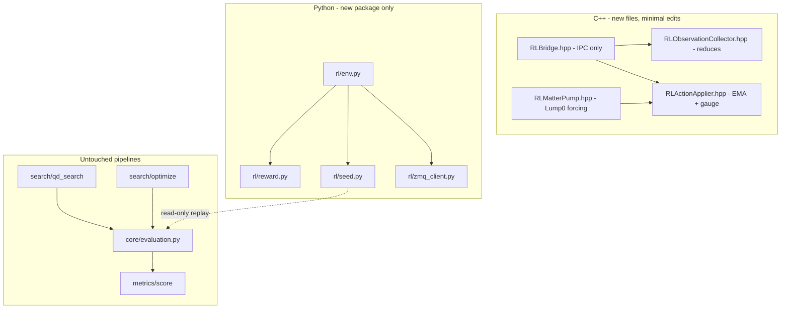

# Hybrid QD + RL for FTL Campaign Control (v3.2 — Tax Man hardened)

> Canonical implementation plan (2026-06-23). Background and early architecture notes: [research.md](research.md). MAP-Elites / QD context: [../neuralspacetime/MapElites.md](../neuralspacetime/MapElites.md).

**Status:** Approved to build. **Verified:** Tax Man reuses [`score_episode`](../../grteclyn-wrapper/src/grteclyn_wrapper/metrics/score/scorer.py); `wec_violation_fraction` exists; gauge EMA mutates live `ccz4_params` via [`RadialRecipeMatterDispatch.hpp`](../../Examples/RadialRecipe/RadialRecipeMatterDispatch.hpp).

## Implementation todos

| ID | Task | Status |
|----|------|--------|
| solid-regression-gate | Every phase: full pytest green; rl_enabled=0 tolerance match on eval 046; no rl imports in core/search/metrics | pending |
| prereq-ftl-metrics | **BLOCKING:** fix Weyl4/ftl_geo NaN; finite ftl_geo_evolving on eval 046 replay | pending |
| phase0-matter-actuator | Lump[0] pump + tanh governor; L2_Ham every coarse step; Gate 0A; no Python rl/ until pass | pending |
| phase0-bridge | Main.cpp two-cadence loop; RLBridge; terminate opcode; dummy_agent smoke | pending |
| phase1-env | rl/ after Gate 0A; frame barrier + consumer drain; CUDA pinning | pending |
| phase1-reward-taxman | Tax Man T1–T4; audit clipped; fence None-guards | pending |
| phase2-baselines | Steer-not-break + Kamikaze test; measure frames/ep for γ | pending |
| phase3-ppo | PPO after T1–T4; γ≈0.999+; VecNormalize dense-only | pending |
| phase4-campaign | campaigns/rl/ + HQ promote | pending |

**Two cadences for L2_Ham (resolved):**

| Use | Cadence | Source |
|-----|---------|--------|
| **In-kernel tanh governor** | **Every coarse step** | `publish_cached_L2_Ham` in Main.cpp after each `coarseTimeStep` |
| **Dense reward −500·L2_Ham** | **Every plot frame** | Sync obs at ZMQ exchange / frame barrier |

Same reducer (`RLL2HamiltonianNorm.hpp`); different sample rates.

**Critical path:** pre-req finite `ftl_geo` → Phase 0A → Phase 0B → Phase 1 (Tax Man env). **No `grteclyn_wrapper/rl/` until Gate 0A.**

## Strategic framing (corrected)

**QD/CMA-ES are not replaced.** They remain the **IC genome generator** for a valid GRTresna elliptic solve. RL adds **evolution-only** closed-loop control on top of that chassis. The failure of IVP-only search is not that QD is useless — it is that static t=0 parameters cannot sustain a throat past t≈21 ([HQ eval 046](../neuralspacetime/MapElites.md)).

**Matter pump is Phase 0** — gauge-only RL on a static shell has no drivetrain.

**User choices (confirmed):** `general_ftl` objective, hybrid IC (QD genome + RL mid-run control).

---

## SOLID architecture — do not break working code

RL is an **opt-in extension layer**. QD, CMA-ES, splash campaigns, HQ promotion, and default GPU evolution must behave identically when RL is off. Every phase ends with a **regression gate** before the next phase starts.

### Non-regression contract

| Rule | Enforcement |
|------|-------------|
| **RL off by default** | `rl_enabled = 0` in all existing `params.txt` templates and campaign launchers; no RL keys required for QD/CMA-ES |
| **Separate build target** | `USE_RL=TRUE` in [`GNUmakefile`](../../Examples/RadialRecipe/GNUmakefile) links ZMQ; default `make` produces the **same binary class** as today (no ZMQ dep) |
| **No core pipeline edits** | Do **not** modify [`evaluate_overrides()`](../../grteclyn-wrapper/src/grteclyn_wrapper/core/evaluation.py), [`qd_search/driver.py`](../../grteclyn-wrapper/src/grteclyn_wrapper/search/qd_search/driver.py), [`optimize/driver.py`](../../grteclyn-wrapper/src/grteclyn_wrapper/search/optimize/driver.py), or splash scripts except adding **new** opt-in RL launchers under `scripts/campaigns/rl/` |
| **Isolated Python package** | All RL code lives in `grteclyn_wrapper/rl/`; **zero imports** from `rl` into `core/`, `search/`, or `metrics/` |
| **Optional deps** | `gymnasium`, `pyzmq`, `stable-baselines3` in `[project.optional-dependencies] rl` |
| **Regression gate per phase** | `uv run pytest` green; Gate 0A with `rl_enabled=0` |

### SOLID mapping (concrete modules)



#### S — Single Responsibility

| Module | Single responsibility | Must NOT do |
|--------|----------------------|-------------|
| `RLBridge.hpp` | ZMQ send/recv, timeouts, heartbeat | Obs reductions, action mapping, physics |
| `RLObservationCollector.hpp` | Pack 6-D obs vector from AMR state | ZMQ, parameter writes |
| `RLActionApplier.hpp` | Map action vector → `SimulationParameters` (EMA, clamps) | IPC, RHS forcing |
| `RLMatterPump.hpp` | Spatial envelope + tanh governor + Lump[0] drive | ZMQ, gauge logic |
| `rl/zmq_client.py` | Socket lifecycle, timeout, binary encode/decode | Reward, subprocess |
| `rl/env.py` | Gym API, frame barrier, GPU pinning | Reward math, elite parsing |
| `rl/reward.py` | Dense + fences + horizon one-shot | ZMQ, process spawn |
| `rl/audit.py` | Terminal Tax Man via `score_episode` | Training loop |
| `rl/seed.py` | Load QD elite overrides + pump geometry | Training loop |

#### O — Open/Closed

- **Closed:** `RadialRecipeLevel::specificPostTimeStep`, `evaluate_overrides`, MAP-Elites archive, QD `objectives.py`
- **Open:** `Main_RadialRecipe.cpp` hook; matter RHS forcing when `rl_pump_amplitude > 0`

#### L — Liskov Substitution

When `rl_enabled = 0` and `rl_pump_amplitude = 0`: evolution matches IVP within Gate 0A tolerance (rel 1e-10 on L2_Ham/min_lapse).

#### I — Interface Segregation

```cpp
std::array<double, 6> collect_rl_observations(GRAMR& amr, const SimulationParameters& params);
void apply_rl_actions(SimulationParameters& params, const std::array<double, 5>& actions);
```

```python
class ObservationSource(Protocol):
    def recv_obs(self) -> np.ndarray: ...
class ActionSink(Protocol):
    def send_action(self, action: np.ndarray) -> None: ...
```

#### D — Dependency Inversion

`rl/seed.py` reads elite eval dirs (HQ replay schema) — does not fork `evaluate_overrides`.

### New directory layout

```
Source/GRTeclynCore/RL/
  RLBridge.hpp
  RLL2HamiltonianNorm.hpp
  RLObservationCollector.hpp
  RLActionApplier.hpp
  RLMatterPumpParams.hpp

grteclyn-wrapper/src/grteclyn_wrapper/rl/
  protocols.py, zmq_client.py, env.py, reward.py, audit.py, seed.py, process.py

grteclyn-wrapper/scripts/campaigns/rl/
grteclyn-wrapper/tests/rl/
```

### Phase exit checklist

1. `uv run pytest` green
2. `rl_enabled=0` smoke on eval **046** — tolerance match
3. No transitive `rl` import in QD driver
4. Splash preflight unchanged
5. New RL tests pass

---

## Five engineering rules (Phase 0 blockers)

| # | Trap | Fix |
|---|------|-----|
| **1** | Async sidecar in obs | **6-D sync C++ obs only**; FTL reward-only at frame boundary |
| **2** | Bang-bang watchdog | **In-kernel `tanh` governor** in RHS |
| **3** | Delta-action saturation | **EMA direct targeting** |
| **4** | Lump superposition | **Lump[0] only** |
| **5** | AMReX subcycling | Hook in **`Main_RadialRecipe.cpp`** after `coarseTimeStep()` |

Additional: A2 frame-aligned stepping; A4 MPI Bcast for HQ; B2 steep L2_Ham; B3 m=0 breathing; C1 tolerance gate; C2 ZMQ timeouts; C3 steer-not-break; C4 8 envs + GPU pinning.

---

## Three final hardening directives (v3)

### 1. Governor L2_Ham refresh — every coarse step

```cpp
while (recipe_amr.okToContinue() && ...) {
    recipe_amr.coarseTimeStep(sim_params.stop_time);
    if (sim_params.rl_enabled) {
        const double L2_Ham = compute_L2_Hamiltonian_norm(recipe_amr, sim_params);
        publish_cached_L2_Ham(sim_params, L2_Ham);
    }
    if (sim_params.rl_enabled &&
        recipe_amr.levelSteps(0) % sim_params.rl_coarse_step_interval == 0) {
        auto obs = collect_rl_observations(recipe_amr, sim_params);
        auto actions = get_rl_bridge().exchange(obs, 5, 30000);
        apply_rl_actions(sim_params, actions);
    }
}
```

### 2. Strict frame barrier (Phase 1)

Block until plot consumer signals frame done before reward read.

### 3. MPI Bcast in RLBridge

```cpp
#ifdef AMREX_USE_MPI
    amrex::ParallelDescriptor::Bcast(actions.data(), action_dim,
        amrex::ParallelDescriptor::IOProcessorNumber());
#endif
```

---

## MDP specification

### Observations — 6-D sync C++

| Index | Signal |
|-------|--------|
| 0–4 | `min_chi`, `min_lapse`, `max_abs_K`, `L2_Ham`, `L2_Mom` |
| 5 | `sim_time` |

### Actions — 5-D + EMA (amp and gauge)

### Reward — Tax Man hierarchical return (v3.2)

**Clawback:** `episode_return ≈ min(Σ R_dense, full_qd)`.

#### Layer 1 — Dense `R_dense` (every frame)

```python
K = 4
level_ftl = mean(ftl_geo_evolving over last K frames)
delta_ftl = level_ftl - prev_level_ftl
ftl_term = 0.7 * level_ftl + 0.3 * delta_ftl

R_dense = (
    + 1000.0 * ftl_term
    -  500.0 * L2_Ham
    -   50.0 * max(0, 0.2 - min_lapse)
)
```

#### Layer 2 — Electric fences

| Fence | Trigger | Penalty |
|-------|---------|---------|
| WEC | `wec_violation_fraction > 0.15` if not None | terminate, −5000 |
| L2_Ham | > 0.05 | terminate |
| Horizon | once | −500 once, terminate |
| min_lapse | < 0.05 | terminate |

**T4:** None guards on all fence metrics. **Terminate handshake** when fence fires (Phase 0B/1).

#### Layer 3 — Tax Man audit (episode end)

```python
wait_consumer_drain(episode_path, timeout=120)
full_qd = score_episode(episode_metrics)
audit_penalty = min(0.0, full_qd.total - sum(R_dense))
audit_penalty = max(audit_penalty, -2000.0)  # T2 clip
reward_terminal = audit_penalty
```

**T1:** γ ≥ 0.999 tuned to frames/episode. **T2:** VecNormalize dense only; audit post-norm. **T3:** full consumer drain before audit.

---

## Phase 0 — C++ actuator + bridge

### 0A — Matter pump

- Lump[0] only; tanh governor; `m_num_fields >= 1` guard
- Shared `RLL2HamiltonianNorm.hpp`
- Gate 0A: amp=0 tolerance match; amp=0.01 stable 100+ steps

### 0B — ZMQ bridge

- Two-cadence Main hook; terminate opcode; MPI Bcast
- Mutable `SimulationParameters&` in Main
- Gate 0B: dummy agent, no hang

---

## Phase 1 — Python env (after Gate 0A)

`grteclyn_wrapper/rl/` — env, reward, audit, seed, process, zmq_client, protocols.

---

## Phase 2 — Baselines

Steer-not-break + Kamikaze test (net return < 0 after audit) + measure frames/ep.

---

## Phase 3 — PPO (after T1–T4)

8 SubprocVecEnv; γ/λ tuned; VecNormalize dense-only; GPU pinning.

---

## Phase 4 — Campaign

QD → CMA-ES → RL → HQ.

---

## Execution order

| Step | Work | Gate |
|------|------|------|
| 0 | SOLID baseline + eval 046 reference | pytest |
| 1 | Pre-req Weyl4/ftl_geo NaN fix | finite ftl_geo |
| 2 | Phase 0A | Gate 0A |
| 3 | Phase 0B | Gate 0B |
| 4 | Phase 1 + T1–T4 | Gate 1 |
| 5 | Phase 2 | Gate 2 |
| 6 | Phase 3 PPO | audit reach |
| 7 | Phase 4 HQ | |

**Do not start PPO until:** pre-req + Gate 0A + Gate 0B + Gate 2 + T1–T4.
