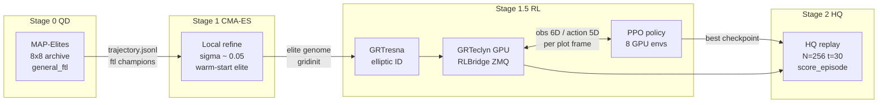
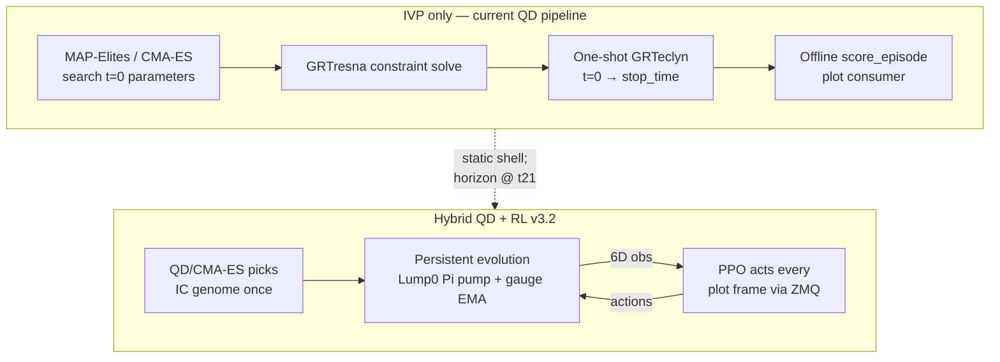
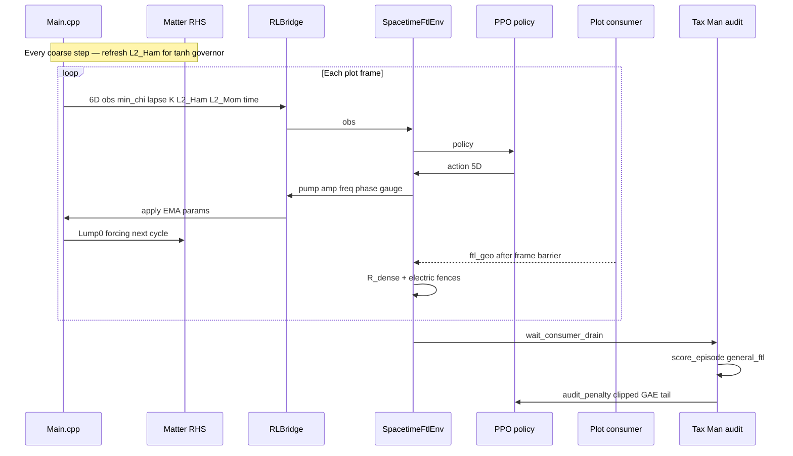
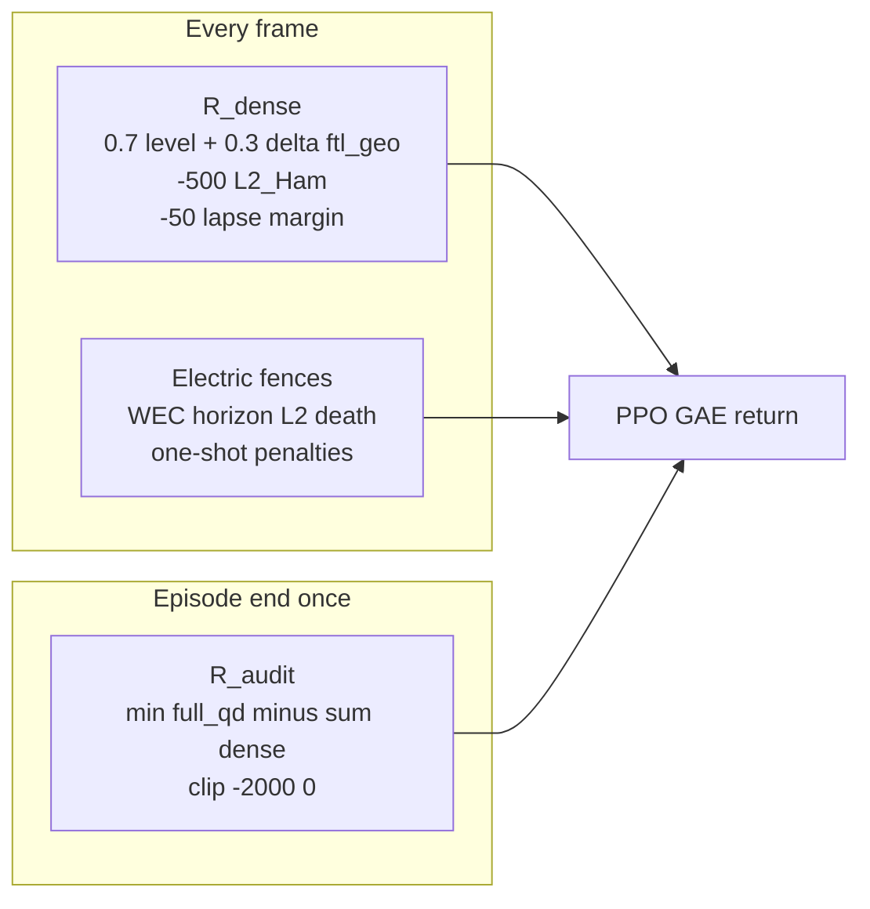
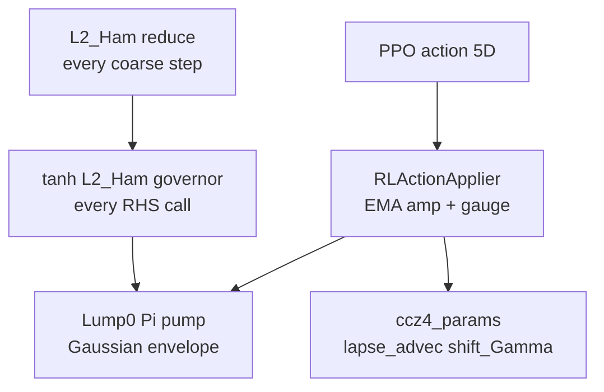

# Hybrid QD + RL for FTL Campaign Control — Research Plan

> **Date:** 2026-06-23  
> **Build specification:** [implementation-plan.md](implementation-plan.md) (v3.2)  
> **QD / CMA-ES baseline:** [../neuralspacetime/MapElites.md](../neuralspacetime/MapElites.md)

## Abstract

The existing MAP-Elites and CMA-ES pipeline discovers FTL-capable initial-value genomes under the `general_ftl` objective, but IVP-only evolution plateaus when the wormhole throat collapses near t≈21 (HQ eval **046**). Static t=0 parameters cannot sustain mid-run throat geometry without actuators. This research plan proposes a **hybrid** architecture: QD and CMA-ES remain the initial-condition genome generator; reinforcement learning adds **evolution-only** closed-loop control via a Lump[0] matter pump and dynamic gauge steering. The training objective aligns with the existing QD scorer through a hierarchical Tax Man reward that couples dense per-frame FTL feedback to a terminal `score_episode` audit.

---

## Background

### IVP search pipeline

The production FTL campaign follows a three-stage offline search ([MapElites.md](../neuralspacetime/MapElites.md)):

| Stage | Method | Role |
|-------|--------|------|
| 0 | MAP-Elites QD | Wide survey; 8×8 archive under `general_ftl` |
| 1 | CMA-ES | Local refinement around QD elites (σ ≈ 0.05) |
| 2 | HQ promotion | Full-resolution replay (N=256, t=30) with incremental scoring |

Each evaluation runs the standard matter-first loop: propose genome → GRTresna elliptic solve → GRTeclyn GPU evolution → time-resolved FTL probes → `score_episode`.

### Observed failure mode

IVP-only elites (e.g. CMA-ES eval **046**) open a wormhole throat during evolution but lose it by t≈21. MAP-Elites and CMA-ES optimize **initial data only**; no mid-run actuator exists to sustain the throat once the static shell destabilizes.

### Paradigm distinction

| Mode | Question | Control |
|------|----------|---------|
| Observational NR (IVP) | Given initial data, what evolves? | None after t=0 |
| Active spacetime control (RL) | How can evolution be steered? | Continuous pump + gauge inputs |

---

## Research question and hypothesis

**Research question:** Can evolution-only RL (matter pump + gauge steering) extend throat lifetime beyond the IVP plateau while preserving `general_ftl` score integrity?

**Hypothesis:** A hierarchical Tax Man reward — dense FTL feedback per plot frame plus a terminal audit via `score_episode` — provides sufficient credit assignment for PPO while preventing reward hacking (e.g. transient FTL spikes followed by constraint violation). Gauge steering alone is insufficient; a Lump[0] matter pump supplies the required drivetrain on the `grtresna_independent_scalars` chassis.

---

## Proposed approach

| Decision | Choice |
|----------|--------|
| Physics target | `general_ftl` FTL campaign (not splash) |
| IC strategy | Hybrid — QD/CMA-ES selects genome once; RL controls evolution |
| Matter model | `grtresna_independent_scalars` (5-lump shell); Lump[0] pump only |
| QD / CMA-ES | Retained as IC generators, not replaced |
| RL algorithm | PPO (Stable-Baselines3); 8 parallel GPU environments |

QD/CMA-ES produce a valid GRTresna elliptic solve and gridinit. RL operates on that fixed chassis for t ∈ [0, 30], exchanging observations and actions at plot-frame cadence via ZMQ.

---

## Pipeline overview

Hybrid **QD + RL** keeps MAP-Elites and CMA-ES as the **IC genome generator**; RL adds **evolution-only** closed-loop control on a fixed elite chassis (e.g. CMA-ES eval **046**). HQ promotion verifies at full resolution.

### Campaign stages (offline → online → verify)



| Stage | Tool | Input | Output | Objective |
|-------|------|-------|--------|-----------|
| **0** | MAP-Elites QD | Random / mutated genomes | `archive.json`, eval dirs | `general_ftl` — find FTL basins |
| **1** | CMA-ES | QD warm-start elite | Refined genome (e.g. eval 046) | Hill-climb in basin |
| **1.5** | RL | CMA-ES gridinit + chassis | Control policy | Sustain throat past t≈21 |
| **2** | HQ promotion | RL-steered or IVP replay | Movies, incremental score | Full-res verification |

### IVP search vs closed-loop control



### Runtime loop — Gym-GRTeclyn + Tax Man reward



### Reward stack (Tax Man v3.2)



Episode return ≈ **min(Σ R_dense, full_qd)**. Transient FTL spikes that violate constraints at episode end are clawed back by the terminal audit via [`score_episode`](../../grteclyn-wrapper/src/grteclyn_wrapper/metrics/score/scorer.py).

### Actuators and safety



---

## MDP specification

The closed-loop problem is formulated as a Markov decision process synchronized to plot-frame cadence. Per-step checkpoint I/O is excluded; the AMReX executable remains in memory and blocks on ZMQ exchange at configured coarse-step intervals.

### Observations (6-D, synchronous C++)

| Index | Signal | Source |
|-------|--------|--------|
| 0 | `min_chi` | AMR reduction |
| 1 | `min_lapse` | AMR reduction |
| 2 | `max_abs_K` | AMR reduction |
| 3 | `L2_Ham` | `RLL2HamiltonianNorm.hpp` |
| 4 | `L2_Mom` | AMR reduction |
| 5 | `sim_time` | Evolution clock |

FTL metrics (`ftl_geo_evolving`) enter the reward only at the plot-frame boundary after consumer drain — not in the observation vector.

### Actions (5-D, EMA targeting)

| Index | Parameter | Effect |
|-------|-----------|--------|
| 0 | Pump amplitude | Lump[0] Π forcing envelope |
| 1 | Pump frequency | m=0 breathing mode (default) |
| 2 | Pump phase | Temporal phase offset |
| 3 | `lapse_advec_coeff` | CCZ4 gauge steering |
| 4 | `shift_Gamma_coeff` | CCZ4 gauge steering |

Actions are mapped through exponential moving averages to physical targets (not delta increments). The metric is not modified directly; actuation respects stress-energy coupling via matter RHS forcing.

### Episode definition

| Property | Value |
|----------|-------|
| Step | One plot frame (configurable `rl_coarse_step_interval`) |
| Horizon | t = 30 or fence termination |
| Discount γ | ≥ 0.999, tuned to frames per episode (T1) |

### Reward — three layers

**Layer 1 — Dense** (every frame):

```python
K = 4
level_ftl = mean(ftl_geo_evolving over last K frames)
delta_ftl = level_ftl - prev_level_ftl
ftl_term = 0.7 * level_ftl + 0.3 * delta_ftl

R_dense = (
    + 1000.0 * ftl_term
    -  500.0 * L2_Ham
    -   50.0 * max(0, 0.2 - min_lapse)
)
```

**Layer 2 — Electric fences:**

| Fence | Trigger | Outcome |
|-------|---------|---------|
| WEC | `wec_violation_fraction > 0.15` (if present) | Terminate, −5000 |
| L2_Ham | > 0.05 | Terminate |
| Horizon | Detected once | −500, terminate |
| min_lapse | < 0.05 | Terminate |

**Layer 3 — Terminal audit** (episode end): `audit_penalty = clip(min(0, full_qd − Σ R_dense), −2000, 0)` after full plot consumer drain.

Hardening directives T1–T4 (γ tuning, VecNormalize scope, consumer drain, None guards) are specified in [implementation-plan.md](implementation-plan.md).

---

## System architecture (Gym-GRTeclyn)

RL is an opt-in extension layer. When `rl_enabled = 0`, QD, CMA-ES, and default GPU evolution are unchanged.

| Component | Location | Responsibility |
|-----------|----------|----------------|
| Control hook | `Main_RadialRecipe.cpp` | Two-cadence loop after `coarseTimeStep()` |
| IPC | `Source/GRTeclynCore/RL/RLBridge.hpp` | ZMQ binary exchange; MPI Bcast from rank 0 |
| Observations | `RLObservationCollector.hpp` | Pack 6-D vector |
| Actions | `RLActionApplier.hpp` | EMA mapping to `SimulationParameters` |
| Matter forcing | `GRTresnaIndependentScalars.impl.hpp` | Lump[0] pump + tanh governor |
| Python env | `grteclyn_wrapper/rl/` | Gymnasium API, reward, audit, seed |
| Training | Stable-Baselines3 PPO | 8 SubprocVecEnv with GPU pinning |

Module isolation and regression gates are defined in the build specification. See the SOLID architecture diagram in [implementation-plan.md](implementation-plan.md#solid-architecture--do-not-break-working-code).

**IPC contract:** Rank 0 binds ZMQ REP; Python connects REQ. Observations and actions are flat binary `float64` arrays. Actions are broadcast to all MPI ranks before the next coarse step. Timeouts and a terminate opcode prevent ZMQ deadlock on fence termination.

**L2_Ham cadence:**

| Use | Cadence |
|-----|---------|
| In-kernel tanh governor | Every coarse step |
| Dense reward term | Every plot frame (ZMQ exchange) |

---

## Implementation roadmap

Full module lists, gate criteria, and code snippets are in [implementation-plan.md](implementation-plan.md).

| Phase | Scope | Gate |
|-------|-------|------|
| Pre-req | Fix Weyl4 / `ftl_geo_evolving` NaN on eval 046 replay | Finite FTL metrics |
| 0A | Lump[0] pump, tanh governor, shared L2 reducer | Gate 0A: amp=0 tolerance match |
| 0B | Main.cpp hook, RLBridge, dummy agent | Gate 0B: no ZMQ hang |
| 1 | Python `rl/` package, Tax Man T1–T4 | Gate 1 |
| 2 | Scripted baselines, Kamikaze audit test | Gate 2 |
| 3 | PPO training (8 GPUs, VecNormalize dense-only) | Audit reach via GAE |
| 4 | `campaigns/rl/` launchers, HQ promotion | HQ score verification |

**PPO entry criteria:** pre-req complete, Gate 0A, Gate 0B, Gate 2, and Tax Man T1–T4 validated. No Python `grteclyn_wrapper/rl/` until Gate 0A passes.

---

## Prerequisites and risks

### Blocking prerequisite

Weyl4 / `ftl_geo_evolving` NaN on eval **046** replay (metrics extraction issue in `extraction/central.py`) must be resolved before RL reward engineering. Dense FTL terms require finite per-frame values.

### Risk register

| Risk | Mitigation |
|------|------------|
| ZMQ + MPI deadlock | Rank-0-only socket; Bcast after recv; terminate opcode; timeouts |
| Kamikaze reward exploit | Terminal Tax Man audit aligned with `score_episode` |
| AMReX subcycling desync | Hook in Main.cpp after coarse step, not per-level callback |
| Gauge-only control insufficient | Lump[0] matter pump mandatory in Phase 0A |
| Regression in QD/CMA-ES | `rl_enabled=0` default; isolated `rl/` package; pytest gate per phase |
| Zombie GPU processes | Process management in `rl/process.py`; SIGKILL on env teardown |

---

## Appendix — Superseded proposals

Early exploratory notes in this directory contained proposals that differ from the v3.2 specification. The following deltas apply:

| Topic | Superseded | Current (v3.2) |
|-------|------------|----------------|
| Control hook | `RadialRecipeLevel::specificPostTimeStep` | `Main_RadialRecipe.cpp` after `coarseTimeStep()` |
| Matter sector | ComplexScalarField / boson star motor | `grtresna_independent_scalars`, Lump[0] only |
| Observations | GW proxy, sidecar async metrics | 6-D sync C++ vector; FTL reward-only at frame barrier |
| Actions | Delta increments on amplitude | EMA direct targeting |
| Reward | Simple GW amplitude + lapse penalty | Tax Man hierarchical (dense / fences / audit) |
| IPC format | JSON over ZMQ | Binary `float64` arrays |
| Objective | Splash / GW motor | `general_ftl` campaign |

Detailed file paths, gate checklists, and module interfaces: [implementation-plan.md](implementation-plan.md).
