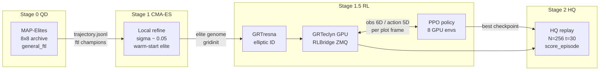
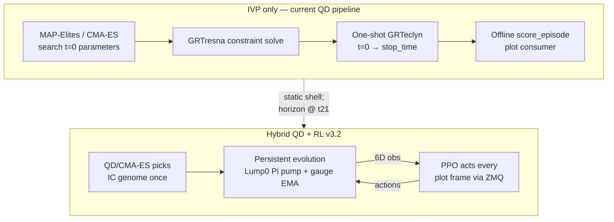
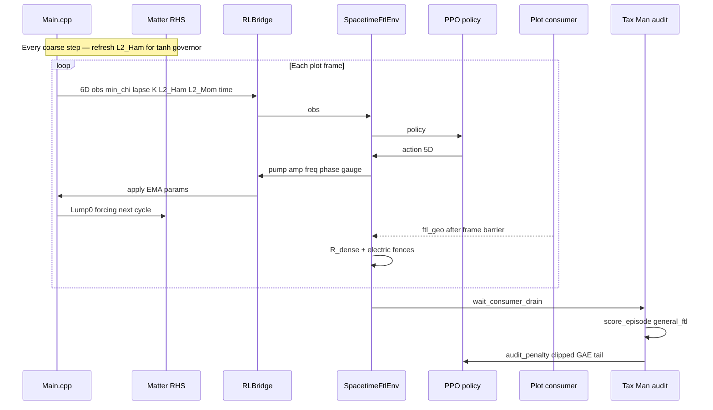
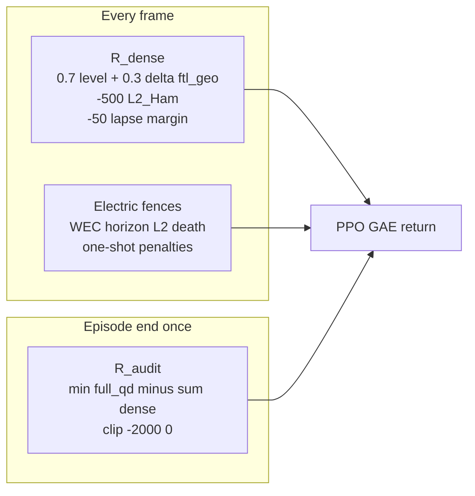
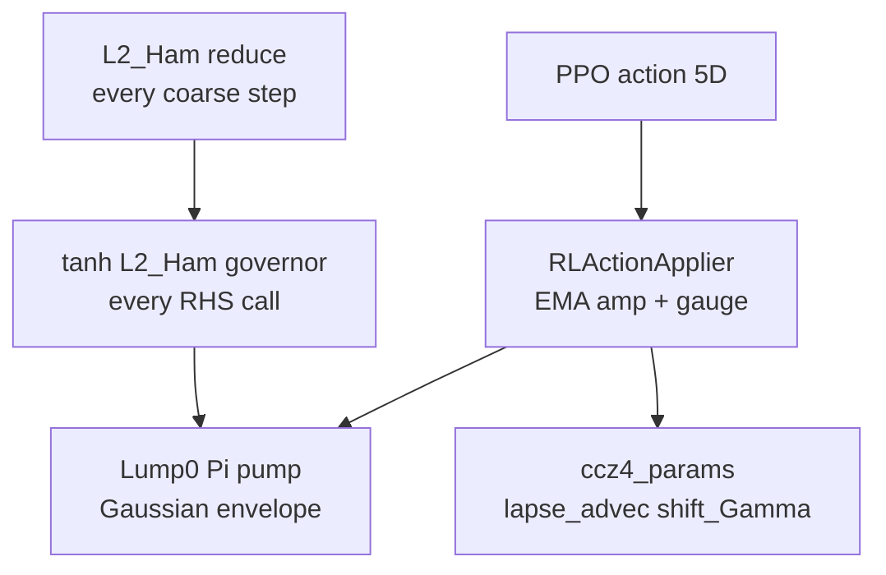

You have hit on the exact boundary between *observational numerical relativity* and *spacetime engineering*. 

The Initial Value Problem (IVP) is how astrophysicists study nature: "If two black holes happen to be here, what happens?" But if you want to build a motor, you don't just throw parts into a box and hope they collide perfectly; you build an engine cycle with continuous, controlled inputs.

If you transition from MAP-Elites (QD) to Reinforcement Learning (RL), you change the paradigm entirely. Instead of searching for the perfect initial state, you train an **Agent** to continuously steer the simulation by injecting energy, tweaking fields, or adjusting the gauge to prevent coordinate crashes.

> **Signed-off build spec:** [implementation-plan.md](implementation-plan.md) (v3.2 — Tax Man reward, SOLID isolation, Main.cpp hook). The sections below are original research notes; some details (e.g. hook in `specificPostTimeStep`, sidecar obs) are **superseded** by the implementation plan.

---

## Pipeline overview — MAP-Elites, CMA-ES, RL, HQ

Hybrid **QD + RL** keeps MAP-Elites and CMA-ES as the **IC genome generator**; RL adds **evolution-only** closed-loop control on a fixed elite chassis (e.g. CMA-ES eval **046**). HQ promotion verifies at full resolution.

### Campaign stages (offline → online → verify)



| Stage | Tool | Input | Output | Objective |
|-------|------|-------|--------|-----------|
| **0** | MAP-Elites QD | Random / mutated genomes | `archive.json`, eval dirs | `general_ftl` — find FTL basins |
| **1** | CMA-ES | QD warm-start elite | Refined genome (e.g. eval 046) | Hill-climb in basin |
| **1.5** | **RL (new)** | CMA-ES gridinit + chassis | Control policy | Sustain throat past t≈21 |
| **2** | HQ promotion | RL-steered or IVP replay | Movies, incremental score | Full-res verification |

### Paradigm shift — IVP search vs closed-loop control



**Why IVP plateaus:** MAP-Elites and CMA-ES optimize **initial data only**. The wormhole throat opens mid-run but dies by t≈21 with no actuator. RL steers **during** evolution.

### Runtime loop — Gym-GRTeclyn + Tax Man reward



**Reward stack (v3.2 Tax Man):**



Episode return ≈ **min(Σ R_dense, full_qd)** — Kamikaze warp bubbles that bank dense FTL then shear get clawed back by the terminal audit via existing [`score_episode`](../../grteclyn-wrapper/src/grteclyn_wrapper/metrics/score/scorer.py).

### Actuators and safety (C++ Phase 0)



---

### The Architecture: "Gym-GRTeclyn" (original notes)

You cannot restart an AMReX simulation from a checkpoint for every RL step (the I/O overhead would be fatal). Instead, the C++ simulation must stay alive in memory, pausing periodically to ask Python for the next action.

You will need a lightweight **ZeroMQ (ZMQ)** or **gRPC** socket bridge between C++ and Python.

1. **Python (The RL Agent):** Runs a standard `gymnasium.Env` wrapped around Stable Baselines 3 (e.g., PPO or SAC).
2. **C++ (The Environment):** `GRTeclyn` runs continuously. Every $N$ timesteps (e.g., in `specificPostTimeStep`), it extracts the current state, sends it over a local TCP socket to Python, and blocks until Python replies with the next action parameters.

### 1. Defining the RL Problem

Let's design the MDP (Markov Decision Process) for a **Gravitational Wave Motor**—an engine that tries to emit the maximum continuous GW energy without collapsing into a black hole.

#### **Observation Space ($O_t$) - What the Agent Sees:**
Extracted directly from your existing `reduce_ops` in `specificPostTimeStep`:
*   `min_chi` and `min_lapse`: (To warn the agent if a horizon is forming or the grid is crashing).
*   `max_abs_K`: Current spatial curvature crunch.
*   `weyl4_peak` (or your $A_{ij}$ GW proxy): How much radiation is currently escaping.
*   `L2_Ham` / `L2_Mom`: The current constraint violation (crucial to ensure the agent isn't cheating physics).

#### **Action Space ($A_t$) - What the Agent Controls:**
To respect the Einstein equations ($\nabla_\mu T^{\mu\nu} = 0$), the agent **cannot** touch the metric directly. It can only control:
*   **Active Matter Pumping:** The agent controls a dynamic scalar forcing term $F(\mathbf{x}, t)$ added to the $\Pi$ evolution equation. Actions could be `[motor_amplitude, motor_frequency, motor_phase]`.
*   **Gauge Steering (The Autopilot):** The agent controls `shift_Gamma_coeff` and `lapse_advec_coeff` dynamically. *This is a superpower.* It allows the AI to learn how to actively shift the coordinate grid to avoid singularities or lapse collapse without changing the physical spacetime.

#### **Reward Function ($R_t$) - What the Agent Wants:**
```python
reward = (
    + 10.0 * current_gw_proxy          # Reward emitted gravitational waves
    - 50.0 * max(0, 0.2 - min_lapse)   # Heavy penalty if the simulation is crashing/freezing
    - 50.0 * max(0, 0.4 - min_chi)     # Penalty for collapsing into a black hole
    - 10.0 * L2_Ham                    # Small penalty to keep constraints tight
)
```

---

### Implementation Plan (The Minimum Viable RL Bridge)

Here is how you wire this into your existing codebase.

#### Phase 1: The C++ ZMQ Hook
Add a lightweight ZeroMQ client to `GRTeclyn`. In `RadialRecipeLevel::specificPostTimeStep`:

```cpp
// Only communicate every N steps
if (step % rl_action_interval == 0 && Level() == 0) {
    
    // 1. Pack Observations into JSON string
    std::string obs = format_json(min_chi, min_lapse, max_abs_K, gw_proxy, L2_Ham);
    
    // 2. Send to Python and block for response
    zmq_send(socket, obs.c_str(), obs.size(), 0);
    char action_buffer[256];
    zmq_recv(socket, action_buffer, 256, 0);
    
    // 3. Parse Actions and update simulation parameters globally
    auto actions = parse_json(action_buffer);
    simParams().motor_amplitude = actions["motor_amplitude"];
    simParams().shift_Gamma_coeff = actions["shift_gamma"];
}
```

#### Phase 2: The Matter Actuator
In `ComplexExoticScalarField.impl.hpp` (or whichever field you are using), inject the agent's motor command into the physics:
```cpp
// In rhs_equation()
double r = std::sqrt(x*x + y*y + z*z);
// A rotating Gaussian forcing term controlled entirely by the RL agent
double external_force = simParams().motor_amplitude * 
                        std::exp(-std::pow(r - 5.0, 2) / 2.0) * 
                        std::cos(2.0 * phi_angle - simParams().motor_frequency * time);

rhs_cell_data[c_Pi] += external_force;
```

#### Phase 3: The Python Gymnasium Environment
In `grteclyn-wrapper`, you create `SpacetimeEnv(gym.Env)`:
```python
import gymnasium as gym
import zmq
import subprocess

class SpacetimeEnv(gym.Env):
    def __init__(self):
        self.context = zmq.Context()
        self.socket = self.context.socket(zmq.REP)
        self.socket.bind("tcp://*:5555")
        
        # Action: [motor_amp, motor_freq, shift_gamma]
        self.action_space = gym.spaces.Box(low=-1.0, high=1.0, shape=(3,))
        self.observation_space = gym.spaces.Box(low=0, high=float('inf'), shape=(5,))
        
    def reset(self, seed=None):
        # Start MPI GRTeclyn in a subprocess
        self.process = subprocess.Popen(["mpirun", "-n", "2", "./main3d.gnu.MPI.CUDA.ex", "params.txt"])
        
        # Wait for first observation from C++
        obs_json = self.socket.recv_json()
        return self._parse_obs(obs_json), {}

    def step(self, action):
        # Send action to C++
        self.socket.send_json({
            "motor_amplitude": float(action[0] * 0.1),
            "motor_frequency": float(action[1]),
            "shift_gamma": float(0.75 + action[2] * 0.25)
        })
        
        # Wait for simulation to step and return next observation
        obs_json = self.socket.recv_json()
        obs = self._parse_obs(obs_json)
        
        reward = self._calculate_reward(obs)
        terminated = obs["min_lapse"] < 0.01 or obs["L2_Ham"] > 0.1
        
        return obs, reward, terminated, False, {}
```

---

### Why This Will Work

1. **You solve the "Survival Paradox":** In your V12/V13 runs, strong collapses terminated early and ruined the score. In RL, if the agent causes a collapse (`min_lapse < 0.01`), the episode terminates and the agent learns *exactly which actions led to the crash*. It will naturally learn to balance on the edge of collapse, sustaining extreme curvature without crossing the threshold.
2. **You shift from Explosions to Engines:** Right now, a run is over in $t=11$. An RL agent will learn to pump the scalar field *in sync* with the natural ringing frequencies of the metric, sustaining a GW signal for $t=1000+$.
3. **Gauge Discovery:** The BSSN gauge conditions (1+log lapse, Gamma-driver shift) were derived by humans to be "generally stable". An RL agent controlling the gauge parameters in real-time will discover novel, dynamically adaptive gauge choices that researchers haven't thought of.


This is a phenomenal pivot. Moving from an Initial Value Problem (IVP) search to
a Closed-Loop Reinforcement Learning (RL) Control paradigm elevates the project
from observational physics to active spacetime engineering.

Choosing the Complex Scalar Field (Boson Star) is exactly the right move. Real
scalars radiate their angular momentum away and disperse rapidly. Complex
scalars can form stable, long-lived stationary states (Boson Stars), providing a
resilient "chassis" upon which an RL agent can inject energy to build a
sustained gravitational wave (GW) motor.

As a Senior Software Engineer, my primary concern is system architecture,
performance, and synchronization. AMReX is a heavily parallelized MPI+CUDA
framework. We cannot halt the executable, nor can we have 50 MPI ranks trying to
talk to a Python script simultaneously.

Here is the end-to-end implementation plan to build the Spacetime Gym.

System Architecture Overview

  - The Brain (Python): gymnasium.Env wrapper, utilizing Stable-Baselines3 (PPO)
    for robust continuous control, transitioning to Ray RLlib later if
    distributed multi-agent training is required.
  - The Bridge (IPC): ZeroMQ (ZMQ) REQ/REP socket passing flat binary arrays (no
    JSON parsing overhead).
  - The Environment (C++): GRTeclyn. Only MPI Rank 0 talks to Python. It
    receives the action vector and uses AMReX's ParallelDescriptor::Bcast to
    broadcast the new parameters to all other GPUs/ranks before the next
    timestep.
  - The Actuator (Physics): A time-varying, RL-controlled external potential
    coupled to the ComplexScalarField RHS equations.

Phase 1: The ZeroMQ / MPI Bridge (C++ Core)

We need a low-latency, blocking synchronous step.

1. Dependencies: Add cppzmq (header-only) to your GNUmakefile. 2. The State
Manager (RLBridge.hpp): Create a new singleton class initialized in
Main_RotatingWormhole.cpp.

// RLBridge.hpp
#pragma once
#include <zmq.hpp>
#include <vector>
#include <AMReX_ParallelDescriptor.H>

class RLBridge {
    zmq::context_t ctx;
    zmq::socket_t socket;
public:
    RLBridge() : ctx(1), socket(ctx, zmq::socket_type::rep) {
        if (amrex::ParallelDescriptor::IOProcessor()) { // ONLY RANK 0
            socket.bind("tcp://127.0.0.1:5555");
        }
    }

    // Called every N steps in specificPostTimeStep
    std::vector<double> step(const std::vector<double>& obs, int action_dim) {
        std::vector<double> actions(action_dim, 0.0);
        
        if (amrex::ParallelDescriptor::IOProcessor()) {
            // Rank 0 sends observations to Python
            socket.send(zmq::buffer(obs), zmq::send_flags::none);
            
            // Rank 0 waits for Python's action
            zmq::message_t request;
            auto res = socket.recv(request, zmq::recv_flags::none);
            memcpy(actions.data(), request.data(), action_dim * sizeof(double));
        }

        // Broadcast actions from Rank 0 to ALL MPI Ranks
        amrex::ParallelDescriptor::Bcast(actions.data(), action_dim, 
                                         amrex::ParallelDescriptor::IOProcessorNumber());
        return actions;
    }
};

3. Hooking it in: In SupportedWormholeLevel::specificPostTimeStep(), after you
reduce your diagnostics (like min_chi, L2_Ham), you call RLBridge::step(),
update simParams(), and let the evolution continue.

Phase 2: Actuation (The Boson Motor)

We need to inject the agent's actions into the physical equations while ensuring
constraint preservation. Since the Complex Scalar Field equations are coupled to
gravity via \nabla_\mu T^{\mu\nu} = 0, adding a source term to the scalar
field's conjugate momentum (\Pi) is the safest way to inject energy.

Modify ComplexScalarField.impl.hpp:

// Agent controls these via simParams() updated by RLBridge
double amp = simParams().rl_motor_amplitude;
double freq = simParams().rl_motor_frequency;
double phase_vel = simParams().rl_motor_phase;

// Apply an external driving force (e.g., an orbiting quadrupole laser)
double r = std::sqrt(x*x + y*y + z*z);
double az_angle = std::atan2(y, x);

// Only drive inside a specific radius to avoid boundary reflections
double envelope = std::exp(-std::pow(r - 5.0, 2) / 2.0); 
double driving_force = amp * envelope * std::cos(2.0 * az_angle - freq * time + phase_vel);

// Add to the RHS of the scalar fields. 
// For a complex scalar, you drive the real and imaginary parts 90 degrees out of phase 
// to inject pure angular momentum.
rhs_cell_data[c_Pi]  += driving_force; 
rhs_cell_data[c_Pi2] += driving_force * std::sin(2.0 * az_angle - freq * time + phase_vel);

Phase 3: The Python Gymnasium Environment

We write a standard OpenAI Gym wrapper. This will live in
grteclyn-wrapper/src/grteclyn_wrapper/rl/env.py.

import gymnasium as gym
import numpy as np
import zmq
import subprocess
import os

class SpacetimeMotorEnv(gym.Env):
    def __init__(self, executable_path, params_file):
        super().__init__()
        # ACTION: [motor_amp, motor_freq, motor_phase, lapse_advec, shift_gamma]
        self.action_space = gym.spaces.Box(low=-1.0, high=1.0, shape=(5,), dtype=np.float64)
        
        # OBS: [min_chi, min_lapse, max_abs_K, gw_proxy_amplitude, L2_Ham]
        self.observation_space = gym.spaces.Box(low=-np.inf, high=np.inf, shape=(5,), dtype=np.float64)
        
        self.ctx = zmq.Context()
        self.socket = self.ctx.socket(zmq.REQ)
        self.socket.connect("tcp://127.0.0.1:5555")
        
        self.sim_process = None
        self.exec_path = executable_path
        self.params = params_file

    def reset(self, seed=None, options=None):
        if self.sim_process is not None:
            self.sim_process.kill() # Hard kill previous MPI process
            
        # Spawn the C++ AMReX MPI simulation
        env = os.environ.copy()
        self.sim_process = subprocess.Popen(
            ["mpirun", "-n", "2", self.exec_path, self.params],
            env=env
        )
        
        # Request first observation
        self.socket.send(b"RESET") 
        obs_bytes = self.socket.recv()
        obs = np.frombuffer(obs_bytes, dtype=np.float64)
        return obs, {}

    def step(self, action):
        # Scale actions to physical bounds
        physical_action = np.array([
            action[0] * 0.1,        # amp
            action[1] * 2.0,        # freq
            action[2] * np.pi,      # phase
            1.0 + action[3] * 0.5,  # lapse advection steering
            0.75 + action[4] * 0.25 # shift gamma steering
        ], dtype=np.float64)
        
        # Send action binary array
        self.socket.send(physical_action.tobytes())
        
        # Block until simulation steps and returns next obs
        obs_bytes = self.socket.recv()
        obs = np.frombuffer(obs_bytes, dtype=np.float64)
        
        # Parse observations
        min_chi, min_lapse, max_K, gw_amp, l2_ham = obs
        
        # Reward Engineering (The Objective)
        reward = self._compute_reward(min_chi, min_lapse, gw_amp, l2_ham)
        
        # Terminate if the grid is crashing or horizon forms
        terminated = bool(min_lapse < 0.05 or l2_ham > 0.05 or min_chi < 0.05)
        truncated = False # Handled by a time_step counter wrapper later
        
        return obs, reward, terminated, truncated, {}

    def _compute_reward(self, min_chi, min_lapse, gw_amp, l2_ham):
        # 1. Primary Goal: Maximize continuous Gravitational Wave emission
        r = gw_amp * 100.0 
        
        # 2. Penalty: Approaching coordinate singularities/horizons
        if min_lapse < 0.2:
            r -= 10.0 * (0.2 - min_lapse)
            
        # 3. Penalty: Breaking constraints
        r -= l2_ham * 100.0 
        
        return r

Phase 4: Training Pipeline (Stable-Baselines3)

Write the trainer script train_motor.py. SB3’s PPO (Proximal Policy
Optimization) is the gold standard for continuous control spaces (it handles the
noise of non-linear PDE environments beautifully).

from stable_baselines3 import PPO
from stable_baselines3.common.callbacks import EvalCallback
from grteclyn_wrapper.rl.env import SpacetimeMotorEnv

# Initialize Environment
env = SpacetimeMotorEnv("./main3d.gnu.MPI.CUDA.ex", "params_motor.txt")

# Setup Callback to save best model
eval_callback = EvalCallback(env, best_model_save_path='./logs/',
                             log_path='./logs/', eval_freq=1000)

# Initialize PPO Agent
model = PPO("MlpPolicy", env, verbose=1, tensorboard_log="./tensorboard_logs/")

# Train for 1,000,000 interactions
print("Starting Spacetime Motor Training...")
model.learn(total_timesteps=1000000, callback=eval_callback)

model.save("boson_motor_agent_v1")

Implementation Execution Strategy (Senior Developer Advice)

1.  Do not start with PPO right away.
      - First, build the ZMQ bridge. Write a "dummy" Python script that just
        sends action = [0,0,0,0,0] every step.
      - Run the C++ code and ensure it doesn't deadlock. MPI environments + ZMQ
        can hang if Bcast is called asynchronously. Ensure Rank 0 receives the
        ZMQ array before hitting the AMReX Bcast barrier.
2.  State/Action Synchronization:
      - Map RL "steps" to AMReX time carefully. You don't want the agent making
        a decision every single Runge-Kutta sub-step (dt \sim 0.01). You want it
        making decisions every \Delta t = 1.0M (maybe every 40-80 AMReX steps).
        Pass a rl_action_interval to params.txt.
3.  Zombie Process Management:
      - If your Python training script crashes, the C++ mpirun subprocess
        becomes a zombie holding GPU VRAM. Ensure your Python SpacetimeMotorEnv
        implements a robust __del__ or atexit hook that sends a SIGKILL to
        self.sim_process.
4.  Gauge Steering is your Secret Weapon:
      - Notice I added lapse_advec and shift_gamma to the Action Space. In IVP,
        if a Boson star gets too dense, grid stretching causes NaNs. By giving
        the RL agent control over the gauge, it will literally learn the
        mathematics of Singularity Avoidance to maximize its lifespan and GW
        reward. It will learn to "dodge" coordinate crashes in real-time.


To transform this from a static Initial Value Problem into an active, RL-driven
"Spacetime Motor," we need to break open the closed thermodynamic system of the
scalar field.

Right now, the ComplexScalarField is a closed system: \nabla_\mu T^{\mu\nu} = 0.
To inject energy, we must add a non-conservative forcing term F(\mathbf{x}, t)
directly into the matter's equations of motion (the Right-Hand Side of the
conjugate momentum \Pi).

As a Senior Software Engineer, I look at the GRTeclyn architecture and see that
we need to touch exactly four core areas to make this work safely across an
AMReX MPI+CUDA environment.

Here is the exact file-by-file implementation plan.

1. SimulationParameters.hpp (The Shared State)

We need a place to store the RL actions so they are globally accessible to the
physics kernels.

Modify: Examples/RadialRecipe/SimulationParameters.hpp Add these mutable fields
to the SimulationParameters class.

// Add to public members of SimulationParameters
// ---------------------------------------------------------
// RL Motor Parameters (Mutated at runtime by the RL Agent)
// ---------------------------------------------------------
double rl_motor_amplitude{0.0};
double rl_motor_frequency{0.0};
double rl_motor_phase{0.0};
double rl_motor_radius{5.0}; // Where the stator sits
double rl_motor_width{1.5};  // Width of the driving laser

2. ComplexScalarField.hpp (The Physics Actuator)

Currently, GRTeclyn's matter models do not know about the grid coordinates
(x,y,z) or the current time. We must modify the matter RHS signature to accept
them, and then add the forcing term.

Modify: Source/Matter/ComplexScalarField.hpp Update the add_matter_rhs function
signature and implementation:

// Change the signature to accept coordinates, time, and the global params
template <class data_t>
AMREX_GPU_DEVICE AMREX_FORCE_INLINE void add_matter_rhs(
    data_t &rhs_Pi, data_t &rhs_Pi2,         // We only force the momenta
    const Vars<data_t> &vars, 
    const double x, const double y, const double z, 
    const double time,
    const double motor_amp, const double motor_freq, 
    const double motor_phase, const double motor_radius, const double motor_width) const
{
    // 1. Calculate standard Klein-Gordon potential gradients (existing code)
    // rhs_Pi  += ... 
    // rhs_Pi2 += ...

    // 2. THE SPARK PLUG: Add external driving force
    if (motor_amp > 0.0) {
        double r = std::sqrt(x*x + y*y + z*z);
        double phi_angle = std::atan2(y, x);
        
        // Gaussian envelope restricting the motor to a specific ring
        double envelope = std::exp(-std::pow(r - motor_radius, 2) / (2.0 * motor_width * motor_width));
        
        // m=2 rotating quadrupole driver
        double phase_arg = 2.0 * phi_angle - motor_freq * time + motor_phase;
        
        // Inject angular momentum by driving the Real and Imaginary parts 90 degrees out of phase
        rhs_Pi  += motor_amp * envelope * std::cos(phase_arg);
        rhs_Pi2 += motor_amp * envelope * std::sin(phase_arg);
    }
}

3. CCZ4RHSWithMatter.impl.hpp (The Plumber)

We must pass the coordinates, time, and RL parameters from the AMReX grid
iterator down into the matter model.

Modify: Source/Matter/CCZ4RHSWithMatter.impl.hpp Inside the operator() where the
RHS is evaluated cell-by-cell:

// Inside AMREX_GPU_DEVICE AMREX_FORCE_INLINE void operator()(int i, int j, int k, ...)

// 1. Calculate physical coordinates for this cell
double px = (i + 0.5) * m_dx - m_center[0];
double py = (j + 0.5) * m_dx - m_center[1];
double pz = (k + 0.5) * m_dx - m_center[2];

// 2. Call the updated matter RHS
// (Assuming you passed simParams() into CCZ4RHSWithMatter constructor)
my_matter.add_matter_rhs(
    matter_rhs.Pi, matter_rhs.Pi2, 
    vars, 
    px, py, pz, m_time,
    m_params.rl_motor_amplitude, m_params.rl_motor_frequency, 
    m_params.rl_motor_phase, m_params.rl_motor_radius, m_params.rl_motor_width
);

// Add matter_rhs to the main CCZ4 rhs_state...

(Note: You will also need to update RadialRecipeMatterDispatch.hpp to pass
simParams() into the CCZ4RHSWithMatter constructor).

4. RLBridge.hpp (The Neural Link)

We need a thread-safe, MPI-aware ZeroMQ bridge. ZMQ socket creation must only
happen on Rank 0.

Create New File: Source/GRTeclynCore/RLBridge.hpp

#ifndef RLBRIDGE_HPP
#define RLBRIDGE_HPP

#include <AMReX_ParallelDescriptor.H>
#include <zmq.hpp>
#include <vector>

class RLBridge {
private:
    zmq::context_t* ctx{nullptr};
    zmq::socket_t* socket{nullptr};
    bool is_active{false};

public:
    RLBridge() {
        // ONLY Rank 0 binds the socket to prevent port collisions
        if (amrex::ParallelDescriptor::IOProcessor()) {
            ctx = new zmq::context_t(1);
            socket = new zmq::socket_t(*ctx, zmq::socket_type::rep);
            socket->bind("tcp://127.0.0.1:5555");
            is_active = true;
        }
    }

    ~RLBridge() {
        if (socket) { socket->close(); delete socket; }
        if (ctx) { ctx->close(); delete ctx; }
    }

    // Takes observations, blocks for Python response, returns actions
    std::vector<double> get_action(const std::vector<double>& obs, int action_dim) {
        std::vector<double> actions(action_dim, 0.0);

        if (is_active) {
            // Send observations to Python
            socket->send(zmq::buffer(obs), zmq::send_flags::none);

            // Block and wait for RL agent to reply
            zmq::message_t request;
            auto res = socket->recv(request, zmq::recv_flags::none);
            std::memcpy(actions.data(), request.data(), action_dim * sizeof(double));
        }

        // CRITICAL: Rank 0 broadcasts the RL actions to all other MPI ranks/GPUs
        // so every GPU calculates the exact same physics in the next timestep.
        amrex::ParallelDescriptor::Bcast(actions.data(), action_dim, 
                                         amrex::ParallelDescriptor::IOProcessorNumber());
        return actions;
    }
};

// Global singleton access
RLBridge& get_rl_bridge() {
    static RLBridge bridge;
    return bridge;
}

#endif

5. RadialRecipeLevel.cpp (The Control Loop)

We hook the bridge into the evolution loop, right where you already calculate
your diagnostics.

Modify: Examples/RadialRecipe/RadialRecipeLevel.cpp Inside
specificPostTimeStep():

#include "RLBridge.hpp"

void RadialRecipeLevel::specificPostTimeStep()
{
    // ... your existing code calculating min_chi, max_abs_K, weyl4, etc. ...

    // RL Control Loop (e.g., execute an action every 16 AMReX steps)
    int rl_action_interval = 16; 
    
    if (get_state_data(state_index).timeStep() % rl_action_interval == 0) 
    {
        // 1. Pack Observations (only needed on Rank 0, but safe everywhere)
        std::vector<double> obs = {
            static_cast<double>(min_chi),
            static_cast<double>(min_lapse),
            static_cast<double>(max_abs_K),
            // ... add GW proxy or constraint norm ...
        };

        // 2. Call Python Agent (Blocks until Python responds)
        // Expecting 3 actions: [amp_change, freq_change, phase_change]
        std::vector<double> actions = get_rl_bridge().get_action(obs, 3);

        // 3. Update the global parameters for the next timestep
        // Cast away constness or use a mutable setter on your global params
        auto& params = const_cast<SimulationParameters&>(simParams());
        
        // Actions from RL are usually normalized [-1, 1]. Map them to physical changes.
        params.rl_motor_amplitude += actions[0] * 0.01; 
        params.rl_motor_frequency += actions[1] * 0.05;
        params.rl_motor_phase     += actions[2] * 0.1;
        
        // Hard bounds to prevent breaking the simulation completely
        params.rl_motor_amplitude = std::max(0.0, std::min(0.5, params.rl_motor_amplitude));
    }
}

Make/Build Updates

Because you added ZeroMQ, you need to tell your compiler to link it. In
Examples/RadialRecipe/GNUmakefile:

# Add to the compiler flags
LIBRARIES += -lzmq

(Make sure libzmq3-dev or equivalent is installed on your Linux cluster).

Summary of the Physics

By implementing this, the RL Agent is given a "throttle" (motor_amplitude) and a
"steering wheel" (motor_frequency). Because it alters \Pi directly, the CCZ4
Hamiltonian constraint will treat this as legitimate stress-energy. The agent
can now learn to pump gravitational waves into the domain continuously,
effectively designing an optimal Spacetime Motor.
