# Gravitational Wave Focusing & Critical Collapse

**Research program:** MAP-Elites and CMA-ES campaigns on toroidal ring layouts to discover (1) constructive wave focusing ("gravitational splash") and critical collapse, (2) sustained boson-star resonance, and (3) **optimal wave engineering** — phased-array gravitational antennas with coherent, beamed radiation.

---

## Executive Summary

| Question | Answer |
|----------|--------|
| Can we run splash/collapse experiments **now**? | **Yes** — real scalar fields on the current 128³ gridinit pipeline |
| Do we need boson stars for everything? | **No** — only for sustained resonance and long-term standing-wave cavities |
| Primary mechanism (splash) | Symmetric ring → ingoing waves → geometric amplification at \(r=0\) → non-linear curvature spike |
| GW antenna extension | Search over phase offsets, quadrupole shape, and orbital \(\omega\) → phased-array beaming along a narrow axis |

The pool analogy is exact: disturbing water in a circular bath sends waves inward; shrinking circumference compresses energy; waves meet at the center in constructive interference and produce a localized non-linear peak. General Relativity permits the same geometry with positive-energy matter — a **gravitational splash**.

---

## 1. Physical Motivation

### 1.1 Constructive Wave Focusing

When waves travel inward on a circular front, the wavefront area shrinks and amplitude grows:

| Dimension | Amplitude scaling |
|-----------|-------------------|
| 2D (cylindrical) | \(\propto 1/\sqrt{r}\) |
| 3D (spherical) | \(\propto 1/r\) |

At the origin, waves in phase interfere constructively. Energy density scales as \(\rho \sim \dot{\phi}^2 + |\nabla\phi|^2\), so the peak is strongly non-linear.

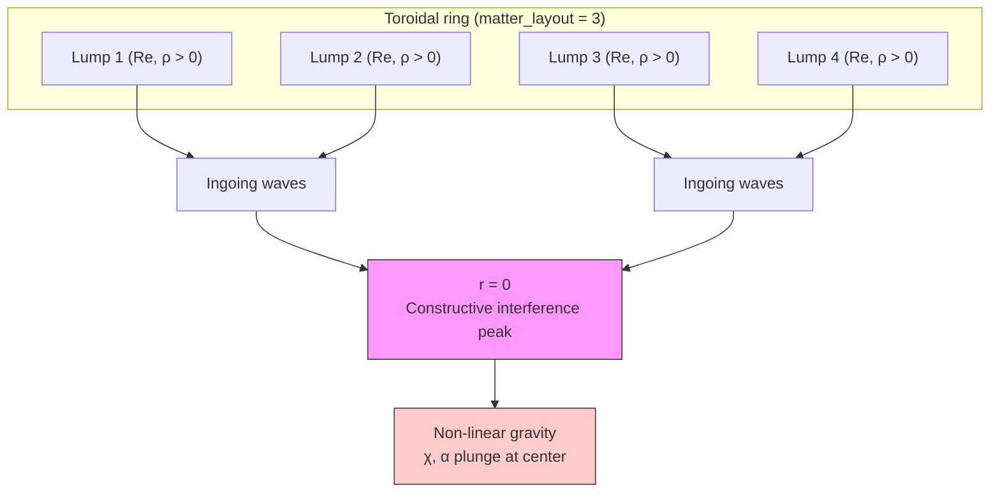

**Observable signatures at \(r=0\):** conformal factor well (\(\chi - 1\), Group 12), local coordinate speed \(c\) drop (Group 10), transient gravitational potential well from wave focusing alone.

### 1.2 Two Outcome Regimes

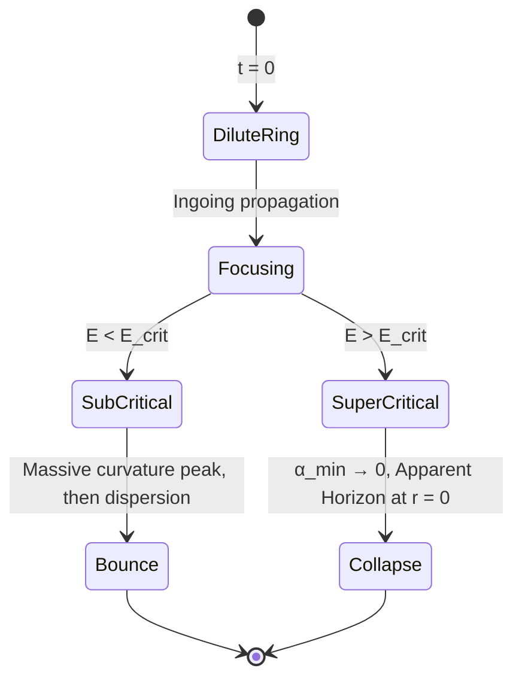

| Regime | Condition | Outcome |
|--------|-----------|---------|
| **Sub-critical splash** | Wave energy below threshold | Peak at \(r=0\), clean bounce, waves disperse |
| **Super-critical collapse** | Wave energy above threshold | Lapse collapse (\(\alpha_{\min} \to 0\)), AH finder detects BH from focused positive-energy waves |

Historical anchor: Choptuik's critical collapse and discrete self-similarity were discovered with a **real, massless** scalar field — the splash/collapse lifecycle does not require complex fields.

---

## 2. Research Design

### 2.1 The Gravitational Bath (No Reflecting Walls)

We do **not** impose unphysical grid boundaries. Instead:

1. **Ring as transmitter** — symmetric boson/scalar lumps on a circle around \(r=0\) (`matter_layout = 3`)
2. **Coherent breathing** — scalar momentum \(\Pi\) configured so all lumps oscillate in phase, sending waves inward
3. **Geometric focus** — amplitude grows as waves converge; perfect phase alignment at the origin
4. **Non-linear takeover** — \(\rho \sim \dot{\phi}^2 + |\nabla\phi|^2\) spikes; spacetime warps violently

### 2.2 MAP-Elites Search Space

**Fitness (wave concentration):**

\[
\text{Score} = \max_t \left[ \rho_{\rm req}(t, \vec{0}) \right] \times \text{survival} - \text{penalties}
\]

Penalty if initial mass is already collapsed — waves must start dilute and **travel inward** to form the peak.

**Descriptor axes:**

| Axis | Physical quantity | Role |
|------|-------------------|------|
| **X** | Wave chromaticity (frequency) | Oscillation frequency of focusing waves |
| **Y** | Initial ring radius \(R\) | Propagation distance before center meeting |

MAP-Elites discovers combinations of scalar mass \(m\), self-coupling \(\lambda\), and \(R\) that act as a gravitational lens.

### 2.3 Campaign Strategy (Three Phases)

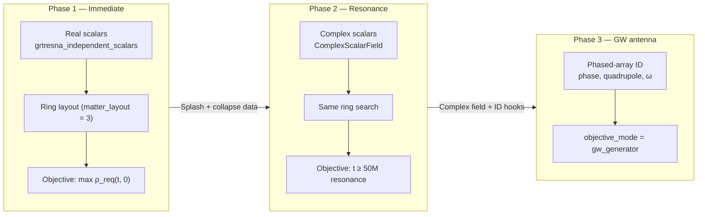

| Phase | Model | Objective | Timeline |
|-------|-------|-----------|----------|
| **1 — Splash** | Real scalars, `grtresna_exotic_fraction=0` | Max central energy density peak; visualize splash, lapse collapse, AH | **Run now** on v21/v22 pipeline |
| **2 — Resonance** | Complex scalars (boson stars) | Long-evolution standing-wave cavities, orbital resonance | After ComplexScalarField compile |
| **3 — GW antenna** | Complex scalars + phased-array ID | Max \(E_{\rm radiated}\), Q-factor, directional beaming \(\mathcal{D}\) | After Phase 2; requires `spaces.py` + GRTresna ID hooks |

---

## 3. Model Selection: Real vs Complex Scalars

### 3.1 What Real Scalars Do Well

- Klein-Gordon wave propagation and focusing — fully physical
- One-off splash and critical collapse on current 5-lump ring setup
- Entire lifecycle (kick → focus → bounce or \(\alpha \to 0\)) runnable today

### 3.2 Why Complex Scalars Are Needed for Resonance

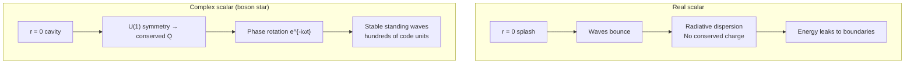

| Property | Real scalar | Complex scalar |
|----------|-------------|----------------|
| Conserved charge | None | Noether charge \(Q\) |
| Long-term energy | Disperses to infinity | Trapped in cavity |
| Use case | Splash, critical collapse | Sustained resonance, geons |

---

## 4. Implementation Blueprint

Metrics and scoring live in Python (`grteclyn-wrapper/src/grteclyn_wrapper/metrics/`). C++ outputs minimal ASCII; Python computes objectives.

### 4.1 Architecture

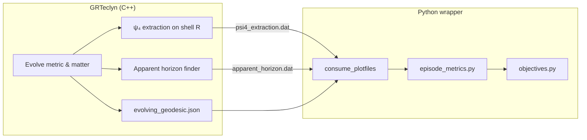

### 4.2 Track 1 — `gw_generator` (Gravitational Wave Antenna)

**Goal:** Evolve matter configurations into **optimal wave generators** — not merely orbiting bodies, but synchronized phased arrays that emit coherent, beamed gravitational radiation.

**Core extraction:** Newman–Penrose \(\Psi_4(t,\theta,\phi)\) on sphere \(R_{\rm extract} \approx 40M\):

\[
\Psi_4(t,\theta,\phi) = \sum_{l=2}^{\infty} \sum_{m=-l}^{l} C_{lm}(t)\,_{-2}Y_{lm}(\theta,\phi)
\]

Search-space and initial-data changes live in `grteclyn-wrapper/.../search/optimize/spaces.py` (Python) and GRTresna `MatterParams.hpp` / `MyMatterFunctions.cpp` (C++ initial data).

#### 4.2.1 Engineering the Spacetime Phased Array

The optimizer must learn to synchronize quantum phases and orbital speeds of individual boson stars so the ring acts as a **gravitational phased-array antenna** [1, 4].

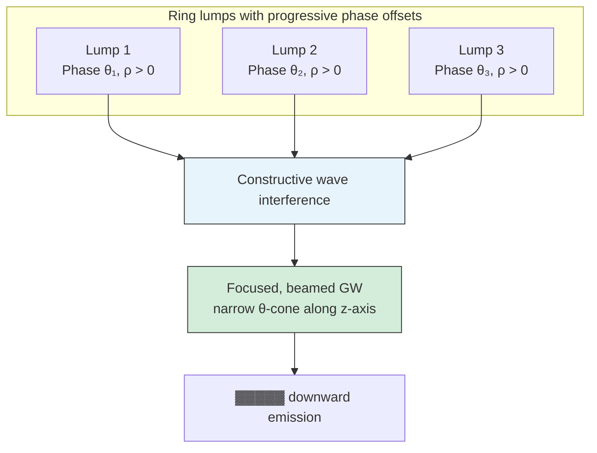

**A. New search parameters** (`spaces.py` + `MatterParams.hpp`):

| Parameter | Type | Range | Physical role |
|-----------|------|-------|---------------|
| `grtresna_lump_phase_diff` | Float | \([0, 2\pi]\) | Phase offset \(\Delta\theta_k\) between adjacent lumps in the ring [4] |
| `grtresna_lump_quadrupole_amp` | Float | \([0, 0.5]\) | Non-spherical quadrupole deformation (\(l=2, m=2\)) of each star [2] |
| `grtresna_lump_orbital_omega` | Float | \([0, 0.8]\) | Shared orbital frequency of the ring → rotating quadrupole moments [4] |

**B. Initial-data phase equations** (`MyMatterFunctions.cpp`):

At \(t=0\), paint each lump with progressive phase differences (\(k \in \{1 \ldots N_{\rm lumps}\}\), \(\Delta\theta\) from search):

\[
\begin{aligned}
\phi_{1,k} &= \phi_0(r_k) \cos(k \cdot \Delta\theta) \\
\phi_{2,k} &= -\phi_0(r_k) \sin(k \cdot \Delta\theta) \\
\Pi_{1,k} &= \omega \phi_{2,k} - v^i \partial_i \phi_{1,k} \\
\Pi_{2,k} &= -\omega \phi_{1,k} - v^i \partial_i \phi_{2,k}
\end{aligned}
\]

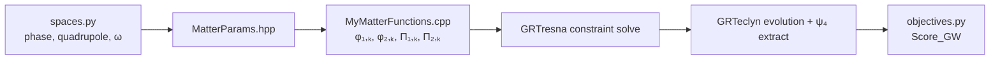

#### 4.2.2 Antenna Scoring Function (Optimal Wave Emission)

Guide the optimizer toward **laser-like** gravitational wave generation rather than chaotic collapse or random scattering. Configure `objectives.py` as:

\[
\text{Score}_{\rm GW} = w_1 \cdot E_{\rm radiated} + w_2 \cdot Q_{\rm factor} + w_3 \cdot \mathcal{D}_{\rm beaming} - \text{penalties}
\]

| Term | Metric field | Definition | Weight | Role |
|------|--------------|------------|--------|------|
| \(E_{\rm radiated}\) | `gw_power_total` | Time-integral of radiated power from \(\Psi_4\) | \(w_1 = 800\) | Rewards sheer GW output [2] |
| \(Q_{\rm factor}\) | `gw_chromaticity` | \(Q = \omega_{\rm peak} / \text{FWHM}\) from FFT of dominant \(C_{22}(t)\) | \(w_2 = 400\) | Monochromatic, stable emission; penalizes collapse/dispersion [2] |
| \(\mathcal{D}_{\rm beaming}\) | `gw_beaming_factor` | \(\displaystyle\mathcal{D} = \frac{\int_{0}^{\pi/6} P_{\rm GW}(\theta)\, d\Omega}{\oint P_{\rm GW}(\theta)\, d\Omega}\) | \(w_3 = 300\) | Directional concentration; rewards phased-array phase offsets \(\Delta\theta\) that beam along one axis [4] |

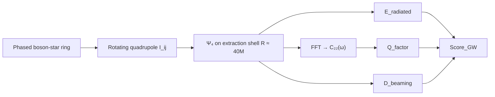

#### 4.2.3 Expected Evolved Species

Under the `gw_generator` scoring profile, MAP-Elites should populate the archive with three distinct species of positive-energy GW generators:

| Species | Discovered configuration | Radiative signature |
|---------|--------------------------|---------------------|
| **A — Monochromatic ring** | Symmetric xy-plane ring, synchronized phase rotation | Clean, continuous, monochromatic GW; zero net orbital translation [2] |
| **B — Gravitational flashlight** | Asymmetric dipole shell; phase difference beams along one axis | Highly directional, narrow-cone GW emission [1, 2] |
| **C — High-order breather** | Single compact star in \(l=4\) hexadecapole mode | High-frequency, high-order radiation without binary separation [2] |

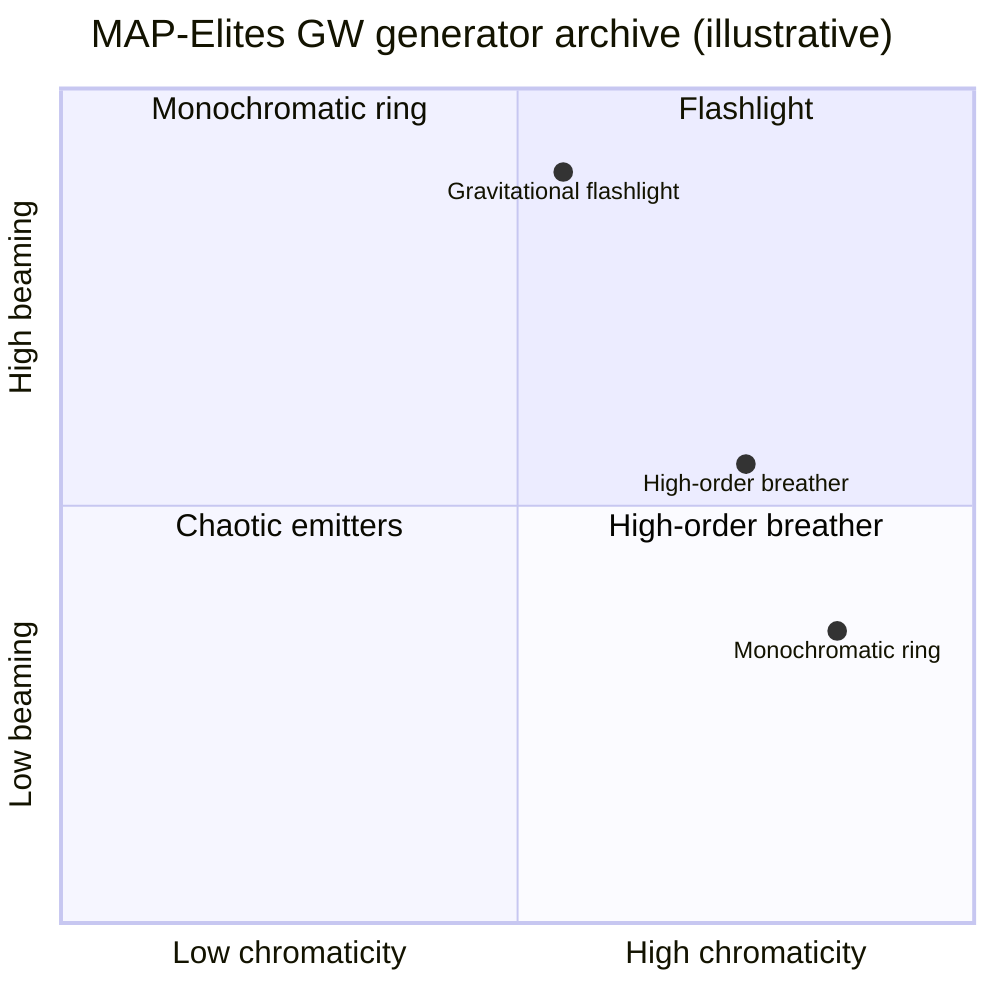

### 4.3 Track 2 — `critical_collapse` (Spacetime Splash)

**Goal:** Boundary between wave-packet bounce and BH formation.

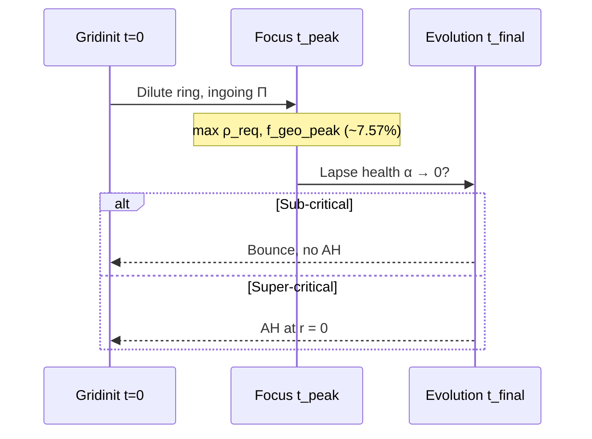

| Metric | Source | Weight | Notes |
|--------|--------|--------|-------|
| `f_geo_peak` | `evolving_geodesic.json` | +1000 | Transient FTL throat mid-run |
| `central_lapse_collapse` | \(\alpha_{\min} = \min_t \alpha(t,\vec{0})\) | +500 | Reward \(\alpha_{\min} \in [0.01, 0.05]\); penalize if \(< 0.01\) (horizon formed) when studying threshold |
| `focusing_efficiency` | \(\mathcal{F} = \max_t \rho(t,\vec{0}) / \rho(0, \vec{x}_{\rm center})\) | +300 | Lens effectiveness |
| `apparent_horizon_formation_time` | AH finder | — | Earlier \(t_{\rm AH}\) when BH formation is desired |

### 4.4 Code Integration Checklist

1. **GRTeclyn output:** `psi4_extraction.dat` — columns `time, re_C22, im_C22`
2. **consume_plotfiles:** Read `psi4_extraction.dat` and `apparent_horizon.dat` on the fly
3. **EpisodeMetrics** — extend dataclass:

```python
@dataclass
class EpisodeMetrics:
    gw_power_total: float = 0.0
    gw_chromaticity: float = 0.0
    gw_beaming_factor: float = 0.0
    central_lapse_collapse: float = 1.0
    focusing_efficiency: float = 1.0
```

4. **objectives.py:** Branch on `objective_mode`:
   - `"gw_generator"` — wave antenna campaign
   - `"critical_collapse"` — splash/collapse campaign

Compatible with MAP-Elites and CMA-ES.

---

## 5. Physical Timeline (What Happens in the Simulation)

Two coupled mechanisms drive generation and concentration: **matter waves** (scalar field) and **induced spacetime waves** (gravitational radiation).

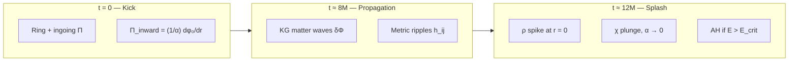

### Step 1 — Initial Kick (Wave-Maker)

Constraint solver (GRTresna) sets a ring of positive-mass lumps **out of equilibrium**:

\[
\Pi_{\rm inward} = \frac{1}{\alpha(x)} \frac{d\phi_0}{dr}
\]

With scalar mass \(m = 0.70\), this plunger forces inward oscillation and propagation toward \(r=0\).

### Step 2 — Matter vs Gravitational Waves

| Channel | Mechanism | Carries |
|---------|-----------|---------|
| **A — Matter** | Klein-Gordon waves \(\delta\Phi\) from inward kick | Mass-energy \(\rho = T_{00}\) |
| **B — Gravity** | Time-varying quadrupole \(I_{ij}\) shakes spacetime | GW ripples \(h_{ij}\); CCZ4/BSSN couples \(T_{\mu\nu}\) to \(K_{ij}, \gamma_{ij}\) |

### Step 3 — Geometric Squeeze

Both wave systems travel inward. Circular symmetry shrinks the wavefront area → amplitudes grow \(\propto 1/r\).

### Step 4 — Central Splash (\(t \approx 8\text{–}12M\))

Symmetric initialization → perfect constructive interference at \(r=0\):

- Scalar amplitude maximum
- \(\rho\) spike
- \(\chi\) plunges, \(\alpha\) collapses, coordinate \(c \to 0\)
- If kick energy exceeds threshold → AH around centralized wave peak

**Summary chain:** Non-equilibrium \(\Pi\) at \(t=0\) → accelerating scalar field generates GWs → both systems geometrically focused by ring symmetry → non-linear curvature peak at \(r=0\).

---

## 6. References

| ID | Topic |
|----|-------|
| [1] | Constructive wave focusing / pool analogy |
| [2] | GRTresna, GRTeclyn, scalar physics, Choptuik collapse, metrics pipeline |
| [3] | CMA-ES optimizer integration |
| [4] | Toroidal ring layout, MAP-Elites campaign configuration, phased-array search parameters |

---

## Appendix: Quick-Start Commands (Phase 1)

| Parameter | Value |
|-----------|-------|
| Layout | `matter_layout = 3` (ring) |
| Matter | `grtresna_exotic_fraction = 0` |
| Scorer | `objective_mode = "critical_collapse"` |
| Primary fitness | \(\max_t \rho_{\rm req}(t, \vec{0})\) |

Run on current 128³ gridinit pipeline — no boson-star compile required for splash and collapse experiments.

### Phase 3 — GW Phased Array (after ComplexScalarField)

| Parameter | Value |
|-----------|-------|
| Layout | `matter_layout = 3` (ring) |
| Search dims | `grtresna_lump_phase_diff`, `grtresna_lump_quadrupole_amp`, `grtresna_lump_orbital_omega` |
| Scorer | `objective_mode = "gw_generator"` |
| Primary fitness | \(\text{Score}_{\rm GW} = w_1 E_{\rm radiated} + w_2 Q_{\rm factor} + w_3 \mathcal{D}_{\rm beaming}\) |

Requires C++ initial-data hooks in GRTresna (`MatterParams.hpp`, `MyMatterFunctions.cpp`) and corresponding entries in `spaces.py`.
