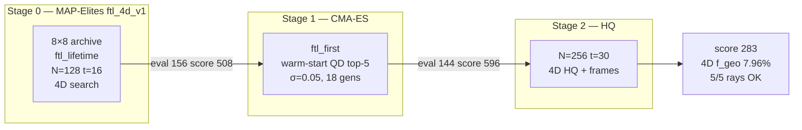

# MAP-Elites + CMA-ES FTL Discovery — Matter-First Metric Discovery

> Three-stage pipeline: **MAP-Elites** (wide survey) finds where good warps live in
> the 23-D shell search space; **CMA-ES** (local refinement) hill-climbs around
> the best *healthy* survivors; **HQ promotion** re-runs the top QD + CMA-ES elites
> at full resolution and extended time with incremental scoring. All stages share
> the same matter-first loop — propose lumps → GRTresna constraint solve → GRTeclyn
> GPU evolution → time-resolved FTL probes → score — but differ in proposer,
> resolution, and stop time.

## Table of contents

**Reference**

- [The idea: matter-first, not metric-first](#the-idea-matter-first-not-metric-first)
- [The pipeline](#the-pipeline)
- [The hard consistency rule](#the-hard-consistency-rule)
- [Behavior descriptors](#behavior-descriptors-the-diversity-axes)
- [Scoring model](#scoring-model-the-quality-axis)
- [Code map](#code-map-where-everything-lives)
- [Building the binaries](#building-the-binaries-grtresna--grteclyn)
- [How to run a campaign](#how-to-run-a-campaign)

**Campaign log** (reverse-chronological)

- [Quick index](#campaign-log--runs-analysis)
- [v21: Multi-slot GPU pipeline](#v21-multi-slot-gpu-pipeline-5-evols-per-gpu-2026-06-17)
- [v20: General FTL discovery](#v20-general-ftl-discovery-wormhole--ring--spin-2026-06-17)
- [v18: 4D QD + CMA-ES + HQ](#v18-4d-qd--cma-es--hq-ftl_4d-line-2026-06-16)
- [4D evolving null-geodesic probe](#4d-evolving-null-geodesic-probe-2026-06-15--2026-06-16)
- [ftl_max_speed_no_penalty_v1](#ftl_max_speed_no_penalty_v1-max-speed-qd-survey-2026-06-15)
- [HQ v16 + v17 + eval 177 physics](#hq-v16--v17--eval-177-physics-2026-06-15)
- [Future directions](#future-directions-persistence-transport-and-the-exotic-energy-frontier-2026-06-15)
- [v17: CMA-ES robust refinement](#v17-cma-es-robust-refinement-after-v16-2026-06-14)
- [v16 + horizon fix](#v16-ftl-champion-retention--horizon-fix-2026-06-13)
- [v15: time-resolved FTL scoring](#v15-time-resolved-intermediate-ftl-scoring-2026-06-13)
- [v14 + Alcubierre control](#v14-launch--results--alcubierre-control-2026-06-12)
- [v13 → v7 compact history](#v13--v7-compact-history-2026-06-11--2026-06-12)
- [Foundational entries (2026-06-10)](#foundational-entries-2026-06-10)

## The idea: matter-first, not metric-first

Classic warp-drive analysis is **metric-first**: write down a target metric
(Alcubierre, Natário, …), then read off the stress-energy `T_ab = G_ab/8π` it
requires — which is always exotic, often pathological, and never solved as a
*consistent initial-value problem*. The "FTL" in those constructions is baked
into the chosen coordinates and need not survive a real evolution.

This project inverts that. The pipeline is **matter-first**:

1. The search proposes a **matter configuration** (massive scalar-field "lumps").
2. GRTresna **solves the Einstein constraint equations** for conformal factor and shift.
3. GRTeclyn **evolves** that spacetime forward on GPU.
4. Probes measure whether an FTL signature emerges and *persists*.
5. MAP-Elites stores the best candidate per behavior cell and mutates elites.

The payoff: any FTL signal that survives this loop is a property of a
**self-consistent, evolved spacetime**, not a hand-picked metric. Metrics are
iteratively hardened so the leaderboard cannot be gamed by coordinate artifacts
(see the [campaign log](#campaign-log--runs-analysis)).

## The pipeline

### Diagram — end-to-end overview

The closed loop: search proposes matter → physics builds and evolves a real
spacetime → metrics discover FTL signatures → archive feeds the next proposal.


### Diagram — matter-first vs metric-first


### Stage 0 — Quality-Diversity proposer (MAP-Elites)

MAP-Elites maintains an 8×8 behavior archive keyed by a 2-D descriptor. Each
batch it either **mutates an existing elite** (boundary-reflected Gaussian
perturbation, σ=0.15, ~85% of draws) or **samples inside the feasible box** of
known elites. Proposals are points in the 23-D `grtresna_shell` search space.

> **QD vs CMA-ES.** QD (`campaigns/qd/run.sh`) illuminates the 8×8 grid.
> CMA-ES (`campaigns/cmaes/run.sh` → `optimize`) hill-climbs from QD survivors.
> Same search space (`search/optimize/spaces.py`); only the proposer differs.
> See [CMA-ES refinement](#cma-es-refinement-after-map-elites).

### Stage 1 — Initial data (GRTresna, CPU/MPI)

`../GRTresna` paints lumps into `(φ, Π)` and runs a Lichnerowicz/York **constraint
solve**. CPU/MPI-bound; poorly-conditioned proposals fail the Ham/Mom gate and are
**rejected before the GPU**.

### Stage 2 — Evolution (GRTeclyn, GPU)

Converged initial data evolves via `RadialRecipe` to `STOP_TIME`, dumping plotfiles
every `PLOT_INTERVAL` steps.

### Stage 3 — Metrics & probes (scoring)

Plotfiles → diagnostics: constraints, `theta_plus`, comoving/shift stats, matter
density, and FTL probes — coordinate (`operational_ftl_solved`), evolved
(`operational_ftl`, `ftl_persistence`), gauge-invariant geodesic shortcut
(`operational_ftl_geodesic`), and (opt-in) **4D evolving** end-to-end null trace
(`ftl_geo_evolving`; authoritative in search when enabled — see
[4D probe](#4d-evolving-null-geodesic-probe-2026-06-15--2026-06-16)).

### Stage 4 — Archive update & feedback

`metrics/score/` collapses diagnostics into `ftl_first` fitness. Only `gpu_ok`
candidates compete for a behavior cell. Rejected GRTresna solves log to
`trajectory.jsonl` but never enter the archive.

## The hard consistency rule

`T_ab` used in the GRTresna **constraint solve** must equal `T_ab` used in the
GRTeclyn **evolution**. Otherwise the run starts off-constraint and any apparent
"FTL" is a constraint-relaxation transient, not physics.

The `grtresna_independent_scalars` matter path exists precisely to keep both
sides identical; any new matter sector must be added to **both** sides with
matching analytic forms. (Root cause: `Examples/RadialRecipe/Debug.md`; see also
[Matter model](#foundational-entries-2026-06-10).)

## Behavior descriptors (the "diversity" axes)

Current descriptor: **`ftl_lifetime`** (`qd_search/descriptors.py`), added in
[v15](#v15-time-resolved-intermediate-ftl-scoring-2026-06-13):

- **x** — peak trustworthy `f_geo`, ramped `(f_geo − 1e-3)/(2e-1 − 1e-3)`.
- **y** — **FTL-lifetime fraction** (share of frames with a live shortcut).

Back-compat: **`speed_super`** (v14 default); `speed_horizon` retired after the
`theta_plus` centering bug (see [Status](#map-elites-ftl-discovery-status)).

## Scoring model (the "quality" axis)

Fitness is `ftl_first` in `metrics/score/` (CMA-ES may use `robust_ftl`; see
[v17](#v17-cma-es-robust-refinement-after-v16-2026-06-14)).

- **Gauge-invariant FTL dominates — time-averaged since v15; 4D since v18.**
  `operational_ftl_geodesic` (×1000) or `ftl_geo_evolving` when 4D runs; gated on
  `h_quality_ok` and ray reach; mean over trustworthy magnitudes × `structural_persistence`.
- **Dynamical signal next.** `operational_ftl` (×400) + `ftl_persistence` (×300) outweigh
  coordinate `operational_ftl_solved` (×50, shaping only).
- **Persistence-honest health.** `survival = numerical_survival × structural_persistence`.
- **Vetoes / penalties.** Horizon (−500 when corroborated, [v16](#v16-ftl-champion-retention--horizon-fix-2026-06-13)),
  exotic, instability, stationary warp-lens artifacts.

Geodesic ramp: `(f_geo − 1e-3)/(2e-1 − 1e-3)` — full marks need ~20% shortcut
([v9 recalibration](#v13--v7-compact-history-2026-06-11--2026-06-12)).

Per-component weight table: `grteclyn-wrapper/src/grteclyn_wrapper/metrics/README.md`.

### Plain-English glossary (compact)

Modes: `weighted` (plain sum) and `ftl_first` (validated FTL dominates).

| FTL signals | Role |
|-------------|------|
| `operational_ftl_geodesic` | Frozen per-frame null-ray shortcut; largest weight when 4D off |
| `ftl_geo_evolving` | 4D end-to-end null trace; authoritative when enabled |
| `operational_ftl`, `ftl_persistence` | Evolved coordinate shortcut + final-frame persistence |
| `operational_ftl_solved`, `ftl_precursor`, `channel_progress`, `shift_drive` | Shaping / t=0 hints; gated |

| Health rewards | Role |
|----------------|------|
| `numerical_survival`, `structural_persistence`, `survival` | Integrator + morphology |
| `stability`, `comoving_stability`, `constraint_health`, `lapse_health` | Geometry / solve quality |
| `energy_condition`, `anec_condition`, `tidal_comfort` | Physical energy rules |
| `curvature_activity`, `nontrivial_geometry`, … | Non-flat geometry rewards |

| Penalties | Role |
|-----------|------|
| `exotic_penalty` | Graded 0..−1.6 for negative-energy matter |
| `horizon_penalty` | −500 veto when lapse-collapsed trapped surface corroborated |
| `instability_penalty`, `qei_penalty`, `boundary_penalty` | Geometry churn / bounds |
| `stationary_artifact_penalty` | Static lens pretending to be FTL |

**Non-triviality gate** — health rewards off for flat vacuum.

## Code map (where everything lives)

| Concern | Path |
|---------|------|
| **MAP-Elites** QD loop, archive, descriptors | `grteclyn-wrapper/src/grteclyn_wrapper/search/qd_search/` |
| **CMA-ES** optimize loop, warm-start | `grteclyn-wrapper/src/grteclyn_wrapper/search/optimize/` |
| Search-space defs (shared QD + CMA-ES) | `search/optimize/spaces.py` |
| FTL champion retention | `search/ftl_retention.py` |
| Scoring (`ftl_first`, `robust_ftl`, `general_ftl`) | `grteclyn-wrapper/src/grteclyn_wrapper/metrics/score/` |
| Metric aggregation | `grteclyn-wrapper/src/grteclyn_wrapper/metrics/aggregation/collector.py` |
| FTL probes | `grteclyn-wrapper/src/grteclyn_wrapper/metrics/probes/ftl/` |
| **4D evolving geodesic** + metric-stack cache | `metrics/probes/ftl/evolving_geodesic.py`, `metric_field.py`, `metric_stack_cache.py` |
| Plotfile → frames + `ftl_timeseries.dat` | `visualisation/process_wave/consume_plotfiles/` |
| **Incremental HQ scoring** | `metrics/aggregation/incremental.py` |
| HQ promotion launcher | `scripts/campaigns/hq/run_batch.sh`, `campaigns/hq/replay_eval.py` |
| Frame → movie stitching | `scripts/plot/make_movies.sh` |
| Matter (evolution) | `Source/Matter/GRTresnaIndependentScalars.{hpp,impl.hpp}`, `Examples/RadialRecipe/` |
| Matter (initial data) | `../GRTresna/Examples/ScalarFieldBH/` |
| Campaign launchers | `scripts/campaigns/qd/run.sh`, `cmaes/run.sh`, `general_ftl/run_all.sh` |

## Building the binaries (GRTresna + GRTeclyn)

**GRTresna** = Chombo + conda-OpenMPI (CPU/MPI). **GRTeclyn** = AMReX + CUDA (GPU).

### One env to set first (every shell)

```bash
export GRTRESNA_ENV=/home/jovyan/.mlspace/envs/grtresna
export SIM_ROOT=/home/jovyan/nachevsky/test/simulation
export CHOMBO_HOME="${SIM_ROOT}/Chombo/lib"
export CONDA_PREFIX="${GRTRESNA_ENV}"
export PATH="${GRTRESNA_ENV}/bin:${PATH}"
export LD_LIBRARY_PATH="${GRTRESNA_ENV}/lib:${LD_LIBRARY_PATH:-}"
```

Shortcut: `source grteclyn-wrapper/scripts/lib/env.sh`. Full recipe:
`grteclyn-wrapper/src/grteclyn_wrapper/README.md`.

### Build GRTresna (initial-data solver, MPI)

```bash
cd "${SIM_ROOT}/GRTresna/Examples/ScalarFieldBH"
PATH="${GRTRESNA_ENV}/bin:${PATH}" CONDA_PREFIX="${GRTRESNA_ENV}" \
  make all -j4 CHOMBO_HOME="${CHOMBO_HOME}" MPI=TRUE
# -> Main_ScalarFieldBH3d.Linux.64.mpicxx.gfortran.OPTHIGH.MPI.ex
```

First time: `cd "${CHOMBO_HOME}" && make lib -j"$(nproc)"`. Header-only edits need force-relink.

### Build GRTeclyn (evolution, GPU)

```bash
cd "${SIM_ROOT}/GRTeclyn/Examples/RadialRecipe"
make COMP=gnu USE_CUDA=TRUE USE_MPI=FALSE CUDA_ARCH=90 -j"$(nproc)"   # H100
make COMP=gnu USE_CUDA=TRUE USE_MPI=TRUE  CUDA_ARCH=90 -j"$(nproc)"   # MPI+CUDA
```

`CUDA_ARCH`: `90` = H100, `80` = A100, `70` = V100.

### Common failures → fixes

| Symptom | Fix |
|---------|-----|
| `mpicxx` / `gfortran` not found | `export PATH="${GRTRESNA_ENV}/bin:${PATH}"` |
| `cannot find -lhdf5` | `export CONDA_PREFIX="${GRTRESNA_ENV}"` before `make` |
| `libmpi.so` / `libhdf5.so` missing at runtime | `export LD_LIBRARY_PATH="${GRTRESNA_ENV}/lib:..."` |
| `CHOMBO_HOME` undefined | `export CHOMBO_HOME="${SIM_ROOT}/Chombo/lib"` |
| Header edit "did nothing" | force-relink |
| `/bin/csh: No such file` | point Chombo at conda `tcsh` (README step 6) |

## How to run a campaign

### MAP-Elites (QD)

```bash
cd grteclyn-wrapper
QD_NAME=ftl_discovery_vN QD_ITERATIONS=10 BINS=8 STOP_TIME=16.0 \
  GPU_IDS="0 1 2 3 4 5 6 7" RANKS=8 LUMPS=5 SHELL_PROFILE=compact \
  GRTRESNA_MAX_HAM_PCT=5.0 GRTRESNA_MAX_MOM_PCT=5.0 \
  nohup bash scripts/campaigns/qd/run.sh \
  > ../runs/qd_ftl_discovery_vN.launch.log 2>&1 &
```

Results: `runs/grtresna_qd/<name>/` (`trajectory.jsonl`, `archive.json`, `eval_*/`).

**Monitor:** `tail -f runs/grtresna_qd/<name>/trajectory.jsonl`;
`cat runs/grtresna_qd/<name>/ftl_champions.json`.

### CMA-ES refinement after MAP-Elites

| Line | QD source | Objective | Warm-start | Doc |
|------|-----------|-----------|------------|-----|
| **v20** | `general_ftl_{wormhole,ring,spin}` | **`general_ftl`** | Ring eval **43** (TBD) | [v20](#v20-general-ftl-discovery-wormhole--ring--spin-2026-06-17) |
| **v18 / ftl_4d** | `ftl_4d_v1` | **`ftl_first`** | QD **156** → CMA-ES **144** | [v18](#v18-4d-qd--cma-es--hq-ftl_4d-line-2026-06-16) |
| **v17** | `ftl_discovery_v16` | `robust_ftl` | eval **739** (not king 233) | [v17](#v17-cma-es-robust-refinement-after-v16-2026-06-14) |

**Rule:** CMA-ES must match QD `OBJECTIVE_MODE`, grid, stop time, and 4D profile
(`campaigns/lib/search_common.sh`). Do **not** switch objectives on a warm-started trajectory.

```bash
cd grteclyn-wrapper
RUN_NAME=<run> \
WARM_START_TRAJECTORY="${GRTECLYN_ROOT}/runs/grtresna_qd/<qd>/trajectory.jsonl" \
WARM_START_TOP_K=5 WARM_START_JITTER=0.03 SIGMA0=0.05 MAX_GENERATIONS=18 \
GPU_IDS="0 1 2 3 4 5 6 7" \
  bash scripts/campaigns/cmaes/run.sh
```

Legacy v17 (`robust_ftl`, `ftl_cmaes_v17_robust`): see [v17](#v17-cma-es-robust-refinement-after-v16-2026-06-14).

### HQ promotion (full resolution)

QD/CMA-ES at **N=128, L=64, ml=2, t=16** → HQ at **N=256, L=128, ml=3, t=30** with fresh
GRTresna solve, frames, and incremental `score_timeseries.jsonl`.

```bash
cd grteclyn-wrapper
SOURCE_RUN="${GRTECLYN_ROOT}/runs/grtresna_cmaes/<cmaes_run>" \
CANDIDATES="<eval_ids>" NAME_PREFIX=<prefix> FORCE=1 \
  bash scripts/campaigns/hq/run_batch.sh
```

| Knob | Search | HQ |
|------|--------|-----|
| Grid | 128³, L=64, ml=2 | **256³, L=128, ml=3** |
| Stop time | 16 | **30** |
| 4D mode | `search` (cheap) | `hq` (full stack) |
| Objective | campaign-specific | usually `ftl_first` |

**Incremental scoring:** when `--evolving-geodesic` is on, only `ftl_geo_evolving` earns
geodesic FTL credit until the end-of-run 4D trace completes — mid-run totals are not comparable
to search finals. See [v18 HQ](#stage-2--hq-promotion-eval_000144--verified-4d-shortcut-done).

```bash
tail -f runs/grtresna_promote/*/small_data/score_timeseries.jsonl
bash scripts/plot/make_movies.sh runs/grtresna_promote/* --framerate 10
```

Concrete candidate lists and results → [campaign log](#campaign-log--runs-analysis).

---

## Campaign log / runs analysis

Reverse-chronological journal. Quick index:

| Campaign / section | Date | Headline |
|--------------------|------|----------|
| [**v21: Multi-slot GPU pipeline**](#v21-multi-slot-gpu-pipeline-5-evols-per-gpu-2026-06-17) | **06-17 running** | **Pipelined MAP-Elites** with `GpuPool` + `EvalPipeline`. **5 concurrent GPU evolutions per H100** (`gpu_slots_per_device=5`). Wormhole-only stage-0 relaunch. VRAM benchmark: ~8.7 GB/eval @ t=4; ~44 GB peak solo @ t=16. |
| [**v20: General FTL discovery**](#v20-general-ftl-discovery-wormhole--ring--spin-2026-06-17) | **06-17 stopped early** | **3 parallel QD** (`general_ftl_{wormhole,ring,spin}`). **Ring wins:** eval **43** score **196**, search 4D `f_geo` **~3.9%** (`h_quality_ok`, `best_direction=z`). Spin: **8** 4D hits. Wormhole: **0** 4D hits. **172/248** logged; **top-3 eval dirs retained** per class. |
| [**v18: 4D QD + CMA-ES + HQ**](#v18-4d-qd--cma-es--hq-ftl_4d-line-2026-06-16) | **06-16 → 06-17** | **Done.** QD **156** → CMA-ES **144** (**596**) → HQ **144**: **verified 4D `f_geo` ≈ 8%** (5/5 rays, `h_quality_ok`); frozen peak **11.5%** collapses by t=30; final score **283** |
| [**4D evolving geodesic probe**](#4d-evolving-null-geodesic-probe-2026-06-15--2026-06-16) | **06-15 → 06-16** | Smoke eval **086**: 4D **1.42%** vs frozen **5.75%**. HQ t=30 eval **086**: 4D **0%** (negative control). Search-loop integration → **`ftl_4d_v1`** |
| [**ftl_max_speed_no_penalty_v1**](#ftl_max_speed_no_penalty_v1-max-speed-qd-survey-2026-06-15) | **06-15 done** | **200 evals**, 100 gpu_ok. Max speed **1.58 c** (eval 70); best score **eval 86** (+27.5); best geodesic **eval 92** (27.5% timeavg). Plateau; scores not comparable to v16 |
| [**HQ v16 + v17 + eval 177**](#hq-v16--v17--eval-177-physics-2026-06-15) | **06-15 done** | 4/4 HQ complete. **Incr. peak eval 233 score 749** @ t≈12; only **eval 177** finishes positive (+67). Horizon kills 3/4 by t=30. Exotic **~5–24× < Alcubierre** |
| [**Future directions**](#future-directions-persistence-transport-and-the-exotic-energy-frontier-2026-06-15) | 06-15 | Persistence/transport reframe; exotic-energy Pareto; boson-star matter; CMA-ME; 4D verification ladder |
| [**v17: CMA-ES**](#v17-cma-es-robust-refinement-after-v16-2026-06-14) | 06-14 → **06-15 done** | **200 evals.** Winner eval **177**: f_geo **5.65%**, timeavg **16.3%**, exotic **−1.17** |
| [**v16 + horizon fix**](#v16-ftl-champion-retention--horizon-fix-2026-06-13) | 06-13 | FTL hall of fame (`ftl_retention.jsonl`). Horizon penalty needs lapse corroboration. ~971 evals |
| [**v15: time-resolved FTL**](#v15-time-resolved-intermediate-ftl-scoring-2026-06-13) | 06-13 | Per-frame `ftl_timeseries.dat`; time-averaged geodesic; `ftl_lifetime` axis. Eval 231 peak **7.43%** @ t=9.6 |
| [**v14 + Alcubierre**](#v14-launch--results--alcubierre-control-2026-06-12) | 06-12 | 504 evals, 351 gpu_ok. Top eval **231** f_geo=**5.30%**. Alcubierre probes validated (~32%) |
| [**v13 → v7 history**](#v13--v7-compact-history-2026-06-11--2026-06-12) | 06-10 → 06-12 | λφ⁴, layouts, geodesic fixes, HQ rejection filter, scoring hardening |
| [**Foundational (06-10)**](#foundational-entries-2026-06-10) | 06-10 | Matter model, navigation overhaul, status reset |

---

## v21: Multi-slot GPU pipeline (5 evols per GPU) (2026-06-17)

**Status:** **running** — wormhole-only MAP-Elites relaunch to validate the pipelined
evaluator (`search/gpu_pool.py`, `search/eval_pipeline.py`) under production grid/time.

**Purpose.** v20 QD held **one GPU evolution per device**; GRTresna CPU solves and GPU
`main3d` sessions were effectively serialized per GPU. **v21** enables **N concurrent
GPU leases per device** so multiple candidates can evolve on the same H100 while others
are still in the GRTresna CPU phase.

### Architecture

| Component | Role |
|-----------|------|
| `GpuPool` | `total_slots = len(gpu_ids) × gpu_slots_per_device`; blocking lease before GPU phase |
| `EvalPipeline` | Cross-batch queue; CPU admission + GPU backpressure; resume-safe |
| `evaluate_overrides` | Split `_run_cpu_grtresna_gates()` → `_run_gpu_session()` |
| QD driver | Pipelined MAP-Elites (`use_pipeline=True` default) |

CLI: `--gpu-ids`, `--gpu-slots-per-device`, `--cluster-cpu-fraction`, `--pipeline-cpu-share`.

### VRAM sizing (eval_000005 gridinit replays, H100 80 GB)

Duplicate-replay benchmark (`scripts/benchmarks/gpu_gridinit_load.sh`) using the real
128³ GRTresna `initial_data.gridinit` from a `gpu_ok` wormhole eval — **not** bare
`sweep` with recipe defaults (~5 GB underestimate).

| Concurrent `main3d` | `stop_time` | Peak VRAM | Notes |
|--------------------|-------------|-----------|-------|
| 1 | 4 | ~9.7 GB | matches QD `evaluate` path |
| 2 | 4 | ~17.4 GB | ~8.7 GB/eval, linear |
| 3 | 4 | ~25.5 GB | linear |
| 4 | 4 | ~43 GB | ~9.3 min wall for batch of 4 |
| 5 | 4 | ~52 GB | fits 80 GB; **5 slots viable at short t** |
| 1 | **16** | **~44 GB** | AMR growth over long evolution; **not** ~9 GB |

**Rule of thumb:** VRAM scales ~linearly with concurrent evolutions at a fixed `stop_time`,
but **per-eval footprint grows strongly with `stop_time`** (AMR refinement). Production
QD uses `stop_time=16` → expect **1–2** concurrent long evolutions per 80 GB GPU unless
benchmarked on your grid. **v21 launch uses 5 slots** as a throughput experiment; monitor
`runs/_logs/*.pipeline_monitor.csv` and `nvidia-smi` for OOM.

### Launch (wormhole, 8×GPU × 5 slots = 40 GPU leases)

```bash
cd grteclyn-wrapper
BRANCH=wormhole PIPELINE_MONITOR=1 \
  QD_NAME=general_ftl_wormhole_v21 \
  QD_TARGET_EVALS=80 \
  GPU_IDS="0 1 2 3 4 5 6 7" \
  GPU_SLOTS_PER_DEVICE=5 \
  BATCH_SIZE=40 \
  QD_ITERATIONS=30 \
  SKIP_QD_PREFLIGHT_TESTS=1 \
  bash scripts/campaigns/general_ftl/run_all.sh \
  > ../runs/_logs/general_ftl_wormhole_v21.launch.log 2>&1 &
```

Single-GPU smoke (5 slots, short time):

```bash
BRANCH=wormhole PIPELINE_MONITOR=1 \
  QD_TARGET_EVALS=10 GPU_IDS="0" GPU_SLOTS_PER_DEVICE=5 BATCH_SIZE=5 \
  STOP_TIME=4.0 PLOT_INTERVAL=40 QD_ITERATIONS=3 SKIP_QD_PREFLIGHT_TESTS=1 \
  bash scripts/campaigns/general_ftl/run_all.sh
```

**Monitor:**

```bash
tail -f runs/_logs/general_ftl_wormhole_v21.launch.log
tail -f runs/grtresna_qd/general_ftl_wormhole_v21/trajectory.jsonl
watch -n5 'nvidia-smi --query-gpu=index,memory.used,utilization.gpu --format=csv'
```

**Outputs:** `runs/grtresna_qd/general_ftl_wormhole_v21/` — same as v20 wormhole pins
(`general_ftl` objective, `ftl_lifetime` descriptors, `GRTECLYN_GEO_DIRECTIONS=x y z`).

### v21 vs v20

| | v20 | **v21** |
|---|-----|---------|
| GPU tenancy | 1 evol / GPU | **5 evol / GPU** (`gpu_slots_per_device=5`) |
| Evaluator | batch barrier | **pipelined** CPU→GPU |
| Campaign | 3-class parallel | **wormhole-only** pipeline validation |
| Batch size | `#GPUs` | **`#GPUs × slots`** (40 on 8×H100) |

---

## v20: General FTL discovery (wormhole / ring / spin) (2026-06-17)

**Status:** **stopped early** (user halt; did not reach 30-iteration budget). Stage 0 only —
three parallel MAP-Elites surveys. **Ring** produced strong 4D elites; **spin** modest 4D signal;
**wormhole** scored on health but **no** `ftl_geo_evolving` hits. Disk pruned to **top-3 `gpu_ok`
eval dirs** per class (~**5.4 GB**). CMA-ES / HQ **not run**.

**Purpose.** [v18](#v18-4d-qd--cma-es--hq-ftl_4d-line-2026-06-16) proved ~8% 4D shortcuts on a
**translating warp bubble** (`β ≠ 0`). **v20 pivots** to stationary FTL geometries (wormholes,
toroidal waveguides, frame-dragging conduits):

1. Score only gauge-invariant null shortcut + persistence/health — **not** `shift_drive` /
   `channel_progress` (`general_ftl` objective).
2. **`--pin-dimension`** locks matter topology per campaign.
3. **`GRTECLYN_GEO_DIRECTIONS=x y z`** on end-of-run 4D trace.

### What changed (code + campaign)

| Mod | Component | Effect |
|-----|-----------|--------|
| **1** | `--pin-dimension` (`parser.py`, `grtresna_context.py`, `qd/run.sh`) | Remove pinned dims from optimizer; force via `base_overrides` |
| **2** | `general_ftl` objective (`objectives.py`) | ×1000 geodesic; zero warp-motor shaping terms |
| **3** | Multi-direction 4D probe (`evolving_geodesic.py`) | `GRTECLYN_GEO_DIRECTIONS=x y z` on final trace only |
| **4** | `scripts/campaigns/general_ftl/run_all.sh` | Three parallel QD campaigns |

Tests: **65/65** pass before launch (`test_general_ftl_objective.py`, pin-dimension, multi-axis Alcubierre).

### Campaign matrix

| Campaign | Run dir | GPUs | Pins | Free levers | Dims | Target evals |
|----------|---------|------|------|-------------|------|--------------|
| **wormhole** | `runs/grtresna_qd/general_ftl_wormhole/` | 0–2 | layout **2**, axis **+x**, `shell_static=1`, v/ω=0 | amp, width, radius, thickness, mass, λ, exotic, multipoles, profile, mode, jitter | **15** | **93** |
| **ring** | `runs/grtresna_qd/general_ftl_ring/` | 3–5 | layout **3**, `shell_static=1`, v/ω=0 | same + **axis θ, φ** | **17** | **93** |
| **spin** | `runs/grtresna_qd/general_ftl_spin/` | 6–7 | layout **0**, `shell_static=0`, v=0, `shift_seed=0` | **`shell_omega`**, mode, exotic, geometry | **17** | **62** |

**Matter classes (one line each):**

| Class | Shape | Motion | Target |
|-------|-------|--------|--------|
| **Wormhole** | Two clumps on +x axis | Static | Throat / bridge |
| **Ring** | Circle of lumps (orientation free) | Static | Toroidal shortcut — **best class** |
| **Spin** | Sphere of lumps | **Spin allowed** (`shell_omega`) | Frame-dragging conduit |

Shared: `OBJECTIVE_MODE=general_ftl`, `DESCRIPTOR_MODE=ftl_lifetime`,
`GRTECLYN_EVOLVING_GEODESIC=1`, mode `search`, `GRTECLYN_GEO_DIRECTIONS=x y z`,
`GRTECLYN_FRAMES=0`, grid 128³ L=64 ml=2 t=16.

### Launch (2026-06-17)

```bash
cd grteclyn-wrapper
MODE=par QD_ITERATIONS=30 \
  bash scripts/campaigns/general_ftl/run_all.sh \
  > ../runs/_logs/general_ftl_par.launch.log 2>&1 &
```

### Results (stopped early)

| Campaign | Logged / target | `gpu_ok` | Reject rate | 4D hits |
|----------|-----------------|----------|-------------|---------|
| **wormhole** | 57 / 90 | 37 | 35% | **0** |
| **ring** | 63 / 90 | 49 | 22% | **20** |
| **spin** | 52 / 60 | 44 | 15% | **8** |

**Total:** 172 logged, **130** `gpu_ok` (target 248).

**Top-3 elites (retained on disk):**

| Rank | Wormhole | Ring | Spin |
|------|----------|------|------|
| **1** | eval **31**, **+36.6**, `f_geo_evolving=0` | eval **43**, **+195.7**, `f_geo_evolving=0.193`, search `f_geo≈3.9%`, `best_direction=z` | eval **49**, **+28.8**, `f_geo_evolving=0.040` |
| **2** | eval **23**, **+21.4** | eval **46**, **+98.8** | eval **52**, **+16.9** |
| **3** | eval **33**, **+16.1** | eval **18**, **+97.3** | eval **39**, **+14.0** |

**Minimum bar met:** ring eval **43** has `ftl_geo_evolving > 0.01` + `h_quality_ok`; wormhole
inconclusive (health-dominated scores, no geodesic term).

**Disk:** ~85 GB freed; kept `eval_*` dirs above + `trajectory.jsonl`, `metadata.json`,
`archive.json`, `ftl_champions.json`, `ftl_retention.jsonl`.

**Framed replays (post-stop):**

```bash
cd grteclyn-wrapper
bash scripts/campaigns/general_ftl/replay_top_frames.sh
```

| Class | Source | Framed dir | Score | PNG frames |
|-------|--------|------------|-------|------------|
| wormhole | `eval_000031` | `eval_000031_frames/` | +36.6 | 105 |
| ring | `eval_000043` | `eval_000043_frames/` | +195.7 | 105 |
| spin | `eval_000049` | `eval_000049_frames/` | +28.8 | 105 |

**Planned follow-up:** per-class CMA-ES (`OBJECTIVE_MODE=general_ftl`, same pins); HQ of ring
eval **43** with `GRTECLYN_EVOLVING_GEODESIC_MODE=hq`.

### v20 vs v18

| | v18 (`ftl_4d`) | **v20 (`general_ftl`)** |
|--|----------------|-------------------------|
| Goal | Best FTL regardless of class | Best FTL **within** wormhole / ring / spin |
| Objective | `ftl_first` (warp shaping ON) | **`general_ftl`** (gauge-invariant only) |
| Search space | Full 23-D | **15–17 D** (topology pinned) |
| 4D probe dirs | +x only | **x, y, z** |
| Reference result | eval **144**: HQ 4D **~8%** | ring eval **43**: search **~3.9%**, score **196** (*HQ TBD*) |

---

## v18: 4D QD + CMA-ES + HQ (ftl_4d line) (2026-06-16)

**Context.** First **end-to-end production pipeline** with **4D evolving null-geodesic**
scoring in the search loop, same objective through QD and CMA-ES, and **HQ falsification passed**
(2026-06-17): verified **~8% null-geodesic shortcut** at N=256, t=30. Supersedes frozen-geodesic
[v17](#v17-cma-es-robust-refinement-after-v16-2026-06-14).



| Stage | Run dir | Resolution | t | Objective | 4D mode | Status |
|-------|---------|------------|---|-----------|---------|--------|
| MAP-Elites | `runs/grtresna_qd/ftl_4d/ftl_4d_v1/` | 128³, L=64, ml=2 | 16 | `ftl_first` | **search** | **done** (192 evals) |
| CMA-ES | `runs/grtresna_cmaes/ftl_4d_cmaes_v1/` | 128³, L=64, ml=2 | 16 | `ftl_first` | **search** | **done** (144 evals) |
| HQ | `runs/grtresna_promote/l128n256t30_ftl_4d_cmaes_qd_eval000144/` | **256³, L=128, ml=3** | **30** | `ftl_first` | **hq** | **done** (2026-06-17) |

### Stage 0 — MAP-Elites QD (`ftl_4d_v1`)

```bash
cd grteclyn-wrapper
RUNS_DIR="${GRTECLYN_ROOT}/runs/grtresna_qd/ftl_4d" \
QD_NAME=ftl_4d_v1 QD_TARGET_EVALS=200 BATCH_SIZE=8 GPU_IDS="0 1 2 3 4 5 6 7" \
  bash scripts/campaigns/qd/run.sh
```

**Result:** **192** records (**105** `gpu_ok`). Archive saturated late; large final jump at eval **156**.

| Leaderboard | Eval | Score | `ftl_geo_evolving` | Cell |
|-------------|------|-------|---------------------|------|
| Best | **156** | **508.5** | **0.346** | [2,7] |
| #2 | 142 | 382.6 | 0.275 | [2,7] |
| #3 | 145 | 368.6 | 0.287 | [2,7] |

Saturation plot: `visualisation/plots/qd_batch_progress_ftl_4d_v1.png`

### Stage 1 — CMA-ES refinement (`ftl_4d_cmaes_v1`)

```bash
RUN_NAME=ftl_4d_cmaes_v1 \
WARM_START_TRAJECTORY="${GRTECLYN_ROOT}/runs/grtresna_qd/ftl_4d/ftl_4d_v1/trajectory.jsonl" \
WARM_START_TOP_K=5 WARM_START_JITTER=0.03 SIGMA0=0.05 MAX_GENERATIONS=18 \
RANDOM_INJECTION_FRACTION=0.05 EXOTIC_INJECTION_FRACTION=0.0 GPU_IDS="0 1 2 3 4 5 6 7" \
  bash scripts/campaigns/cmaes/run.sh
```

**Result:** **144/144** evals (**140** `gpu_ok`). Monotonic improvement — phase 2 not needed.

| | QD best (156) | **CMA-ES winner (144)** | Δ |
|--|---------------|-------------------------|---|
| Score | 508.5 | **596.3** | **+87.8 (+17%)** |
| `ftl_geo_evolving` | 0.346 | **0.395** | +14% |
| `exotic_penalty` | −1.6 | −1.6 | same |

### CMA-ES knobs (planning record, 2026-06-16)

Executed as stage 1 above. Rationale for tight local search around eval **156**:

| Knob | Value | Rationale |
|------|-------|-----------|
| `OBJECTIVE_MODE` | **`ftl_first`** | Must match QD; never `robust_ftl` |
| `WARM_START_TOP_K` | **5** | Ranks 6–8 far weaker (202 vs 508) |
| `WARM_START_JITTER` | **0.03** | QD already explored basin |
| `SIGMA0` | **0.05** | Local refinement, not re-discovery |
| `MAX_GENERATIONS` | **18** | ~144 evals; extend only if improving |
| `EXOTIC_INJECTION_FRACTION` | **0** | Elites already exotic-heavy |

**Do not:** `robust_ftl` on this trajectory; `SIGMA0=0.15` (leaves basin); expect +140 jumps.

HQ promoted in parallel with CMA-ES winner (not QD 156 alone).

### Genome — eval **144** (CMA-ES winner / HQ promote)

| Property | Value |
|----------|-------|
| **Lumps** | **5** (fixed knob `LUMPS=5`, not evolved) |
| **Ansatz** | Full-sphere shell, layout ≈ 2.77 |
| **Dynamics** | **Moving** (`shell_static ≈ 0`); tor/pol/rad currents + **ω ≈ 0.39** |
| **Shift seed** | **−0.44** (warp motor) |
| **Exotic** | **~91%** exotic shell |
| **Max coordinate speed** | **~1.27 c** @ t=16 |
| **4D null shortcut (search)** | **`f_geo_evol ≈ 0.08`** |
| **Frozen geodesic (HQ)** | **11.5%** peak @ t≈5.8 → **0%** @ t=30 (not credited) |

FTL claim rests on **4D end-to-end null geodesics**, not frozen mid-run snapshots.

### Stage 2 — HQ promotion (`eval_000144`) — verified 4D shortcut (done)

**Verdict.** Real gauge-invariant shortcut at full resolution and **t=30**.

| Probe | CMA-ES search (N=128, t=16) | **HQ (N=256, t=30)** |
|-------|------------------------------|----------------------|
| **4D `f_geo`** | **0.0797** | **0.0796** |
| Rays reached | **3/3** | **5/5** |
| `h_quality_ok` | true | true (`max_h_rel_drift ≈ 0.0008`) |
| `t_arrival` / `t_flat` | 13.25 / 14.4 | 13.25 / 14.4 |
| Frozen `f_geo` peak | — | **11.5%** @ t≈5.76 → **0%** @ t=30 |
| **`score.json` total** | **596.3** | **282.6** |
| `ftl_geo_evolving` (scored) | 0.395 | **0.249** (`structural_persistence` **0.63**) |

HQ reproduces search 4D value to ~0.1% on harder bill (fresh solve, 2× grid/time, 5 rays,
124-slice metric stack). **Contrast eval 086:** frozen peak did not survive integration (4D → 0);
eval **144** is the positive control.

**Score gap (596 → 283):** `structural_persistence` 0.63, `instability_penalty` −0.96,
`exotic_penalty` −1.6; incremental mid-run peak ~83 @ t≈2.9 is 4D-gated (not comparable).

**Launch (2026-06-17):** first attempt aborted @ t≈10.7 (pre-fix incremental scoring); restarted
with 4D-authoritative gating (`evolving_geodesic_mode` in `metrics/score/ftl.py`).

```bash
SOURCE_RUN="${GRTECLYN_ROOT}/runs/grtresna_cmaes/ftl_4d_cmaes_v1" \
CANDIDATES="144 0" NAME_PREFIX=ftl_4d_cmaes FORCE=1 \
  bash scripts/campaigns/hq/run_batch.sh
```

**Key artifacts:** `small_data/evolving_geodesic.json` (`f_geo=0.0796`, 5/5 rays);
`score.json` **282.6**; `ftl_timeseries.dat` (frozen diagnostic); `frames/scalar_activity_z/`.

Paper draft: `researchnew.tex` (eval **144**).

### v18 vs v17

| | v17 | **v18** |
|--|-----|---------|
| QD objective | frozen geodesic | `ftl_first` + **4D search** |
| CMA-ES objective | `robust_ftl` | **`ftl_first`** |
| CMA-ES gain | +32 pts vs seed 739 | **+88 pts** vs QD 156 |
| HQ headline | eval 177 (+67 @ t=30) | eval **144**: 4D **7.96%**, score **283** |
| Headline metric | frozen timeavg | **`ftl_geo_evolving`** |

---

## 4D evolving null-geodesic probe (2026-06-15 — 2026-06-16)

**Context.** Since v8, gauge-invariant FTL used **frozen-snapshot** null-ray tracing per plotfile
time `t`. Dynamic lumps evolve on ~10M vs ~16M light-crossing — frozen probe answers *"if I froze
spacetime at t, what shortcut?"* not *"what does a ray experience through the history?"*

**New probe:** opt-in end-of-run integration through time-interpolated 4-metric stack
(`EvolvingMetricField` in `metric_field.py`):

1. **During consume:** plotfiles → `small_data/metric_stack/*.npz` before HDF5 delete.
2. **At episode end:** linear interp in time, integrate null rays with `t_emit = times[0]`.
3. **Outputs:** `evolving_geodesic.json`; `ftl_geo_evolving` headline when 4D runs.

### Smoke (2026-06-15)

| | |
|--|--|
| **Run** | `runs/grtresna_promote/l128n256t8_evol_cache_smoke_qd_eval000086` |
| **Source** | QD [eval 086](#ftl_max_speed_no_penalty_v1-max-speed-qd-survey-2026-06-15) |
| **Grid / time** | L=128, N=256, ml=3, **t=8** |
| **Metric stack** | **34** cached slices |

```bash
GRIDINIT=runs/grtresna_promote/l128n256t30_ftl_max_speed_qd_eval000086/initial_data.gridinit \
QD_RUN=runs/grtresna_qd/ftl_max_speed/ftl_max_speed_no_penalty_v1 \
STOP_TIME=8 N_FULL=256 L_FULL=128 NAME_PREFIX=evol_cache_smoke \
CANDIDATES="086 0" FORCE=1 GRTECLYN_FRAMES=0 \
bash scripts/campaigns/hq/run_batch.sh
```

### Frozen vs 4D — comparison table

| Probe | eval 086 smoke (t=8) | eval 086 HQ (t=30) | eval 144 HQ (t=30) |
|-------|----------------------|--------------------|--------------------|
| **Frozen peak** | **5.75%** @ t≈4.08 | **5.75%** @ t≈4.08 | **11.5%** @ t≈5.8 |
| **4D `f_geo`** | **1.42%** (5/5, `h_quality_ok`) | **0.0** (0/5, `h_quality_ok=false`) | **7.96%** (5/5, `h_quality_ok`) |
| **Ratio evolving/frozen** | **≈0.25×** (~4× smaller) | **0** (honest falsification) | **~0.69×** (frozen overstates) |
| **Readout** | Frozen optimistic for dynamic lumps | Transient warp, no end-to-end transport | **Verified shortcut** |

**Implementation bugs fixed in smoke:** `Path` import in `worker.py` (`700d958`); `numpy.bool_`
JSON serialization in `evolving_geodesic.json` (`_json_safe()`).

### HQ falsification eval 086 (2026-06-16)

Run: `runs/grtresna_promote/l128n256t30_ftl_max_speed_4d_qd_eval000086` — fresh GRTresna + GPU
to **t=30**, **124** metric slices, **126** frames. Bubble rises t≈1.9, peaks t≈4–8, dissipates
by t=30. **4D `f_geo=0`**, `h_rel=3.72` — frozen peak **not realized end-to-end**. Score **−492.6**
(horizon + exotic + instability). **Negative control** validating 4D tracer design.

Finalization cost ~14 min (frozen-peak scan × 124 slices) — cap slice count before enabling
4D weight in tight search loops.

### Search-loop integration (2026-06-16)

| Layer | Change |
|-------|--------|
| **QD** | `GRTECLYN_EVOLVING_GEODESIC=1` in `campaigns/qd/run.sh` |
| **Fast profile** | `MODE=search`: stride 2, max 40 slices, 33³ cache, 3 rays, 15k step cap |
| **HQ verify** | `MODE=hq`: full stack, frozen peak, 65³, 5 rays |
| **Scoring** | `ftl_geo_evolving` headline; frozen timeavg zeroed when 4D runs |
| **Fallback** | No 4D when FTL gate skips → frozen timeavg still applies |

Code: `evolving_geodesic_options.py`, `ftl.py`. Pilot → **`ftl_4d_v1`** (~190 evals) → [v18](#v18-4d-qd--cma-es--hq-ftl_4d-line-2026-06-16).

---

## ftl_max_speed_no_penalty_v1: max-speed QD survey (2026-06-15)

**Context.** Side survey after v16/v17: stress-test **max superluminal coordinate speed** with
`exotic_penalty=0`, `horizon_penalty=0`, descriptor **`speed_super`**, objective **`weighted`**.

Run: `runs/grtresna_qd/ftl_max_speed/ftl_max_speed_no_penalty_v1`. Grid N=128, ml=1, t=16.
**200/200** evals, **100 gpu_ok**, archive **26/64 cells**. Scores **not comparable** to v16.

| Leaderboard | Eval | Value | Notes |
|-------------|------|-------|-------|
| Best score | **86** | **+27.5** | f_geo timeavg 3.6% |
| Best geodesic | **92** | **27.5%** timeavg | FTL retention champion |
| Max `max_local_speed` | **70** | **1.577 c** | score −1.7 |
| Best mid-run speed | **149** | **1.370 c** @ t≈9.6 | f_geo = 0 throughout |

**Eval 92** (sustained geodesic): f_geo 4.5%→8.2%→7.4%→3.6% over t=0–16; `ftl_lifetime=100%`.

**Eval 149** (coordinate only): max_c 1.37 @ t=9.6, f_geo=0 all frames.

**Takeaway:** Penalty-free QD finds higher coordinate speeds (to 1.58 c) and one strong geodesic
(eval 92), but plateaued early. HQ + 4D on eval 086/092 → [4D probe](#4d-evolving-null-geodesic-probe-2026-06-15--2026-06-16).

---

## HQ v16 + v17 + eval 177 physics (2026-06-15)

**Context.** First HQ batch since v9 with working geodesics and time-averaged scoring. Promotes
v16 QD top 3 + CMA-ES v17 winner **eval 177** at N=256, t=30 with incremental scoring.

**HQ configuration**

| Knob | QD / CMA-ES | HQ |
|------|-------------|-----|
| Grid | 128 / 64, ml=2 | **256 / 128, ml=3** |
| Stop time | 16 | **30** |
| `plot_interval` | 320 | **24** |
| Objective | QD: `ftl_first`; CMA-ES: `robust_ftl` | **`ftl_first`** (all four) |

**Launch:**

```bash
cd grteclyn-wrapper
CANDIDATES="177 3 233 0 446 1 676 2" \
  QD_RUN=runs/grtresna_qd/ftl_discovery_v16 NAME_PREFIX=l128n256t30 \
  N_FULL=256 L_FULL=128 STOP_TIME=30 PLOT_INTERVAL=24 MAX_LEVEL=3 \
  bash scripts/campaigns/hq/run_batch.sh
# eval 177 from runs/grtresna_cmaes/ftl_cmaes_v17_robust/eval_000177
```

### Results — QD vs incremental peak vs final

| Eval | Source | QD score | **Incr. peak** (t) | f_geo @ peak | **Final** (t=30) | Horizon |
|------|--------|----------|-------------------|--------------|------------------|---------|
| **233** | v16 QD | 652 | **749** (t≈11.8) | 6.33% | **−378** | −500 @ t≈20.6 |
| **446** | v16 QD | 540 | **701** (t≈11.8) | 5.45% | **−481** | −500 @ t≈29.3 |
| **676** | v16 QD | 393 | **658** (t≈10.6) | 2.88% | **−533** | −500 @ t≈19.0 |
| **177** | CMA-ES v17 | 312 | **301** (t≈9.1) | 5.72% | **+67** | **none** |

**Best HQ FTL (incremental):** eval **233** score **749**, raw `f_geo_peak` **6.85%**.
**Best final:** eval **177** (+67) — only run without horizon −500 veto.

vs v9 HQ: shortcuts died completely. This batch confirms **real 5–7% geodesic shortcuts at HQ**
that **do not persist** to t=30 on static-lump v16 elites (horizon + FTL fade).

### Eval 177 — HQ time evolution + physics readout

Source: `runs/grtresna_promote/l128n256t30_ftl_cmaes_v17_robust_qd_eval000177/`.
**126 frames**, `ftl_first` incremental scoring.

| t | f_geo | f_op | max c | superlum. | incr. score |
|---|-------|------|-------|-----------|-------------|
| 0.0 | 0.00% | 1.34% | 1.32 | 4.1% | 0 |
| 7.9 | 5.77% | 5.74% | 1.16 | 64.8% | +281 |
| **9.1** | **5.72%** | 5.79% | 1.17 | 72.7% | **+301** |
| 18.2 | 0.26% | 1.60% | 1.15 | 51.7% | +75 |
| **30.0** | **0.00%** | 0.00% | 1.12 | 20.6% | **−10** |

**Final score +67:** `operational_ftl_geodesic` +99 (time-mean faded), `survival` +34,
`exotic_penalty` −64, `horizon_penalty` 0.

**What is FTL (and what isn't):**

- **FTL:** null geodesic arrives **~5.9% early** (`f_geo` peak) between distant static observers —
  effective signal speed **≈1.063 c**. Matter lumps **sub-luminal** (0.2–0.8 c); they source geometry only.
- **Not FTL:** local light rays or matter breaking `c`. `f_op` agrees with `f_geo` ⇒ not gauge artifact.
- **Persistence:** shortcut present **t≈1.9–18** (~54% of run), constraint-clean, no corroborated horizon.
- **Caveats:** `ftl_geo_timeavg=0.163` is normalized reward (16% of full 20% mark), not 16% shortcut.
  `integral_negative_rho` late growth is numerical, not warp-supporting (use t=0→peak range).
- **Frozen vs 4D:** frozen peak ~5.7%; 4D on eval 086 shows ~4× reduction — see [4D probe](#4d-evolving-null-geodesic-probe-2026-06-15--2026-06-16).

### Exotic-matter cost: eval 177 vs Alcubierre

`scripts/validation/exotic_energy_compare.py` — same measure `|∫_{ρ<0} ρ dV|`:

```bash
uv run python scripts/validation/exotic_energy_compare.py --v-s 2.0 --radius 4.0 \
  --candidate-eval runs/grtresna_promote/l128n256t30_ftl_cmaes_v17_robust_qd_eval000177
```

| Measure | Alcubierre v_s=2 | Eval 177 | Ratio |
|---------|------------------|----------|-------|
| Total exotic, build (t=0) | 3.57 | **0.15** | **~24× less** |
| Total exotic, warp peak | 3.57 | **0.78** | **~4.6× less** |
| min NEC | −0.24 to −0.47 | **−0.0024** | **~100–200× milder** |
| Shortcut (`f_geo`) | 31.5% | 5.9% | (context) |
| **Exotic per unit shortcut** | **11.3** | **13.1 (peak)** | **≈ comparable** |

177 needs less total exotic matter because it is a milder warp; per-unit-of-shortcut comparable.
Decisive edge: **self-consistent evolved solution** from sub-luminal matter.

### Code fixes + artifacts

1. `regrid_intervals_for_max_level()` — HQ ml=3 fix (`campaigns/hq/replay_eval.py`).
2. `IncrementalScoreWriter` — `metrics/aggregation/incremental.py`.

Artifacts under `runs/grtresna_promote/l128n256t30_*` — `score.json`, `score_timeseries.jsonl`,
`ftl_timeseries.dat`, `frames/*/movie_*.mp4`.

**Movie colorbar fix (2026-06-15):** stable presets in `consume_plotfiles/config.py` + `frames/zlim.py`
(per-frame bounce on weak signals). Eval 177 movies predate fix.

**Takeaways:** (1) HQ confirms real shortcuts — peak f_geo **6.85%** (233) exceeds QD peaks.
(2) Trust **incremental peak**, not final t=30, for static-lump elites. (3) Eval **177** only
candidate surviving t=30 without horizon veto.

---

## Future directions: persistence, transport, and the exotic-energy frontier (2026-06-15)

Pipeline is constraint-clean; eval 177 is first analyzed FTL candidate but **not transport** — a
pulsing lens. Reframe:

1. **Score the object, not a slice** — persistent standing channel (reward sustained `f_geo` +
   stationary comoving metric) vs transport worldtube (localized flat passenger region moving
   finite proper distance).
2. **Exotic-energy Pareto** — shortcut × persistence vs `∫ρ₋` (Ford–Roman / ANEC bounds).
3. **Better matter** — complex scalar / boson-star (conserved charge, non-dispersing).
4. **Search machinery** — CMA-ME / CMA-MAE; surrogate pre-filter for GRTresna rejects;
   descriptors around comoving-stationarity / exotic fraction.
5. **Verification ladder** — 4D null-ray trace ([done](#4d-evolving-null-geodesic-probe-2026-06-15--2026-06-16));
   resolution ladder; analytic extraction → citable spacetime.

---

## v17: CMA-ES robust refinement after v16 (2026-06-14)

**Context.** v16 QD plateaued (~971 evals). Local refinement around **OBSERVER_EC** survivors,
not raw-score king eval 233.

**Change:** Seeds evals **739** (x0), **655**, **389**, **256** (`v17_seed_survivors.jsonl`);
`OBJECTIVE_MODE=robust_ftl`; CMA-ES retention + `ftl_timeseries` on optimize path.

**Result:** 25 gens, **200/200** evals, **163 gpu_ok**.

| Metric | seed 739 | king 233 | **eval 177** |
|--------|----------|----------|--------------|
| Score | 280.6 | 652.2 | **312.2** (`robust_ftl`) |
| f_geo peak | 5.39% | 5.88% | **5.65%** |
| ftl_geo timeavg | 14.0% | 17.7% | **16.3%** |
| Exotic penalty | −1.32 | −1.60 | **−1.17** |
| Comoving stability | 0.53 | 0.05 | **0.75** |

Peak f_geo **eval 78** (5.68%); best `robust_ftl` **eval 177**. CMA-ES delivered +0.26 pp f_geo,
+2.3 pp timeavg, −11% exotic vs seed 739.

**Legacy launch** (`ftl_cmaes_v17_robust`): `OBJECTIVE_MODE=robust_ftl`, `SIGMA0=0.08`,
`MAX_GENERATIONS=25`, warm-start `v17_seed_survivors.jsonl`. Artifacts:
`runs/grtresna_cmaes/ftl_cmaes_v17_robust/`.

HQ + physics detail → [HQ v16 + v17](#hq-v16--v17--eval-177-physics-2026-06-15).

---

## v16: FTL champion retention + horizon fix (2026-06-13)

**FTL retention.** Disk pruning kept top-10 by score only; mid-run FTL peaks lost (eval 146
@ 5.61% f_geo pruned). **Fix:** union retention — top-10 ∪ one champion per peak metric
(`f_geo_peak`, `f_op_peak`, `max_local_speed`, `superluminal_fraction`, `ftl_lifetime_fraction`,
`ftl_geo_timeavg`). Files: `ftl_retention.jsonl`, `ftl_champions.json`. Code:
`search/ftl_retention.py`, `qd_search/driver.py`. Up to ~16 eval dirs; campaign ~971 evals.

**Horizon penalty corroboration fix (2026-06-13, mid-v16).** Any `theta+≤0` triggered −500 even
with healthy lapse. **Fix** (`metrics/diagnostics/collapse.py`): penalize only `theta+ < −0.05`
**and** `lapse < 0.2`; suppress late-only collapse (after 75% of `final_time`); domain guard
from `params.txt`. Eval 6: −559→**−42**; eval 27: −446→**−5**. Tests: `test_horizon_finder_guard.py`.

---

## v15: time-resolved (intermediate) FTL scoring (2026-06-13)

**Context.** Final-frame-only scoring under-credited mid-run peaks (eval 231: peak **7.43%** @
t≈9.6, **5.24%** @ t=16).

**Change:** In-flight `ftl_timeseries.dat`; `operational_ftl_geodesic` = time-mean of trustworthy
magnitudes × persistence; descriptor **`ftl_lifetime`**; QD grid `dx=0.5`, ml=2, t=16.

**Validation (eval 231 replay):**

| t | f_geo | trustworthy |
|---|-------|-------------|
| 0.0 | 2.70% | yes |
| 9.6 | **7.43%** | yes |
| 16.0 | 5.24% | yes |

Timeavg 0.275 vs final-frame 0.258; `ftl_lifetime = 100%`.

Report: `uv run python scripts/search/report_campaign_ftl.py <run_dir>`.

---

## v14 launch + results + Alcubierre control (2026-06-12)

**v14 setup.** Per-lump profile (Gaussian vs top-hat), cloud layout (`matter_layout=4`), λφ⁴,
layouts 0–3. Search space **23 dimensions**. GRTresna rebuild; pytest 182 passed.

```bash
cd grteclyn-wrapper
QD_NAME=ftl_discovery_v14 QD_ITERATIONS=10 BINS=8 STOP_TIME=16.0 \
  GPU_IDS="0 1 2 3 4 5 6 7" RANKS=8 LUMPS=5 SHELL_PROFILE=compact \
  GRTRESNA_MAX_HAM_PCT=5.0 GRTRESNA_MAX_MOM_PCT=5.0 \
  nohup bash scripts/campaigns/qd/run.sh \
  > ../runs/qd_ftl_discovery_v14.launch.log 2>&1 &
```

**Results:** 504 evals, 351 gpu_ok, 33/64 archive cells (**51.6%**).

| # | Eval | Score | f_geo | Layout | λ | Exotic |
|---|------|-------|-------|--------|---|--------|
| 1 | 231 | 551 | **5.30%** | ring | 0.066 | 90.6% |
| 2 | 369 | 513 | 2.40% | ring | 0.054 | 91.9% |
| 3 | 483 | 441 | 3.42% | bipolar | 0.088 | 91.6% |

vs Alcubierre 129³: **31.5%** f_geo vs our **5.30%** — but ours is self-consistent and evolvable.
Ring layout dominates top-5; exotic 90–99% universal.

### Alcubierre positive control

`scripts/validation/alcubierre_metric_validation.py`:

| config | f_geo | rel-H | gate | min NEC |
|--------|-------|-------|------|---------|
| v_s=0 | 0.000 | — | — | +0.000 |
| v_s=2, 65³ | 0.315 | 2.16e-2 | ✗ | −0.40 |
| v_s=2, 129³ | 0.315 | 5.04e-3 | ✓ | −0.47 |

~32% shortcut detected; exotic flagged. **Verdict:** metric-first good for probe validation;
matter-first correct for discovery. QD H-gate fails at 65³, passes at 129³ — fixed with
`GEO_REFINE_N=129` re-probe (`test_reliability_reprobe_*`).

---

## v13 → v7 compact history (2026-06-11 — 2026-06-12)

### `ftl_discovery_v12` → `v13` (2026-06-12)

- **Context:** 278 evals; zero geodesic FTL; eval 197 scored 130 with `f_geo=0`.
- **Change:** Searchable λφ⁴; matter layouts 0–3 (sphere, channel, bipolar, ring); geodesic
  contradiction gate on shaping terms. 21-D space.
- **Result:** Foundation for v14 profile + cloud layout.

### `ftl_discovery_v10` → `v11` (2026-06-12)

- **Context:** 400 evals; top elites 91–100% exotic; eval 258 fragmented (persistence 0.46).
- **Change:** `operational_ftl_geodesic` × `structural_persistence`; `energy_condition` 2→**40×**,
  `exotic_penalty` 1→**100×**.

### HQ verdict → `v10` (2026-06-11)

- **Context:** HQ promotion of v9 top 3 at N=256, t=30.
- **Result:** All shortcuts died (f_geo→0). Pipeline working as rejection filter.
- **Change:** `STOP_TIME` 8→**16**; searchable `grtresna_shell_static` toggle.

### `ftl_discovery_v9` review + HQ (2026-06-11)

- **Context:** Coordinate precursor out-voted validated geodesic FTL (eval 72 score 315 vs eval 11
  f_geo 3.3% ranked #8).
- **Change:** Rebalanced `ftl_first` — down-weight `channel_progress`, `operational_ftl_solved`;
  zero `operational_ftl` when geodesic finds no shortcut.
- **Result:** Top 3 genuine geodesic shortcuts; HQ promoted evals 40, 11, 80.

### Geodesic-reward recalibration → `v9` (2026-06-11)

- **Context:** v8 eval 11 scored **1066** on 3.3% shortcut — reward saturated.
- **Change:** `GEO_FTL_TARGET` 5%→**20%**; geodesic weight ×1500→×1000. Eval 11: 1066→~250.

### Null-geodesic reliability fix (2026-06-11, post-v7)

- **Bug 1:** Rays launched backward → `future_null_cov` fix; **5/5** rays reach.
- **Bug 2:** Absolute H-drift gate unreachable → relative gate `H_REL_TOL = 1e-2`.
- **Result:** Re-scored v7 plotfiles show real small shortcuts (eval 88: 0.83%). → `ftl_discovery_v8`.

### `ftl_discovery_v7` (2026-06-11)

- **Context:** 88 evals, best 606; zero `operational` tier.
- **Result:** Persistence/coherence metrics work; `operational_ftl_geodesic=0` for all tops
  (geodesic blind until v8 fix). Non-stationary coordinate precursors, not certified FTL.

### `ftl_discovery_v4` (2026-06-11)

- **Change:** `survival = numerical_survival × structural_persistence`; FTL shaping × persistence;
  `STOP_TIME` 2→8; searched mass `∈ [0.3, 1.5]`; velocity caps. 18-D space.

### `ftl_discovery_v2` (2026-06-10)

- **Context:** First sane scoring (`speed_super` 8×8).
- **Result:** Eval 36 score 405 — real shift precursor, `operational_ftl_geodesic=0` (geodesic
  under-weighted; resolved in v8/v9).

---

## Foundational entries (2026-06-10)

### Matter model — reference

Campaign evolves **N independent massive real scalar fields** ("lumps") via
`grtresna_independent_scalars` — 5 lumps, `recipe_scalar_mass` searched, per-lump exotic flags.

| Side | Key paths |
|------|-----------|
| GRTeclyn | `RadialRecipeMatterDispatch.hpp`, `GRTresnaIndependentScalars.{hpp,impl.hpp}`, `StateVariables.hpp` |
| GRTresna | `MatterParams.hpp` (lump_t), `MyMatterFunctions.cpp` |

Potential: `V = ½ m² (Σφ_k)²` (+ λφ⁴ when searched). Lumps interact via shared gravity + mass term;
O(1) boosts + light mass → fly-away (fixed v4 mass search + velocity caps).

**Roadmap (done in bold):** **(1)** search mass + cap boosts; **(2)** λφ⁴; (3) complex scalar /
Q-balls; (4) per-lump independent mass.

### Navigation overhaul (2026-06-10)

1. `speed_horizon` → **`speed_super`** descriptor.
2. ~82% pre-GPU rejection → tightened bounds, feasible-box sampling, harder GRTresna solve.
   `ftl_discovery_nav`: GPU-reach ~40%.

**Scoring fix (after ~90 evals):** stationary warp-lens artifacts — reliability-gate geodesic;
zero shaping when stationary + no dynamical FTL. Eval 83: 1164→−247.

### MAP-Elites FTL Discovery Status

Status: **reset**. `theta_plus` measured from origin not `grid_center` → false horizon penalty.
Fixed in `RadialRecipeLevel.cpp`; `ftl_discovery_postfix` confirmed `horizon_penalty=0`.
~93% pre-GPU rejection exposed navigation defects fixed above.
