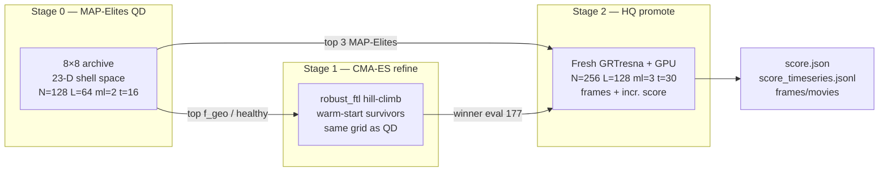

# MAP-Elites + CMA-ES FTL Discovery — Matter-First Metric Discovery

> Three-stage pipeline: **MAP-Elites** (wide survey) finds where good warps live in
> the 23-D shell search space; **CMA-ES** (local refinement) hill-climbs around
> the best *healthy* survivors; **HQ promotion** re-runs the top QD + CMA-ES elites
> at full resolution and extended time with incremental scoring. All stages share
> the same matter-first loop — propose lumps → GRTresna constraint solve → GRTeclyn
> GPU evolution → time-resolved FTL probes → score — but differ in proposer,
> resolution, and stop time.

## Table of contents

- [The idea: matter-first, not metric-first](#the-idea-matter-first-not-metric-first)
- [The pipeline](#the-pipeline)
  - [Diagram — end-to-end overview](#diagram--end-to-end-overview)
  - [Diagram — matter-first vs metric-first](#diagram--matter-first-vs-metric-first)
  - [Stage 0 — Quality-Diversity proposer (MAP-Elites)](#stage-0--quality-diversity-proposer-map-elites)
  - [Stage 1 — Initial data (GRTresna, CPU/MPI)](#stage-1--initial-data-grtresna-cpumpi)
  - [Stage 2 — Evolution (GRTeclyn, GPU)](#stage-2--evolution-grteclyn-gpu)
  - [Stage 3 — Metrics & probes (scoring)](#stage-3--metrics--probes-scoring)
  - [Stage 4 — Archive update & feedback](#stage-4--archive-update--feedback)
- [The hard consistency rule](#the-hard-consistency-rule)
- [Behavior descriptors (the "diversity" axes)](#behavior-descriptors-the-diversity-axes)
- [Scoring model (the "quality" axis)](#scoring-model-the-quality-axis)
  - [Plain-English glossary: every metric & penalty](#plain-english-glossary-every-metric--penalty)
- [Code map (where everything lives)](#code-map-where-everything-lives)
- [Building the binaries (GRTresna + GRTeclyn)](#building-the-binaries-grtresna--grteclyn)
- [How to run a campaign](#how-to-run-a-campaign)
  - [MAP-Elites (QD)](#map-elites-q-d)
  - [CMA-ES refinement after MAP-Elites](#cma-es-refinement-after-map-elites)
  - [HQ promotion (full resolution)](#hq-promotion-full-resolution)
- [Campaign log / runs analysis](#campaign-log--runs-analysis) — quick index + reverse-chronological journal below

## The idea: matter-first, not metric-first

Classic warp-drive analysis is **metric-first**: write down a target metric
(Alcubierre, Natário, …), then read off the stress-energy `T_ab = G_ab/8π` it
requires — which is always exotic, often pathological, and never solved as a
*consistent initial-value problem*. The "FTL" in those constructions is baked
into the chosen coordinates and need not survive a real evolution.

This project inverts that. The pipeline is **matter-first**:

1. The search proposes a **matter configuration** (massive scalar-field "lumps").
2. GRTresna **solves the Einstein constraint equations** for conformal factor and shift.
3. GRTeclyn **evolves** that spacetime forward on GPU.
4. Probes measure whether an FTL signature emerges and *persists*.
5. MAP-Elites stores the best candidate per behavior cell and mutates elites.

The payoff: any FTL signal that survives this loop is a property of a
**self-consistent, evolved spacetime**, not a hand-picked metric. Metrics are
iteratively hardened so the leaderboard cannot be gamed by coordinate artifacts
(see the [campaign log](#campaign-log--runs-analysis)).

## The pipeline

### Diagram — end-to-end overview

The closed loop: search proposes matter → physics builds and evolves a real
spacetime → metrics discover FTL signatures → archive feeds the next proposal.


### Diagram — matter-first vs metric-first


---

### Stage 0 — Quality-Diversity proposer (MAP-Elites)

MAP-Elites maintains an 8×8 behavior archive keyed by a 2-D descriptor. Each
batch it either **mutates an existing elite** (boundary-reflected Gaussian
perturbation, σ=0.15, ~85% of draws) or **samples inside the feasible box** of
known elites. Proposals are points in the 23-D `grtresna_shell` search space.

> **QD vs CMA-ES.** QD (`run_grtresna_qd_search.sh`) illuminates the 8×8 grid.
> CMA-ES (`run_grtresna_search.sh` → `optimize`) hill-climbs from QD survivors.
> Same search space (`search/optimize/spaces.py`); only the proposer differs.
> See [CMA-ES refinement](#cma-es-refinement-after-map-elites).

### Stage 1 — Initial data (GRTresna, CPU/MPI)

`../GRTresna` paints lumps into `(φ, Π)` and runs a Lichnerowicz/York **constraint
solve**. CPU/MPI-bound; poorly-conditioned proposals fail the Ham/Mom gate and are
**rejected before the GPU**.

### Stage 2 — Evolution (GRTeclyn, GPU)

Converged initial data evolves via `RadialRecipe` to `STOP_TIME`, dumping plotfiles
every `PLOT_INTERVAL` steps.

### Stage 3 — Metrics & probes (scoring)

Plotfiles → diagnostics: constraints, `theta_plus`, comoving/shift stats, matter
density, and FTL probes — coordinate (`operational_ftl_solved`), evolved
(`operational_ftl`, `ftl_persistence`), and gauge-invariant geodesic shortcut
(`operational_ftl_geodesic`).

### Stage 4 — Archive update & feedback

`metrics/score/` collapses diagnostics into `ftl_first` fitness. Only `gpu_ok`
candidates compete for a behavior cell. Rejected GRTresna solves log to
`trajectory.jsonl` but never enter the archive.

## The hard consistency rule

`T_ab` used in the GRTresna **constraint solve** must equal `T_ab` used in the
GRTeclyn **evolution**. Otherwise the run starts off-constraint and any apparent
"FTL" is a constraint-relaxation transient, not physics.

The `grtresna_independent_scalars` matter path exists precisely to keep both
sides identical; any new matter sector must be added to **both** sides with
matching analytic forms. (Root cause: `Examples/RadialRecipe/Debug.md`; see also
[Matter model](#matter-model--reference--future-directions-2026-06-10).)

## Behavior descriptors (the "diversity" axes)

Current descriptor: **`ftl_lifetime`** (`qd_search/descriptors.py`), added in
[v15](#v15-time-resolved-intermediate-ftl-scoring-2026-06-13):

- **x** — peak trustworthy `f_geo`, ramped `(f_geo − 1e-3)/(2e-1 − 1e-3)`.
- **y** — **FTL-lifetime fraction** (share of frames with a live shortcut).

Back-compat: **`speed_super`** (v14 default); `speed_horizon` retired after the
`theta_plus` centering bug (see [Status](#map-elites-ftl-discovery-status)).

## Scoring model (the "quality" axis)

Fitness is `ftl_first` in `metrics/score/` (CMA-ES may use `robust_ftl`; see
[v17](#v17-cma-es-robust-refinement-after-v16-2026-06-14)).

- **Gauge-invariant FTL dominates — time-averaged since v15.** `operational_ftl_geodesic`
  (×1000) only when `h_quality_ok` and all rays reach the detector; otherwise 0.
  Mean over all per-frame trustworthy magnitudes, gated by `structural_persistence`.
- **Dynamical signal next.** `operational_ftl` (×400, geodesic-gated) +
  `ftl_persistence` (×300) outweigh coordinate `operational_ftl_solved` (×50,
  shaping only). See [v9 review](#ftl_discovery_v9-review--shaping-rebalance--hq-promotion-2026-06-11).
- **Persistence-honest health.** `survival = numerical_survival × structural_persistence`
  (density retention × morphological coherence).
- **Vetoes / penalties.** Horizon (−500 when corroborated, [v16](#v16-ftl-champion-retention-2026-06-13)),
  exotic, instability, stationary warp-lens artifacts.

Geodesic ramp: `(f_geo − 1e-3)/(2e-1 − 1e-3)` — full marks need ~20% shortcut
([v9 recalibration](#geodesic-reward-recalibration--ftl_discovery_v9-2026-06-11)).

Per-component weight table: `grteclyn-wrapper/src/grteclyn_wrapper/metrics/README.md`.
Full component definitions → [glossary](#plain-english-glossary-every-metric--penalty).

### Plain-English glossary: every metric & penalty

Two modes: `weighted` (plain sum) and `ftl_first` (validated FTL dominates).

**1. FTL signals**

- **`operational_ftl_geodesic`** — null-ray shortcut; gauge-invariant; largest weight;
  reliability-gated; persistence-gated.
- **`operational_ftl`** — evolved coordinate shortcut; zeroed when trustworthy geodesic finds none.
- **`ftl_persistence`** — shortcut lasts across final frames.
- **`operational_ftl_solved`** — t=0 constraint-solved hint (localization-gated).
- **`ftl_precursor`, `channel_progress`, `shift_drive`** — shaping gradients; gated by persistence.
- **`ftl_shortcut`** — faint t=0 hint.

**2. Health rewards**

- **`numerical_survival`** — integrator reached stop time.
- **`structural_persistence`** — density retention × morphological coherence.
- **`survival`** = `numerical_survival × structural_persistence`.
- **`stability` / `comoving_stability`** — geometry drift.
- **`constraint_health`, `constraint_growth`, `initial_constraint_quality`** — Einstein solve quality.
- **`lapse_health`** — time-slicing behavior.
- **`energy_condition` / `anec_condition`** — physical energy rules.
- **`tidal_comfort`** — passenger survivability.
- **`curvature_activity`, `nontrivial_geometry`, `nonflat_geometry`, `expansion_asymmetry`** — non-flat geometry rewards.

**3. Penalties**

- **`exotic_penalty`** — graded 0..−1.6 for negative-energy matter.
- **`horizon_penalty`** — `theta_plus` proxy; −500 veto when lapse-collapsed trapped surface corroborated ([v16](#v16-ftl-champion-retention-2026-06-13)).
- **`instability_penalty`**, **`qei_penalty`**, **`boundary_penalty`**.
- **`stationary_artifact_penalty`** — static lens pretending to be FTL.

**Non-triviality gate** — health rewards off for flat vacuum.

## Code map (where everything lives)

| Concern | Path |
|---------|------|
| **MAP-Elites** QD loop, archive, descriptors | `grteclyn-wrapper/src/grteclyn_wrapper/search/qd_search/` |
| **CMA-ES** optimize loop, warm-start | `grteclyn-wrapper/src/grteclyn_wrapper/search/optimize/` |
| Search-space defs (shared QD + CMA-ES) | `search/optimize/spaces.py` |
| FTL champion retention | `search/ftl_retention.py` |
| Scoring (`ftl_first`, `robust_ftl`) | `grteclyn-wrapper/src/grteclyn_wrapper/metrics/score/` |
| Metric aggregation | `grteclyn-wrapper/src/grteclyn_wrapper/metrics/aggregation/collector.py` |
| FTL probes | `grteclyn-wrapper/src/grteclyn_wrapper/metrics/probes/ftl/` |
| Plotfile → frames + `ftl_timeseries.dat` | `grteclyn-wrapper/src/grteclyn_wrapper/visualisation/process_wave/consume_plotfiles/` |
| **Incremental HQ scoring** (`score_timeseries.jsonl`) | `metrics/aggregation/incremental.py`, wired in `consume_plotfiles/driver.py` |
| HQ promotion launcher | `grteclyn-wrapper/scripts/search/run_promote_qd_batch.sh`, `replay_grtresna_eval.py` |
| Frame → movie stitching | `grteclyn-wrapper/scripts/plot/make_movies.sh` |
| Matter (evolution) | `Source/Matter/GRTresnaIndependentScalars.{hpp,impl.hpp}`, `Examples/RadialRecipe/` |
| Matter (initial data) | `../GRTresna/Examples/ScalarFieldBH/` |
| Campaign launcher (QD) | `grteclyn-wrapper/scripts/search/run_grtresna_qd_search.sh` |
| Campaign launcher (CMA-ES) | `grteclyn-wrapper/scripts/search/run_grtresna_search.sh` |

## Building the binaries (GRTresna + GRTeclyn)

**GRTresna** = Chombo + conda-OpenMPI (CPU/MPI). **GRTeclyn** = AMReX + CUDA (GPU).
GRTresna build requires conda env on `PATH`/`LD_LIBRARY_PATH` and `CONDA_PREFIX`.

### One env to set first (every shell)

```bash
export GRTRESNA_ENV=/home/jovyan/.mlspace/envs/grtresna
export SIM_ROOT=/home/jovyan/nachevsky/test/simulation
export CHOMBO_HOME="${SIM_ROOT}/Chombo/lib"
export CONDA_PREFIX="${GRTRESNA_ENV}"
export PATH="${GRTRESNA_ENV}/bin:${PATH}"
export LD_LIBRARY_PATH="${GRTRESNA_ENV}/lib:${LD_LIBRARY_PATH:-}"
```

Shortcut: `source grteclyn-wrapper/scripts/lib/env.sh`. Full micromamba recipe:
`grteclyn-wrapper/src/grteclyn_wrapper/README.md` ("Installing GRTresna from scratch").

### Build GRTresna (initial-data solver, MPI)

```bash
cd "${SIM_ROOT}/GRTresna/Examples/ScalarFieldBH"
PATH="${GRTRESNA_ENV}/bin:${PATH}" CONDA_PREFIX="${GRTRESNA_ENV}" \
  make all -j4 CHOMBO_HOME="${CHOMBO_HOME}" MPI=TRUE
# -> Main_ScalarFieldBH3d.Linux.64.mpicxx.gfortran.OPTHIGH.MPI.ex
```

First time: `cd "${CHOMBO_HOME}" && make lib -j"$(nproc)"`. Header-only edits need
force-relink (rm `.ex` + listed `.o` files, then `make all`).

### Build GRTeclyn (evolution, GPU)

```bash
cd "${SIM_ROOT}/GRTeclyn/Examples/RadialRecipe"
make COMP=gnu USE_CUDA=TRUE USE_MPI=FALSE CUDA_ARCH=90 -j"$(nproc)"   # -> main3d.gnu.CUDA.ex
make COMP=gnu USE_CUDA=TRUE USE_MPI=TRUE  CUDA_ARCH=90 -j"$(nproc)"   # -> main3d.gnu.MPI.CUDA.ex
```

`CUDA_ARCH`: `90` = H100, `80` = A100, `70` = V100.

### Common failures → fixes (the MPI/conda gotcha)

| Symptom | Fix |
|---------|-----|
| `mpicxx` / `gfortran` not found | `export PATH="${GRTRESNA_ENV}/bin:${PATH}"` |
| `cannot find -lhdf5` | `export CONDA_PREFIX="${GRTRESNA_ENV}"` before `make` |
| `libmpi.so` / `libhdf5.so` missing at runtime | `export LD_LIBRARY_PATH="${GRTRESNA_ENV}/lib:..."` |
| `CHOMBO_HOME` undefined | `export CHOMBO_HOME="${SIM_ROOT}/Chombo/lib"` |
| Header edit "did nothing" | force-relink |
| `/bin/csh: No such file` | point Chombo at conda `tcsh` (README step 6) |

## How to run a campaign

### MAP-Elites (QD)

```bash
cd grteclyn-wrapper
QD_NAME=ftl_discovery_vN QD_ITERATIONS=10 BINS=8 STOP_TIME=16.0 \
  GPU_IDS="0 1 2 3 4 5 6 7" RANKS=8 LUMPS=5 SHELL_PROFILE=compact \
  GRTRESNA_MAX_HAM_PCT=5.0 GRTRESNA_MAX_MOM_PCT=5.0 \
  nohup bash scripts/search/run_grtresna_qd_search.sh \
  > ../runs/qd_ftl_discovery_vN.launch.log 2>&1 &
```

Results: `runs/grtresna_qd/ftl_discovery_vN/` (`trajectory.jsonl`, `score.json`, `frames/`).

### CMA-ES refinement after MAP-Elites

MAP-Elites surveys the 23-D box; CMA-ES locally refines around **healthy** QD
survivors (e.g. evals 739, 655, 256, 389 — `observer_ec` tier, not raw-score
king eval 233 which is exotic-heavy). Uses `robust_ftl` objective; see
[v17](#v17-cma-es-robust-refinement-after-v16-2026-06-14) for weight table and results.

**Launch (`ftl_cmaes_v17_robust`):**

```bash
cd grteclyn-wrapper
: > ../runs/cmaes_ftl_v17_robust.launch.log
RUNS_DIR=/home/jovyan/nachevsky/test/simulation/GRTeclyn/runs/grtresna_cmaes \
RUN_NAME=ftl_cmaes_v17_robust \
WARM_START_TRAJECTORY=/home/jovyan/nachevsky/test/simulation/GRTeclyn/runs/grtresna_cmaes_v17_seed_survivors.jsonl \
WARM_START_TOP_K=8 WARM_START_JITTER=0.05 SIGMA0=0.08 MAX_GENERATIONS=25 \
KEEP_TOP_EVAL_DIRS=10 FTL_RETENTION=1 \
GRTRESNA_ANSATZ=shell SHELL_PROFILE=compact LUMPS=5 RANKS=8 GPU_IDS="0 1 2 3 4 5 6 7" \
STOP_TIME=16.0 PLOT_INTERVAL=320 GRTRESNA_EVOLUTION_N_FULL=128 GRTRESNA_EVOLUTION_L_FULL=64.0 \
OBJECTIVE_MODE=robust_ftl GRTRESNA_MAX_HAM_PCT=5.0 GRTRESNA_MAX_MOM_PCT=5.0 \
SOLVED_FTL_NEAR_LUMINAL_SPEED_FLOOR=0.95 \
RANDOM_INJECTION_FRACTION=0.1 EXOTIC_INJECTION_FRACTION=0.1 \
nohup bash scripts/search/run_grtresna_search.sh \
  >> ../runs/cmaes_ftl_v17_robust.launch.log 2>&1 &
```

| Knob | v17 value | Effect |
|------|-----------|--------|
| `WARM_START_TRAJECTORY` | `v17_seed_survivors.jsonl` | 4 QD survivors; x0 = eval 739 |
| `SIGMA0=0.08` | 8% of box | Local refinement |
| `OBJECTIVE_MODE=robust_ftl` | — | Persistence/survival/exotic rebalanced |
| `MAX_GENERATIONS=25` × pop 8 | ~200 evals | ~30–40 GPU-hours |

**Monitor:** `grep -a "\[optimize\]" ../runs/cmaes_ftl_v17_robust.launch.log | tail`;
`cat runs/grtresna_cmaes/ftl_cmaes_v17_robust/ftl_champions.json`.

### HQ promotion (full resolution)

After QD + CMA-ES identify elites at **low resolution** (`N=128`, `L=64`, `max_level=2`,
`t=16`), **HQ promotion** replays the same geometry genome with a fresh GRTresna solve
and a long GPU evolution at **full resolution** (`N=256`, `L=128`, `max_level=3`, `t=30`).
This is the stress test: does the shortcut survive finer grids and longer time?



| Stage | Script | Resolution | Stop time | Objective | Output dir |
|-------|--------|------------|-----------|-----------|------------|
| MAP-Elites | `run_grtresna_qd_search.sh` | 128³, L=64, ml=2 | 16 | `ftl_first` | `runs/grtresna_qd/ftl_discovery_v16/` |
| CMA-ES | `run_grtresna_search.sh` | 128³, L=64, ml=2 | 16 | `robust_ftl` | `runs/grtresna_cmaes/ftl_cmaes_v17_robust/` |
| HQ promote | `run_promote_qd_batch.sh` → `replay_grtresna_eval.py` | **256³, L=128, ml=3** | **30** | `ftl_first` | `runs/grtresna_promote/l128n256t30_*/` |

**Candidate pick (this batch):** CMA-ES winner **eval 177** plus MAP-Elites v16 top 3 by
`ftl_first` score — evals **233**, **446**, **676** (not the raw-speed outlier eval 643).

**Launch (2026-06-15):**

```bash
cd grteclyn-wrapper
CANDIDATES="177 3 233 0 446 1 676 2" \
  QD_RUN=/home/jovyan/nachevsky/test/simulation/GRTeclyn/runs/grtresna_qd/ftl_discovery_v16 \
  NAME_PREFIX=l128n256t30 \
  RUNS_DIR=/home/jovyan/nachevsky/test/simulation/GRTeclyn/runs/grtresna_promote \
  N_FULL=256 L_FULL=128 STOP_TIME=30 PLOT_INTERVAL=24 MAX_LEVEL=3 \
  bash scripts/search/run_promote_qd_batch.sh
# eval 177 sourced from runs/grtresna_cmaes/ftl_cmaes_v17_robust/eval_000177
```

**Incremental scoring (new in this HQ batch).** The plotfile consumer appends one JSON
line per plotfile to `small_data/score_timeseries.jsonl` by re-scoring the prefix of
`ftl_timeseries.dat`, `collapse_diagnostics.dat`, and `constraint_norms.dat` with the
same `ftl_first` objective as the final `score.json`. Monitor mid-run score drift:

```bash
tail -f runs/grtresna_promote/l128n256t30_*/small_data/score_timeseries.jsonl
```

**Movies from in-flight frames:**

```bash
bash scripts/plot/make_movies.sh runs/grtresna_promote/l128n256t30_* --framerate 10
```

See [HQ promotion results (2026-06-15)](#hq-promotion-after-v16-qd--v17-cma-es-2026-06-15)
for analytics.

## Campaign log / runs analysis

Reverse-chronological journal below. Quick index:

| Campaign / section | Date | Headline |
|--------------------|------|----------|
| [**HQ promotion: v16 + v17 CMA-ES**](#hq-promotion-after-v16-qd--v17-cma-es-2026-06-15) | **06-15 done** | 4/4 complete. **Incr. peak eval 233 score 749** @ t≈12; only **eval 177** finishes positive (+67). Horizon kills 3/4 by t=30 |
| [**v17: CMA-ES robust refinement**](#v17-cma-es-robust-refinement-after-v16-2026-06-14) | 06-14 → **06-15 done** | **200 evals.** Winner eval **177**: f_geo **5.65%**, timeavg **16.3%**, exotic **−1.17**. Peak f_geo **eval 78** at **5.68%** |
| [**v16: FTL champion retention + horizon fix**](#v16-ftl-champion-retention-2026-06-13) | 06-13 | FTL hall of fame (`ftl_retention.jsonl`). Horizon penalty needs lapse corroboration. ~971 evals |
| [**v15: time-resolved FTL scoring**](#v15-time-resolved-intermediate-ftl-scoring-2026-06-13) | 06-13 | Per-frame `ftl_timeseries.dat`; time-averaged geodesic score; `ftl_lifetime` axis. Eval 231 peak **7.43%** at t=9.6 |
| [**v14 results & analytics**](#v14-campaign-results--analytics-2026-06-12-completed) | 06-12 | 504 evals, 351 gpu_ok. Top eval **231** f_geo=**5.30%**. Ring layout dominates |
| [`v14` launch setup](#v14-launch-setup-matter-profile-and-cloud-layout-2026-06-12) | 06-12 | Profile + cloud layout; 23-D search space |
| [Alcubierre positive control](#alcubierre-positive-control--metric-first-vs-matter-first-verdict-2026-06-12) | 06-12 | Probes validated (~32% on textbook metric). 129³ re-probe for QD H-gate |
| [`v12` → `v13`](#ftl_discovery_v12-review--lambda-phi4--ftl-geometry-layouts--ftl_discovery_v13-2026-06-12) | 06-12 | λφ⁴ + matter layouts; geodesic contradiction gate |
| [`v10` → `v11`](#ftl_discovery_v10-review--persistence-gate--physicality-pressure--ftl_discovery_v11-2026-06-12) | 06-12 | Persistence-gate geodesic; raise exotic/energy weights |
| [HQ verdict → `v10`](#hq-verdict-shortcuts-did-not-survive-refinement--ftl_discovery_v10-2026-06-11) | 06-11 | HQ killed all 3 promoted shortcuts. STOP_TIME 8→16; static toggle |
| [`v9` review + HQ promotion](#ftl_discovery_v9-review--shaping-rebalance--hq-promotion-2026-06-11) | 06-11 | Coordinate precursor out-voted geodesic → rebalanced; top 3 HQ |
| [Geodesic recalibration → `v9`](#geodesic-reward-recalibration--ftl_discovery_v9-2026-06-11) | 06-11 | `GEO_FTL_TARGET` 5%→20%; weight ×1500→×1000 |
| [Null-geodesic fix → `v8`](#null-geodesic-reliability-fix-2026-06-11-post-v7) | 06-11 | Forward rays + relative H-drift gate |
| [`ftl_discovery_v7`](#campaign-ftl_discovery_v7--finished-run--critical-leaderboard-review-2026-06-11) | 06-11 | Persistence honest; geodesic still blind |
| [`ftl_discovery_v4`](#campaign-ftl_discovery_v4--persistence-honest-scoring--bound-matter-2026-06-11) | 06-11 | Persistence-gated survival; searched mass; capped boosts |
| [Matter model](#matter-model--reference--future-directions-2026-06-10) | 06-10 | Lumps, file map, roadmap |
| [`ftl_discovery_v2`](#campaign-ftl_discovery_v2--first-healthy-run--a-scoring-concern-2026-06-10) | 06-10 | First sane scoring; geodesic under-weighted |
| [Stationary warp-lens fix](#scoring-fix-stationary-warp-lens-artifacts-2026-06-10-after-90-evals) | 06-10 | Reliability + stationary gates |
| [Navigation overhaul](#navigation-overhaul-2026-06-10) | 06-10 | `speed_super` descriptor; feasible-box sampling |
| [Status / reset](#map-elites-ftl-discovery-status) | 06-10 | `theta_plus` re-centered on `grid_center` |

---

## v17: CMA-ES robust refinement after v16 (2026-06-14)

**Context.** v16 QD plateaued (~971 evals); peak crowns stopped updating after eval 643.
Local refinement around **OBSERVER_EC** survivors, not raw-score king eval 233.

**Change**
- Seeds: evals **739** (x0), **655**, **389**, **256** — `v17_seed_survivors.jsonl`.
- `OBJECTIVE_MODE=robust_ftl` — geodesic ×1000 unchanged; persistence/survival/exotic reweighted (see launch table above).
- CMA-ES retention + `ftl_timeseries` on optimize path. Code: `search/optimize/`,
  `metrics/score/`, `run_grtresna_search.sh`. Tests: `test_optimize_retention.py`,
  `test_robust_ftl_objective.py`.

### MAP-Elites → CMA-ES: what improved (v17 completed, 2026-06-15)

**Result:** 25 gens, **200/200** evals, **163 gpu_ok**, 17 dirs on disk.

| Metric | seed 739 | king 233 | **eval 177** |
|--------|----------|----------|--------------|
| Score | 280.6 (`ftl_first`) | 652.2 | **312.2** (`robust_ftl`) |
| f_geo peak | 5.39% | 5.88% | **5.65%** |
| ftl_geo timeavg | 14.0% | 17.7% | **16.3%** |
| Exotic penalty | −1.32 | −1.60 | **−1.17** |
| Comoving stability | 0.53 | 0.05 | **0.75** |

FTL champions: peak f_geo **eval 78** (5.68%); best `robust_ftl` **eval 177**.
Score progression: gen 1 → 227, gen 23 → **312.2** (plateau). Same basin as 739
(Δparams &lt;0.15); exotic_penalty fell despite knob nudge up.

**Artifacts:** `runs/grtresna_cmaes/ftl_cmaes_v17_robust/` (`result.json`, `ftl_champions.json`).

**Takeaway:** CMA-ES (~20% of v16 eval count) delivered +0.26 pp f_geo, +2.3 pp
timeavg, −11% exotic vs seed 739.

**Next step:** [HQ promotion](#hq-promotion-after-v16-qd--v17-cma-es-2026-06-15) of eval
**177** (CMA-ES) + v16 top 3 (**233**, **446**, **676**) at N=256, t=30 — completed same day.

## HQ promotion after v16 QD + v17 CMA-ES (2026-06-15)

**Context.** First HQ batch since [v9](#hq-verdict-shortcuts-did-not-survive-refinement--ftl_discovery_v10-2026-06-11)
with working geodesic probes and time-averaged scoring. Promotes the **best FTL geometry**
from each search line: MAP-Elites v16 (`ftl_first`, ~971 evals) and CMA-ES v17
(`robust_ftl`, 200 evals). Adds **incremental scoring** so mid-run score peaks are
recorded before final `score.json`.

**HQ configuration**

| Knob | QD / CMA-ES | HQ promotion |
|------|-------------|--------------|
| `N_full` / `L_full` | 128 / 64 | **256 / 128** |
| `max_level` | 2 | **3** |
| `stop_time` | 16 | **30** |
| `plot_interval` | 320 (→ ~3.2 code units) | **24** (→ ~0.24 code units) |
| Objective | QD: `ftl_first`; CMA-ES: `robust_ftl` | **`ftl_first`** (all four) |
| Frames | QD: off; HQ: **on** | PNG slices + mp4 movies |
| Incremental score | — | **`score_timeseries.jsonl`** per plotfile |

**Candidates**

| HQ dir | Source campaign | QD/CMA-ES score | Lumps @ t=0 | Notes |
|--------|-----------------|-----------------|-------------|-------|
| `…_eval000177` | CMA-ES v17 | 312 (`robust_ftl`) | **Dynamic** (moving) | Only HQ finish without horizon |
| `…_eval000233` | MAP-Elites v16 | 652 (`ftl_first`) | **Static** (`shell_static→1`) | Best incremental peak |
| `…_eval000446` | MAP-Elites v16 | 540 | **Static** | Strong mid-run f_geo |
| `…_eval000676` | MAP-Elites v16 | 393 | **Static** | FTL faded earliest |

Static lumps: `grtresna_shell_static` rounds to 1 → all lump velocities/ω zeroed in
GRTresna; FTL channel is geometry + `shift_seed`, not matter currents. Eval 177 is the
only **dynamic** (momentum-carrying) candidate.

### Results — QD vs incremental peak vs final

| Eval | QD score | **Incr. peak** (t) | f_geo @ peak | **Final** (t=30) | Horizon |
|------|----------|-------------------|--------------|------------------|---------|
| **233** | 652 | **749** (t≈11.8) | 6.33% | **−378** | −500 @ t≈20.6 |
| **446** | 540 | **701** (t≈11.8) | 5.45% | **−481** | −500 @ t≈29.3 |
| **676** | 393 | **658** (t≈10.6) | 2.88% | **−533** | −500 @ t≈19.0 |
| **177** | 312 | **301** (t≈9.1) | 5.72% | **+67** | **none** |

**Best HQ FTL (incremental peak):** eval **233** — score **749**, raw `f_geo_peak` **6.85%**
@ t≈9.4 (above its QD score 652). **Best final score:** eval **177** (+67) — only run
without corroborated horizon; final `f_geo` ≈ 0 but survival/health intact.

**vs v9 HQ ([2026-06-11](#hq-verdict-shortcuts-did-not-survive-refinement--ftl_discovery_v10-2026-06-11)):**
v9 shortcuts died completely at HQ (f_geo→0, low survival). This batch **does** produce
real mid-run geodesic shortcuts at HQ resolution (5–7% f_geo, scores 300–750) — they
**do not persist** to t=30 on the v16 static-lump elites because of horizon formation +
FTL fade.

### Incremental score analytics

All four jobs wrote `small_data/score_timeseries.jsonl` (111–126 rows). Typical **four
phases** (same pattern as [v15 time-resolved scoring](#v15-time-resolved-intermediate-ftl-scoring-2026-06-13)):

1. **Negative plateau** (t≈0–2): `f_geo=0` → geodesic contradiction gate zeros FTL
   shaping; only `exotic_penalty` bites (score ≈ −16 to −25).
2. **Rise** (t≈2–6): trustworthy geodesic shortcut appears → score jumps positive.
3. **Peak** (t≈9–12): best FTL + survival; **trust these scores**, not the final.
4. **Decline** (t≈12–30): `f_geo→0`, structure dissipates; v16 jobs hit **horizon_penalty
   −500** (corroborated trapped surface); final scores floor near −400 to −530.

**Per-eval timeline**

| Eval | Score flips + | Peak score @ t | f_geo→0 after peak @ t | Horizon @ t |
|------|---------------|----------------|------------------------|-------------|
| 177 | t≈1.9 | 301 @ 9.1 | t≈18.2 | — |
| 233 | t≈5.0 | 749 @ 11.8 | t≈21.8 | 20.6 |
| 446 | t≈0 (solved f_geo) | 701 @ 11.8 | t≈19.9 | 29.3 |
| 676 | t≈5.3 | 658 @ 10.6 | t≈11.8 | 19.0 |

**Why early incremental scores look negative vs QD/CMA-ES.** Incremental rows use
prefix survival (`t/30`), prefix constraints, and the geodesic gate at each frame — a
t=0.5 snapshot is not comparable to a t=16 final score. Compare like with like: peak
incremental row vs QD final, or wait for t≈16 rows.

**Example monitor commands**

```bash
# live incremental scores
tail -f runs/grtresna_promote/l128n256t30_ftl_discovery_v16_qd_eval000233/small_data/score_timeseries.jsonl

# per-frame FTL (same times as score rows)
column -t runs/grtresna_promote/l128n256t30_*/small_data/ftl_timeseries.dat | less
```

### Code fixes shipped for this HQ batch

1. **`regrid_interval` vs `max_level`** — HQ `max_level=3` requires three `regrid_interval`
   entries; promotion now generates them via `regrid_intervals_for_max_level()` in
   `replay_grtresna_eval.py` (fixed eval 177 GRTresna abort on first attempt).
2. **`IncrementalScoreWriter`** — `metrics/aggregation/incremental.py`; wired through
   `plot_consumer.py` → `consume_plotfiles/driver.py` with `--incremental-score`,
   `--objective-mode ftl_first`, `--target-stop-time 30`.

Tests: `tests/metrics/aggregation/test_incremental_score.py`.

### Artifacts

```
runs/grtresna_promote/
  l128n256t30_ftl_cmaes_v17_robust_qd_eval000177/   # dynamic lumps, final +67
  l128n256t30_ftl_discovery_v16_qd_eval000233/       # peak incr. 749
  l128n256t30_ftl_discovery_v16_qd_eval000446/
  l128n256t30_ftl_discovery_v16_qd_eval000676/
    score.json                          # final aggregate
    small_data/score_timeseries.jsonl   # incremental score trace
    small_data/ftl_timeseries.dat       # per-frame FTL probes
    frames/*/movie_*.mp4                # from make_movies.sh
```

### Takeaways

1. **HQ resolution confirms real shortcuts** — peak f_geo **6.85%** (eval 233) exceeds
   QD t=16 peaks; the v16 search found genuine geometry, not a grid artifact.
2. **Final t=30 score is the wrong metric for these elites** — horizon + FTL fade dominate;
   use **`score_timeseries.jsonl` peak** or stop HQ earlier (~t≈12) for ranking.
3. **Static-lump v16 winners are horizon-prone** at long times; eval **177** (dynamic +
   CMA-ES refined) is the only candidate that survives t=30 without −500 veto.
4. **Next experiments:** HQ stop at t≈16 for apples-to-apples QD comparison; promote
   CMA-ES-only line; try `robust_ftl` incremental objective to match CMA-ES training.

## v16: FTL champion retention (2026-06-13)

**Context.** Disk pruning kept top-10 by score only; mid-run FTL peaks lost eval dirs
(eval 146 @ 5.61% f_geo pruned despite valid frames).

**Change**
- Union retention: top-10 by score ∪ one champion per peak metric (`f_geo_peak`,
  `f_op_peak`, `max_local_speed`, `superluminal_fraction`, `ftl_lifetime_fraction`,
  `ftl_geo_timeavg`).
- Files: `ftl_retention.jsonl`, `ftl_champions.json`. Knobs: `QD_FTL_RETENTION=1`,
  `QD_KEEP_TOP_EVAL_DIRS=10`.
- Code: `search/ftl_retention.py`, `search/ftl_peak_metrics.py`, `qd_search/driver.py`.

**Result.** Up to ~16 eval dirs on disk. Campaign resumed to ~971 evals.

### Horizon penalty corroboration fix (2026-06-13, mid-v16)

**Context.** Any `theta+≤0` triggered −500 veto even with healthy lapse (eval 6: −559
with valid FTL frames t≈6–10).

**Change** (`metrics/diagnostics/collapse.py`, `metrics/score/`):
1. Penalize only `theta+ < −0.05` **and** `lapse < 0.2` at same timestep.
2. Suppress late-only collapse (after 75% of `final_time`).
3. Domain guard: read `L_full` from `params.txt`.

**Result (rescored):** eval 6 −559→**−42**; eval 27 −446→**−5**. Tests:
`test_horizon_finder_guard.py`.

## v15: time-resolved (intermediate) FTL scoring (2026-06-13)

**Context.** Final-frame-only scoring under-credited mid-run peaks and could not
separate sustained warps from collapsing bubbles (eval 231: peak **7.43%** at t≈9.6,
**5.24%** at t=16).

**Change**
- In-flight `ftl_timeseries.dat` per plotfile (process+delete); geodesic gated on cheap probe.
- `operational_ftl_geodesic` = **time-mean** of per-frame trustworthy magnitudes × persistence.
- New descriptor **`ftl_lifetime`** (peak strength × lifetime fraction).
- QD grid: `dx=0.5`, `max_level=2`, `t=16`.

**Code:** `consume_plotfiles/extraction/ftl.py`, `metrics/diagnostics/ftl_timeseries.py`,
`metrics/score/`, `qd_search/descriptors.py`.

### Validation (eval 231 replay, gridinit reused, GRTresna skipped)

| t | f_geo | trustworthy |
|---|-------|-------------|
| 0.0 | 2.70% | yes |
| 9.6 | **7.43% (peak)** | yes |
| 16.0 | 5.24% | yes |

Timeavg magnitude 0.275 vs final-frame 0.258. `ftl_lifetime = 100%`.

### Where it lives

- Extraction: `visualisation/.../extraction/ftl.py` (auto-on with plotfile consumer).
- Aggregation: `metrics/diagnostics/ftl_timeseries.py` → `collector.py`.
- Leaderboard: `uv run python scripts/search/report_campaign_ftl.py <run_dir>`.

### Per-frame FTL trace (not just the final snapshot)

```bash
tail -f runs/grtresna_qd/ftl_discovery_v15/eval_000127/small_data/ftl_timeseries.dat
```

| Column | Meaning |
|--------|---------|
| `time`, `f_op`, `f_geo` | frame time and shortcut magnitudes |
| `geo_trustworthy` | null-ray reliability gate passed |
| `max_local_speed`, `superluminal_fraction` | coordinate diagnostics |
| `n_rays`, `n_reached`, `max_h_rel_drift` | geodesic probe |

Peaks in `score.json` → `metrics.ftl_timeseries` (`f_geo_peak`, `ftl_lifetime_fraction`, …).

## v14 launch setup: matter profile and cloud layout (2026-06-12)

**Context.** v13 stack + two matter-distribution knobs (broader physical palette).

### New in v14 (matter distribution)

1. **Per-lump profile:** `0`=Gaussian, `1`=smoothed top-hat ball; driven by
   `grtresna_shell_profile_fraction` (+ phase). Byte-identical in GRTresna
   `MatterParams.hpp::lump_phi` and Python `lump_fields.py`.
2. **Cloud layout** (`grtresna_matter_layout = 4`): low-discrepancy R³ scatter.

Search space: **23 dimensions** (was 21). GRTresna `ScalarFieldBH` rebuild required
for `profile` field; no GRTeclyn `Source/` change.

### Carried over from v13 (independently reviewed, sound)

3. **λφ⁴** (`grtresna_scalar_lambda ∈ [0, 0.1]`): `V = ½(m·Σφ)² − (λ/4)(Σφ)⁴`.
4. **Layouts 0–3:** sphere, channel, bipolar, ring (+ cloud = 4).
5. **Geodesic contradiction gate:** zero shaping when trustworthy geodesic finds no shortcut.

### Build / rebuild status

GRTresna recompiled; pytest 182 passed; C++/Python envelope agreement 1e-9.

### Launch command

```bash
cd grteclyn-wrapper
QD_NAME=ftl_discovery_v14 QD_ITERATIONS=10 BINS=8 STOP_TIME=16.0 \
  GPU_IDS="0 1 2 3 4 5 6 7" RANKS=8 LUMPS=5 SHELL_PROFILE=compact \
  GRTRESNA_MAX_HAM_PCT=5.0 GRTRESNA_MAX_MOM_PCT=5.0 \
  nohup bash scripts/search/run_grtresna_qd_search.sh \
  > ../runs/qd_ftl_discovery_v14.launch.log 2>&1 &
```

### v14 campaign results & analytics (2026-06-12, completed)

**Result:** 504 evals, 351 gpu_ok, 33/64 archive cells (**51.6%**), pre-GPU rejection 30.4%.

| # | Eval | Score | Tier | f_geo | Layout | λ | Exotic |
|---|------|-------|------|-------|--------|---|--------|
| 1 | 231 | 551 | observer_ec | **5.30%** | ring | 0.066 | 90.6% |
| 2 | 369 | 513 | observer_ec | 2.40% | ring | 0.054 | 91.9% |
| 3 | 483 | 441 | operational | 3.42% | bipolar | 0.088 | 91.6% |
| 4 | 489 | 341 | operational | 3.57% | ring | 0.056 | 98.4% |
| 5 | 91 | 277 | operational | 4.22% | sphere | 0.081 | 98.9% |

vs Alcubierre (129³): **31.5%** f_geo vs our **5.30%** (~17%) — but ours is
self-consistent and evolvable ([verdict](#alcubierre-positive-control--metric-first-vs-matter-first-verdict-2026-06-12)).

**Patterns:** ring layout dominates top-5; exotic 90–99% universal; λ actively used;
cloud layout (4) no top-10 breakthrough.

## Alcubierre positive control → metric-first vs matter-first verdict (2026-06-12)

**Context.** Validate probes on prescribed Alcubierre metric
(`scripts/validation/alcubierre_metric_validation.py`).

### Result: the probes are validated

| config | f_geo | rel-H | gate | min NEC |
|--------|-------|-------|------|---------|
| v_s=0 | 0.000 | — | — | +0.000 |
| v_s=2, 65³ | 0.315 | 2.16e-2 | ✗ | −0.40 |
| v_s=2, 129³ | 0.315 | 5.04e-3 | ✓ | −0.47 |

~32% gauge-invariant shortcut detected; exotic matter flagged. Campaign null results
on physical scalars are trustworthy.

### Bonus finding: the QD-resolution reliability gate rejects even Alcubierre

H-drift gate fails at 65³, passes at 129³ while `f_geo` unchanged (discretization artifact).

**Fix:** `compute_geodesic_ftl_from_plotfile` **re-probes at 129³** when base res finds
shortcut but H gate fails (`GEO_REFINE_N=129`). Tests: `test_reliability_reprobe_*`.

### Verdict: is metric-first (geometry-first) a bad idea, or are we doing matter-first wrong?

- **Metric-first for analysis** — good; validates detectors (`stress_energy` + geodesic).
- **Metric-first for discovery** — dead end; cannot evolve prescribed metric with physical matter.
- **Alcubierre T is NEC-violating** — no canonical scalar reproduces it at t=0.
- **Matter-first is correct** for self-consistent dynamics; clean null is honest physics.
- **Instrumentation gap (QD H-gate)** — fixed with 129³ re-probe; philosophy unchanged.

**Bottom line:** search can't find Alcubierre because (1) physical scalars can't source
its T, (2) moving-puncture damps warp shift, (3) exotic matter is penalized — all features.

## `ftl_discovery_v12` review → λφ⁴ + FTL geometry layouts → `ftl_discovery_v13` (2026-06-12)

**Context.** 278 evals; zero geodesic FTL; eval 197 scored 130 with `f_geo=0` (coordinate gaming).

### Three changes → `v13`

1. Searchable `grtresna_scalar_lambda ∈ [0, 0.1]`.
2. `grtresna_matter_layout` 0–3: sphere, channel, bipolar, ring.
3. Geodesic contradiction gate on all shaping terms.

Pytest preflight before QD launch. Rebuild GRTeclyn + GRTresna. Search space: **21 dimensions**. Tests: `test_scalar_lambda_potential`,
`test_matter_geometry_consistency`, `test_grtresna_integration`.

### Matter-distribution enrichment → per-lump profile + cloud layout

Items 4–5 (profile + cloud layout) shipped in [v14](#v14-launch-setup-matter-profile-and-cloud-layout-2026-06-12);
search space 21→23.

## `ftl_discovery_v10` review → persistence-gate + physicality pressure → `ftl_discovery_v11` (2026-06-12)

**Context.** 400 evals; top-5 f_geo 1.7–3.3% (HQ-death band); #1 eval 258 fragmented
(persistence 0.46) yet ranked top; all elites 91–100% exotic.

### Two metric changes → `v11`

1. `operational_ftl_geodesic` × `structural_persistence` (`metrics/score/ftl.py`).
2. `energy_condition` 2→**40×**, `exotic_penalty` 1→**100×** in `ftl_first`.

Test: `test_geodesic_reward_gated_by_structural_persistence`.

## HQ verdict: shortcuts did not survive refinement → `ftl_discovery_v10` (2026-06-11)

**Context.** HQ promotion of v9 top 3 (L=128, N=256, ml=3, t=30).

| eval | QD f_geo | HQ f_geo | HQ survival |
|------|----------|----------|-------------|
| 11 | 3.30% | **0.0%** | 0.64 |
| 40 | 2.58% | **0.0%** | 0.61 |
| 80 | 2.33% | **0.29%** | 0.18 |

**Result:** No certified FTL at HQ. Pipeline working as rejection filter.

### Two diagnoses → two `v10` changes

1. **QD window too short** — `STOP_TIME` 8→**16**, `PLOT_INTERVAL` 80→160.
2. **Only moving matter tested** — searchable `grtresna_shell_static` toggle (0=moving).

Code: `search/optimize.py`, `run_grtresna_qd_search.sh`. Tests: `test_grtresna_shell_ansatz.py`.

## `ftl_discovery_v9` review + shaping rebalance → HQ promotion (2026-06-11)

**Context.** 54/88 gpu_ok; geodesic gate works but coordinate precursor out-voted validated FTL.

### What works (validated in production)

- `h_quality_ok=True`, 5/5 rays on all successes.
- Five real shortcuts: eval 11 (3.3%), 40 (2.6%), 80 (2.3%), 25 (1.7%), 57 (1.2%).

### The bug — coordinate precursor out-voted validated FTL

| eval | score | f_geo | driver |
|------|-------|-------|--------|
| 40 | 326 | **2.6%** | geodesic |
| 72 | 315 | 0 | t=0 precursor |
| 11 | 203 | **3.3%** | geodesic (ranked #8) |

### Fix (`metrics/score/`, `ftl_first`)

- `channel_progress` ×150→×100; `operational_ftl_solved` ×180→×50.
- `operational_ftl` zeroed when trustworthy geodesic finds no shortcut.

### Effect (re-scored offline; simulator matches the live scorer to 0.000)

Top 3: eval 40 (266), 11 (200), 80 (185) — all genuine geodesic shortcuts. 64/64 tests pass.

### HQ promotion of the genuine top 3

```bash
QD_RUN=runs/grtresna_qd/ftl_discovery_v9 NAME_PREFIX=ftl_discovery_v9 \
  CANDIDATES="40 0 11 1 80 2" bash scripts/search/run_promote_qd_batch.sh
# L=128 N=256 max_level=3 t=30
```

Outputs: `runs/grtresna_promote/l128n256t30_ftl_discovery_v9_qd_eval0000{40,11,80}/`.

## Geodesic-reward recalibration → `ftl_discovery_v9` (2026-06-11)

**Context.** v8 eval 11 scored **1066** on modest 3.3% shortcut — reward saturated.

### Validation of `v8` eval 11 (score 1066, cell [2,0])

Real shortcut (`f_geo=0.033`, 5/5 rays, coherence 1.0) but near-flat geometry (~3.3%).

### Diagnosis — the reward saturated, so magnitude was lost

3.3% → component 0.654 → 981 pts at ×1500; same score as 30% shortcut would get.

### Fix

- `GEO_FTL_TARGET`: **5e-2 → 2e-1**; geodesic weight **×1500 → ×1000**.
- Eval 11: **1066 → ~250**. Tests updated for `f_geo=0.2` strong-shortcut case.

### Campaign `ftl_discovery_v9`

Relaunched; success = leaderboard ranks by shortcut magnitude toward 20% target.

## Null-geodesic reliability fix (2026-06-11, post-v7)

**Context.** v7: `operational_ftl_geodesic=0` for all elites — ray tracer bugs, not physics.

### Bug 1 — rays launched backward (the dominant failure)

`project_null` could select backward root; 0–2/5 rays reached detector.

**Fix:** `future_null_cov(g, n_hat)` — future-directed null momentum. **5/5** rays reach.

### Bug 2 — reliability gated on an unreachable absolute drift

C0 interpolation floor ~1e-3–3e-4; gate required 1e-5.

**Fix:** relative drift gate `H_REL_TOL = 1e-2`.

### Effect (re-scored on the retained v7 plotfiles)

| eval | f_geo | h_ok |
|------|-------|------|
| 88 | 0.0083 | ✓ |
| 71 | 0.0077 | ✓ |
| 80/81/83/85 | 0.0 | ✓ (no shortcut) |

Tests: `test_future_null_cov_propagates_forward_under_shift`,
`test_integrate_null_ray_reaches_detector_under_shift`.

### Campaign `ftl_discovery_v8`

Relaunched; success = elites reach `operational` tier.

## Campaign `ftl_discovery_v7` — finished run + critical leaderboard review (2026-06-11)

**Context.** 88 evals, 53 gpu_ok, best 606; **zero `operational` tier** (geodesic blind).

### Do the metrics work this time? — yes on persistence/coherence, still blind on gauge-invariance

- `survival` differentiates (1.0 / 0.72 / 1.0 on top-3).
- `structure_coherence = 1.0`; `superluminal_fraction` de-saturated (0.11–0.20).
- ~60% of eval 71 score from dynamical evolved+sustained channel.

### What was found

| eval | score | survival | max c | op_ftl |
|------|-------|----------|-------|--------|
| 71 | 606 | 1.00 | 1.108 | 0.513 |
| 79 | 375 | 0.72 | 1.118 | 0.213 |
| 64 | 348 | 1.00 | 1.103 | 0.188 |

Non-stationary, exotic-supported, bound lumps with sustained **coordinate** channel.

### Critical caveat — these are precursors, NOT certified FTL

`operational_ftl_geodesic = 0` for all tops (`h_quality_ok=False`). Bottleneck:
[null-geodesic fix](#null-geodesic-reliability-fix-2026-06-11-post-v7).

## Campaign `ftl_discovery_v4` — persistence-honest scoring + bound matter (2026-06-11)

**Context.** Leaderboard rewarded dissipating structures; `m=0.1` let lumps fly away.

### Scoring fixes

- `survival = numerical_survival × structural_persistence`.
- FTL shaping × `structural_persistence`. Test: `test_ftl_shaping_rewards_scale_with_persistence`.

### Search-parameter fixes

- `STOP_TIME` 2→8, `PLOT_INTERVAL` 10→40.
- `grtresna_scalar_mass ∈ [0.3, 1.5]`; fly-away velocities capped. 18-D space.

### Watch-list (open, not yet verified on `v4`)

- Heavy-mass GRTresna convergence at high m.
- Geodesic still blind → fixed in [v8](#null-geodesic-reliability-fix-2026-06-11-post-v7).

## Campaign `ftl_discovery_v2` — first healthy run + a scoring concern (2026-06-10)

**Context.** First sane scoring run (`speed_super` 8×8); archive spreads y=0→7.

### Validation of the top elite (eval_000036, score 405, cell [7,7])

**Verdict:** best physical **precursor**, not certified FTL. Real shift (`beta_mean=0.371`),
no horizon; score driven by coordinate `operational_ftl_solved` (1.287×c);
`operational_ftl_geodesic=0` (`h_quality_ok=False`, 4/5 rays).

### Concern + plan: gauge-invariant signal is under-weighted

Coordinate speed dominated while geodesic rejected. **Resolved** in
[null-geodesic fix](#null-geodesic-reliability-fix-2026-06-11-post-v7) +
[v9 shaping rebalance](#ftl_discovery_v9-review--shaping-rebalance--hq-promotion-2026-06-11).

## Matter model — reference & future directions (2026-06-10)

Campaign evolves **N independent massive real scalar fields** ("lumps") via
`grtresna_independent_scalars` — not single-field or massless paths.

### What the campaign actually runs

```
recipe_matter_model      = grtresna_independent_scalars
recipe_num_scalar_fields = 5
recipe_scalar_mass       = 0.1   # searched in QD; see v4
recipe_exotic_matter     = 0     # per-lump exotic flags
```

### Where the matter lives (file map)

| Side | Key paths |
|------|-----------|
| GRTeclyn | `RadialRecipeMatterDispatch.hpp`, `GRTresnaIndependentScalars.{hpp,impl.hpp}`, `GRTresnaScalarPotential.hpp`, `StateVariables.hpp` |
| GRTresna | `MatterParams.hpp` (lump_t: amp, width, center, velocity, omega, mode, exotic), `MyMatterFunctions.cpp` |

Potential: `V = ½ m² (Σφ_k)²` (+ λφ⁴ when searched). Exotic lumps damped `EXOTIC_AMP_SCALE=0.25`.

### How lumps interact / change shape (answers we keep re-deriving)

- **Shape:** Klein–Gordon wave fields — oscillate, disperse; initial Gaussian cloud.
- **Interaction:** shared gravity + shared mass potential `½m²(Σφ)²` cross-couples lumps.
- **Fly-away:** O(1) boosts + light mass → free-stream (expected; fixed by mass search + velocity caps in v4).

### Future directions (ranked: leverage vs. effort)

1. **Search mass + cap boosts** — *done (v4).*
2. **λφ⁴ self-interaction** — *done (v13).*
3. **Complex scalar / Q-balls** — larger lift.
4. **Per-lump independent mass** — not yet.

### Hard consistency rule (do not violate)

See [The hard consistency rule](#the-hard-consistency-rule). Any new matter must match on both GRTresna and GRTeclyn sides.

## Navigation Overhaul (2026-06-10)

**Change**
1. `speed_horizon` y-axis collapsed → **`speed_super`** descriptor (cone-tilt × superluminal fraction).
2. ~82% pre-GPU rejection → tightened bounds, boundary-reflected mutation, feasible-box sampling, harder GRTresna solve.

`ftl_discovery_nav`: GPU-reach ~40% (vs ~18%).

### Scoring fix: stationary warp-lens artifacts (2026-06-10, after ~90 evals)

All elites stationary zero-shift lenses; eval_083 scored 1164 on unreliable geodesic.

**Fix:** reliability-gate geodesic; zero shaping when stationary + no dynamical FTL.
Eval_083: 1164→−247. Tests: `test_unreliable_geodesic_shortcut_is_not_rewarded`,
`test_stationary_warp_lens_artifact_ranks_below_genuine_candidate`.

## MAP-Elites FTL Discovery Status

Status: **reset**. Previous QD/HQ results discarded.

### Why the reset

`theta_plus` measured from origin not `grid_center` → false horizon penalty.
Fixed in `RadialRecipeLevel.cpp`; `ftl_discovery_postfix` confirmed `horizon_penalty=0`.
~93% pre-GPU rejection exposed navigation defects fixed in [Navigation Overhaul](#navigation-overhaul-2026-06-10).
