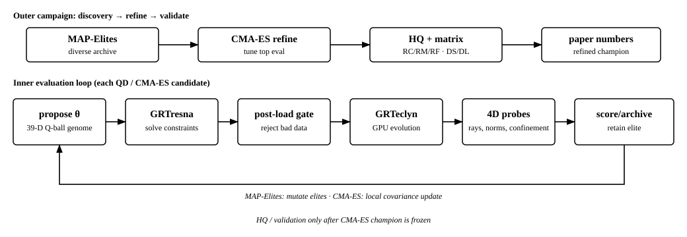
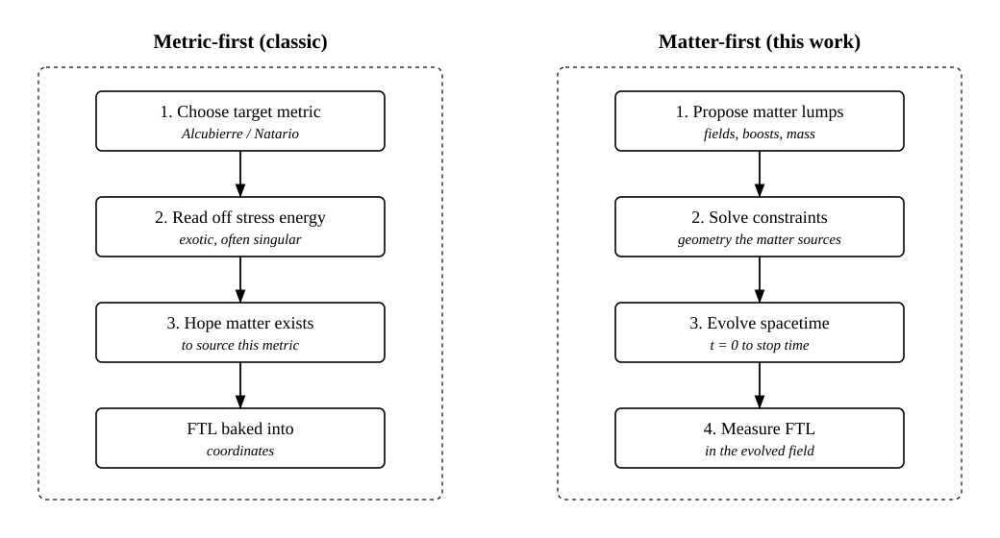
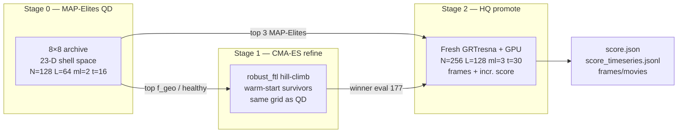
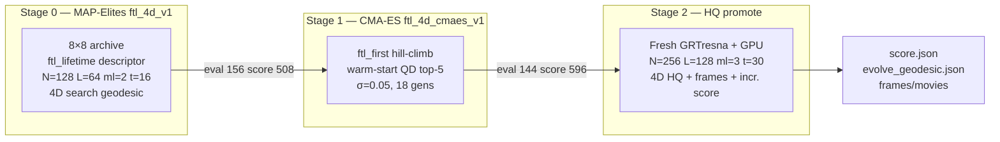

# MAP-Elites + CMA-ES FTL Discovery — Matter-First Metric Discovery

> Three-stage pipeline: **MAP-Elites** (wide survey) finds where good warps live in
> the 23-D shell search space; **CMA-ES** (local refinement) hill-climbs around
> the best *healthy* survivors; **HQ promotion** re-runs the top QD + CMA-ES elites
> at full resolution and extended time with incremental scoring. All stages share
> the same matter-first loop — propose lumps → GRTresna constraint solve → GRTeclyn
> GPU evolution → time-resolved FTL probes → score — but differ in proposer,
> resolution, and stop time.

## Table of contents

- [The idea: matter-first, not metric-first](#the-idea-matter-first-not-metric-first)
- [The pipeline](#the-pipeline)
  - [Diagram — end-to-end overview](#diagram--end-to-end-overview)
  - [Diagram — matter-first vs metric-first](#diagram--matter-first-vs-metric-first)
  - [Stage 0 — Quality-Diversity proposer (MAP-Elites)](#stage-0--quality-diversity-proposer-map-elites)
  - [Stage 1 — Initial data (GRTresna, CPU/MPI)](#stage-1--initial-data-grtresna-cpumpi)
  - [Stage 2 — Evolution (GRTeclyn, GPU)](#stage-2--evolution-grteclyn-gpu)
  - [Stage 3 — Metrics & probes (scoring)](#stage-3--metrics--probes-scoring)
  - [Stage 4 — Archive update & feedback](#stage-4--archive-update--feedback)
- [4D evolving null-geodesic trace (smoke test)](#4d-evolving-null-geodesic-trace-smoke-test-2026-06-15)
- [The hard consistency rule](#the-hard-consistency-rule)
- [Behavior descriptors (the "diversity" axes)](#behavior-descriptors-the-diversity-axes)
- [Scoring model (the "quality" axis)](#scoring-model-the-quality-axis)
  - [Plain-English glossary: every metric & penalty](#plain-english-glossary-every-metric--penalty)
- [Code map (where everything lives)](#code-map-where-everything-lives)
- [Building the binaries (GRTresna + GRTeclyn)](#building-the-binaries-grtresna--grteclyn)
- [How to run a campaign](#how-to-run-a-campaign)
  - [MAP-Elites (QD)](#map-elites-q-d)
  - [CMA-ES refinement after MAP-Elites](#cma-es-refinement-after-map-elites)
  - [ftl_4d_v1 → CMA-ES refinement proposal](#ftl_4d_v1--cma-es-refinement-proposal-2026-06-16)
  - [HQ promotion (full resolution)](#hq-promotion-full-resolution)
- [Campaign log / runs analysis](#campaign-log--runs-analysis) — quick index + reverse-chronological journal below
  - [v18: 4D QD + CMA-ES + HQ (ftl_4d line)](#v18-4d-qd--cma-es--hq-ftl_4d-line-2026-06-16)

## The idea: matter-first, not metric-first

Classic warp-drive analysis is **metric-first**: write down a target metric
(Alcubierre, Natário, …), then read off the stress-energy `T_ab = G_ab/8π` it
requires — which is always exotic, often pathological, and never solved as a
*consistent initial-value problem*. The "FTL" in those constructions is baked
into the chosen coordinates and need not survive a real evolution.

This project inverts that. The pipeline is **matter-first**:

1. The search proposes a **matter configuration** (massive scalar-field "lumps").
2. GRTresna **solves the Einstein constraint equations** for conformal factor and shift.
3. GRTeclyn **evolves** that spacetime forward on GPU.
4. Probes measure whether an FTL signature emerges and *persists*.
5. MAP-Elites stores the best candidate per behavior cell and mutates elites.

The payoff: any FTL signal that survives this loop is a property of a
**self-consistent, evolved spacetime**, not a hand-picked metric. Metrics are
iteratively hardened so the leaderboard cannot be gamed by coordinate artifacts
(see the [campaign log](#campaign-log--runs-analysis)).

## The pipeline

### Diagram — end-to-end overview

The closed loop: search proposes matter → physics builds and evolves a real
spacetime → metrics discover FTL signatures → archive feeds the next proposal.



### Diagram — matter-first vs metric-first



---

### Stage 0 — Quality-Diversity proposer (MAP-Elites)

MAP-Elites maintains an 8×8 behavior archive keyed by a 2-D descriptor. Each
batch it either **mutates an existing elite** (boundary-reflected Gaussian
perturbation, σ=0.15, ~85% of draws) or **samples inside the feasible box** of
known elites. Proposals are points in the 23-D `grtresna_shell` search space.

> **QD vs CMA-ES.** QD (`campaigns/qd/run.sh`) illuminates the 8×8 grid.
> CMA-ES (`campaigns/cmaes/run.sh` → `optimize`) hill-climbs from QD survivors.
> Same search space (`search/optimize/spaces.py`); only the proposer differs.
> See [CMA-ES refinement](#cma-es-refinement-after-map-elites).

### Stage 1 — Initial data (GRTresna, CPU/MPI)

`../GRTresna` paints lumps into `(φ, Π)` and runs a Lichnerowicz/York **constraint
solve**. CPU/MPI-bound; poorly-conditioned proposals fail the Ham/Mom gate and are
**rejected before the GPU**.

### Stage 2 — Evolution (GRTeclyn, GPU)

Converged initial data evolves via `RadialRecipe` to `STOP_TIME`, dumping plotfiles
every `PLOT_INTERVAL` steps.

### Stage 3 — Metrics & probes (scoring)

Plotfiles → diagnostics: constraints, `theta_plus`, comoving/shift stats, matter
density, and FTL probes — coordinate (`operational_ftl_solved`), evolved
(`operational_ftl`, `ftl_persistence`), gauge-invariant geodesic shortcut
(`operational_ftl_geodesic`), and (opt-in) **4D evolving** end-to-end null trace
(`ftl_geo_evolving`, weight 0 by default — diagnostic only).

### Stage 4 — Archive update & feedback

`metrics/score/` collapses diagnostics into `ftl_first` fitness. Only `gpu_ok`
candidates compete for a behavior cell. Rejected GRTresna solves log to
`trajectory.jsonl` but never enter the archive.

## The hard consistency rule

`T_ab` used in the GRTresna **constraint solve** must equal `T_ab` used in the
GRTeclyn **evolution**. Otherwise the run starts off-constraint and any apparent
"FTL" is a constraint-relaxation transient, not physics.

The `grtresna_independent_scalars` matter path exists precisely to keep both
sides identical; any new matter sector must be added to **both** sides with
matching analytic forms. (Root cause: `Examples/RadialRecipe/Debug.md`; see also
[Matter model](#matter-model--reference--future-directions-2026-06-10).)

## Behavior descriptors (the "diversity" axes)

Current descriptor: **`ftl_lifetime`** (`qd_search/descriptors.py`), added in
[v15](#v15-time-resolved-intermediate-ftl-scoring-2026-06-13):

- **x** — peak trustworthy `f_geo`, ramped `(f_geo − 1e-3)/(2e-1 − 1e-3)`.
- **y** — **FTL-lifetime fraction** (share of frames with a live shortcut).

Back-compat: **`speed_super`** (v14 default); `speed_horizon` retired after the
`theta_plus` centering bug (see [Status](#map-elites-ftl-discovery-status)).

## Scoring model (the "quality" axis)

Fitness is `ftl_first` in `metrics/score/` (CMA-ES may use `robust_ftl`; see
[v17](#v17-cma-es-robust-refinement-after-v16-2026-06-14)).

- **Gauge-invariant FTL dominates — time-averaged since v15.** `operational_ftl_geodesic`
  (×1000) only when `h_quality_ok` and all rays reach the detector; otherwise 0.
  Mean over all per-frame trustworthy magnitudes, gated by `structural_persistence`.
- **Dynamical signal next.** `operational_ftl` (×400, geodesic-gated) +
  `ftl_persistence` (×300) outweigh coordinate `operational_ftl_solved` (×50,
  shaping only). See [v9 review](#ftl_discovery_v9-review--shaping-rebalance--hq-promotion-2026-06-11).
- **Persistence-honest health.** `survival = numerical_survival × structural_persistence`
  (density retention × morphological coherence).
- **Vetoes / penalties.** Horizon (−500 when corroborated, [v16](#v16-ftl-champion-retention-2026-06-13)),
  exotic, instability, stationary warp-lens artifacts.

Geodesic ramp: `(f_geo − 1e-3)/(2e-1 − 1e-3)` — full marks need ~20% shortcut
([v9 recalibration](#geodesic-reward-recalibration--ftl_discovery_v9-2026-06-11)).

Per-component weight table: `grteclyn-wrapper/src/grteclyn_wrapper/metrics/README.md`.
Full component definitions → [glossary](#plain-english-glossary-every-metric--penalty).

### Plain-English glossary: every metric & penalty

Two modes: `weighted` (plain sum) and `ftl_first` (validated FTL dominates).

**1. FTL signals**

- **`operational_ftl_geodesic`** — null-ray shortcut; gauge-invariant; largest weight;
  reliability-gated; persistence-gated. **Frozen-snapshot:** per-frame static metric.
- **`ftl_geo_evolving`** — same shortcut measured by a **4D evolving** null trace through
  the full metric-stack history (`f_geo_evol` in timeseries); diagnostic only (weight 0).
  Typically **smaller** than frozen peak for dynamic lumps — see
  [smoke test](#4d-evolving-null-geodesic-trace-smoke-test-2026-06-15).
- **`operational_ftl`** — evolved coordinate shortcut; zeroed when trustworthy geodesic finds none.
- **`ftl_persistence`** — shortcut lasts across final frames.
- **`operational_ftl_solved`** — t=0 constraint-solved hint (localization-gated).
- **`ftl_precursor`, `channel_progress`, `shift_drive`** — shaping gradients; gated by persistence.
- **`ftl_shortcut`** — faint t=0 hint.

**2. Health rewards**

- **`numerical_survival`** — integrator reached stop time.
- **`structural_persistence`** — density retention × morphological coherence.
- **`survival`** = `numerical_survival × structural_persistence`.
- **`stability` / `comoving_stability`** — geometry drift.
- **`constraint_health`, `constraint_growth`, `initial_constraint_quality`** — Einstein solve quality.
- **`lapse_health`** — time-slicing behavior.
- **`energy_condition` / `anec_condition`** — physical energy rules.
- **`tidal_comfort`** — passenger survivability.
- **`curvature_activity`, `nontrivial_geometry`, `nonflat_geometry`, `expansion_asymmetry`** — non-flat geometry rewards.

**3. Penalties**

- **`exotic_penalty`** — graded 0..−1.6 for negative-energy matter.
- **`horizon_penalty`** — `theta_plus` proxy; −500 veto when lapse-collapsed trapped surface corroborated ([v16](#v16-ftl-champion-retention-2026-06-13)).
- **`instability_penalty`**, **`qei_penalty`**, **`boundary_penalty`**.
- **`stationary_artifact_penalty`** — static lens pretending to be FTL.

**Non-triviality gate** — health rewards off for flat vacuum.

## Code map (where everything lives)

| Concern | Path |
|---------|------|
| **MAP-Elites** QD loop, archive, descriptors | `grteclyn-wrapper/src/grteclyn_wrapper/search/qd_search/` |
| **CMA-ES** optimize loop, warm-start | `grteclyn-wrapper/src/grteclyn_wrapper/search/optimize/` |
| Search-space defs (shared QD + CMA-ES) | `search/optimize/spaces.py` |
| FTL champion retention | `search/ftl_retention.py` |
| Scoring (`ftl_first`, `robust_ftl`) | `grteclyn-wrapper/src/grteclyn_wrapper/metrics/score/` |
| Metric aggregation | `grteclyn-wrapper/src/grteclyn_wrapper/metrics/aggregation/collector.py` |
| FTL probes | `grteclyn-wrapper/src/grteclyn_wrapper/metrics/probes/ftl/` |
| **4D evolving geodesic** + metric-stack cache | `metrics/probes/ftl/evolving_geodesic.py`, `metric_field.py`, `metric_stack_cache.py`; collector hook in `collector.py` |
| Plotfile → frames + `ftl_timeseries.dat` | `grteclyn-wrapper/src/grteclyn_wrapper/visualisation/process_wave/consume_plotfiles/` |
| **Incremental HQ scoring** (`score_timeseries.jsonl`) | `metrics/aggregation/incremental.py`, wired in `consume_plotfiles/driver.py` |
| HQ promotion launcher | `grteclyn-wrapper/scripts/campaigns/hq/run_batch.sh`, `campaigns/hq/replay_eval.py` |
| Frame → movie stitching | `grteclyn-wrapper/scripts/plot/make_movies.sh` |
| Matter (evolution) | `Source/Matter/GRTresnaIndependentScalars.{hpp,impl.hpp}`, `Examples/RadialRecipe/` |
| Matter (initial data) | `../GRTresna/Examples/ScalarFieldBH/` |
| Campaign launcher (QD) | `grteclyn-wrapper/scripts/campaigns/qd/run.sh` |
| Campaign launcher (CMA-ES) | `grteclyn-wrapper/scripts/campaigns/cmaes/run.sh` |

## Building the binaries (GRTresna + GRTeclyn)

**GRTresna** = Chombo + conda-OpenMPI (CPU/MPI). **GRTeclyn** = AMReX + CUDA (GPU).
GRTresna build requires conda env on `PATH`/`LD_LIBRARY_PATH` and `CONDA_PREFIX`.

### One env to set first (every shell)

```bash
export GRTRESNA_ENV=/home/jovyan/.mlspace/envs/grtresna
export SIM_ROOT=/home/jovyan/nachevsky/test/simulation
export CHOMBO_HOME="${SIM_ROOT}/Chombo/lib"
export CONDA_PREFIX="${GRTRESNA_ENV}"
export PATH="${GRTRESNA_ENV}/bin:${PATH}"
export LD_LIBRARY_PATH="${GRTRESNA_ENV}/lib:${LD_LIBRARY_PATH:-}"
```

Shortcut: `source grteclyn-wrapper/scripts/lib/env.sh`. Full micromamba recipe:
`grteclyn-wrapper/src/grteclyn_wrapper/README.md` ("Installing GRTresna from scratch").

### Build GRTresna (initial-data solver, MPI)

```bash
cd "${SIM_ROOT}/GRTresna/Examples/ScalarFieldBH"
PATH="${GRTRESNA_ENV}/bin:${PATH}" CONDA_PREFIX="${GRTRESNA_ENV}" \
  make all -j4 CHOMBO_HOME="${CHOMBO_HOME}" MPI=TRUE
# -> Main_ScalarFieldBH3d.Linux.64.mpicxx.gfortran.OPTHIGH.MPI.ex
```

First time: `cd "${CHOMBO_HOME}" && make lib -j"$(nproc)"`. Header-only edits need
force-relink (rm `.ex` + listed `.o` files, then `make all`).

### Build GRTeclyn (evolution, GPU)

```bash
cd "${SIM_ROOT}/GRTeclyn/Examples/RadialRecipe"
make COMP=gnu USE_CUDA=TRUE USE_MPI=FALSE CUDA_ARCH=90 -j"$(nproc)"   # -> main3d.gnu.CUDA.ex
make COMP=gnu USE_CUDA=TRUE USE_MPI=TRUE  CUDA_ARCH=90 -j"$(nproc)"   # -> main3d.gnu.MPI.CUDA.ex
```

`CUDA_ARCH`: `90` = H100, `80` = A100, `70` = V100.

### Common failures → fixes (the MPI/conda gotcha)

| Symptom | Fix |
|---------|-----|
| `mpicxx` / `gfortran` not found | `export PATH="${GRTRESNA_ENV}/bin:${PATH}"` |
| `cannot find -lhdf5` | `export CONDA_PREFIX="${GRTRESNA_ENV}"` before `make` |
| `libmpi.so` / `libhdf5.so` missing at runtime | `export LD_LIBRARY_PATH="${GRTRESNA_ENV}/lib:..."` |
| `CHOMBO_HOME` undefined | `export CHOMBO_HOME="${SIM_ROOT}/Chombo/lib"` |
| Header edit "did nothing" | force-relink |
| `/bin/csh: No such file` | point Chombo at conda `tcsh` (README step 6) |

## How to run a campaign

### MAP-Elites (QD)

```bash
cd grteclyn-wrapper
QD_NAME=ftl_discovery_vN QD_ITERATIONS=10 BINS=8 STOP_TIME=16.0 \
  GPU_IDS="0 1 2 3 4 5 6 7" RANKS=8 LUMPS=5 SHELL_PROFILE=compact \
  GRTRESNA_MAX_HAM_PCT=5.0 GRTRESNA_MAX_MOM_PCT=5.0 \
  nohup bash scripts/campaigns/qd/run.sh \
  > ../runs/qd_ftl_discovery_vN.launch.log 2>&1 &
```

Results: `runs/grtresna_qd/ftl_discovery_vN/` (`trajectory.jsonl`, `score.json`, `frames/`).

### CMA-ES refinement after MAP-Elites

MAP-Elites surveys the 23-D shell box; CMA-ES locally refines around QD elites.
Two production lines:

| Line | QD source | Objective | Warm-start centre | Doc |
|------|-----------|-----------|-------------------|-----|
| **v17 (frozen geodesic era)** | `ftl_discovery_v16` | `robust_ftl` | Healthy survivors (eval 739), not raw king 233 | [v17](#v17-cma-es-robust-refinement-after-v16-2026-06-14) |
| **v18 / ftl_4d (4D search era)** | `ftl_4d_v1` | **`ftl_first`** (must match QD) | QD **156** → CMA-ES **144** | [v18](#v18-4d-qd--cma-es--hq-ftl_4d-line-2026-06-16) |

**Rule:** warm-started CMA-ES must use the **same** `OBJECTIVE_MODE`, grid, stop time,
and 4D geodesic profile as the QD run that produced the trajectory (`campaigns/lib/search_common.sh`).
Do **not** switch to `robust_ftl` on an `ftl_first` QD trajectory — scores will not compare.

**Legacy v17 launch** (`robust_ftl`, frozen-geodesic QD survivors):

**Launch (`ftl_cmaes_v17_robust`):**

```bash
cd grteclyn-wrapper
: > ../runs/cmaes_ftl_v17_robust.launch.log
RUNS_DIR=/home/jovyan/nachevsky/test/simulation/GRTeclyn/runs/grtresna_cmaes \
RUN_NAME=ftl_cmaes_v17_robust \
WARM_START_TRAJECTORY=/home/jovyan/nachevsky/test/simulation/GRTeclyn/runs/grtresna_cmaes_v17_seed_survivors.jsonl \
WARM_START_TOP_K=8 WARM_START_JITTER=0.05 SIGMA0=0.08 MAX_GENERATIONS=25 \
KEEP_TOP_EVAL_DIRS=10 FTL_RETENTION=1 \
GRTRESNA_ANSATZ=shell SHELL_PROFILE=compact LUMPS=5 RANKS=8 GPU_IDS="0 1 2 3 4 5 6 7" \
STOP_TIME=16.0 PLOT_INTERVAL=320 GRTRESNA_EVOLUTION_N_FULL=128 GRTRESNA_EVOLUTION_L_FULL=64.0 \
OBJECTIVE_MODE=robust_ftl GRTRESNA_MAX_HAM_PCT=5.0 GRTRESNA_MAX_MOM_PCT=5.0 \
SOLVED_FTL_NEAR_LUMINAL_SPEED_FLOOR=0.95 \
RANDOM_INJECTION_FRACTION=0.1 EXOTIC_INJECTION_FRACTION=0.1 \
nohup bash scripts/campaigns/cmaes/run.sh \
  >> ../runs/cmaes_ftl_v17_robust.launch.log 2>&1 &
```

| Knob | v17 value | Effect |
|------|-----------|--------|
| `WARM_START_TRAJECTORY` | `v17_seed_survivors.jsonl` | 4 QD survivors; x0 = eval 739 |
| `SIGMA0=0.08` | 8% of box | Local refinement |
| `OBJECTIVE_MODE=robust_ftl` | — | Persistence/survival/exotic rebalanced |
| `MAX_GENERATIONS=25` × pop 8 | ~200 evals | ~30–40 GPU-hours |

**Monitor:** `grep -a "\[optimize\]" ../runs/cmaes_ftl_v17_robust.launch.log | tail`;
`cat runs/grtresna_cmaes/ftl_cmaes_v17_robust/ftl_champions.json`.

### HQ promotion (full resolution)

After QD + CMA-ES identify elites at **low resolution** (`N=128`, `L=64`, `max_level=2`,
`t=16`), **HQ promotion** replays the same geometry genome with a fresh GRTresna solve
and a long GPU evolution at **full resolution** (`N=256`, `L=128`, `max_level=3`, `t=30`).
This is the stress test: does the shortcut survive finer grids and longer time?



| Stage | Script | Resolution | Stop time | Objective | Output dir |
|-------|--------|------------|-----------|-----------|------------|
| MAP-Elites | `campaigns/qd/run.sh` | 128³, L=64, ml=2 | 16 | `ftl_first` | `runs/grtresna_qd/ftl_discovery_v16/` |
| CMA-ES | `campaigns/cmaes/run.sh` | 128³, L=64, ml=2 | 16 | `robust_ftl` | `runs/grtresna_cmaes/ftl_cmaes_v17_robust/` |
| HQ promote | `campaigns/hq/run_batch.sh` → `campaigns/hq/replay_eval.py` | **256³, L=128, ml=3** | **30** | `ftl_first` | `runs/grtresna_promote/l128n256t30_*/` |

**Candidate pick (this batch):** CMA-ES winner **eval 177** plus MAP-Elites v16 top 3 by
`ftl_first` score — evals **233**, **446**, **676** (not the raw-speed outlier eval 643).

**Launch (2026-06-15):**

```bash
cd grteclyn-wrapper
CANDIDATES="177 3 233 0 446 1 676 2" \
  QD_RUN=/home/jovyan/nachevsky/test/simulation/GRTeclyn/runs/grtresna_qd/ftl_discovery_v16 \
  NAME_PREFIX=l128n256t30 \
  RUNS_DIR=/home/jovyan/nachevsky/test/simulation/GRTeclyn/runs/grtresna_promote \
  N_FULL=256 L_FULL=128 STOP_TIME=30 PLOT_INTERVAL=24 MAX_LEVEL=3 \
  bash scripts/campaigns/hq/run_batch.sh
# eval 177 sourced from runs/grtresna_cmaes/ftl_cmaes_v17_robust/eval_000177
```

**Incremental scoring (v18 HQ).** The plotfile consumer appends one JSON line per plotfile
to `small_data/score_timeseries.jsonl` with the same `ftl_first` objective as final
`score.json`. When `--evolving-geodesic` is on, **only `ftl_geo_evolving` earns geodesic
FTL credit** — frozen `f_geo` and coordinate `operational_ftl` stay at zero until the
end-of-run **4D HQ trace** completes (`evolving_geodesic.json`). Mid-run totals are
therefore **health + shaping only** (~50–100), not comparable to search finals (~500–600).

```bash
tail -f runs/grtresna_promote/l128n256t30_*/small_data/score_timeseries.jsonl
```

**Movies from in-flight frames:**

```bash
bash scripts/plot/make_movies.sh runs/grtresna_promote/l128n256t30_* --framerate 10
```

See [HQ promotion results (2026-06-15)](#hq-promotion-after-v16-qd--v17-cma-es-2026-06-15)
for analytics.

## Campaign log / runs analysis

Reverse-chronological journal below. Quick index:

| Campaign / section | Date | Headline |
|--------------------|------|----------|
| [**v18: 4D QD + CMA-ES + HQ**](#v18-4d-qd--cma-es--hq-ftl_4d-line-2026-06-16) | **06-16 → 06-17** | QD **192** → CMA-ES **144** winner **596** (+88); HQ **eval 144** @ t≈10 (**~34%**), incr. **~83** (4D-gated); genome **5 dynamic exotic lumps** |
| [**ftl_4d_v1 → CMA-ES proposal**](#ftl_4d_v1--cma-es-refinement-proposal-2026-06-16) | 06-16 executed | Planning doc for phase-1 CMA-ES knobs; **results → [v18](#v18-4d-qd--cma-es--hq-ftl_4d-line-2026-06-16)** |
| [**4D evolving geodesic smoke test**](#4d-evolving-null-geodesic-trace-smoke-test-2026-06-15) | **06-15 done** | Eval **086** @ N=256, t=8. **4D `f_geo` = 1.42%** vs frozen peak **5.75%** (~4× smaller); metric_stack cache (34 slices) works |
| [**ftl_max_speed_no_penalty_v1**](#ftl_max_speed_no_penalty_v1-max-speed-qd-survey-2026-06-15) | **06-15 done** | **200 evals**, 100 gpu_ok. Max speed **1.58 c** (eval 70); best score **eval 86** (+27.5); best geodesic **eval 92** (27.5% timeavg). Plateau; scores not comparable to v16 |
| [**HQ promotion: v16 + v17 CMA-ES**](#hq-promotion-after-v16-qd--v17-cma-es-2026-06-15) | **06-15 done** | 4/4 complete. **Incr. peak eval 233 score 749** @ t≈12; only **eval 177** finishes positive (+67). Horizon kills 3/4 by t=30 |
| [**Eval 177 physics + exotic vs Alcubierre + next directions**](#eval-177-what-is-actually-moving-faster-than-light-2026-06-15) | 06-15 | What's FTL: end-to-end **null transit ~1.06c**, not matter (matter sub-luminal). Exotic **~5–24× < Alcubierre**, **~100–200× milder NEC** (per-shortcut comparable). Reframe → persistence/transport + exotic-energy frontier |
| [**v17: CMA-ES robust refinement**](#v17-cma-es-robust-refinement-after-v16-2026-06-14) | 06-14 → **06-15 done** | **200 evals.** Winner eval **177**: f_geo **5.65%**, timeavg **16.3%**, exotic **−1.17**. Peak f_geo **eval 78** at **5.68%** |
| [**v16: FTL champion retention + horizon fix**](#v16-ftl-champion-retention-2026-06-13) | 06-13 | FTL hall of fame (`ftl_retention.jsonl`). Horizon penalty needs lapse corroboration. ~971 evals |
| [**v15: time-resolved FTL scoring**](#v15-time-resolved-intermediate-ftl-scoring-2026-06-13) | 06-13 | Per-frame `ftl_timeseries.dat`; time-averaged geodesic score; `ftl_lifetime` axis. Eval 231 peak **7.43%** at t=9.6 |
| [**v14 results & analytics**](#v14-campaign-results--analytics-2026-06-12-completed) | 06-12 | 504 evals, 351 gpu_ok. Top eval **231** f_geo=**5.30%**. Ring layout dominates |
| [`v14` launch setup](#v14-launch-setup-matter-profile-and-cloud-layout-2026-06-12) | 06-12 | Profile + cloud layout; 23-D search space |
| [Alcubierre positive control](#alcubierre-positive-control--metric-first-vs-matter-first-verdict-2026-06-12) | 06-12 | Probes validated (~32% on textbook metric). 129³ re-probe for QD H-gate |
| [`v12` → `v13`](#ftl_discovery_v12-review--lambda-phi4--ftl-geometry-layouts--ftl_discovery_v13-2026-06-12) | 06-12 | λφ⁴ + matter layouts; geodesic contradiction gate |
| [`v10` → `v11`](#ftl_discovery_v10-review--persistence-gate--physicality-pressure--ftl_discovery_v11-2026-06-12) | 06-12 | Persistence-gate geodesic; raise exotic/energy weights |
| [HQ verdict → `v10`](#hq-verdict-shortcuts-did-not-survive-refinement--ftl_discovery_v10-2026-06-11) | 06-11 | HQ killed all 3 promoted shortcuts. STOP_TIME 8→16; static toggle |
| [`v9` review + HQ promotion](#ftl_discovery_v9-review--shaping-rebalance--hq-promotion-2026-06-11) | 06-11 | Coordinate precursor out-voted geodesic → rebalanced; top 3 HQ |
| [Geodesic recalibration → `v9`](#geodesic-reward-recalibration--ftl_discovery_v9-2026-06-11) | 06-11 | `GEO_FTL_TARGET` 5%→20%; weight ×1500→×1000 |
| [Null-geodesic fix → `v8`](#null-geodesic-reliability-fix-2026-06-11-post-v7) | 06-11 | Forward rays + relative H-drift gate |
| [`ftl_discovery_v7`](#campaign-ftl_discovery_v7--finished-run--critical-leaderboard-review-2026-06-11) | 06-11 | Persistence honest; geodesic still blind |
| [`ftl_discovery_v4`](#campaign-ftl_discovery_v4--persistence-honest-scoring--bound-matter-2026-06-11) | 06-11 | Persistence-gated survival; searched mass; capped boosts |
| [Matter model](#matter-model--reference--future-directions-2026-06-10) | 06-10 | Lumps, file map, roadmap |
| [`ftl_discovery_v2`](#campaign-ftl_discovery_v2--first-healthy-run--a-scoring-concern-2026-06-10) | 06-10 | First sane scoring; geodesic under-weighted |
| [Stationary warp-lens fix](#scoring-fix-stationary-warp-lens-artifacts-2026-06-10-after-90-evals) | 06-10 | Reliability + stationary gates |
| [Navigation overhaul](#navigation-overhaul-2026-06-10) | 06-10 | `speed_super` descriptor; feasible-box sampling |
| [Status / reset](#map-elites-ftl-discovery-status) | 06-10 | `theta_plus` re-centered on `grid_center` |

---

## v18: 4D QD + CMA-ES + HQ (ftl_4d line) (2026-06-16)

**Context.** First **end-to-end production pipeline** with **4D evolving null-geodesic**
scoring in the search loop (`ftl_geo_evolving` headline in `ftl_first`), the same objective
through QD and CMA-ES, and HQ falsification with full **4D HQ verify** + frames +
incremental scoring. Supersedes the frozen-geodesic [v17](#v17-cma-es-robust-refinement-after-v16-2026-06-14)
line (`robust_ftl` on `ftl_discovery_v16`).



| Stage | Run dir | Script | Resolution | t | Objective | 4D mode | Status |
|-------|---------|--------|------------|---|-----------|---------|--------|
| MAP-Elites | `runs/grtresna_qd/ftl_4d/ftl_4d_v1/` | `campaigns/qd/run.sh` | 128³, L=64, ml=2 | 16 | `ftl_first` | **search** | **done** (192 evals, stopped early) |
| CMA-ES | `runs/grtresna_cmaes/ftl_4d_cmaes_v1/` | `campaigns/cmaes/run.sh` | 128³, L=64, ml=2 | 16 | `ftl_first` | **search** | **done** (144 evals) |
| HQ | `runs/grtresna_promote/l128n256t30_ftl_4d_cmaes_qd_eval000144/` | `campaigns/hq/run_batch.sh` | **256³, L=128, ml=3** | **30** | `ftl_first` | **hq** | **in progress** (~34% t) |

---

### Stage 0 — MAP-Elites QD (`ftl_4d_v1`)

**Launch (2026-06-16):**

```bash
cd grteclyn-wrapper
RUNS_DIR="${GRTECLYN_ROOT}/runs/grtresna_qd/ftl_4d" \
QD_NAME=ftl_4d_v1 QD_TARGET_EVALS=200 BATCH_SIZE=8 \
GPU_IDS="0 1 2 3 4 5 6 7" \
  bash scripts/campaigns/qd/run.sh
```

**Configuration:** `campaigns/lib/search_common.sh` — `OBJECTIVE_MODE=ftl_first`,
`DESCRIPTOR_MODE=ftl_lifetime`, `GRTECLYN_EVOLVING_GEODESIC=1`,
`GRTECLYN_EVOLVING_GEODESIC_MODE=search`, plotfile consume + delete, `consumer_keep_last=3`.

**Result:** **192** trajectory records (**105** `gpu_ok`), stopped at target 200 to hand off
to CMA-ES. Archive saturated late (only **4/40** recent evals improved) but a large final
jump at eval **156**.

| Leaderboard | Eval | Score | `ftl_geo_evolving` | Cell | Notes |
|-------------|------|-------|---------------------|------|-------|
| Best score | **156** | **508.5** | **0.346** | [2,7] | FTL champions: `superluminal_fraction=1.0`, exotic −1.6 |
| #2 | 142 | 382.6 | 0.275 | [2,7] | Same lifetime column |
| #3 | 145 | 368.6 | 0.287 | [2,7] | Neighbour in parameter space |

**Artifacts:** `trajectory.jsonl`, `archive.json`, `ftl_champions.json`, 15 retained
`eval_*/` (heavy plotfiles/gridinit stripped post-run → ~106 MB).

**Saturation plot:** `grteclyn-wrapper/src/grteclyn_wrapper/visualisation/plots/qd_batch_progress_ftl_4d_v1.png`

---

### Stage 1 — CMA-ES refinement (`ftl_4d_cmaes_v1`)

Executed the [phase-1 proposal](#ftl_4d_v1--cma-es-refinement-proposal-2026-06-16): warm-start
from QD trajectory, tight local search around eval **156** (`x₀` = top vector).

**Launch (2026-06-16):**

```bash
RUN_NAME=ftl_4d_cmaes_v1 \
WARM_START_TRAJECTORY="${GRTECLYN_ROOT}/runs/grtresna_qd/ftl_4d/ftl_4d_v1/trajectory.jsonl" \
WARM_START_TOP_K=5 WARM_START_JITTER=0.03 SIGMA0=0.05 MAX_GENERATIONS=18 \
RANDOM_INJECTION_FRACTION=0.05 EXOTIC_INJECTION_FRACTION=0.0 \
GPU_IDS="0 1 2 3 4 5 6 7" \
  bash scripts/campaigns/cmaes/run.sh
```

**Result:** **144/144** evals (**140** `gpu_ok`, 4 `solved_ftl_rejected`). Steady monotonic
improvement through all 18 generations — phase 2 not needed.

| | QD best (156) | **CMA-ES winner (144)** | Δ |
|--|---------------|-------------------------|---|
| Score (`ftl_first`) | 508.5 | **596.3** | **+87.8 (+17%)** |
| `ftl_geo_evolving` | 0.346 | **0.395** | +14% |
| `exotic_penalty` | −1.6 | −1.6 | same tier |

**CMA-ES generation progression** (all-time best):

| Gen | Best | Mean (batch) |
|-----|------|--------------|
| 1 | 514.2 | 407.6 |
| 5 | 533.7 | 523.3 |
| 10 | 558.6 | 546.9 |
| 15 | 580.9 | 576.4 |
| **18** | **596.3** | **589.0** |

**Artifacts:** `runs/grtresna_cmaes/ftl_4d_cmaes_v1/` — `result.json`, `trajectory.jsonl`,
`ftl_champions.json`, winner `eval_000144/`.

**Readout:** Tight σ=0.05 refinement around the QD elite cluster delivered **+88 points** without
changing resolution or objective — validates the QD→CMA-ES handoff for the 4D-scored line.

---

### Genome — eval **144** (CMA-ES winner / HQ promote)

Same 23-D shell genome replayed at HQ resolution; matter is rebuilt from overrides via a
fresh GRTresna solve.

| Property | Value | Notes |
|----------|-------|-------|
| **Lumps** | **5** | Fixed campaign knob `LUMPS=5` in `search_common.sh` — **not** evolved by MAP-Elites or CMA-ES (~18 shell parameters only; lump count is a mesh-resolution knob, not a search dimension) |
| **Ansatz** | **Full-sphere shell** | Fibonacci lattice on an oriented axis (`grtresna_matter_layout ≈ 2.77`) |
| **Static vs dynamic** | **Dynamic** | `grtresna_shell_static ≈ 0.035` → rounds to **0** (moving matter; only `≥1` zeroes all currents) |
| **Shell currents** | tor **−1.20**, pol **−0.53**, rad **+0.30**, **ω ≈ 0.39** | Momentum-carrying bubble + spin |
| **Shift seed** | **−0.44** | Frame-drag / warp motor (`shift_drive > 0` in scoring) |
| **Exotic sector** | **`exotic_fraction ≈ 0.91`** | ~**91%** of shell in exotic wedge; all 5 lumps exotic in GRTresna |
| **Max coordinate speed** | **~1.27 c** | CMA-ES search @ t=16 (`max_local_speed`); HQ mid-run similar |
| **4D null shortcut (search)** | **`f_geo_evol ≈ 0.08`** (**8%**) | CMA-ES `eval_000144/small_data/evolving_geodesic.json` @ N=128, t=16 |
| **Frozen geodesic (HQ diagnostic)** | **~11%** peak mid-run | Visible in `ftl_timeseries.dat` but **not credited** in incremental score until 4D HQ trace |

**Mechanism readout:** shift-driven **dynamic** exotic shell — not the static-lump family
(`shell_static=1`). FTL claim rests on evolved geometry + end-to-end 4D null geodesics, not
frozen mid-run snapshots.

---

### Stage 2 — HQ promotion (`eval_000144`) — in progress

**Launch (2026-06-17):** promote CMA-ES winner at full resolution; same `ftl_first` objective,
**4D HQ verify** profile, frames on, incremental `score_timeseries.jsonl`. First attempt aborted
@ t≈10.7 (old incremental scoring stacked frozen + coordinate FTL → ~1156); **restarted** with
4D-authoritative incremental gating (`evolving_geodesic_mode` in `metrics/score/ftl.py`).

```bash
SOURCE_RUN="${GRTECLYN_ROOT}/runs/grtresna_cmaes/ftl_4d_cmaes_v1" \
CANDIDATES="144 0" \
NAME_PREFIX=ftl_4d_cmaes \
FORCE=1 \
  bash scripts/campaigns/hq/run_batch.sh
```

Future runs use folder name **`ftl_4d_cmaes_hq_eval000144`** (campaign slug + `_hq_eval*`; no
`l128n256t30_` prefix) — see `campaigns/lib/promote_common.sh`.

| Knob | Value |
|------|-------|
| Output | `runs/grtresna_promote/l128n256t30_ftl_4d_cmaes_qd_eval000144/` (this run; legacy name) |
| Grid | N=256, L=128, ml=3, t=30, plot_interval=24 (~126 frames) |
| 4D | `--evolving-geodesic`, `GRTECLYN_EVOLVING_GEODESIC_MODE=hq` |
| Frames | `GRTECLYN_FRAMES=1` → `frames/*_z/` |
| Scoring | `ftl_first` + gated incremental (`ftl_geo_evolving` only after 4D trace) |
| GRTresna | Fresh solve (Ham ~0.51%, Mom ~0.05%, 7 iter) |

**Mid-run snapshot (~t≈10.2 / 30, ~34% complete, restarted run):**

| Metric | Value | Notes |
|--------|-------|-------|
| Incremental score (peak so far) | **~83** @ t≈2.9 | **4D-gated** — health + shaping only; comparable scale to pre-FTL baseline, **not** to CMA-ES final **596** |
| `ftl_geo_evolving` (incremental) | **0** | expected until end-of-run 4D HQ trace |
| Frozen `f_geo` (diagnostic) | **~11%** peak | in `ftl_timeseries.dat`; **not** in incremental total |
| `max_local_speed` | **~1.27 c** | matches CMA-ES search tier |
| `horizon_penalty` | **0** | no corroborated trapped surface yet |
| 4D `f_geo` (end-to-end) | **pending** | written at end → `small_data/evolving_geodesic.json`; expect jump to **~500–600** if search `f_geo_evol ≈ 0.08` holds at HQ |
| Frames | **700+** PNGs | 8 fields × z-slices |

**Monitor:**

```bash
tail -f runs/grtresna_promote/l128n256t30_ftl_4d_cmaes_qd_eval000144.log
tail -f runs/grtresna_promote/l128n256t30_ftl_4d_cmaes_qd_eval000144/small_data/score_timeseries.jsonl
bash scripts/plot/make_movies.sh runs/grtresna_promote/l128n256t30_ftl_4d_cmaes_qd_eval000144 --framerate 10
```

**Open (fill when HQ completes):** final `score.json`, HQ 4D `f_geo` vs frozen peak,
whether shortcut persists to t=30, horizon at late times (cf. [eval 086 HQ t=30](#hq-t30-confirmation--full-history-collapses-the-shortcut-to-zero-2026-06-16)
where 4D trace went to **0**).

---

### v18 vs v17 (frozen-geodesic era)

| | v17 | **v18 (ftl_4d)** |
|--|-----|------------------|
| QD objective | `ftl_first` (frozen geodesic) | `ftl_first` + **4D search geodesic** |
| CMA-ES objective | **`robust_ftl`** | **`ftl_first`** (matched to QD) |
| CMA-ES gain | +32 pts vs seed 739 | **+88 pts** vs QD 156 |
| HQ candidate | eval 177 (+67 final @ t=30) | eval **144** (in progress) |
| Headline metric | frozen `operational_ftl_geodesic` timeavg | **`ftl_geo_evolving`** |

**Takeaway (stages 0–1):** The 4D-scored search loop finds elites that **CMA-ES can still
improve locally** (+17% score) with matched physics — the first validated QD→CMA-ES→HQ
pipeline on the new metric stack. HQ will determine whether the CMA-ES winner survives
full resolution and extended time under the **honest 4D trace**.

---

## ftl_4d_v1 → CMA-ES refinement proposal (2026-06-16)

> **Status:** executed as [v18 stage 1](#stage-1--cma-es-refinement-ftl_4d_cmaes_v1). Kept
> as the planning record for CMA-ES knob choices.

**Context.** First full QD campaign with **4D evolving geodesic** in the search loop
([integration](#4d-in-the-qd-search-loop-2026-06-16): `GRTECLYN_EVOLVING_GEODESIC=1`,
`GRTECLYN_EVOLVING_GEODESIC_MODE=search`, `ftl_geo_evolving` headline in `ftl_first`).
Run: `runs/grtresna_qd/ftl_4d/ftl_4d_v1/` (~**190** evals, **103** `gpu_ok`).

QD is **saturated but not dead**: archive gains are infrequent (4/40 recent evals improved),
yet the last major jump was large (+140 at eval 156). CMA-ES should be a **tight hill-climb
around eval 156**, not a second discovery pass.

### QD outcome — best candidate for CMA-ES

| Field | eval **156** |
|-------|----------------|
| **Score** | **508.5** (+126 over #2 eval 142) |
| **Path** | `runs/grtresna_qd/ftl_4d/ftl_4d_v1/eval_000156` |
| **Archive cell** | `[2, 7]` — high `ftl_geo_evolving` × full `ftl_lifetime` |
| **Champions** | `ftl_geo_evolving` **0.346**, `f_geo_evol` **0.070**, `superluminal_fraction` **1.0** |
| **Main drag** | `exotic_penalty` **−1.6** (max tier; `exotic_fraction` ≈ **0.90**) |
| **Wall time** | ~**13 min**/eval @ 8 GPUs |

**Top-8 warm-start pool** (default CMA-ES loader, by score):

| Rank | Eval | Score | Cell | `ftl_geo_evolving` |
|------|------|-------|------|---------------------|
| 1 | **156** | 508.5 | [2,7] | 0.346 |
| 2 | 142 | 382.6 | [2,7] | 0.275 |
| 3 | 145 | 368.6 | [2,7] | 0.287 |
| 4 | 166 | 306.0 | [1,7] | 0.197 |
| 5 | 95 | 281.9 | [1,7] | 0.213 |
| 6–8 | 181, 179, 153 | 202–243 | [0–1,7] | 0.07–0.19 |

CMA-ES sets the initial mean **`x₀` = eval 156** (top trajectory vector). Gen 1 replaces
the first `min(top_k, popsize)` solutions with the exact best vector plus jittered copies of
ranks 2…k (`search/optimize/driver.py`).

### Recommended CMA-ES — phase 1 (local refinement)

Tighter than launcher defaults because QD already mapped the elite basin around column **7**
(full lifetime). Target: **+20–50** score if lucky; do not expect another +140 spike.

```bash
cd grteclyn-wrapper

RUN_NAME=ftl_4d_cmaes_v1 \
RUNS_DIR="${GRTECLYN_ROOT}/runs/grtresna_cmaes" \
WARM_START_TRAJECTORY="${GRTECLYN_ROOT}/runs/grtresna_qd/ftl_4d/ftl_4d_v1/trajectory.jsonl" \
WARM_START_TOP_K=5 \
WARM_START_JITTER=0.03 \
SIGMA0=0.05 \
MAX_GENERATIONS=18 \
RANDOM_INJECTION_FRACTION=0.05 \
EXOTIC_INJECTION_FRACTION=0.0 \
KEEP_TOP_EVAL_DIRS=10 \
FTL_RETENTION=1 \
SEED=7 \
GPU_IDS="0 1 2 3 4 5 6 7" \
  nohup bash scripts/campaigns/cmaes/run.sh \
  > ../runs/ftl_4d_cmaes_v1.launch.log 2>&1 &
```

| Knob | Phase-1 value | Default | Rationale |
|------|---------------|---------|-----------|
| `OBJECTIVE_MODE` | **`ftl_first`** (implicit) | same | Must match QD; never `robust_ftl` here |
| `WARM_START_TOP_K` | **5** | 8 | Ranks 6–8 are far weaker (202 vs 508); stay in elite cluster |
| `WARM_START_JITTER` | **0.03** | 0.05 | Smaller gen-1 spread — QD already explored this region |
| `SIGMA0` | **0.05** | 0.08 | Peaked landscape; local refinement not re-discovery |
| `MAX_GENERATIONS` | **18** | 25 | ~**144** evals ≈ **31 h**; extend only if still improving |
| `RANDOM_INJECTION_FRACTION` | **0.05** | 0.10 | Less wasted GPU once QD coverage is done |
| `EXOTIC_INJECTION_FRACTION` | **0** | 0.10 | Elites already exotic-heavy; injection re-hits −1.6 penalty |
| Physics | `search_common.sh` defaults | — | Same N=128, L=64, ml=2, t=16, 4D **search** profile |

**Monitor:**

```bash
tail -f ../runs/ftl_4d_cmaes_v1.launch.log
tail -f runs/grtresna_cmaes/ftl_4d_cmaes_v1/trajectory.jsonl
uv run python -m grteclyn_wrapper.visualisation.search \
  runs/grtresna_cmaes/ftl_4d_cmaes_v1 --batch-size 8   # batch saturation plot
```

**Stop early** (or skip phase 2) if best score flat for **≥5 generations**, or best stays
≤ **520** with no `ftl_geo_evolving` gain.

### Phase 2 — only if phase 1 stalls

Warm-start from the CMA-ES trajectory; widen search slightly:

```bash
RUN_NAME=ftl_4d_cmaes_v2 \
WARM_START_TRAJECTORY="${GRTECLYN_ROOT}/runs/grtresna_cmaes/ftl_4d_cmaes_v1/trajectory.jsonl" \
WARM_START_TOP_K=8 WARM_START_JITTER=0.05 SIGMA0=0.08 \
MAX_GENERATIONS=12 \
RANDOM_INJECTION_FRACTION=0.10 EXOTIC_INJECTION_FRACTION=0.05 \
  bash scripts/campaigns/cmaes/run.sh
```

If still flat → return to **QD** seeded near eval 156, not more CMA-ES.

### HQ in parallel (do not wait on CMA-ES)

CMA-ES at QD resolution may only squeeze marginal gains. Promote the QD elite while
CMA-ES runs — falsification at N=256, L=128, ml=3, t=30 with full 4D **HQ** trace:

```bash
SOURCE_RUN="${GRTECLYN_ROOT}/runs/grtresna_qd/ftl_4d/ftl_4d_v1" \
CANDIDATES="156 0 142 1 145 2" \
NAME_PREFIX=ftl_4d \
  bash scripts/campaigns/hq/run_batch.sh
```

If CMA-ES beats 508, promote the new winner as well.

### What not to do

- **`robust_ftl`** on this trajectory — scores incomparable to QD `ftl_first`.
- **`SIGMA0=0.15`** on phase 1 — leaves the eval-156 basin.
- **`WARM_START_TOP_K=1`** — loses gen-1 diversity from jittered elites 142/145/166/95.
- **Expect huge jumps** — QD's last archive gain was +140 at eval 156; CMA-ES is polish.

### vs v17 CMA-ES

| | v17 (`ftl_cmaes_v17_robust`) | ftl_4d proposal |
|--|------------------------------|-----------------|
| QD source | `ftl_discovery_v16` (frozen geodesic) | `ftl_4d_v1` (4D search geodesic) |
| Objective | `robust_ftl` | **`ftl_first`** |
| Best seed | eval 739 (healthy, not king 233) | eval **156** (clear score leader) |
| Headline metric | frozen `operational_ftl_geodesic` timeavg | **`ftl_geo_evolving`** |
| Typical gain | +0.26 pp f_geo, −11% exotic vs seed | TBD; expect smaller at same grid |

---

## 4D evolving null-geodesic trace (smoke test, 2026-06-15)

**Context.** Since [v8](#null-geodesic-reliability-fix-2026-06-11-post-v7), gauge-invariant FTL
has been measured by **frozen-snapshot** null-ray tracing: for each plotfile time `t`, build a
static 3D metric `g_{μν}(x,y,z)` from that Cauchy slice and integrate null geodesics with the
same RK4 Hamiltonian integrator (`metrics/probes/ftl/geodesic.py`). Per-frame `f_geo(t)` feeds
`ftl_timeseries.dat`; the scorer time-averages trustworthy magnitudes into
`operational_ftl_geodesic` / `ftl_geo_timeavg`.

**The gap (already flagged for eval 177).** Matter lumps move at **0.2–0.8 c**; the metric
evolves on **~10M**, comparable to the **~16M** light-crossing time. A photon threading the
channel in real time sees a **changing** geometry. The frozen probe answers: *"if I froze the
spacetime at t, what shortcut would a null ray see?"* — not *"what shortcut does a ray
experience through the actual history?"*

**New probe — 4D evolving trace.** Opt-in end-of-run integration through a time-interpolated
4-metric stack (`EvolvingMetricField` in `metric_field.py`):

1. **During consume** (`--evolving-geodesic`): each plotfile is sampled to `g_{μν}` on a 65³
   grid and written to `small_data/metric_stack/*.npz` **before** HDF5 plotfiles are deleted
   (`metric_stack_cache.py`; enabled automatically with the flag).
2. **At episode end** (`collector.py`): rebuild `g(t,x,y,z)` from the cache (≥3 slices),
   linearly interpolate in simulation time, finite-difference `∂_μ g^{ab}`, integrate null rays
   with `t_emit = times[0]` (`evolving_geodesic.py`).
3. **Outputs:** `small_data/evolving_geodesic.json`; last row of `ftl_timeseries.dat` patched
   with `f_geo_evol` / `f_geo_evol_ok`. Score component `ftl_geo_evolving` is the **headline
   geodesic reward in the QD loop** when the probe runs; frozen timeavg is zeroed.

**Smoke run** — validate cache + 4D integration on a real evolved spacetime without a full
t=30 HQ bill:

| | |
|--|--|
| **Run** | `runs/grtresna_promote/l128n256t8_evol_cache_smoke_qd_eval000086` |
| **Source** | QD [eval 086](#ftl_max_speed_no_penalty_v1-max-speed-qd-survey-2026-06-15) (`ftl_max_speed_no_penalty_v1`) |
| **Grid / time** | L=128, N=256, `max_level=3`, **t=8** (not 30) |
| **Mode** | GPU-only replay from HQ-promote `initial_data.gridinit` (`GRIDINIT=…`, `--gridinit`) |
| **Flags** | `--evolving-geodesic`, `consumer_keep_last=3`, `ftl_first` incremental scoring |
| **Metric stack** | **34** cached slices (`small_data/metric_stack/`) |

Launch (from `grteclyn-wrapper/`):

```bash
GRIDINIT=runs/grtresna_promote/l128n256t30_ftl_max_speed_qd_eval000086/initial_data.gridinit \
QD_RUN=runs/grtresna_qd/ftl_max_speed/ftl_max_speed_no_penalty_v1 \
STOP_TIME=8 N_FULL=256 L_FULL=128 NAME_PREFIX=evol_cache_smoke \
CANDIDATES="086 0" FORCE=1 GRTECLYN_FRAMES=0 \
bash scripts/campaigns/hq/run_batch.sh
```

### Frozen vs 4D — same candidate, same physics

| Probe | What it measures | Result (eval 086 smoke) | Notes |
|-------|------------------|-------------------------|-------|
| **Frozen per-frame** `f_geo(t)` | Static null ray on each snapshot | **Peak 5.75%** @ t≈4.08; time-mean mag **11.5%** of scorer scale (`ftl_geo_timeavg=0.115`) | Existing pipeline; 35 frames in `ftl_timeseries.dat` |
| **Frozen peak on stack** `f_geo_frozen_peak` | Max frozen `f_geo` over the same cached slices (sanity check) | **5.75%** | Matches timeseries peak — stack rebuild is consistent |
| **4D evolving** `f_geo` | Single end-to-end null ray through interpolated `g(t,x,y,z)` | **1.42%** | `t_emit=0`, `t_arrival≈14.2`, `t_flat=14.4`; **5/5** rays, `h_quality_ok=True` |
| **Ratio** | Evolving / frozen peak | **≈ 0.25×** (~**4× smaller**) | Dynamic geometry erodes most of the snapshot shortcut |

Artifact: `small_data/evolving_geodesic.json` (recomputed post-run after JSON-serialization fix).

**Readout.** The smoke test **confirms the frozen-snapshot caveat** from
[eval 177](#eval-177--hq-time-evolution-n256-t30): the mid-run frozen peak (**5.75%**) **overstates**
the gauge-invariant shortcut seen by a ray that actually traverses the **evolving** channel
(**1.42%**). This is the expected direction — not a failure of the 4D integrator (frozen peak
on the same stack matches the timeseries). Implications:

- **`operational_ftl_geodesic` / `ftl_geo_timeavg` are optimistic** for dynamic lumps; ranking
  by frozen time-average may prefer geometries whose shortcut is partly a "strobe" artifact.
- **4D `f_geo` is the honest end-to-end gauge-invariant number** for transport questions; keep
  frozen traces for cheap per-frame monitoring, use evolving trace for verification / paper claims.
- At **t=8** the final frozen slice has `f_geo=0` (channel already faded) while the 4D trace
  still integrates over the full history including the t≈4 peak — another reason snapshot-only
  scoring can mis-rank decaying pulses.

**Implementation notes (bugs found in smoke).**

1. **Metric-stack cache silently failed** on first attempt: `worker.py` used `Path` without
   importing it — fixed in `700d958`.
2. **`evolving_geodesic.json` not written** on the first successful GPU run: `json.dumps`
   cannot serialize `numpy.bool_` / `numpy.float64` from the report dataclass — fixed with
   `_json_safe()`; collector now logs each step (`logger.exception` on failure).

**Next.** Enable `--evolving-geodesic` on full HQ promotes (t=30); consider nonzero
`ftl_geo_evolving` weight only after 4D/frozen ratios are catalogued across elites. Longer smoke
or HQ replay of eval **092** (stronger frozen geodesic) to see whether the ~4× gap persists.

### HQ t=30 confirmation — full history collapses the shortcut to zero (2026-06-16)

First **full HQ promote** with `--evolving-geodesic` on (frames enabled): a from-scratch GRTresna
solve + GPU evolution to **t=30**, not a truncated GPU-only replay.

| | |
|--|--|
| **Run** | `runs/grtresna_promote/l128n256t30_ftl_max_speed_4d_qd_eval000086` |
| **Source** | QD [eval 086](#ftl_max_speed_no_penalty_v1-max-speed-qd-survey-2026-06-15) (`ftl_max_speed_no_penalty_v1`) |
| **Grid / time** | L=128, N=256, `max_level=3`, **t=30** (full evolution) |
| **Mode** | GRTresna initial-data solve → GPU evolution (not a `--gridinit` replay) |
| **Flags** | `--evolving-geodesic`, frames on, `consumer_keep_last=3`, `ftl_first` |
| **Metric stack / frames** | **124** cached slices, **126** frames (lockstep, one per plotfile) |
| **Finalization cost** | ~**14 min** CPU (frozen-peak scan over 124 slices + evolving trace; many late-time rays burn toward the 50k-step cap) |

**Bubble lifecycle (per-frame `ftl_timeseries.dat`).** The coordinate warp **rises, peaks ~t≈4–8,
then fully dissipates** by t=30:

| metric | t≈1.9 | t≈7.9 (peak) | t≈11.8 | t≈30 (end) |
|--------|-------|--------------|--------|------------|
| `f_op` (coord FTL) | 0.026 | **0.166** | 0.136 | **0.000** |
| `max_local_speed` | 1.12 | **1.33** | 1.28 | 1.07 |
| `superluminal_fraction` | 0.11 | **0.91** | 0.84 | 0.01 |
| `n_reached` / 5 (frozen) | 5 | 5 | 2–3 | **0** |

**Frozen vs 4D — full t=30 history:**

| Probe | Result (eval 086 HQ t=30) | Notes |
|-------|---------------------------|-------|
| **Frozen peak on stack** `f_geo_frozen_peak` | **5.75%** @ t≈4.08 | Same peak as the t=8 smoke — stack rebuild consistent |
| **Frozen per-frame** scorer channels | `ftl_geo_peak=0.284`, `ftl_geo_timeavg=0.032` | Still credit the transient |
| **4D evolving** `f_geo` | **0.0** — **0/5** rays reached detector | `t_emit=0`, `t_arrival=null`, `max_h_rel_drift=3.72` (≫ tol), `h_quality_ok=False` |

Artifact: `small_data/evolving_geodesic.json`.

**Readout — the honest answer flips with a complete history.** The t=8 smoke reported a small but
**positive** 4D shortcut (1.42%, 5/5 rays reached) because its truncated stack held the faded last
slice as a near-flat tail the ray could coast through. With the **full t=30 history**, the ray
emitted at `t_emit=0` must thread the geometry *while it is violently forming and collapsing*: it
accumulates enormous Hamiltonian drift (`h_rel=3.72`) and **never reaches the detector**. So:

- **Frozen peak 5.75% is not realized end-to-end.** The 4D trace returns **`f_geo=0` and flags
  itself untrustworthy** (`h_quality_ok=False`) — no reliable gauge-invariant shortcut exists for a
  real pulse traversing this dynamic channel.
- This is the strongest demonstration yet of the frozen-snapshot caveat: a candidate that looks
  like a ~5.75% mid-run shortcut delivers **zero** honest transport once time-evolution is
  integrated. `ftl_geo_evolving = 0.0` in the score, as it should be.

**Score verdict — not a breakthrough.** Total **−492.6**, dominated by `horizon_penalty=−1.0`
(trapped-surface proxy fires), `exotic_penalty=−1.6` (exotic matter required), and
`instability_penalty=−0.96`. eval 086 is a strong-looking *transient coordinate* warp with **no
real 4D FTL**, a horizon, and exotic-matter dependence. The probe validated cleanly on a realistic,
non-trivial HQ run.

**Caveat for weighting.** The 14-min finalization (frozen-peak scan re-tracing 5 rays × 124 slices,
many running to the step cap) is the cost driver. Before enabling a nonzero `ftl_geo_evolving`
weight in a search loop, cap the frozen-peak slice count or step budget so finalization stays
sub-minute on long t=30 stacks.

### 4D in the QD search loop (2026-06-16)

The HQ t=30 falsification of eval 086 showed frozen per-frame / time-averaged geodesic scoring
was **optimistically ranking strobing coordinate warps**. The search loop now measures **4D
end-to-end transport** instead:

| Layer | Change |
|-------|--------|
| **Enable in QD** | `campaigns/qd/run.sh` exports `GRTECLYN_EVOLVING_GEODESIC=1` |
| **Fast profile** | `GRTECLYN_EVOLVING_GEODESIC_MODE=search`: skip frozen-peak scan, stride-2 temporal subsample (max 40 slices), 33³ metric cache, 3 rays, 15k step cap, `h_rel` early abort |
| **HQ verify** | Promotes use `GRTECLYN_EVOLVING_GEODESIC_MODE=hq` (full stack, frozen peak, 65³, 5 rays) |
| **Scoring** | When 4D runs, `ftl_geo_evolving` is the headline geodesic reward (1000× in `ftl_first`); frozen `ftl_geo_timeavg` / `ftl_geo_peak` are zeroed; if 4D finds no reliable shortcut, frozen credit is also zero |
| **Fallback** | When the FTL gate skips 4D (no superluminal signal), frozen timeavg still applies |

Code: `evolving_geodesic_options.py` (`SEARCH_OPTIONS` / `HQ_OPTIONS`), collector passes profile
from env, `ftl.py` authoritative gate.

**Next.** ~~Re-run a short QD pilot (~50 evals)~~ → **`ftl_4d_v1`** completed (~190 evals);
see [CMA-ES refinement proposal](#ftl_4d_v1--cma-es-refinement-proposal-2026-06-16).

---

## ftl_max_speed_no_penalty_v1: max-speed QD survey (2026-06-15)

**Context.** Side MAP-Elites campaign after [v16](#v16-ftl-champion-retention-2026-06-13) /
[v17 CMA-ES](#v17-cma-es-robust-refinement-after-v16-2026-06-14) to stress-test **maximum
superluminal coordinate speed** without exotic/horizon score vetoes. Hypothesis: relaxing
penalties would let QD climb to higher `max_local_speed` basins and reveal whether strong
geodesic FTL can coexist with extreme superluminal volume.

**Change**
- Run: `ftl_max_speed_no_penalty_v1` under `runs/grtresna_qd/ftl_max_speed/`.
- Descriptor **`speed_super`** (cone-tilt × superluminal fraction) — not `ftl_lifetime`.
- Objective **`weighted`** with **`exotic_penalty=0`**, **`horizon_penalty=0`**; geodesic
  weight ×15 vs default weighted stack.
- Grid: N=128, L=64, `max_level=1`, `stop_time=16` (lighter AMR than v16 ml=2).
- **200 evals**, batch 4, GPUs 4–7, `ftl_retention` on. Launch log:
  `runs/grtresna_qd/ftl_max_speed/launch_ftl_max_speed_no_penalty_v1_ml1.log`.

**Result:** **200/200** evals, **100 gpu_ok** (50%), 43 solved-FTL rejected, 32 GRTresna
rejected, 23 failed, 2 postload. Archive **26/64 cells (41%)**; best score plateaued at
**+27.5** from iter ~21. **Scores are not comparable** to v16 `ftl_first` (652-scale).

| Leaderboard | Eval | Value | Notes |
|-------------|------|-------|-------|
| Best score | **86** | **+27.5** | operational tier; f_geo timeavg 3.6% |
| Best geodesic FTL | **92** | **27.5%** timeavg | observer_ec; gauge-invariant shortcut; FTL retention champion |
| Max `max_local_speed` (admitted) | **70** | **1.577 c** | 100% superluminal bin; score −1.7; dir pruned |
| Best retained mid-run speed | **149** | **1.370 c** @ t≈9.6 | score +18.7; f_geo = 0 throughout |
| Archive front | 86, 92, 109, 160, 25 | — | 5 cells; coverage stalled |

**Speed vs score.** Speeds **>1.4 c** (evals 70, 161, 75, 174) score poorly and lack
operational/geodesic backing. Nothing broke **1.6 c**. High `f_geo_peak` on penalty-free
runs (eval **161** 65%) correlates with coordinate artifacts, not leaderboard rank.

### Eval 92 — best sustained geodesic (score +27.0)

| t | max_c | super% | f_geo% | f_op% |
|---|-------|--------|--------|-------|
| 0.0 | 1.208 | 21.9 | 4.5 | 7.6 |
| 6.4 | 1.175 | 72.4 | 8.2 | 7.5 |
| 9.6 | 1.158 | 93.4 | 7.4 | 7.7 |
| 16.0 | 1.117 | 70.9 | 3.6 | 5.9 |

`ftl_lifetime` = 100%; scorer notes gauge-invariant null-geodesic shortcut confirmed.

### Eval 149 — best retained mid-run speed peak (score +18.7)

| t | max_c | super% | f_geo% |
|---|-------|--------|--------|
| 0.0 | 1.101 | 4.5 | 0.0 |
| 6.4 | 1.273 | 74.5 | 0.0 |
| **9.6** | **1.370** | **87.8** | 0.0 |
| 16.0 | 1.313 | 80.9 | 0.0 |

Pure coordinate superluminal channel; speed builds 0→9.6 then eases.

**vs v16 QD.** v16 peak healthy geodesic ~5% timeavg at QD resolution; eval **92** here
shows **27.5%** timeavg — much stronger geodesic signal, but under penalty-free scoring
and unvalidated at HQ. v16 best raw score (eval 233, 652) remains the production leaderboard.

**Artifacts:** `runs/grtresna_qd/ftl_max_speed/ftl_max_speed_no_penalty_v1/`
(`trajectory.jsonl`, `ftl_champions.json`, `validation.json`, retained `eval_000086/`,
`eval_000092/`, …).

**Takeaway.** Penalty-free `speed_super` QD finds **higher coordinate speeds** (to 1.58 c)
and one **strong geodesic survivor** (eval 92), but the search **plateaued early** and
did not beat v16 on physically weighted objectives. High-speed basins are coordinate-heavy.

**Next step (open):** HQ-promote **eval 92** (and/or **86**) at N=256, t=30 with
`ftl_first` / restored penalties — test whether the geodesic signal survives refinement.
Run with `--evolving-geodesic` to measure frozen-vs-4D gap at full duration (see
[4D smoke test](#4d-evolving-null-geodesic-trace-smoke-test-2026-06-15)).

---

## v17: CMA-ES robust refinement after v16 (2026-06-14)

**Context.** v16 QD plateaued (~971 evals); peak crowns stopped updating after eval 643.
Local refinement around **OBSERVER_EC** survivors, not raw-score king eval 233.

**Change**
- Seeds: evals **739** (x0), **655**, **389**, **256** — `v17_seed_survivors.jsonl`.
- `OBJECTIVE_MODE=robust_ftl` — geodesic ×1000 unchanged; persistence/survival/exotic reweighted (see launch table above).
- CMA-ES retention + `ftl_timeseries` on optimize path. Code: `search/optimize/`,
  `metrics/score/`, `campaigns/cmaes/run.sh`. Tests: `test_optimize_retention.py`,
  `test_robust_ftl_objective.py`.

### MAP-Elites → CMA-ES: what improved (v17 completed, 2026-06-15)

**Result:** 25 gens, **200/200** evals, **163 gpu_ok**, 17 dirs on disk.

| Metric | seed 739 | king 233 | **eval 177** |
|--------|----------|----------|--------------|
| Score | 280.6 (`ftl_first`) | 652.2 | **312.2** (`robust_ftl`) |
| f_geo peak | 5.39% | 5.88% | **5.65%** |
| ftl_geo timeavg | 14.0% | 17.7% | **16.3%** |
| Exotic penalty | −1.32 | −1.60 | **−1.17** |
| Comoving stability | 0.53 | 0.05 | **0.75** |

### Eval 177 — FTL vs time and score breakdown (CMA-ES / **QD resolution**)

Source: `runs/grtresna_cmaes/ftl_cmaes_v17_robust/eval_000177/` (`ftl_timeseries.dat`,
`score.json`). **QD grid** N=128, L=64, ml=2, t=16; **7 plotfile frames**; objective
`robust_ftl` → **total 312.2**. HQ promotion trace for the same geometry →
[below](#eval-177--hq-time-evolution-n256-t30).

**Per-frame FTL** — gauge-invariant shortcut absent at t=0, peaks mid-run, diffuses by t=16:

| t | f_geo | f_op | max c | superlum. frac | geo trustworthy | geodesic ramp† |
|---|-------|------|-------|----------------|-----------------|----------------|
| 0.0 | 0.00% | 2.93% | 1.22 | 21.3% | yes (5/5) | 0.000 |
| 3.2 | 3.05% | 4.44% | 1.18 | 35.0% | yes | 0.148 |
| 6.4 | 5.45% | 4.75% | 1.18 | 55.1% | yes | 0.269 |
| **9.6** | **5.65%** | 4.69% | 1.20 | **63.8%** | yes | **0.279** |
| 12.8 | 4.34% | 3.65% | 1.19 | 63.1% | yes | 0.213 |
| 16.0 | 2.38% | 2.20% | 1.19 | 61.2% | yes | 0.115 |

† Per-frame ramp `(f_geo − 1e-3)/(0.2 − 1e-3)` when trustworthy; headline
`operational_ftl_geodesic` = **mean** of these × `structural_persistence` → **0.163**
(16.3% timeavg). `ftl_lifetime` = **86%** (6/7 frames with f_geo &gt; 0.1%). Peak
f_geo at **t≈9.6**; coordinate f_op peaks earlier at **t≈6.4** (4.75%).

**`robust_ftl` score components** — how FTL-related terms add up to 312.2:

| Component | Value | Weight | Points | Role |
|-----------|-------|--------|--------|------|
| `operational_ftl_geodesic` | 0.163 | ×1000 | **+163** | Time-averaged gauge-invariant shortcut (dominant) |
| `survival` | 1.00 | ×150‡ | **+133** | Full structural persistence (gate ×0.888) |
| `exotic_penalty` | −1.17 | ×70 | **−82** | Negative-energy matter cost |
| `channel_progress` | 0.46 | ×60 | +28 | Evolved coordinate channel (weak; not certified FTL) |
| `operational_ftl_solved` | 0.77 | ×30 | +23 | t=0 coordinate hint (down-gated, delocalized) |
| `ftl_precursor` | 0.89 | ×20 | +18 | Cone-tilt shaping gradient |
| `comoving_stability` | 0.75 | ×20‡ | +13 | Warp holds shape (β_mean≈0.52) |
| `operational_ftl` | 0.00 | ×200 | 0 | Zeroed — no strong evolved end-to-end shortcut |
| `ftl_persistence` | 0.00 | ×500 | 0 | Final-frame persistence gate did not fire |

‡ Health block multiplied by `nontriviality_gate` (0.888). Other health/penalty terms
(stability, instability, constraint_health, shift_drive, …) sum the remaining ~+25 pts.

**Readout:** ~52% of the score is time-averaged geodesic FTL; ~43% is health/survival;
exotic penalty is the main drag (−26%). Coordinate metrics (`f_op`, max c, superluminal
fraction) stay high through t=16 even as **f_geo** falls — the scorer weights only the
gauge-invariant time-mean, not the late coordinate channel.

FTL champions: peak f_geo **eval 78** (5.68%); best `robust_ftl` **eval 177**.
Score progression: gen 1 → 227, gen 23 → **312.2** (plateau). Same basin as 739
(Δparams &lt;0.15); exotic_penalty fell despite knob nudge up.

**Artifacts:** `runs/grtresna_cmaes/ftl_cmaes_v17_robust/` (`result.json`, `ftl_champions.json`).

**Takeaway:** CMA-ES (~20% of v16 eval count) delivered +0.26 pp f_geo, +2.3 pp
timeavg, −11% exotic vs seed 739.

**Next step:** [HQ promotion](#hq-promotion-after-v16-qd--v17-cma-es-2026-06-15) of eval
**177** (CMA-ES) + v16 top 3 (**233**, **446**, **676**) at N=256, t=30 — completed same day.

## HQ promotion after v16 QD + v17 CMA-ES (2026-06-15)

**Context.** First HQ batch since [v9](#hq-verdict-shortcuts-did-not-survive-refinement--ftl_discovery_v10-2026-06-11)
with working geodesic probes and time-averaged scoring. Promotes the **best FTL geometry**
from each search line: MAP-Elites v16 (`ftl_first`, ~971 evals) and CMA-ES v17
(`robust_ftl`, 200 evals). Adds **incremental scoring** so mid-run score peaks are
recorded before final `score.json`.

**HQ configuration**

| Knob | QD / CMA-ES | HQ promotion |
|------|-------------|--------------|
| `N_full` / `L_full` | 128 / 64 | **256 / 128** |
| `max_level` | 2 | **3** |
| `stop_time` | 16 | **30** |
| `plot_interval` | 320 (→ ~3.2 code units) | **24** (→ ~0.24 code units) |
| Objective | QD: `ftl_first`; CMA-ES: `robust_ftl` | **`ftl_first`** (all four) |
| Frames | QD: off; HQ: **on** | PNG slices + mp4 movies |
| Incremental score | — | **`score_timeseries.jsonl`** per plotfile |

**Candidates**

| HQ dir | Source campaign | QD/CMA-ES score | Lumps @ t=0 | Notes |
|--------|-----------------|-----------------|-------------|-------|
| `…_eval000177` | CMA-ES v17 | 312 (`robust_ftl`) | **Dynamic** (moving) | Only HQ finish without horizon |
| `…_eval000233` | MAP-Elites v16 | 652 (`ftl_first`) | **Static** (`shell_static→1`) | Best incremental peak |
| `…_eval000446` | MAP-Elites v16 | 540 | **Static** | Strong mid-run f_geo |
| `…_eval000676` | MAP-Elites v16 | 393 | **Static** | FTL faded earliest |

Static lumps: `grtresna_shell_static` rounds to 1 → all lump velocities/ω zeroed in
GRTresna; FTL channel is geometry + `shift_seed`, not matter currents. Eval 177 is the
only **dynamic** (momentum-carrying) candidate.

### Results — QD vs incremental peak vs final

| Eval | QD score | **Incr. peak** (t) | f_geo @ peak | **Final** (t=30) | Horizon |
|------|----------|-------------------|--------------|------------------|---------|
| **233** | 652 | **749** (t≈11.8) | 6.33% | **−378** | −500 @ t≈20.6 |
| **446** | 540 | **701** (t≈11.8) | 5.45% | **−481** | −500 @ t≈29.3 |
| **676** | 393 | **658** (t≈10.6) | 2.88% | **−533** | −500 @ t≈19.0 |
| **177** | 312 | **301** (t≈9.1) | 5.72% | **+67** | **none** |

**Best HQ FTL (incremental peak):** eval **233** — score **749**, raw `f_geo_peak` **6.85%**
@ t≈9.4 (above its QD score 652). **Best final score:** eval **177** (+67) — only run
without corroborated horizon; final `f_geo` ≈ 0 but survival/health intact.

**vs v9 HQ ([2026-06-11](#hq-verdict-shortcuts-did-not-survive-refinement--ftl_discovery_v10-2026-06-11)):**
v9 shortcuts died completely at HQ (f_geo→0, low survival). This batch **does** produce
real mid-run geodesic shortcuts at HQ resolution (5–7% f_geo, scores 300–750) — they
**do not persist** to t=30 on the v16 static-lump elites because of horizon formation +
FTL fade.

### Incremental score analytics

All four jobs wrote `small_data/score_timeseries.jsonl` (111–126 rows). Typical **four
phases** (same pattern as [v15 time-resolved scoring](#v15-time-resolved-intermediate-ftl-scoring-2026-06-13)):

1. **Negative plateau** (t≈0–2): `f_geo=0` → geodesic contradiction gate zeros FTL
   shaping; only `exotic_penalty` bites (score ≈ −16 to −25).
2. **Rise** (t≈2–6): trustworthy geodesic shortcut appears → score jumps positive.
3. **Peak** (t≈9–12): best FTL + survival; **trust these scores**, not the final.
4. **Decline** (t≈12–30): `f_geo→0`, structure dissipates; v16 jobs hit **horizon_penalty
   −500** (corroborated trapped surface); final scores floor near −400 to −530.

**Per-eval timeline**

| Eval | Score flips + | Peak score @ t | f_geo→0 after peak @ t | Horizon @ t |
|------|---------------|----------------|------------------------|-------------|
| 177 | t≈1.9 | 301 @ 9.1 | t≈18.2 | — |
| 233 | t≈5.0 | 749 @ 11.8 | t≈21.8 | 20.6 |
| 446 | t≈0 (solved f_geo) | 701 @ 11.8 | t≈19.9 | 29.3 |
| 676 | t≈5.3 | 658 @ 10.6 | t≈11.8 | 19.0 |

### Eval 177 — HQ time evolution (N=256, t=30)

Source: `runs/grtresna_promote/l128n256t30_ftl_cmaes_v17_robust_qd_eval000177/`
(`ftl_timeseries.dat`, `score_timeseries.jsonl`, `score.json`). **HQ grid** N=256,
L=128, ml=3, t=30; **126 plotfile frames** (Δt≈0.24); scored with **`ftl_first`**
(incremental rows use prefix survival `t/30` and per-frame geodesic gates).

**FTL + incremental score vs time** — same transient arc as QD, but finer sampling and
longer evolution; shortcut **does not survive** to t=30:

| t | f_geo | f_op | max c | superlum. | incr. score | geodesic† | horizon |
|---|-------|------|-------|-----------|-------------|-----------|---------|
| 0.0 | 0.00% | 1.34% | 1.32 | 4.1% | 0 | 0 | 0 |
| 1.9 | 0.38% | 2.12% | 1.14 | 15.3% | +1 | +1 | 0 |
| 4.1 | 3.04% | 3.53% | 1.14 | 23.6% | +36 | +9 | 0 |
| 6.0 | 5.11% | 4.92% | 1.15 | 49.7% | +173 | +24 | 0 |
| 7.9 | 5.77% | 5.74% | 1.16 | 64.8% | +281 | +33 | 0 |
| **9.1** | **5.72%** | 5.79% | 1.17 | 72.7% | **+301** | +38 | 0 |
| 10.1 | 5.58% | 5.64% | 1.17 | 77.6% | +288 | +42 | 0 |
| 12.0 | 4.71% | 5.01% | 1.16 | 76.9% | +231 | +51 | 0 |
| 16.1 | 2.02% | 2.89% | 1.15 | 60.6% | +58 | +75 | 0 |
| 18.2 | 0.26% | 1.60% | 1.15 | 51.7% | +75 | +85 | 0 |
| 19.9 | 0.00% | 0.11% | 1.14 | 43.1% | +40 | +97 | 0 |
| 24.0 | 0.00% | 0.00% | 1.12 | 28.6% | +72 | +123 | 0 |
| **30.0** | **0.00%** | 0.00% | 1.12 | 20.6% | **−10** | +99 | 0 |

† `operational_ftl_geodesic` component ×1000 at that prefix (time-average of frames
seen so far). Peak raw **f_geo = 5.88%** @ t≈8.4; peak **incremental score = +301**
@ t≈9.1. **f_geo → 0** after t≈18; coordinate **max c** and superluminal fraction
stay elevated while the gauge-invariant shortcut is gone.

**Final score @ t=30 = +67** (`ftl_first`, no horizon veto — unlike evals 233/446/676):

| Component | Value | Points | Notes |
|-----------|-------|--------|-------|
| `operational_ftl_geodesic` | 0.099 | **+99** | Time-mean over 126 frames (faded) |
| `survival` | 1.00 | +34 | Structure intact at stop |
| `exotic_penalty` | −1.60 | −64 | Full exotic cost |
| `instability_penalty` | −0.95 | −14 | Geometry churn |
| `horizon_penalty` | 0 | 0 | No corroborated trapped surface |

**Readout vs QD:** HQ confirms a **real ~5.7% geodesic shortcut** at refinement (similar
magnitude to QD 5.65%), but the longer t=30 window shows **diffusion after t≈18** —
the only promoted candidate that finishes **positive** because it never hits the
horizon −500 veto. Trust the **incremental peak (+301 @ t≈9)**, not the final +67.

**Why early incremental scores look negative vs QD/CMA-ES.** Incremental rows use
prefix survival (`t/30`), prefix constraints, and the geodesic gate at each frame — a
t=0.5 snapshot is not comparable to a t=16 final score. Compare like with like: peak
incremental row vs QD final, or wait for t≈16 rows.

**Example monitor commands**

```bash
# live incremental scores
tail -f runs/grtresna_promote/l128n256t30_ftl_discovery_v16_qd_eval000233/small_data/score_timeseries.jsonl

# per-frame FTL (same times as score rows)
column -t runs/grtresna_promote/l128n256t30_*/small_data/ftl_timeseries.dat | less
```

### Code fixes shipped for this HQ batch

1. **`regrid_interval` vs `max_level`** — HQ `max_level=3` requires three `regrid_interval`
   entries; promotion now generates them via `regrid_intervals_for_max_level()` in
   `campaigns/hq/replay_eval.py` (fixed eval 177 GRTresna abort on first attempt).
2. **`IncrementalScoreWriter`** — `metrics/aggregation/incremental.py`; wired through
   `plot_consumer.py` → `consume_plotfiles/driver.py` with `--incremental-score`,
   `--objective-mode ftl_first`, `--target-stop-time 30`.

Tests: `tests/metrics/aggregation/test_incremental_score.py`.

### Artifacts

```
runs/grtresna_promote/
  l128n256t30_ftl_cmaes_v17_robust_qd_eval000177/   # dynamic lumps, final +67
  l128n256t30_ftl_discovery_v16_qd_eval000233/       # peak incr. 749
  l128n256t30_ftl_discovery_v16_qd_eval000446/
  l128n256t30_ftl_discovery_v16_qd_eval000676/
    score.json                          # final aggregate
    small_data/score_timeseries.jsonl   # incremental score trace
    small_data/ftl_timeseries.dat       # per-frame FTL probes
    frames/*/movie_*.mp4                # from make_movies.sh
```

### Takeaways

1. **HQ resolution confirms real shortcuts** — peak f_geo **6.85%** (eval 233) exceeds
   QD t=16 peaks; the v16 search found genuine geometry, not a grid artifact.
2. **Final t=30 score is the wrong metric for these elites** — horizon + FTL fade dominate;
   use **`score_timeseries.jsonl` peak** or stop HQ earlier (~t≈12) for ranking.
3. **Static-lump v16 winners are horizon-prone** at long times; eval **177** (dynamic +
   CMA-ES refined) is the only candidate that survives t=30 without −500 veto.
4. **Next experiments:** HQ stop at t≈16 for apples-to-apples QD comparison; promote
   CMA-ES-only line; try `robust_ftl` incremental objective to match CMA-ES training.

## Eval 177: what is actually moving faster than light (2026-06-15)

Deep-dive on the HQ-promoted CMA-ES winner
(`l128n256t30_ftl_cmaes_v17_robust_qd_eval000177`), reconciling "is this a real FTL
candidate?" with the physics. Probe definition: `f_geo = (t_flat − t_min)/t_flat`, the
fractional travel-time saving of a **null geodesic** between two asymptotic static
observers in the flat far-field (gauge-invariant — the endpoints are Minkowski). Code:
`metrics/probes/ftl/geodesic.py`.

**What is — and isn't — moving FTL.** Nothing material, and no local light ray, breaks `c`.

| Quantity (HQ N=256, t=30 run) | Value | Reading |
|---|---|---|
| `f_geo` peak | **5.88%** @ t≈8.4 | gauge-invariant null shortcut |
| effective signal speed | **≈ 1.063 c** | `c/(1−f_geo)`, between distant static observers |
| `f_op` peak (coordinate Dijkstra) | 5.80% | **agrees with f_geo ⇒ not a gauge artifact** |
| max coordinate light speed | 1.16 c (1.32 c t=0 transient) | tilted cones (gauge quantity) |
| superluminal area fraction | up to **78%** | cone-tilt is **broad, not a thin tube** |
| scalar-lump coordinate speed | 0.2–0.8 c | **matter is sub-luminal** (it is only the source) |
| reliability | `geo_trustworthy`=1 all frames; rel-H ≈ 1.5e-4 ≪ 1e-2 | certified on the null cone |

The FTL signature is a **transient warp-channel for light**: a light pulse routed through
the region arrives ~5.9% early relative to the asymptotic rest frame. The matter only
*sources* the geometry; the tilted/flowing cones carry the signal — the same mechanism as
an Alcubierre bubble, but grown self-consistently from sub-luminal matter instead of
prescribed. The "v_s"-type coordinate over-speed (and even the supporting matter's
coordinate velocity) is a tilted-cone/pattern effect, not local superluminal motion.

**Three readings that prevent over- or under-claiming:**

- **`Pi_lump_sum` oscillation is real physics, not the colorbar bug.** The massive scalar
  (m=1.245) rings at its Compton period 2π/m ≈ **5.05** (~6 cycles over t=0–30): the global
  Π amplitude is constant (≈0.0139) while the slice pattern flips sign. The actual shortcut
  `f_geo` is a single hump, not oscillatory.
- **`ftl_geo_timeavg = 0.163` is a normalized reward, not a 16% shortcut** — it is the mean
  of `(f_geo − 1e-3)/(0.20 − 1e-3)`, i.e. 16% of the "dramatic 20% shortcut" full mark. The
  real shortcut is ~6% peak, ~2–4% time-mean.
- **`integral_negative_rho` grows monotonically** (0.15 → 0.78 → 3.04) *after* the warp dies
  at t≈19 — late-time numerical/constraint accumulation, **not** warp-supporting matter. Use
  the t=0 (0.15) → peak (0.78) range; never the run-max 3.04.

**Persistence (the notable part).** The gauge-invariant shortcut is present **t≈1.9–18.0
(~16 code units, 54% of the run)** in a constraint-clean (Ham/Mom L2 ≈ 3.8e-3 / 4e-4),
**non-collapsing** evolution (lapse floor 0.49, χ_min 0.30, no corroborated trapped
surface). It is a *dynamically sustained* channel, not a t=0 initial-data artifact — and the
only promoted candidate to finish t=30 without the horizon −500 veto.

**Caveat — frozen-snapshot probe.** `f_geo(t)` ray-traces each *static* snapshot. The
geometry evolves on ~10M, comparable to the ~16M light-crossing time, so the true
end-to-end shortcut for a ray threading the *evolving* tunnel needs a 4D trace — now
implemented ([smoke test on eval 086](#4d-evolving-null-geodesic-trace-smoke-test-2026-06-15):
**1.42% evolving vs 5.75% frozen peak**, ~4× reduction).

### Exotic-matter cost: eval 177 vs an Alcubierre bubble

Computed on the **identical measure** `|∫_{ρ<0} ρ dV|` with
`ρ = T_{ab} n^a n^b = (R + K² − K_ijK^ij)/16π` (geometric units), via the reusable
`warpfactory.exotic_energy_budget()` + driver
`scripts/validation/exotic_energy_compare.py` (Alcubierre side uses
`warpfactory.alcubierre_metric`; candidate side reads `constraint_norms.dat`). Reproduce:

```bash
uv run python scripts/validation/exotic_energy_compare.py --v-s 2.0 --radius 4.0 \
  --candidate-eval runs/grtresna_promote/l128n256t30_ftl_cmaes_v17_robust_qd_eval000177
```

| Measure (same definition) | Alcubierre v_s=2 | Eval 177 | 177 |
|---|---|---|---|
| Total exotic energy, build (t=0) | 3.57 | **0.15** | **~24× less** |
| Total exotic energy, warp peak | 3.57 | **0.78** | **~4.6× less** |
| Pointwise NEC (min NEC, probe-dependent) | −0.24 to −0.47 | **−0.0024** | **~100–200× milder** |
| min energy density (min ρ) | −0.038 | −0.016 | ~2.4× milder |
| shortcut delivered (`f_geo`) | 31.5% | 5.9% | (context) |
| **exotic energy per unit shortcut** | **11.3** | **13.1 (peak)** | **≈ comparable** |

**Honest reading:** 177 needs **~5–24× less total exotic matter** and is **~100–200× gentler
pointwise** (the NEC magnitude is probe/resolution-dependent; the *energy integral* is the
robust measure) — but largely because it is a *milder, smaller* warp; **per unit of shortcut
delivered the two are on par** (177 slightly worse at peak; ~4× better counting only the t=0
assembled matter). The decisive edge over Alcubierre is not efficiency but that 177 is a
**self-consistent, evolved** solution from sub-luminal matter, not a hand-built metric.
(Comparison is vs the specific v_s=2 control; Alcubierre's exotic energy scales ~v_s².)

**Movie colorbar fix (2026-06-15).** Frame colorbars rescaled per-frame (the "histogram
bounce"): `scalar_activity`/`lump_activity` fell back to per-frame auto when the signal was
weak, and `chi`/`chi_minus_1` had `auto_zlim:True`. Fixed to stable presets in
`consume_plotfiles/config.py` + `frames/zlim.py` (per-frame still available via
`GRTECLYN_FRAMES_AUTO_ZLIM`). Existing 177 movies predate the fix.

## Future directions: persistence, transport, and the exotic-energy frontier (2026-06-15)

The pipeline is now constraint-clean and self-consistent (paper §7), and 177 is the first
*analyzed* FTL candidate. What it is **not**: transport. It is a pulsing lens — light
crosses faster, but nothing is carried. The reframe:

1. **Score the object, not a slice.** Replace per-slice `f_geo` with a trajectory/worldtube
   functional, split into two well-posed targets:
   - **Persistent standing channel** (achievable now): reward `f_geo` *sustained above
     threshold while the comoving metric is ~stationary* (small ∂ₜ). Turns 177's decaying
     pulse into a traversable standing shortcut.
   - **Transport worldtube** (paper §6 goal): reward a localized, ~flat passenger region
     that *moves a finite proper distance* with bounded tides — the only thing that earns
     "warp drive".
2. **Map the exotic-energy frontier.** Multi-objective Pareto (shortcut × persistence vs
   `∫ρ₋`) instead of a weighted sum — a publishable result tied to Ford–Roman quantum
   inequalities / ANEC / Olum bounds even if no "drive" appears.
3. **Better matter model.** Scalar lumps disperse — that is *why* the shortcut decays. A
   complex-scalar / **boson-star** source (conserved U(1) charge) is stationary and
   non-dispersing, attacking persistence directly.
4. **Search machinery.** CMA-ME / CMA-MAE (CMA dynamics driving archive illumination); train
   `search/surrogate.py` as a feasibility pre-filter to cut the ~30% GRTresna rejections;
   re-pick MAP-Elites descriptors around comoving-stationarity / exotic fraction /
   localization.
5. **Verification ladder** (paper §6): **4D null-ray trace through the evolving metric**
   — first smoke on eval 086 ([results](#4d-evolving-null-geodesic-trace-smoke-test-2026-06-15));
   extend to HQ t=30 promotes. Remaining: resolution ladder + observer-robust energy
   conditions; **analytic extraction** — fit a closed-form metric/matter profile, re-solve
   the constraints, replay → turns a coefficient vector into a citable spacetime.

## v16: FTL champion retention (2026-06-13)

**Context.** Disk pruning kept top-10 by score only; mid-run FTL peaks lost eval dirs
(eval 146 @ 5.61% f_geo pruned despite valid frames).

**Change**
- Union retention: top-10 by score ∪ one champion per peak metric (`f_geo_peak`,
  `f_op_peak`, `max_local_speed`, `superluminal_fraction`, `ftl_lifetime_fraction`,
  `ftl_geo_timeavg`).
- Files: `ftl_retention.jsonl`, `ftl_champions.json`. Knobs: `QD_FTL_RETENTION=1`,
  `QD_KEEP_TOP_EVAL_DIRS=10`.
- Code: `search/ftl_retention.py`, `search/ftl_peak_metrics.py`, `qd_search/driver.py`.

**Result.** Up to ~16 eval dirs on disk. Campaign resumed to ~971 evals.

### Horizon penalty corroboration fix (2026-06-13, mid-v16)

**Context.** Any `theta+≤0` triggered −500 veto even with healthy lapse (eval 6: −559
with valid FTL frames t≈6–10).

**Change** (`metrics/diagnostics/collapse.py`, `metrics/score/`):
1. Penalize only `theta+ < −0.05` **and** `lapse < 0.2` at same timestep.
2. Suppress late-only collapse (after 75% of `final_time`).
3. Domain guard: read `L_full` from `params.txt`.

**Result (rescored):** eval 6 −559→**−42**; eval 27 −446→**−5**. Tests:
`test_horizon_finder_guard.py`.

## v15: time-resolved (intermediate) FTL scoring (2026-06-13)

**Context.** Final-frame-only scoring under-credited mid-run peaks and could not
separate sustained warps from collapsing bubbles (eval 231: peak **7.43%** at t≈9.6,
**5.24%** at t=16).

**Change**
- In-flight `ftl_timeseries.dat` per plotfile (process+delete); geodesic gated on cheap probe.
- `operational_ftl_geodesic` = **time-mean** of per-frame trustworthy magnitudes × persistence.
- New descriptor **`ftl_lifetime`** (peak strength × lifetime fraction).
- QD grid: `dx=0.5`, `max_level=2`, `t=16`.

**Code:** `consume_plotfiles/extraction/ftl.py`, `metrics/diagnostics/ftl_timeseries.py`,
`metrics/score/`, `qd_search/descriptors.py`.

### Validation (eval 231 replay, gridinit reused, GRTresna skipped)

| t | f_geo | trustworthy |
|---|-------|-------------|
| 0.0 | 2.70% | yes |
| 9.6 | **7.43% (peak)** | yes |
| 16.0 | 5.24% | yes |

Timeavg magnitude 0.275 vs final-frame 0.258. `ftl_lifetime = 100%`.

### Where it lives

- Extraction: `visualisation/.../extraction/ftl.py` (auto-on with plotfile consumer).
- Aggregation: `metrics/diagnostics/ftl_timeseries.py` → `collector.py`.
- Leaderboard: `uv run python scripts/search/report_campaign_ftl.py <run_dir>`.

### Per-frame FTL trace (not just the final snapshot)

```bash
tail -f runs/grtresna_qd/ftl_discovery_v15/eval_000127/small_data/ftl_timeseries.dat
```

| Column | Meaning |
|--------|---------|
| `time`, `f_op`, `f_geo` | frame time and shortcut magnitudes |
| `geo_trustworthy` | null-ray reliability gate passed |
| `max_local_speed`, `superluminal_fraction` | coordinate diagnostics |
| `n_rays`, `n_reached`, `max_h_rel_drift` | geodesic probe |

Peaks in `score.json` → `metrics.ftl_timeseries` (`f_geo_peak`, `ftl_lifetime_fraction`, …).

## v14 launch setup: matter profile and cloud layout (2026-06-12)

**Context.** v13 stack + two matter-distribution knobs (broader physical palette).

### New in v14 (matter distribution)

1. **Per-lump profile:** `0`=Gaussian, `1`=smoothed top-hat ball; driven by
   `grtresna_shell_profile_fraction` (+ phase). Byte-identical in GRTresna
   `MatterParams.hpp::lump_phi` and Python `lump_fields.py`.
2. **Cloud layout** (`grtresna_matter_layout = 4`): low-discrepancy R³ scatter.

Search space: **23 dimensions** (was 21). GRTresna `ScalarFieldBH` rebuild required
for `profile` field; no GRTeclyn `Source/` change.

### Carried over from v13 (independently reviewed, sound)

3. **λφ⁴** (`grtresna_scalar_lambda ∈ [0, 0.1]`): `V = ½(m·Σφ)² − (λ/4)(Σφ)⁴`.
4. **Layouts 0–3:** sphere, channel, bipolar, ring (+ cloud = 4).
5. **Geodesic contradiction gate:** zero shaping when trustworthy geodesic finds no shortcut.

### Build / rebuild status

GRTresna recompiled; pytest 182 passed; C++/Python envelope agreement 1e-9.

### Launch command

```bash
cd grteclyn-wrapper
QD_NAME=ftl_discovery_v14 QD_ITERATIONS=10 BINS=8 STOP_TIME=16.0 \
  GPU_IDS="0 1 2 3 4 5 6 7" RANKS=8 LUMPS=5 SHELL_PROFILE=compact \
  GRTRESNA_MAX_HAM_PCT=5.0 GRTRESNA_MAX_MOM_PCT=5.0 \
  nohup bash scripts/campaigns/qd/run.sh \
  > ../runs/qd_ftl_discovery_v14.launch.log 2>&1 &
```

### v14 campaign results & analytics (2026-06-12, completed)

**Result:** 504 evals, 351 gpu_ok, 33/64 archive cells (**51.6%**), pre-GPU rejection 30.4%.

| # | Eval | Score | Tier | f_geo | Layout | λ | Exotic |
|---|------|-------|------|-------|--------|---|--------|
| 1 | 231 | 551 | observer_ec | **5.30%** | ring | 0.066 | 90.6% |
| 2 | 369 | 513 | observer_ec | 2.40% | ring | 0.054 | 91.9% |
| 3 | 483 | 441 | operational | 3.42% | bipolar | 0.088 | 91.6% |
| 4 | 489 | 341 | operational | 3.57% | ring | 0.056 | 98.4% |
| 5 | 91 | 277 | operational | 4.22% | sphere | 0.081 | 98.9% |

vs Alcubierre (129³): **31.5%** f_geo vs our **5.30%** (~17%) — but ours is
self-consistent and evolvable ([verdict](#alcubierre-positive-control--metric-first-vs-matter-first-verdict-2026-06-12)).

**Patterns:** ring layout dominates top-5; exotic 90–99% universal; λ actively used;
cloud layout (4) no top-10 breakthrough.

## Alcubierre positive control → metric-first vs matter-first verdict (2026-06-12)

**Context.** Validate probes on prescribed Alcubierre metric
(`scripts/validation/alcubierre_metric_validation.py`).

### Result: the probes are validated

| config | f_geo | rel-H | gate | min NEC |
|--------|-------|-------|------|---------|
| v_s=0 | 0.000 | — | — | +0.000 |
| v_s=2, 65³ | 0.315 | 2.16e-2 | ✗ | −0.40 |
| v_s=2, 129³ | 0.315 | 5.04e-3 | ✓ | −0.47 |

~32% gauge-invariant shortcut detected; exotic matter flagged. Campaign null results
on physical scalars are trustworthy.

### Bonus finding: the QD-resolution reliability gate rejects even Alcubierre

H-drift gate fails at 65³, passes at 129³ while `f_geo` unchanged (discretization artifact).

**Fix:** `compute_geodesic_ftl_from_plotfile` **re-probes at 129³** when base res finds
shortcut but H gate fails (`GEO_REFINE_N=129`). Tests: `test_reliability_reprobe_*`.

### Verdict: is metric-first (geometry-first) a bad idea, or are we doing matter-first wrong?

- **Metric-first for analysis** — good; validates detectors (`stress_energy` + geodesic).
- **Metric-first for discovery** — dead end; cannot evolve prescribed metric with physical matter.
- **Alcubierre T is NEC-violating** — no canonical scalar reproduces it at t=0.
- **Matter-first is correct** for self-consistent dynamics; clean null is honest physics.
- **Instrumentation gap (QD H-gate)** — fixed with 129³ re-probe; philosophy unchanged.

**Bottom line:** search can't find Alcubierre because (1) physical scalars can't source
its T, (2) moving-puncture damps warp shift, (3) exotic matter is penalized — all features.

## `ftl_discovery_v12` review → λφ⁴ + FTL geometry layouts → `ftl_discovery_v13` (2026-06-12)

**Context.** 278 evals; zero geodesic FTL; eval 197 scored 130 with `f_geo=0` (coordinate gaming).

### Three changes → `v13`

1. Searchable `grtresna_scalar_lambda ∈ [0, 0.1]`.
2. `grtresna_matter_layout` 0–3: sphere, channel, bipolar, ring.
3. Geodesic contradiction gate on all shaping terms.

Pytest preflight before QD launch. Rebuild GRTeclyn + GRTresna. Search space: **21 dimensions**. Tests: `test_scalar_lambda_potential`,
`test_matter_geometry_consistency`, `test_grtresna_integration`.

### Matter-distribution enrichment → per-lump profile + cloud layout

Items 4–5 (profile + cloud layout) shipped in [v14](#v14-launch-setup-matter-profile-and-cloud-layout-2026-06-12);
search space 21→23.

## `ftl_discovery_v10` review → persistence-gate + physicality pressure → `ftl_discovery_v11` (2026-06-12)

**Context.** 400 evals; top-5 f_geo 1.7–3.3% (HQ-death band); #1 eval 258 fragmented
(persistence 0.46) yet ranked top; all elites 91–100% exotic.

### Two metric changes → `v11`

1. `operational_ftl_geodesic` × `structural_persistence` (`metrics/score/ftl.py`).
2. `energy_condition` 2→**40×**, `exotic_penalty` 1→**100×** in `ftl_first`.

Test: `test_geodesic_reward_gated_by_structural_persistence`.

## HQ verdict: shortcuts did not survive refinement → `ftl_discovery_v10` (2026-06-11)

**Context.** HQ promotion of v9 top 3 (L=128, N=256, ml=3, t=30).

| eval | QD f_geo | HQ f_geo | HQ survival |
|------|----------|----------|-------------|
| 11 | 3.30% | **0.0%** | 0.64 |
| 40 | 2.58% | **0.0%** | 0.61 |
| 80 | 2.33% | **0.29%** | 0.18 |

**Result:** No certified FTL at HQ. Pipeline working as rejection filter.

### Two diagnoses → two `v10` changes

1. **QD window too short** — `STOP_TIME` 8→**16**, `PLOT_INTERVAL` 80→160.
2. **Only moving matter tested** — searchable `grtresna_shell_static` toggle (0=moving).

Code: `search/optimize.py`, `campaigns/qd/run.sh`. Tests: `test_grtresna_shell_ansatz.py`.

## `ftl_discovery_v9` review + shaping rebalance → HQ promotion (2026-06-11)

**Context.** 54/88 gpu_ok; geodesic gate works but coordinate precursor out-voted validated FTL.

### What works (validated in production)

- `h_quality_ok=True`, 5/5 rays on all successes.
- Five real shortcuts: eval 11 (3.3%), 40 (2.6%), 80 (2.3%), 25 (1.7%), 57 (1.2%).

### The bug — coordinate precursor out-voted validated FTL

| eval | score | f_geo | driver |
|------|-------|-------|--------|
| 40 | 326 | **2.6%** | geodesic |
| 72 | 315 | 0 | t=0 precursor |
| 11 | 203 | **3.3%** | geodesic (ranked #8) |

### Fix (`metrics/score/`, `ftl_first`)

- `channel_progress` ×150→×100; `operational_ftl_solved` ×180→×50.
- `operational_ftl` zeroed when trustworthy geodesic finds no shortcut.

### Effect (re-scored offline; simulator matches the live scorer to 0.000)

Top 3: eval 40 (266), 11 (200), 80 (185) — all genuine geodesic shortcuts. 64/64 tests pass.

### HQ promotion of the genuine top 3

```bash
QD_RUN=runs/grtresna_qd/ftl_discovery_v9 NAME_PREFIX=ftl_discovery_v9 \
  CANDIDATES="40 0 11 1 80 2" bash scripts/campaigns/hq/run_batch.sh
# L=128 N=256 max_level=3 t=30
```

Outputs: `runs/grtresna_promote/l128n256t30_ftl_discovery_v9_qd_eval0000{40,11,80}/`.

## Geodesic-reward recalibration → `ftl_discovery_v9` (2026-06-11)

**Context.** v8 eval 11 scored **1066** on modest 3.3% shortcut — reward saturated.

### Validation of `v8` eval 11 (score 1066, cell [2,0])

Real shortcut (`f_geo=0.033`, 5/5 rays, coherence 1.0) but near-flat geometry (~3.3%).

### Diagnosis — the reward saturated, so magnitude was lost

3.3% → component 0.654 → 981 pts at ×1500; same score as 30% shortcut would get.

### Fix

- `GEO_FTL_TARGET`: **5e-2 → 2e-1**; geodesic weight **×1500 → ×1000**.
- Eval 11: **1066 → ~250**. Tests updated for `f_geo=0.2` strong-shortcut case.

### Campaign `ftl_discovery_v9`

Relaunched; success = leaderboard ranks by shortcut magnitude toward 20% target.

## Null-geodesic reliability fix (2026-06-11, post-v7)

**Context.** v7: `operational_ftl_geodesic=0` for all elites — ray tracer bugs, not physics.

### Bug 1 — rays launched backward (the dominant failure)

`project_null` could select backward root; 0–2/5 rays reached detector.

**Fix:** `future_null_cov(g, n_hat)` — future-directed null momentum. **5/5** rays reach.

### Bug 2 — reliability gated on an unreachable absolute drift

C0 interpolation floor ~1e-3–3e-4; gate required 1e-5.

**Fix:** relative drift gate `H_REL_TOL = 1e-2`.

### Effect (re-scored on the retained v7 plotfiles)

| eval | f_geo | h_ok |
|------|-------|------|
| 88 | 0.0083 | ✓ |
| 71 | 0.0077 | ✓ |
| 80/81/83/85 | 0.0 | ✓ (no shortcut) |

Tests: `test_future_null_cov_propagates_forward_under_shift`,
`test_integrate_null_ray_reaches_detector_under_shift`.

### Campaign `ftl_discovery_v8`

Relaunched; success = elites reach `operational` tier.

## Campaign `ftl_discovery_v7` — finished run + critical leaderboard review (2026-06-11)

**Context.** 88 evals, 53 gpu_ok, best 606; **zero `operational` tier** (geodesic blind).

### Do the metrics work this time? — yes on persistence/coherence, still blind on gauge-invariance

- `survival` differentiates (1.0 / 0.72 / 1.0 on top-3).
- `structure_coherence = 1.0`; `superluminal_fraction` de-saturated (0.11–0.20).
- ~60% of eval 71 score from dynamical evolved+sustained channel.

### What was found

| eval | score | survival | max c | op_ftl |
|------|-------|----------|-------|--------|
| 71 | 606 | 1.00 | 1.108 | 0.513 |
| 79 | 375 | 0.72 | 1.118 | 0.213 |
| 64 | 348 | 1.00 | 1.103 | 0.188 |

Non-stationary, exotic-supported, bound lumps with sustained **coordinate** channel.

### Critical caveat — these are precursors, NOT certified FTL

`operational_ftl_geodesic = 0` for all tops (`h_quality_ok=False`). Bottleneck:
[null-geodesic fix](#null-geodesic-reliability-fix-2026-06-11-post-v7).

## Campaign `ftl_discovery_v4` — persistence-honest scoring + bound matter (2026-06-11)

**Context.** Leaderboard rewarded dissipating structures; `m=0.1` let lumps fly away.

### Scoring fixes

- `survival = numerical_survival × structural_persistence`.
- FTL shaping × `structural_persistence`. Test: `test_ftl_shaping_rewards_scale_with_persistence`.

### Search-parameter fixes

- `STOP_TIME` 2→8, `PLOT_INTERVAL` 10→40.
- `grtresna_scalar_mass ∈ [0.3, 1.5]`; fly-away velocities capped. 18-D space.

### Watch-list (open, not yet verified on `v4`)

- Heavy-mass GRTresna convergence at high m.
- Geodesic still blind → fixed in [v8](#null-geodesic-reliability-fix-2026-06-11-post-v7).

## Campaign `ftl_discovery_v2` — first healthy run + a scoring concern (2026-06-10)

**Context.** First sane scoring run (`speed_super` 8×8); archive spreads y=0→7.

### Validation of the top elite (eval_000036, score 405, cell [7,7])

**Verdict:** best physical **precursor**, not certified FTL. Real shift (`beta_mean=0.371`),
no horizon; score driven by coordinate `operational_ftl_solved` (1.287×c);
`operational_ftl_geodesic=0` (`h_quality_ok=False`, 4/5 rays).

### Concern + plan: gauge-invariant signal is under-weighted

Coordinate speed dominated while geodesic rejected. **Resolved** in
[null-geodesic fix](#null-geodesic-reliability-fix-2026-06-11-post-v7) +
[v9 shaping rebalance](#ftl_discovery_v9-review--shaping-rebalance--hq-promotion-2026-06-11).

## Matter model — reference & future directions (2026-06-10)

Campaign evolves **N independent massive real scalar fields** ("lumps") via
`grtresna_independent_scalars` — not single-field or massless paths.

### What the campaign actually runs

```
recipe_matter_model      = grtresna_independent_scalars
recipe_num_scalar_fields = 5
recipe_scalar_mass       = 0.1   # searched in QD; see v4
recipe_exotic_matter     = 0     # per-lump exotic flags
```

### Where the matter lives (file map)

| Side | Key paths |
|------|-----------|
| GRTeclyn | `RadialRecipeMatterDispatch.hpp`, `GRTresnaIndependentScalars.{hpp,impl.hpp}`, `GRTresnaScalarPotential.hpp`, `StateVariables.hpp` |
| GRTresna | `MatterParams.hpp` (lump_t: amp, width, center, velocity, omega, mode, exotic), `MyMatterFunctions.cpp` |

Potential: `V = ½ m² (Σφ_k)²` (+ λφ⁴ when searched). Exotic lumps damped `EXOTIC_AMP_SCALE=0.25`.

### How lumps interact / change shape (answers we keep re-deriving)

- **Shape:** Klein–Gordon wave fields — oscillate, disperse; initial Gaussian cloud.
- **Interaction:** shared gravity + shared mass potential `½m²(Σφ)²` cross-couples lumps.
- **Fly-away:** O(1) boosts + light mass → free-stream (expected; fixed by mass search + velocity caps in v4).

### Future directions (ranked: leverage vs. effort)

1. **Search mass + cap boosts** — *done (v4).*
2. **λφ⁴ self-interaction** — *done (v13).*
3. **Complex scalar / Q-balls** — larger lift.
4. **Per-lump independent mass** — not yet.

### Hard consistency rule (do not violate)

See [The hard consistency rule](#the-hard-consistency-rule). Any new matter must match on both GRTresna and GRTeclyn sides.

## Navigation Overhaul (2026-06-10)

**Change**
1. `speed_horizon` y-axis collapsed → **`speed_super`** descriptor (cone-tilt × superluminal fraction).
2. ~82% pre-GPU rejection → tightened bounds, boundary-reflected mutation, feasible-box sampling, harder GRTresna solve.

`ftl_discovery_nav`: GPU-reach ~40% (vs ~18%).

### Scoring fix: stationary warp-lens artifacts (2026-06-10, after ~90 evals)

All elites stationary zero-shift lenses; eval_083 scored 1164 on unreliable geodesic.

**Fix:** reliability-gate geodesic; zero shaping when stationary + no dynamical FTL.
Eval_083: 1164→−247. Tests: `test_unreliable_geodesic_shortcut_is_not_rewarded`,
`test_stationary_warp_lens_artifact_ranks_below_genuine_candidate`.

## MAP-Elites FTL Discovery Status

Status: **reset**. Previous QD/HQ results discarded.

### Why the reset

`theta_plus` measured from origin not `grid_center` → false horizon penalty.
Fixed in `RadialRecipeLevel.cpp`; `ftl_discovery_postfix` confirmed `horizon_penalty=0`.
~93% pre-GPU rejection exposed navigation defects fixed in [Navigation Overhaul](#navigation-overhaul-2026-06-10).
