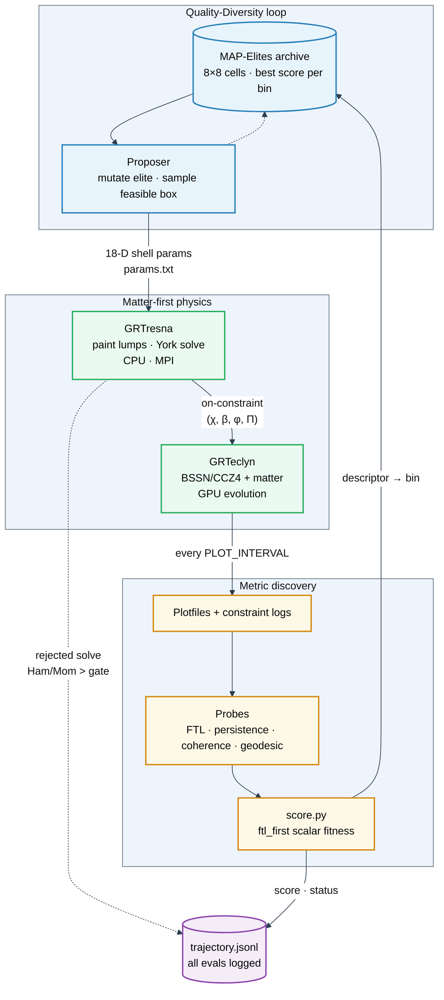
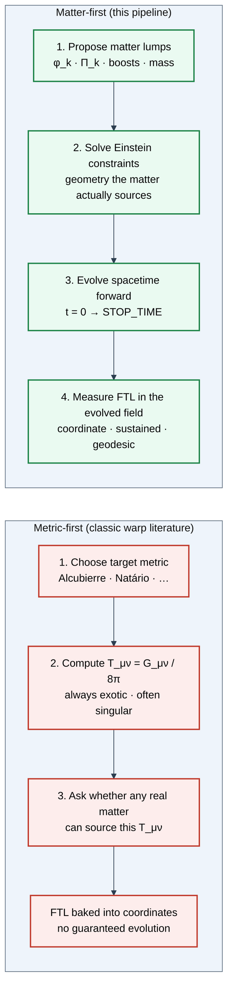

# MAP-Elites FTL Discovery — Matter-First Metric Discovery

> Quality-Diversity (MAP-Elites) search over **matter configurations** that, once
> turned into a self-consistent spacetime and evolved, exhibit faster-than-light
> (FTL) precursors. We do **not** hand-design a warp metric and ask "what matter
> supports it?" — we propose matter, solve Einstein's constraints for the
> geometry it actually produces, evolve that geometry, and let the search
> *discover* which matter distributions yield FTL signatures.

## Table of contents

- [The idea: matter-first, not metric-first](#the-idea-matter-first-not-metric-first)
- [The pipeline](#the-pipeline)
  - [Diagram — end-to-end overview](#diagram--end-to-end-overview)
  - [Diagram — matter-first vs metric-first](#diagram--matter-first-vs-metric-first)
  - [Stage 0 — Quality-Diversity proposer (MAP-Elites)](#stage-0--quality-diversity-proposer-map-elites)
  - [Stage 1 — Initial data (GRTresna, CPU/MPI)](#stage-1--initial-data-grtresna-cpumpi)
  - [Stage 2 — Evolution (GRTeclyn, GPU)](#stage-2--evolution-grteclyn-gpu)
  - [Stage 3 — Metrics & probes (scoring)](#stage-3--metrics--probes-scoring)
  - [Stage 4 — Archive update & feedback](#stage-4--archive-update--feedback)
- [The hard consistency rule](#the-hard-consistency-rule)
- [Behavior descriptors (the "diversity" axes)](#behavior-descriptors-the-diversity-axes)
- [Scoring model (the "quality" axis)](#scoring-model-the-quality-axis)
- [Code map (where everything lives)](#code-map-where-everything-lives)
- [How to run a campaign](#how-to-run-a-campaign)
- [Campaign log / runs analysis](#campaign-log--runs-analysis)

## The idea: matter-first, not metric-first

Classic warp-drive analysis is **metric-first**: write down a target metric
(Alcubierre, Natário, …), then read off the stress-energy `T_ab = G_ab/8π` it
requires — which is always exotic, often pathological, and never solved as a
*consistent initial-value problem*. The "FTL" in those constructions is baked
into the chosen coordinates and need not survive a real evolution.

This project inverts that. The pipeline is **matter-first**:

1. The search proposes a **matter configuration** (a set of massive scalar-field
   "lumps" with positions, boosts, rotations, mass, and exotic flags).
2. GRTresna **solves the Einstein constraint equations** for the conformal factor
   and shift that this matter actually sources — a genuine, on-constraint initial
   data set, not a coordinate guess.
3. GRTeclyn **evolves** that spacetime forward in time on GPU.
4. Probes measure whether an FTL signature (coordinate-speed channel, sustained
   superluminal region, and ultimately a **gauge-invariant null-geodesic
   shortcut**) emerges and *persists*.
5. MAP-Elites stores the best candidate per behavior cell and mutates elites to
   explore the space.

The payoff: any FTL signal that survives this loop is a property of a
**self-consistent, evolved spacetime**, not of a hand-picked metric. The
open scientific question the campaign attacks is *which matter distributions, if
any, produce a real (gauge-invariant) shortcut* — and the metrics themselves are
iteratively hardened so the leaderboard cannot be gamed by coordinate artifacts
(see the campaign log for the bug-fix history that got us here).

## The pipeline

### Diagram — end-to-end overview

The closed loop: search proposes matter → physics builds and evolves a real
spacetime → metrics discover FTL signatures → archive feeds the next proposal.



### Diagram — matter-first vs metric-first



---

### Stage 0 — Quality-Diversity proposer (MAP-Elites)

MAP-Elites maintains an 8×8 behavior archive keyed by a 2-D descriptor. Each
iteration it either **mutates an existing elite** (boundary-reflected Gaussian
perturbation, ~85% of draws) or **samples inside the feasible box** of known
elites. Proposals are points in the `grtresna_shell` search space — an 18-D
parameterization of the lump field (amplitudes, mode, thickness, toroidal /
poloidal / radial velocities, shift seed, exotic phase, **scalar mass**, …).

### Stage 1 — Initial data (GRTresna, CPU/MPI)

The sibling repo `../GRTresna` paints the proposed lumps into `(φ, Π)` and runs a
Lichnerowicz/York elliptic **constraint solve** for the conformal factor and
vector potential. This is CPU/MPI-bound and is the main throughput bottleneck:
poorly-conditioned proposals fail to converge below the Ham/Mom gate and are
**rejected before reaching the GPU** (logged but not inserted into the archive).

### Stage 2 — Evolution (GRTeclyn, GPU)

Converged initial data is handed to GRTeclyn (`RadialRecipe` example), which
evolves the BSSN/CCZ4 system + matter forward to `STOP_TIME` on GPU, dumping
plotfiles every `PLOT_INTERVAL` steps.

### Stage 3 — Metrics & probes (scoring)

Plotfiles are post-processed (`yt`) into diagnostics: constraint norms,
apparent-horizon `theta_plus`, comoving / shift statistics, matter energy density,
and the FTL probe family — coordinate-speed (`operational_ftl_solved`), sustained
evolved speed (`operational_ftl`, `ftl_persistence`), 3-D morphological coherence,
and the gauge-invariant **null-geodesic shortcut** (`operational_ftl_geodesic`).

### Stage 4 — Archive update & feedback

`score.py` collapses the diagnostics into a single `ftl_first` fitness. Only
`gpu_ok` candidates compete for a behavior cell; the new candidate replaces the
incumbent if it scores higher. Rejected GRTresna solves are still written to
`trajectory.jsonl` but never pollute the archive grid. The updated archive feeds
the next proposer step.

## The hard consistency rule

`T_ab` used in the GRTresna **constraint solve** must equal `T_ab` used in the
GRTeclyn **evolution**. Otherwise the run starts off-constraint and any apparent
"FTL" is a constraint-relaxation transient, not physics.

The `grtresna_independent_scalars` matter path exists precisely to keep both
sides identical; any new matter sector (mass search, `λφ⁴`, complex field) must be
added to **both** sides with matching analytic forms. (Root cause documented in
`Examples/RadialRecipe/Debug.md`; see also
[Matter model — reference & future directions](#matter-model--reference--future-directions-2026-06-10).)

## Behavior descriptors (the "diversity" axes)

The current descriptor is **`speed_super`** (`qd_search.py`):

- **x** — recalibrated cone-tilt from `max_local_speed` (floor 0.95, target 1.20)
  so realistic coordinate speeds spread across bins instead of saturating.
- **y** — `superluminal_fraction`: the share of the domain whose local speed
  exceeds `c` by a margin (`SUPERLUMINAL_MARGIN`), rescaled by an observed
  ceiling so localized-vs-widespread superluminal regions separate.

Older `speed_horizon` is kept for back-compat but was retired after the
`theta_plus` centering bug made its y-axis degenerate (see campaign log).

## Scoring model (the "quality" axis)

Fitness is the `ftl_first` objective in `metrics/score.py`. Headline structure:

- **Gauge-invariant FTL is king.** `operational_ftl_geodesic` (null-ray shortcut)
  carries the largest weight, but only when its reliability gate passes
  (`h_quality_ok` via relative Hamiltonian drift, and all rays reach the
  detector). Otherwise it scores 0 — integration noise is never trusted.
- **Dynamical, sustained signal next.** Evolved `operational_ftl` + `ftl_persistence`
  outweigh the one-shot coordinate-speed `operational_ftl_solved`, which is
  treated as a *precursor/shaping* term (localization-gated).
- **Persistence-honest health block.** `survival = numerical_survival ×
  structural_persistence`, where `structural_persistence = density_retention ×
  morphological_coherence`. A configuration that dissipates or fragments can no
  longer bank FTL credit — the shaping rewards are multiplied by persistence.
- **Vetoes / penalties.** Horizon formation, energy-condition / exotic use,
  instability, and stationary "warp-lens" coordinate artifacts are penalized or
  zeroed so the leaderboard tracks genuine, evolving, bound geometries.

Weight hierarchy (approximate): `operational_ftl_geodesic` ×1500 ≫
`operational_ftl` ×400 ≫ `ftl_persistence` ×300 ≫ `operational_ftl_solved` ×180 ≫
health block ×(survival 70 + stability 10 + …).

The full per-component table lives in
`grteclyn-wrapper/src/grteclyn_wrapper/metrics/README.md`.

## Code map (where everything lives)

| Concern | Path |
|---------|------|
| QD loop, archive, descriptors | `grteclyn-wrapper/src/grteclyn_wrapper/search/qd_search.py` |
| Search space + param overrides | `grteclyn-wrapper/src/grteclyn_wrapper/search/optimize.py` |
| Scoring / fitness | `grteclyn-wrapper/src/grteclyn_wrapper/metrics/score.py` |
| Metric aggregation | `grteclyn-wrapper/src/grteclyn_wrapper/metrics/aggregation/collector.py` |
| FTL probes (general / geodesic) | `grteclyn-wrapper/src/grteclyn_wrapper/metrics/probes/ftl/` |
| Diagnostic dataclasses | `grteclyn-wrapper/src/grteclyn_wrapper/metrics/types/diagnostics.py` |
| Plotfile → frames | `grteclyn-wrapper/src/grteclyn_wrapper/visualisation/process_wave/consume_plotfiles.py` |
| Matter (evolution side) | `Source/Matter/GRTresnaIndependentScalars.{hpp,impl.hpp}`, `Examples/RadialRecipe/` |
| Matter (initial-data side) | `../GRTresna/Examples/ScalarFieldBH/` |
| Campaign launcher | `grteclyn-wrapper/scripts/search/run_grtresna_qd_search.sh` |

## How to run a campaign

```bash
cd grteclyn-wrapper
QD_NAME=ftl_discovery_vN QD_ITERATIONS=10 BINS=8 STOP_TIME=8.0 \
  GPU_IDS="0 1 2 3 4 5 6 7" RANKS=8 LUMPS=5 SHELL_PROFILE=compact \
  GRTRESNA_MAX_HAM_PCT=5.0 GRTRESNA_MAX_MOM_PCT=5.0 \
  nohup bash scripts/search/run_grtresna_qd_search.sh \
  > ../runs/qd_ftl_discovery_vN.launch.log 2>&1 &
```

Results land in `runs/grtresna_qd/ftl_discovery_vN/` (`trajectory.jsonl`, per-eval
`score.json`, `frames/`). The campaign log below records what each `vN` changed
and what it found.

## Campaign log / runs analysis

Reverse-chronological isn't enforced below; entries were appended as work
happened. Quick index (most consequential first):

| Campaign / section | Date | Headline |
|--------------------|------|----------|
| [Null-geodesic reliability fix → `v8`](#null-geodesic-reliability-fix-2026-06-11-post-v7) | 06-11 | Forward-launch rays + relative-drift gate; gauge-invariant term finally fires |
| [`ftl_discovery_v7` review](#campaign-ftl_discovery_v7--finished-run--critical-leaderboard-review-2026-06-11) | 06-11 | Persistence/coherence honest; geodesic still blind (the bottleneck) |
| [`ftl_discovery_v4`](#campaign-ftl_discovery_v4--persistence-honest-scoring--bound-matter-2026-06-11) | 06-11 | Persistence-gated `survival`; searched `scalar_mass`; capped boosts |
| [Matter model reference & future directions](#matter-model--reference--future-directions-2026-06-10) | 06-10 | What the lumps are; how they interact; roadmap |
| [`ftl_discovery_v2`](#campaign-ftl_discovery_v2--first-healthy-run--a-scoring-concern-2026-06-10) | 06-10 | First sane scoring run; gauge-invariance under-weighted |
| [Scoring fix: stationary warp-lens artifacts](#scoring-fix-stationary-warp-lens-artifacts-2026-06-10-after-90-evals) | 06-10 | Reliability-gate + stationary-artifact gate |
| [Navigation overhaul](#navigation-overhaul-2026-06-10) | 06-10 | `speed_super` descriptor; feasible-box sampling |
| [Status / reset (theta_plus bug)](#map-elites-ftl-discovery-status) | 06-10 | `theta_plus` re-centered on `grid_center` |

---

## MAP-Elites FTL Discovery Status

Status: **reset**. The previous QD/HQ campaign results were discarded.

### Why the reset

The apparent-horizon / expansion (`theta_plus`) diagnostic in the GRTeclyn
example levels measured the radius and radial direction from the coordinate
origin (the domain corner) instead of the physics `grid_center`. With the
domain at `[0, L]` and `grid_center = (L/2, L/2, L/2)`, the regularizing
`2*sqrt(chi)/r` term was evaluated at `r ~ |grid_center|` instead of `r ~ 0`,
so it collapsed near the center and drove `theta_plus` spuriously negative.
This produced false trapped-surface detections (`max_horizon_radius ~ |grid_center|`,
`min_theta_plus < 0` located at `r ~ |grid_center|`) and a `-1.0` horizon
penalty that vetoed otherwise-viable candidates and inflated the stability
violation. The whole "horizon-safe vs trapped" ranking from that campaign was
therefore unreliable, so all of its runs were deleted.

### Fix applied

`theta_plus` is now measured about `grid_center` in:

- `Examples/RadialRecipe/RadialRecipeLevel.cpp`
- `Examples/RotatingWormholeCollapse/SupportedWormholeLevel.cpp`
- `Examples/SupportedWormholeCollapse/SupportedWormholeLevel.cpp`

The `RadialRecipe` binary was rebuilt with the fix.

### Campaign (2026-06-10)

Fresh MAP-Elites QD launched on the corrected binary:

- **Name**: `ftl_discovery_postfix`
- **Dir**: `runs/grtresna_qd/ftl_discovery/ftl_discovery_postfix/`
- **Descriptor**: `speed_horizon` (8×8 bins)
- **Target evals**: 400
- **GPUs**: 0–7 (batch 8)
- **Launch log**: `runs/qd_ftl_discovery_postfix.launch.log`

No resume, no seed trajectory. Results will be recorded here as the archive fills.

### Validation (in-flight, ~28/400 evals)

The fix is confirmed working on the live campaign:

- `theta_plus` stays **strictly positive** over the full evolution (t=0→2.0) in
  every scored run (`min_theta_plus = +0.037` for eval_022, `+0.10` for eval_023),
  so there are **no false trapped-surface detections**.
- `horizon_penalty = -0.0` on all scored candidates (previously the bug forced
  a spurious `-1.0` veto with `min_theta_plus < 0` at `r ~ |grid_center|`).
- Barycenter diagnostics sit at `~(33, 28, 29) ≈ grid_center (32)`, confirming
  the diagnostic is now centered correctly.

Best elite so far: eval_022, score 598.5 (`operational_ftl_solved=1.0`,
`max_local_speed ≈ 1.083`). Note: ~93% of candidates are rejected at the
GRTresna constraint-solve stage (convergence too poor / MPI failures) before
reaching the GPU evolution — a sampling/tuning issue, not a physics bug.

## Navigation Overhaul (2026-06-10)

The corrected-physics campaign above (`ftl_discovery_postfix`, now archived as
`ftl_discovery_postfix_degenerate_navigation`) exposed two *navigation* defects
(distinct from the earlier physics bug):

1. **Behavior-space collapse.** After the `theta_plus` centering fix,
   `min_theta_plus` is always a small positive (~0.036–0.10), so the
   `speed_horizon` y-axis (`horizon_free = 0.5 + theta/...`) always landed in
   bin 4. The archive degenerated to a single row (coverage ~0.078, 5/64 cells).
2. **~82% pre-GPU rejection waste.** Most candidates never reached the GPU
   because the GRTresna constraint solve stalled/oscillated, and the 30% blind
   uniform sampling kept re-hitting pathological corners of the shell bounds.

### Fixes applied

- **New `speed_super` descriptor** (`qd_search.py`, registered in the CLI):
  x = recalibrated cone-tilt (`max_local_speed`, floor 0.95 / target 1.20 so
  realistic speeds spread across the bins instead of saturating), y =
  `superluminal_fraction` (share of the slice with local speed > c). The y-axis
  now carries real signal — localized vs widespread superluminal region —
  regardless of the horizon diagnostic. `speed_horizon` is kept for back-compat.
- **Infeasible candidates no longer occupy archive cells.** `_record_result`
  inserts into the behavior grid only when `status == gpu_ok`; rejected/failed
  solves are still logged to `trajectory.jsonl` but stop polluting coverage.
- **Shell bounds tightened to the feasible basin** (`grtresna_shell_search_space`,
  compact): `amp 0.08–0.28 → 0.08–0.16`, `thickness 0.0–2.5 → 0.1–2.5`,
  `toroidal_velocity ±2.0 → ±1.2`, `omega ±0.8 → ±0.5`.
- **Boundary reflection instead of hard clipping** in `_mutate_elite`, so
  mutation no longer piles probability mass on the (pathological) bounds.
- **Smarter exploration:** elite-mutation fraction raised 0.70 → 0.85, and the
  remaining random draws are taken inside the bounding box of feasible elites
  (`_sample_feasible_box`) rather than the full space.
- **Harder GRTresna solve:** `--grtresna-iterations 30 → 50`,
  `--grtresna-nl-stall-tolerance 0.02 → 0.005` (script defaults) so oscillating
  near-misses get more iterations to settle below the 5% Ham/Mom gate.
- The graded feasibility penalty for rejected solves (`convergence_rejection_fitness`)
  already exists; it is not surfaced into QD sampling because the loop now
  mutates only archive elites and samples the feasible box, so no extra
  gradient code was added.

### Campaign (2026-06-10, overhaul)

- **Name**: `ftl_discovery_nav`
- **Dir**: `runs/grtresna_qd/ftl_discovery/ftl_discovery_nav/`
- **Descriptor**: `speed_super` (8×8 bins)
- **Target evals**: 400, GPUs 0–7 (batch 8)
- **Launch log**: `runs/qd_ftl_discovery_nav.launch.log`

Success criteria: archive spans ≥3 y-bins and coverage climbs past ~0.20 within
the first ~100 evals; pre-GPU rejection rate drops from ~82% toward <50%; tier
distribution reaches ≥ operational (not just nontrivial). Results recorded here
as the archive fills.

### Follow-up fixes (2026-06-10, after first 16 evals of `ftl_discovery_nav`)

The first run confirmed feasibility improved (gpu-reach ~40% vs ~18% before) and
the x-axis spread, but exposed two issues that were fixed before relaunch:

- **`speed_super` y-axis collapsed again.** The descriptor read
  `superluminal_fraction` from the *evolved* report, where the GRTresna-built
  superluminal region has decayed to ~0 for almost every candidate (solved 0.065
  → evolved 0.010), and used a raw [0, 1] scale on which even 0.065 stays in bin 0.
  Fix: read the **solved** report (`_solved_ftl_report`, observed
  superluminal_fraction 0–0.30, max_local_speed 0.95–1.32) for both axes, and
  rescale y by the observed ceiling `_SPEED_SUPER_FRACTION_TARGET = 0.30` so the
  realistic range fills the grid. Raw fraction kept as `superluminal_fraction_raw`.
- **`chi` / `chi_minus_1` frames rendered blank.** The conformal well reaches
  `min_chi ~0.4` against a ~1.0 far field, but the fixed color windows
  (`chi` [0.98, 1.04], `chi-1` ±0.03) clamped the whole well to the colormap
  floor. Fix (`consume_plotfiles.py`): both fields opt into per-frame percentile
  auto-scaling (`auto_zlim`) with widened presets as fallback, so the well is
  visible regardless of depth. The FTL-relevant `local_speed` / `rho_req` frames
  were already correct.

### Scoring fix: stationary warp-lens artifacts (2026-06-10, after ~90 evals)

Validating the leaderboard exposed a hard scoring bug: the run had converged
into a degenerate basin. **All 15 retained elites were stationary, zero-shift
geometries** — static "warp-lens" coordinate artifacts, not propagating warps.
The top candidate (`eval_000083`, score 1164) was a worked example:

- Geometry **stationary** (`comoving.stationary=True`, `beta_mean≈0`): no
  frame-dragging mechanism, so its `superluminal_fraction=1.0` is a frozen
  coordinate-speed lens (`local_speed` frames disperse in place, never propagate).
- `operational_ftl=0`, `ftl_persistence=0`: zero evolved/sustained FTL.
- Its 1164 was **83% (970 pts) from `operational_ftl_geodesic`** computed off a
  geodesic report explicitly flagged `h_quality_ok=False` (null-constraint drift
  `max H=3.9e-4`, only 4/5 rays reached) — i.e. integration noise trusted at full
  weight. The remainder came from saturated `operational_ftl_solved` + cone-tilt
  `ftl_precursor` + `channel_progress`, which out-ran the old additive
  `stationary_artifact_penalty` (it only fired when `f_op_ev>0`, so it missed the
  zero-shift artifacts entirely).

Two fixes in `metrics/score.py`:

1. **Reliability-gate `operational_ftl_geodesic`.** A gauge-invariant shortcut is
   only certified when the null-ray integration stayed on the constraint surface
   (`h_quality_ok`) **and** the full ray bundle reached the detector
   (`n_reached == n_rays`). Otherwise `f_geo` is noise/caustic → reward 0 + a
   `"geodesic shortcut rejected as unreliable"` note.
2. **Stationary-artifact gate.** When a geometry is stationary (zero net shift)
   **and** has no trustworthy *dynamical* FTL (no `operational_ftl`, no
   persistence, no reliable geodesic), its FTL signals are frozen coordinate
   features: the shaping rewards (`operational_ftl_solved`, `ftl_precursor`,
   `channel_progress`, `shift_drive`) are **zeroed** (not merely penalized) so a
   static artifact cannot climb. Genuine shift-driven candidates have
   `beta_mean≠0`, are never flagged stationary, and keep their full gradient.

Effect (re-scored on real episodes): `eval_000083` 1164 → **−247**;
`eval_000065` 270 → −246; `eval_000094` 194 → −247. The whole stationary basin is
demoted below zero, pushing the search toward non-stationary, shift-driven
geometries. Regression tests:
`test_unreliable_geodesic_shortcut_is_not_rewarded`,
`test_stationary_warp_lens_artifact_ranks_below_genuine_candidate`.

## Matter model — reference & future directions (2026-06-10)

This is a map of *what the lumps actually are* and how to extend them, so we
don't have to re-trace the code each time. The `shell`/MAP-Elites campaign
evolves **N independent massive real scalar fields** ("lumps"), not a single
field and not massless matter.

### What the campaign actually runs

Each eval's `params.txt` sets:

```
recipe_matter_model     = grtresna_independent_scalars
recipe_num_scalar_fields = 5
recipe_scalar_mass       = 0.1
recipe_exotic_matter     = 0     # per-lump exotic flags are used instead
```

So GRTeclyn dispatches to `GRTresnaIndependentScalars` (5 fields, mass m=0.1),
**not** the `ScalarField<DefaultPotential>` / `ExoticScalarField` paths.

### Where the matter lives (file map)

**GRTeclyn (evolution side):**
- `Examples/RadialRecipe/RadialRecipeMatterDispatch.hpp` — runtime model
  selection. `uses_independent_scalars()` picks `GRTresnaIndependentScalars`
  when `recipe_matter_model == "grtresna_independent_scalars"`; otherwise
  `ExoticScalarField<DefaultPotential>` (if `recipe_exotic_matter`) or
  `ScalarField<DefaultPotential>`.
- `Source/Matter/GRTresnaIndependentScalars.{hpp,impl.hpp}` — the per-lump
  fields. `compute_emtensor` sums `sign[k]·T_ab(φ_k)` over lumps;
  `add_matter_rhs` is the curved-space Klein–Gordon RHS per lump.
- `Source/Matter/GRTresnaScalarPotential.hpp` — the **only** non-trivial
  potential currently wired in: `V = ½ m² (Σφ_k)²` (massive, shared sum).
- `Source/Matter/DefaultPotential.hpp` — `V=0` (massless); used by the legacy
  `ScalarField`/`ExoticScalarField` paths. `recipe_scalar_mass` is **ignored**
  on those paths — only `GRTresnaIndependentScalars` honors the mass.
- `Source/Matter/{ScalarField,ExoticScalarField}.{hpp,impl.hpp}` — canonical
  (ρ≥0) and phantom (ρ≤0, T scaled by `-recipe_support_strength`) single-field
  models. Templated on the potential class.
- `Examples/RadialRecipe/StateVariables.hpp` — state layout: `c_phi, c_Pi`
  plus `phi_lump0..4 / Pi_lump0..4` (`2 * GRTRESNA_MAX_INDEPENDENT_SCALARS`).
- `Examples/ScalarField/Potential.hpp` — reference `½ m² φ²` potential class
  (template signature to copy when adding new potentials).

**GRTresna (initial-data side, sibling repo `../GRTresna`):**
- `Examples/ScalarFieldBH/MatterParams.hpp` — the **lump definition**. `lump_t`
  = {amp, width, center, velocity (boost→linear momentum), omega
  (rotation→L_z), mode (0=axisym, 1=dipole, 2=quadrupole), exotic flag}.
  `lump_phi` = `amp·angular_factor(mode)·exp(-r²/2w²)`; `lump_pi` =
  `-(v·∇φ) - omega·∂_azimuth φ` (so each cloud carries net P_i ~ v and L_z ~ omega).
  Exotic lumps are damped by `EXOTIC_AMP_SCALE = 0.25` to stay in the
  Lichnerowicz/York convergent regime.
- `Examples/ScalarFieldBH/MyMatterFunctions.cpp` — paints initial `(phi, Pi)` =
  background + `Σ_k lump_phi/lump_pi`. `my_potential_function` uses
  `½ (scalar_mass·φ)²` (must match GRTeclyn's potential).

### How lumps interact / change shape (answers we keep re-deriving)

- **Shape:** live wave fields under Klein–Gordon — they oscillate, disperse,
  deform. Not rigid. Initial shape is the analytic Gaussian cloud above.
- **Interaction:** only two indirect channels — **(a) gravity** (all lumps
  source one shared metric) and **(b) a shared mass potential** `½m²(Σφ_k)²`
  whose gradient `m²·Σφ_j` is applied to *every* lump's `Pi` RHS
  (`GRTresnaIndependentScalars.impl.hpp`), so overlapping lumps cross-couple.
  There is **no** direct gradient-gradient or self-interaction term.
- **Why they "fly away":** initial boosts are O(1) (`lumpK_velocity ~ |1|`),
  amplitudes are tiny (`amp ~ 0.09` → negligible self-gravity), and the mass is
  light (m=0.1 → Compton wavelength 1/m=10 ≈ box). Nothing binds them, so they
  free-stream out. This is physically expected, not a bug — there is no soliton
  / bound-state mechanism in the current matter sector.

### Future directions (ranked: leverage vs. effort)

1. **Search the mass + cap boosts (config-only, do first).** *Done
   (2026-06-11).* `m=0.1` and O(1) velocities were why lumps dispersed/flew
   away. `grtresna_scalar_mass` is now a searched QD dimension (range
   `0.3–1.5`, default `0.6`) wired into `grtresna_shell_search_space` and
   applied to `cfg.scalar_mass` in `_apply_grtresna_overrides`
   (`search/optimize.py`); it already propagated to both the GRTresna solve
   (`solver.py`) and the GRTeclyn evolution (`matter_wiring.py`), so the
   consistency rule holds with no new physics code. The toroidal current (warp
   motor) keeps its full range, while the net-outflow velocities are capped
   (`poloidal ±1.5→±0.8`, `radial ±0.8→±0.3`) so matter stays bound. Heavier
   mass binds within the shell width (Compton wavelength `1/m`), letting the
   search settle on persistent, near-static matter.
2. **Add `λφ⁴` (or φ⁶) self-interaction ⇒ oscillons / Q-balls** (genuinely bound,
   long-lived). Extend `GRTresnaScalarPotential` (GRTeclyn) **and**
   `my_potential_function` (GRTresna `MyMatterFunctions.cpp`) identically, plus
   one `lambda` param threaded through both param files.
3. **Complex scalar field ⇒ boson stars / Q-balls** with conserved U(1) charge —
   the textbook *stationary, non-dispersing* lump. Larger lift: two real
   components per field, and constraint-solver support on the GRTresna side.
4. **Per-lump independent mass** (currently one shared `scalar_mass`) to mix a
   heavy "anchor" lump with light mobile ones.

### Hard consistency rule (do not violate)

`T_ab` used in the GRTresna **constraint solve** must equal `T_ab` used in the
GRTeclyn **evolution**, or the run starts off-constraint and any "FTL" is a
constraint-relaxation transient (root cause documented in
`Examples/RadialRecipe/Debug.md`). The `grtresna_independent_scalars` path
exists precisely to keep them identical. Any new matter (mass search, `λφ⁴`,
complex field) must be added to **both** sides with matching analytic forms.

## Campaign `ftl_discovery_v2` — first healthy run + a scoring concern (2026-06-10)

Fresh 8-GPU campaign (`runs/grtresna_qd/ftl_discovery_v2/`, `speed_super` 8×8,
`ftl_first`) launched on the vectorized-conversion + corrected-stationarity +
moderated-penalty fixes. This is the first run that scores sanely: gpu_ok
candidates get gradient-rich positives (14→405), `stationary_artifact_penalty`
is 0 on survivors (graded, e.g. −0.955 on the near-stationary eval_011), the
horizon veto fires correctly (eval_026/038 → −1.0), and the archive spreads
across both axes (y-bins 0→7, cells up to [7,7]) — the earlier y-collapse is
fixed.

### Validation of the top elite (eval_000036, score 405, cell [7,7])

Checked in detail because it carries the run's first nonzero
`operational_ftl_solved` (0.717). **Verdict: best *physical precursor* so far,
but NOT confirmed gauge-invariant FTL.** Evidence from `score.json`:

- **Genuinely physical (unlike the old eval_083 lens):** `comoving.stationary =
  false`, `beta_mean = 0.371` (real net shift), final Ham/Mom L2 = 8.2e-4 /
  1.8e-4 (stays on-constraint — not a relaxation transient), `min_theta_plus =
  0.118` (no horizon), survives to t=2.
- **But the 405 is driven by a *coordinate*-speed metric.** `operational_ftl_solved`
  derives from `general_ftl_solved.max_local_speed = 1.287`, explicitly noted as
  a "superluminal **coordinate** channel" — gauge-dependent, a precursor not a proof.
- **The one gauge-invariant test failed its reliability gate:** `geodesic_ftl`
  has `h_quality_ok = False` (null-constraint drift max H=5.4e-4, only 4/5 rays
  reached), so `operational_ftl_geodesic` was correctly zeroed.
- **No sustained signal:** evolved `operational_ftl = 0`, `ftl_persistence = 0`
  (max local speed decays 1.287 → 1.092 over the evolution).
- **Frames** (`shift1_z`, `local_speed_z`, t=0 vs t=2): a real ±0.05 shift dipole
  and a ~1.05–1.10 (on z-slice) superluminal region, both **localized near
  center and weakening in place** — they do not propagate as a warp channel.

So the scoring behaved honestly here: it labeled the result as precursor +
channel progress, *not* certified FTL.

### Concern + plan: gauge-invariant signal is under-weighted

`operational_ftl_solved` (a **coordinate** speed, gauge-dependent) currently
dominates the `ftl_first` objective, while the only gauge-invariant measure
(`geodesic_ftl`, null rays) is frequently rejected for unreliability and
contributes 0. This risks ranking gauge/shift-channel artifacts above genuine
shortcuts. Plan (future work, in priority order):

1. **Fix null-geodesic reliability** so `h_quality_ok` can pass on good
   candidates: tighten ray integration (smaller step / higher-order),
   investigate the constraint-drift source, and ensure all rays reach the
   detector. Until this passes, we have *no* trustworthy gauge-invariant verdict.
   Code: `metrics/null_geodesic.py` (`GeodesicFtlReport`, `h_quality_ok`,
   `n_reached/n_rays`, `max_h_drift`).
2. **Re-weight once geodesic is reliable:** gauge-invariant `operational_ftl_geodesic`
   should outweigh the coordinate-based `operational_ftl_solved`, so the
   leaderboard tracks real shortcuts rather than coordinate channels. Code:
   `metrics/score.py` (`ftl_first` component weights).
3. **Keep `operational_ftl_solved` as a precursor/shaping term only** (lower
   weight), gated as now by non-stationarity, so it guides the search toward
   shift channels without certifying them as FTL.

## Campaign `ftl_discovery_v4` — persistence-honest scoring + bound matter (2026-06-11)

`v2`/`v3` exposed that the leaderboard rewarded structures that *dissipate or
fly apart*: `survival` was `1.0` for HQ elites whose frames showed the lump
gone by the stop time, and the FTL shaping rewards banked cone-tilt off a
structure that no longer existed. Root cause on the matter side: with
`scalar_mass` pinned at `0.1` (Compton wavelength `1/m=10 ≈ box`) nothing binds
the lump, so it free-streams out even at zero boost. The following fixes ship in
`v4` (`runs/grtresna_qd/ftl_discovery_v4/`, `speed_super` 8×8, `ftl_first`,
8 GPUs, `STOP_TIME=8`, `PLOT_INTERVAL=40`).

### Scoring fixes

- **Done — `survival` is now persistence-gated.** Split the old single metric
  into `numerical_survival` (did the integrator reach the stop time — a
  completion gate, weighted lightly) and `structural_persistence` (fraction of
  peak matter energy density retained at the final step,
  `final_peak_rho_required / max_rho_required`). `survival = numerical_survival ×
  structural_persistence`, so a configuration that dissipates can no longer
  score as "stable". Code: `metrics/score.py`, `metrics/types/diagnostics.py`
  (`final_peak_rho_required`), `metrics/diagnostics/constraints.py` (reads it
  from `constraint_norms.dat`).
- **Done — FTL shaping rewards gated by persistence** (commit `be93469`).
  `ftl_precursor` / `channel_progress` / `shift_drive` are multiplied by
  `structural_persistence`, so a fragmented end-state can no longer out-rank a
  coherent survivor by banking cone-tilt/frame-drag credit off a structure that
  has shattered. Persistence defaults to `1.0` when the matter-density series is
  unavailable, leaving the rewards untouched. Regression test:
  `test_ftl_shaping_rewards_scale_with_persistence`.

### Search-parameter fixes

- **Done — `STOP_TIME 2 → 8`, `PLOT_INTERVAL 10 → 40`** (commit `be44e02`). At
  `t=2` a dissipating configuration is indistinguishable from a persistent one
  (both retain ~90% of peak ρ), so the persistence gate could not bite; by `t=8`
  a genuine survivor plateaus (~0.7) while dissipators keep falling (<0.55).
  Plot interval scaled with stop time so the FTL-probe/plotting cost per eval
  stays ~constant.
- **Done — `scalar_mass` is a searched dimension; fly-away velocities capped**
  (commit `e9c193d`, also recorded in *Future directions* #1 above).
  `grtresna_scalar_mass ∈ [0.3, 1.5]` (default `0.6`) lets the search pick heavy,
  bound matter (binds within the shell width). Toroidal current (warp motor)
  keeps its full `±1.2` range; the net-outflow components are tightened
  (`poloidal ±1.5→±0.8`, `radial ±0.8→±0.3`) so heavy matter stays put. Propagated
  consistently to both the GRTresna solve and the GRTeclyn evolution. Tests:
  `test_scalar_mass_flows_into_grtresna_config`,
  `test_shell_fly_away_velocities_are_capped` (search space now 18D).

### Watch-list (open, not yet verified on `v4`)

- **Heavy-mass convergence.** Larger `m` raises the shared potential
  `½m²(Σφ)²` in the GRTresna elliptic solve, which may shift the convergent
  basin. Watch the pre-GPU rejection rate over the first ~20 evals; if it spikes
  at the high-mass end, narrow the top of the mass range or raise solver
  iterations.
- **Gauge-invariant signal still under-weighted** (carried over from `v2`): the
  null-geodesic reliability gate (`h_quality_ok`) still rejects most candidates,
  so `operational_ftl_geodesic` contributes 0 and the coordinate-speed
  `operational_ftl_solved` dominates `ftl_first`. Unchanged in `v4`.

## Campaign `ftl_discovery_v7` — finished run + critical leaderboard review (2026-06-11)

Run `runs/grtresna_qd/ftl_discovery_v7/` (`speed_super` 8×8, `ftl_first`, 8 GPUs,
`STOP_TIME=8`, `PLOT_INTERVAL=80`, `scalar_mass` searched, de-saturated precursor
+ 3D coherence + rebalanced weights). Finished: 88 candidates, 53 `gpu_ok`,
coverage 0.3125 (20/64 cells), best score 606. **All 20 retained elites are tier
`nontrivial` — zero reached the certified `operational` tier** (no candidate
passed the gauge-invariant geodesic gate).

### Do the metrics work this time? — yes on persistence/coherence, still blind on gauge-invariance

The two bugs that made `v2`/`v3` leaderboards lie are fixed and verified on real
episodes:

- **`survival` is now honest and differentiating.** Top-3 read `survival = 1.0 /
  0.72 / 1.0` (eval 71/79/64) instead of a flat `1.0`. The persistence gate bites
  (eval 79's structure partially decays → 0.72). Frames confirm it: eval 71's
  `Pi_lump_sum` is a strong coherent dipole at `t=8.02` (amplitude held at ~0.01,
  same as `t=0`), **not** the dissipated nothing we saw in `v3`. The heavier
  searched mass (binds within the shell) is doing its job.
- **`structure_coherence = 1.0`** on all top-3, matching the frames (single
  connected blob with an internal dipole, no fragmentation into separated lobes).
  The 3D covering-grid count is no longer fooled by slice orientation.
- **`superluminal_fraction` de-saturated**: top-3 read 0.11 / 0.17 / 0.20 (was
  pinned at 1.0 in `v6`). The descriptor carries real signal again.
- **Score composition is now persistence-honest.** eval 71's 606 breaks down as
  `operational_ftl` (evolved, sustained) **205 pts (34%)** + `ftl_persistence`
  **155 pts (26%)** + `operational_ftl_solved` 106 (17%, itself down-gated to
  0.59) + `channel_progress` 65 + health/survival block ~49. So **~60% comes from
  the *dynamical* evolved+sustained channel**, not from a one-shot coordinate
  speed and not from integration noise. Contrast `v2`, where the top score was
  83% from an `h_quality_ok=False` geodesic artifact.

### What was found

A reproducible **family** of non-stationary, exotic-supported, bound lump
configurations that sustain a *localized* superluminal **coordinate** channel
coherently out to `t=8`. Top-3 (all cell `[7,7]`):

| eval | score | survival | coherence | β_mean | max c (evolved) | superlum. frac | op_ftl | persistence |
|------|-------|----------|-----------|--------|-----------------|----------------|--------|-------------|
| 71   | 606   | 1.00     | 1.0       | 0.444  | 1.108           | 0.111          | 0.513  | 0.517       |
| 79   | 375   | 0.72     | 1.0       | 0.466  | 1.118           | 0.166          | 0.213  | 0.216       |
| 64   | 348   | 1.00     | 1.0       | 0.505  | 1.103           | 0.198          | 0.188  | 0.160       |

All three are genuinely non-stationary (`beta_mean ≈ 0.44–0.51`, real net shift),
stay on-constraint (final Ham/Mom L2 `~1e-3 / 1e-4`), are horizon-free
(`min_theta_plus > 0`), and **require exotic matter** (`wec_violation_fraction
0.76–0.85`, `exotic_penalty −0.53 to −1.0`).

### Critical caveat — these are precursors, NOT certified FTL

`operational_ftl_geodesic = 0` for **every** top candidate: the only
gauge-invariant test (null-ray shortcut) is still rejected as unreliable
(`h_quality_ok=False`, e.g. eval 71 `max H=3.6e-4`, 4/5 rays reached). So the
leaderboard is ranking a sustained, coherent, persistent *coordinate-speed /
shift* channel (`max c ≈ 1.10–1.12` localized near center) — a strong physical
precursor — but nothing here is a proven gauge-invariant shortcut. This is the
same open watch-list item from `v2`/`v4`, now the clear bottleneck: **fixing
null-geodesic reliability is the next high-leverage step**, because until it
passes we cannot promote anything past the `nontrivial` tier.

Secondary note: top scorers cluster in cell `[7,7]` (both descriptor axes near
max), so coverage (0.31) is moderate but the *quality* front is narrow — the
search is exploiting one basin. Worth widening exploration or adding a descriptor
that separates these once the geodesic gate is trustworthy.

## Null-geodesic reliability fix (2026-06-11, post-v7)

The `v7` bottleneck above — `operational_ftl_geodesic = 0` for every elite
because `h_quality_ok=False` — was traced to **two real bugs in the ray tracer**
(`metrics/probes/ftl/geodesic.py`), not to the candidates being non-FTL.

### Bug 1 — rays launched backward (the dominant failure)

The initial ray momentum was built as `k^μ = (1,1,0,0)` (contravariant guess),
converted to covariant `k_μ = g_{μν}k^ν`, then passed through a generic
`project_null`. That projection rescales the spatial momentum to restore the null
condition but **does not pin the propagation direction** — it could (and did)
select the *backward* null root. Instrumenting the central ray of `eval_000071`
showed `dx/dλ` pointing in **−x** from step 0, so the ray left the −x boundary
after 57 steps. Almost no rays reached the detector (`reached 0/5`, `0/5`, `2/5`
on the top-3), so the gate could never pass.

*Fix:* `future_null_cov(g, n_hat)` builds the momentum on the contravariant side
— `k^μ = (k^t, n_hat)` with the null condition solved for the future-directed
`k^t` (the unique positive root, since `g_tt<0` and `n·γ·n>0` give opposite-sign
roots). This guarantees `dx^i/dλ ∝ n_hat = +x` and `dt/dλ > 0`. `project_null`
also gained an optional `dx_ref` so in-flight re-projection keeps the ray's
direction. Result: **all retained elites now reach 5/5**.

### Bug 2 — reliability gated on an unreachable absolute drift

With rays reaching, `h_quality_ok` was still `False` because it tested
`max|H| ≤ 1e-5` (`H = ½ g^{μν}k_μk_ν`, exactly 0 for null). But the metric is
only **C0 (trilinear) interpolated**, so the per-step pre-projection drift has an
interpolation-set floor: a convergence study on `eval_000071` (step
`0.05→0.025→0.0125`, grid `65→97→129`) showed `max|H|` falling only as `~O(ds)`
(`1.2e-3 → 3.2e-4`) and never approaching `1e-5`, while `f_geo` stayed **stable
at 0.0077–0.0081** (the shortcut is a real, converged signal). The absolute
threshold was therefore impossible to satisfy by construction.

*Fix:* gate on the **relative** drift `|H| / ½(|g_tt(k^t)²| + |k_iγ^{ij}k_j|)`
(scale-free "distance off the null cone"), tolerance `H_REL_TOL = 1e-2`. The
v7 elites sit at `5e-4–2e-3` relative drift — an order of magnitude inside the
bar — while the absolute drift and `f_geo` magnitude are still reported.

### Effect (re-scored on the retained v7 plotfiles)

`operational_ftl_geodesic` now fires correctly and **discriminates**:

| eval | f_geo | rel-H | h_ok | geo reward (×1500) |
|------|-------|-------|------|--------------------|
| 88   | 0.0083| 1.4e-3| ✅   | +223 |
| 15   | 0.0078| 1.2e-3| ✅   | +208 |
| 71   | 0.0077| 1.3e-3| ✅   | +206 |
| 79   | 0.0058| 2.0e-3| ✅   | +147 |
| 64   | 0.0047| 9.4e-4| ✅   | +113 |
| 80/81/83/85 | 0.0 | <1.5e-3 | ✅ | +0 (no shortcut) |

The gauge-invariant term now contributes, **re-ranking the board** (eval 88 and
15 leap up next to eval 71) and rewarding genuine null shortcuts while still
zeroing no-shortcut geometries (via `GEO_FTL_FLOOR=1e-3`). Regression tests:
`test_future_null_cov_propagates_forward_under_shift`,
`test_integrate_null_ray_reaches_detector_under_shift`.

### Campaign `ftl_discovery_v8`

Relaunched on the geodesic fix (same search space / descriptor / 8 GPUs,
`STOP_TIME=8`, `PLOT_INTERVAL=80`). Success criterion: at least some elites reach
the **`operational` tier** (certified gauge-invariant shortcut), which `v7` could
never do. Watch whether the search now climbs `f_geo` toward the `5e-2` target
instead of plateauing on the coordinate-speed channel.
