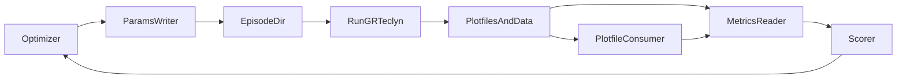

# Python Wrapper Architecture Plan

## Architecture

Use a file-based orchestration layer first. Python owns episodes and optimization; `GRTeclyn` C++ remains the numerical-relativity engine.



The current repo already supports this boundary:

- Executable workflow is documented in [`/home/nik/Desktop/github/GRTeclyn/Examples/SupportedWormholeCollapse/README.md`](/home/nik/Desktop/github/GRTeclyn/Examples/SupportedWormholeCollapse/README.md).
- Canonical params live in [`/home/nik/Desktop/github/GRTeclyn/Examples/SupportedWormholeCollapse/params_2gpu.txt`](/home/nik/Desktop/github/GRTeclyn/Examples/SupportedWormholeCollapse/params_2gpu.txt).
- Wormhole parameters are loaded in [`/home/nik/Desktop/github/GRTeclyn/Examples/SupportedWormholeCollapse/SimulationParameters.hpp`](/home/nik/Desktop/github/GRTeclyn/Examples/SupportedWormholeCollapse/SimulationParameters.hpp).
- Initial data is generated in [`/home/nik/Desktop/github/GRTeclyn/Examples/SupportedWormholeCollapse/SupportedWormholeInitialData.hpp`](/home/nik/Desktop/github/GRTeclyn/Examples/SupportedWormholeCollapse/SupportedWormholeInitialData.hpp).
- Runtime diagnostics are written from [`/home/nik/Desktop/github/GRTeclyn/Examples/SupportedWormholeCollapse/SupportedWormholeLevel.cpp`](/home/nik/Desktop/github/GRTeclyn/Examples/SupportedWormholeCollapse/SupportedWormholeLevel.cpp).
- Visualization and wave extraction are documented in [`/home/nik/Desktop/github/GRTeclyn/src/visualisation/README.md`](/home/nik/Desktop/github/GRTeclyn/src/visualisation/README.md) and [`/home/nik/Desktop/github/GRTeclyn/src/visualisation/process_wave/README.md`](/home/nik/Desktop/github/GRTeclyn/src/visualisation/process_wave/README.md).

## Episode Directory Layout

Each optimizer trial should get an isolated folder:

```text
runs/episode_000001/
  params.txt
  metadata.json
  run.log
  score.json
  data/
    collapse_diagnostics.dat
    constraint_norms.dat
  small_data/
    psi4_mode_l2m0.dat
    areal_radius.dat
    consume_state.json
  frames/
  plots/
```

Do not use shared visualization output folders for automated search. The current shell scripts are useful for manual runs, but the wrapper should call the Python modules directly with episode-local `--data`, `--out`, and `--frames-out` paths.

## Phase 1: Minimal Reproduction Runner

Create a small Python package, likely under a new path such as [`/home/nik/Desktop/github/GRTeclyn/src/wrapper`](/home/nik/Desktop/github/GRTeclyn/src/wrapper), with:

- `config.py`: repo paths, executable path, GPU/MPI settings.
- `params.py`: load `params_2gpu.txt`, apply overrides, write `episode/params.txt`.
- `runner.py`: run `check_params=1`, then launch `main3d.gnu.CUDA.ex` or `main3d.gnu.MPI.CUDA.ex`.
- `episode.py`: create episode directory and write `metadata.json`.

Initial target: reproduce the current supported wormhole run by varying only existing keys such as `wormhole_phi_perturbation_amplitude`, `wormhole_support_strength`, `N_full`, `max_level`, and `stop_time`.

## Phase 2: Metrics Reader and Scorer

Add parsers for existing machine-readable outputs:

- `data/collapse_diagnostics.dat`: collapse time, min lapse, min chi, max `|K|`, horizon proxy, scalar extrema.
- `data/constraint_norms.dat`: Hamiltonian and momentum L2 norms.
- `small_data/psi4_mode_l2m0.dat`: optional GW amplitude and propagation checks.
- `small_data/areal_radius.dat`: throat/areal-radius evolution when generated by the plotfile consumer.

Start with a simple score:

- reward survival to `stop_time`;
- penalize constraint blow-up;
- penalize immediate horizon formation unless the benchmark expects collapse;
- reward nontrivial throat/areal-radius behavior;
- record all component scores in `score.json`.

## Phase 3: Plotfile Consumer Integration

Wrap the existing module rather than duplicating it:

```bash
python -m src.visualisation.process_wave.consume_plotfiles \
  --data EPISODE_DIR \
  --out EPISODE_DIR/small_data \
  --radii 8 12 16 \
  --n-points 64 \
  --areal-radius \
  --frames-out EPISODE_DIR/frames \
  --watch --delete --keep-last 2
```

The wrapper should start this as a side process while `GRTeclyn` runs, then shut it down cleanly after the simulation exits. This avoids storing huge plotfiles while preserving small-data outputs for scoring.

## Phase 4: Search Driver

Add a `search.py` entry point with three modes:

- `reproduce`: one fixed run from `params_2gpu.txt`.
- `sweep`: grid/random sampling over existing wormhole parameters.
- `optimize`: CMA-ES or Bayesian optimization after scoring is stable.

Start with existing parameters only. This avoids touching C++ until the orchestration layer is proven.

## Phase 5: C++ Recipe Initial Data

After the Python runner works, add a new C++ initial-data class modeled on [`/home/nik/Desktop/github/GRTeclyn/Examples/SupportedWormholeCollapse/SupportedWormholeInitialData.hpp`](/home/nik/Desktop/github/GRTeclyn/Examples/SupportedWormholeCollapse/SupportedWormholeInitialData.hpp).

Two options:

- Conservative: extend `SupportedWormholeInitialData` with more radial coefficients.
- Cleaner: create a new example directory, e.g. `Examples/MetricRecipeSearch`, with its own `SimulationParameters.hpp`, `StateVariables.hpp`, `MetricRecipeInitialData.hpp`, and `MetricRecipeLevel.cpp`.

I recommend the cleaner new example once the Python wrapper is stable. It keeps the published wormhole example reproducible.

## Phase 6: Operational Probes

Only after search episodes work, add physical validation probes:

- null rays or scalar pulses for communication time;
- timelike tracer particles for passenger tests;
- horizon/path rejection using existing horizon proxy diagnostics;
- resolution and gauge rerun policies.

These are needed before making any FTL/portal claim. Until then, scores should be described as geometric or diagnostic scores, not physical transport validation.

## Implementation Order

1. Add Python episode directory manager.
2. Add params templating from `params_2gpu.txt`.
3. Add subprocess runner with `check_params=1`.
4. Add parsers for `collapse_diagnostics.dat` and `constraint_norms.dat`.
5. Add simple score output as `score.json`.
6. Add optional live `consume_plotfiles` side process.
7. Add random sweep over current wormhole parameters.
8. Add CMA-ES/Bayesian optimization.
9. Add new C++ recipe initial-data example.
10. Add operational probes and promotion tests.

## Key Design Decisions

- Use subprocess + files first, not Python C++ bindings.
- Keep each trial isolated in its own episode directory.
- Reuse existing visualization modules directly, not the global shell scripts.
- Start with current wormhole parameters before adding new C++ search variables.
- Preserve `SupportedWormholeCollapse` as a benchmark; put generalized metric search in a separate example later.